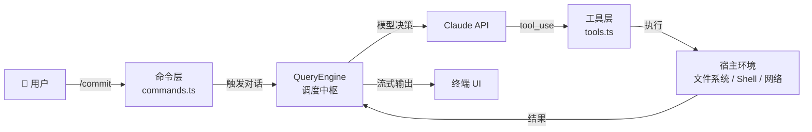
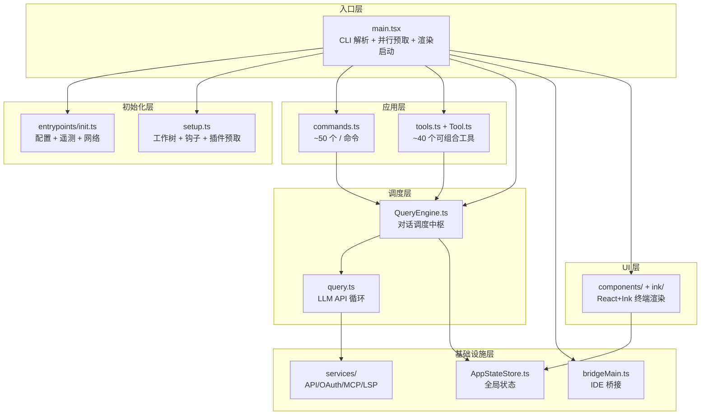
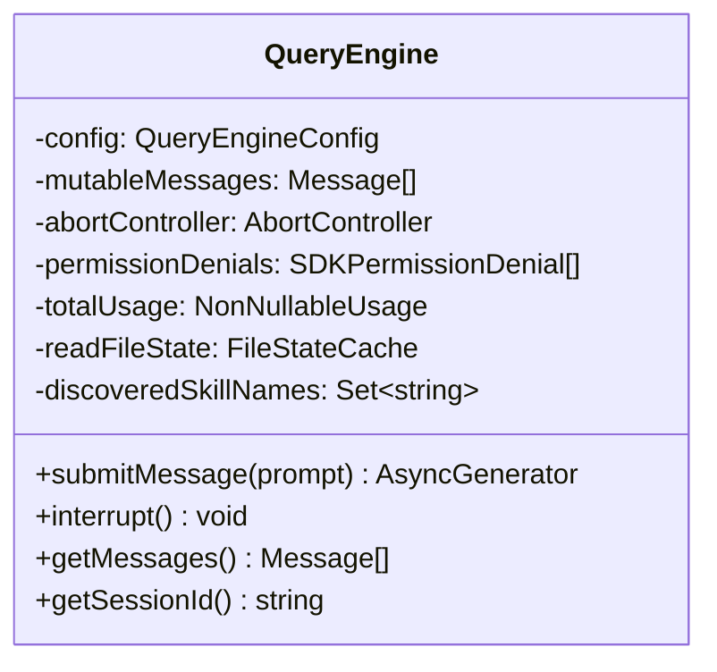

# 第01课：Claude Code 全景架构解析

> **阶段**：第一阶段 · 架构认知  
> **建议时长**：90 分钟  
> **难度**：⭐⭐⭐

---

## 课程信息

### 学习目标

完成本课学习后，你将能够：

1. 描述 Claude Code 的七层模块化架构，理解各层职责与边界
2. 解释"命令 + 工具"双轨设计模式的哲学根源与工程权衡
3. 解读 `QueryEngine` 在整个系统中作为"对话调度中枢"的地位
4. 分析 `main.tsx` → `commands.ts` → `tools.ts` → `QueryEngine` 的注册链路
5. 说明技术选型（Bun / TypeScript / React+Ink）的决策依据

---

## 核心概念

### 1.1 什么是"架构层次"

Claude Code 并不是一个扁平的脚本，它是一个由**多个职责明确的模块**构成的分层系统。理解架构就是理解：

| 层次 | 核心问题 | 代表模块 |
|------|----------|----------|
| 入口层 | 谁来启动？ | `src/main.tsx` |
| 初始化层 | 如何准备运行环境？ | `src/entrypoints/init.ts`、`src/setup.ts` |
| 命令层 | 用户能做什么？ | `src/commands/`、`src/commands.ts` |
| 工具层 | AI 能调用什么？ | `src/tools/`、`src/tools.ts`、`src/Tool.ts` |
| 查询层 | 如何与 Claude 对话？ | `src/QueryEngine.ts`、`src/query.ts` |
| 状态层 | 运行时状态如何维护？ | `src/state/`、`src/bootstrap/state.ts` |
| UI 层 | 终端界面如何呈现？ | `src/components/`、`src/ink/` |

### 1.2 命令 vs. 工具：两条不同的调度轨道

这是理解整个系统最重要的概念对：

- **命令（Command）**：由"/"前缀触发，面向**用户**，如 `/review`、`/commit`、`/config`。命令可以直接返回文本，也可以调用 QueryEngine 进入 AI 对话流程。
- **工具（Tool）**：由 Claude 模型在对话中自主调用，面向**AI**，如 `BashTool`、`FileReadTool`。工具是模型与宿主环境交互的唯一通道。



**关键区别**：命令是"用户意图的入口"，工具是"模型能力的出口"。两者通过 QueryEngine 汇聚。

### 1.3 QueryEngine：统一调度中枢

`QueryEngine` 是全系统最核心的类，它不仅仅是一个 API 调用封装，而是一个完整的**对话生命周期管理器**：

- 维护跨轮次的消息历史（`mutableMessages`）
- 封装权限拒绝追踪（`permissionDenials`）
- 管理文件状态缓存（`readFileState`）
- 统计 API 用量（`totalUsage`）
- 提供 `AsyncGenerator` 接口实现流式输出

---

## 架构设计与设计思想

### 2.1 系统总体架构图



### 2.2 为什么选择"命令 + 工具"双轨设计？

这个设计决策体现了一个深刻的工程洞察：**用户意图与模型能力具有本质不同的安全边界**。

| 维度 | 命令（用户层） | 工具（模型层） |
|------|----------------|----------------|
| 调用者 | 人类用户（可信） | Claude 模型（需授权） |
| 安全检查 | 可用性过滤、订阅状态 | 权限系统、危险模式检测 |
| 执行时机 | 即时、同步响应 | 异步、在对话循环中 |
| 典型用例 | `/commit` 提交代码 | `BashTool` 执行命令 |

如果将两者合并为一套机制，就必须在每个操作前判断"谁在调用"，这会导致安全边界模糊。**双轨设计将信任层次天然分离**，命令面向用户（信任已知），工具面向模型（信任需建立）。

### 2.3 QueryEngine 的设计哲学：会话即对象

传统 AI 应用往往将对话做成无状态函数调用。Claude Code 选择了**面向对象设计**：每次对话对应一个 `QueryEngine` 实例。

这个选择的好处：
- **状态内聚**：消息历史、文件缓存、用量统计都在一个对象内，不需要全局变量
- **生命周期清晰**：构造即初始化，多次 `submitMessage()` 保持同一上下文
- **可测试**：无全局副作用，易于单元测试



### 2.4 技术选型决策

**为什么选 Bun 而不是 Node.js？**
- Bun 的 `feature()` API 支持编译期死代码消除（DCE），使得未启用的功能模块在打包时完全不存在于产物中
- Bun 的启动速度更快（对于 CLI 工具至关重要）
- 原生支持 TypeScript，无需 transpile 配置

**为什么选 React + Ink 而不是直接 `console.log`？**
- Ink 将 React 的声明式 UI 范式带入终端，使得复杂的动态界面（消息流、进度条、状态栏）可以组合式构建
- 支持虚拟滚动（`VirtualMessageList`）处理长消息列表
- 与 React 生态（Context、Hooks、状态管理）无缝集成

**为什么选 Commander.js + Zod？**
- Commander.js 提供成熟的 CLI 参数解析，支持子命令和类型化选项
- Zod 提供运行时类型验证，确保配置和工具输入的安全性

---

## 关键源码深度走查

### 3.1 main.tsx：启动入口的"并行预取"模式

**文件**：`src/main.tsx` 第 1-20 行

```typescript
// 这些副作用必须在所有其他 import 之前运行：
// 1. profileCheckpoint 在重型模块评估开始前标记入口
// 2. startMdmRawRead 触发 MDM 子进程（plutil/reg query），
//    使其与下方 ~135ms 的 import 并行运行
// 3. startKeychainPrefetch 并行触发 macOS keychain 读取
//    （OAuth + 旧版 API key），否则会在启动时顺序读取（每次 ~65ms）
import { profileCheckpoint } from './utils/startupProfiler.js';

profileCheckpoint('main_tsx_entry');  // ① 性能打点：入口时间戳

import { startMdmRawRead } from './utils/settings/mdm/rawRead.js';
startMdmRawRead();  // ② 立即启动 MDM 读取（非阻塞）

import { startKeychainPrefetch } from './utils/secureStorage/keychainPrefetch.js';
startKeychainPrefetch();  // ③ 立即启动 keychain 预取（非阻塞）
```

**逐行解析**：

| 行 | 操作 | 设计意图 |
|----|------|----------|
| `profileCheckpoint('main_tsx_entry')` | 记录入口时间戳 | 性能分析基准点，测量模块加载开销 |
| `startMdmRawRead()` | 触发企业设备管理读取 | **关键优化**：MDM 读取涉及子进程调用（plutil），提前触发使其与剩余 import 并行 |
| `startKeychainPrefetch()` | 触发钥匙串预取 | 每次 macOS keychain 读取需 ~65ms，两次串行就是 130ms，并行化消除等待 |

**设计原则**：**关键路径上的 I/O 操作应尽早触发**（Fire-and-forget + 后续 await）。这是 Node.js/Bun 单线程模型下的标准优化范式。

> 💡 **设计点评 — 并行预取的启动优化**
>
> **好在哪里**：CLI 工具最怕"慢"——用户敲一个命令，等了 0.5 秒才有反应，就感觉很卡。这里的骚操作是：在加载其他代码的同时，提前去读取钥匙串和企业配置，两件事并行跑，等代码加载完，I/O 也差不多完成了，用户感知到的等待时间大幅缩短。
>
> **如果不这样做**：先把所有模块 import 完，再去读钥匙串，再读企业配置——这两次 I/O 是串行的，每次各花 ~65ms，加起来就是额外的 130ms+。对于一个 CLI 工具，这个差距用户是能明显感受到的。就像超市收银，你可以边扫码边装袋，而不是等全部扫完再开始装——节省的时间看起来不多，但真的很值。

---

### 3.2 commands.ts：特性标志驱动的条件导入

**文件**：`src/commands.ts` 第 59-120 行

```typescript
import { feature } from 'bun:bundle'

// 死代码消除：条件导入
const proactive =
  feature('PROACTIVE') || feature('KAIROS')
    ? require('./commands/proactive.js').default
    : null  // ① 标志为 false 时，打包工具直接消除此模块

const bridge = feature('BRIDGE_MODE')
  ? require('./commands/bridge/index.js').default
  : null  // ② IDE 桥接命令：仅在桥接模式下打包

const voiceCommand = feature('VOICE_MODE')
  ? require('./commands/voice/index.js').default
  : null  // ③ 语音命令：仅在语音模式下打包

const ultraplan = feature('ULTRAPLAN')
  ? require('./commands/ultraplan.js').default
  : null  // ④ 超级计划命令：实验性功能门控
```

**逐行解析**：

① `feature('PROACTIVE')` 是 Bun 的编译期 API。当构建时该标志为 `false`，整个 `require('./commands/proactive.js')` 分支在打包产物中消失，实现零成本的"死代码消除"（DCE）。

② `feature('BRIDGE_MODE')` 控制 IDE 桥接命令。在面向普通用户的发布版本中，不需要暴露桥接控制命令。

③ 语音模式、超级计划模式等都通过同样的模式按需打包，**使生产包体积最小化**。

**设计模式**：**特性标志驱动的条件编译**——在编译期（而非运行期）裁剪功能，比运行期 `if-else` 更彻底，没有任何运行时开销。

> 💡 **设计点评 — 编译期特性标志的极简门控**
>
> **好在哪里**：你想关掉一个实验性功能，最彻底的方式不是运行时 `if-else`，而是让那段代码根本不出现在发布包里。`feature('VOICE_MODE')` 为 `false` 时，语音模块的代码就跟它不存在一样——包体积更小，攻击面更窄，用户连代码都看不到。而且这一切在写代码时和写普通条件判断没什么两样，零学习成本。
>
> **如果不这样做**：用运行时 `if-else` 门控，语音模块、桥接模块、超级计划模块的代码全都打包进去了，只是"跑不到"。这意味着：用户可以反编译产物看到内部实验功能的实现细节，安全审计要覆盖所有分支，包体积也白白胖了一圈。一个面向普通用户的轻量 CLI，却带着一堆对他毫无用处的企业/实验代码——就像你买了一辆家用车，引擎盖下却藏着一台赛车发动机的全套配件，没用还占地方。

---

### 3.3 Tool.ts：工具接口的类型约束设计

**文件**：`src/Tool.ts` 第 122-148 行

```typescript
// 应用 DeepImmutable 包装，防止运行时意外修改
export type ToolPermissionContext = DeepImmutable<{
  mode: PermissionMode                    // ① 当前权限模式
  additionalWorkingDirectories: Map<string, AdditionalWorkingDirectory>
  alwaysAllowRules: ToolPermissionRulesBySource   // ② 多源允许规则
  alwaysDenyRules: ToolPermissionRulesBySource    // ③ 多源拒绝规则
  alwaysAskRules: ToolPermissionRulesBySource     // ④ 多源询问规则
  isBypassPermissionsModeAvailable: boolean       // ⑤ 是否可绕过
  isAutoModeAvailable?: boolean                   // ⑥ 是否有自动模式
  strippedDangerousRules?: ToolPermissionRulesBySource  // ⑦ 已剥离的危险规则
  shouldAvoidPermissionPrompts?: boolean   // ⑧ 无头代理：自动拒绝提示
  awaitAutomatedChecksBeforeDialog?: boolean  // ⑨ 协调者工作线程专用
  prePlanMode?: PermissionMode             // ⑩ 进入计划模式前的模式快照
}>

// 空权限上下文工厂函数：类型安全的默认值
export const getEmptyToolPermissionContext: () => ToolPermissionContext =
  () => ({
    mode: 'default',
    additionalWorkingDirectories: new Map(),
    alwaysAllowRules: {},
    alwaysDenyRules: {},
    alwaysAskRules: {},
    isBypassPermissionsModeAvailable: false,
  })
```

**逐行解析**：

① `mode: PermissionMode` — 当前活跃的权限模式（default/plan/bypassPermissions 等）  
② ③ ④ `alwaysAllowRules/alwaysDenyRules/alwaysAskRules` — 按**来源**组织的规则集合（用户设置、项目设置、CLI 参数等）  
⑦ `strippedDangerousRules` — 进入自动模式时被剥离的危险规则备份，退出时恢复  
⑧ `shouldAvoidPermissionPrompts` — 无头/后台代理无法显示交互界面，使用此标志自动拒绝所有需要人工确认的请求  
⑩ `prePlanMode` — 进入计划模式前保存原模式，用于退出时恢复  

**设计原则**：
- **DeepImmutable**：权限上下文一旦创建，不可在工具执行中被修改——防止工具通过副作用提升权限（安全原则）
- **单一真相来源**：所有权限相关状态统一在此类型中，避免散落各处

> 💡 **设计点评 — `DeepImmutable<T>` 的安全性保障**
>
> **好在哪里**：工具代码在执行时拿到的权限上下文是"只读"的——你根本没有办法在工具内部悄悄把自己的权限从"需要询问"改成"直接允许"。这个限制是编译器强制的，不是靠开发者自觉遵守的。
>
> **如果不这样做**：想象一个恶意（或写错了的）工具在运行时偷偷修改权限状态，把某个"需要用户确认"的操作改成"静默执行"——用户完全不知情，AI 就在后台删文件了。`DeepImmutable` 相当于把权限钥匙焊死在保险柜里，工具只能看，不能摸。

---

### 3.4 QueryEngine.ts：wrappedCanUseTool 的拒绝追踪

**文件**：`src/QueryEngine.ts` 第 243-271 行

```typescript
// 包装 canUseTool 以追踪权限拒绝（用于 SDK 报告）
const wrappedCanUseTool: CanUseToolFn = async (
  tool,
  input,
  toolUseContext,
  assistantMessage,
  toolUseID,
  forceDecision,
) => {
  // ① 调用原始权限检查函数
  const result = await canUseTool(
    tool, input, toolUseContext,
    assistantMessage, toolUseID, forceDecision,
  )

  // ② 记录非允许决策（ask / deny）
  if (result.behavior !== 'allow') {
    this.permissionDenials.push({
      tool_name: sdkCompatToolName(tool.name),  // ③ SDK 兼容的工具名
      tool_use_id: toolUseID,
      tool_input: input,
    })
  }

  return result
}
```

**逐行解析**：

① 原始 `canUseTool` 来自 `useCanUseTool` 钩子，包含完整的权限决策链  
② 任何非"允许"的结果（包括"询问"和"拒绝"）都被记录——"询问"也算拒绝，因为模型未被立即授权  
③ `sdkCompatToolName()` 将内部工具名转换为 SDK 规范格式（如 MCP 工具名规范化）  

**设计模式**：**装饰器模式（Decorator Pattern）**——`wrappedCanUseTool` 在不修改原始函数的情况下，为其添加了"拒绝追踪"能力。这是权限审计的关键机制。

> 💡 **设计点评 — 装饰器模式的无侵入审计**
>
> **好在哪里**：权限检查逻辑和拒绝记录逻辑是两件独立的事，`wrappedCanUseTool` 把它们干净地分开了——原来的 `canUseTool` 只管"能不能用"，审计日志的事交给包装层处理，谁都不用知道对方的存在。这样既不改原始逻辑，又能静默地记下"AI 这次会话里想干什么、被挡了几次"，对将来的模型优化和企业合规都很有价值。
>
> **如果不这样做**：要么直接在 `canUseTool` 里加记录逻辑（把权限决策和审计耦合在一起，以后维护是噩梦），要么每个调用点手动加记录（漏掉一处就是审计盲点）。装饰器的妙处就在于：你只需要在一个地方包一层，全局生效，不遗漏，不污染原始逻辑。就像给水管装一个流量计，水该怎么流还是怎么流，但每滴水都被记录了。

---

### 3.5 tools.ts：工具注册与去重

**文件**：`src/tools.ts` 第 1-53 行（精选）

```typescript
// ① 静态导入：核心内置工具
import { BashTool } from './tools/BashTool/BashTool.js'
import { FileEditTool } from './tools/FileEditTool/FileEditTool.js'
import { FileReadTool } from './tools/FileReadTool/FileReadTool.js'
import { GlobTool } from './tools/GlobTool/GlobTool.js'

// ② 死代码消除：仅在特定用户类型下包含
const REPLTool =
  process.env.USER_TYPE === 'ant'
    ? require('./tools/REPLTool/REPLTool.js').REPLTool
    : null  // 外部用户看不到此工具

// ③ 特性标志门控：调度工具
const cronTools = feature('AGENT_TRIGGERS')
  ? [
      require('./tools/ScheduleCronTool/CronCreateTool.js').CronCreateTool,
      require('./tools/ScheduleCronTool/CronDeleteTool.js').CronDeleteTool,
      require('./tools/ScheduleCronTool/CronListTool.js').CronListTool,
    ]
  : []  // 未启用时为空数组，不引入这些模块

// ④ 懒加载（打破循环依赖）
const getTeamCreateTool = () =>
  require('./tools/TeamCreateTool/TeamCreateTool.js').TeamCreateTool
```

**设计分析**：

| 模式 | 代码示例 | 使用理由 |
|------|----------|----------|
| 静态导入 | `import { BashTool }` | 核心工具，必须存在，早期绑定 |
| 环境变量门控 | `process.env.USER_TYPE === 'ant'` | 内部工具（REPL）不对外开放 |
| 特性标志门控 | `feature('AGENT_TRIGGERS')` | 实验性工具的 DCE 控制 |
| 懒加载 | `const getTeamCreateTool = ()` | 打破循环依赖（tools.ts → TeamCreateTool → ... → tools.ts） |

> 💡 **设计点评 — 懒加载打破循环依赖**
>
> **好在哪里**：循环依赖是 JS 模块里的"鸡生蛋蛋生鸡"问题——A 模块加载时需要 B，B 加载时又需要 A，结果谁也没初始化完，程序直接崩。把 `require()` 包进函数里，相当于"先别急着找 B，等我真的要用的时候再去拿"，完全绕开了这个死结。
>
> **如果不这样做**：要么重构模块结构（把有循环依赖的代码拆到第三个文件里，工程量大），要么程序启动时报 `undefined is not a constructor` 这种让人摸不着头脑的错误，排查起来非常费劲。这个一行代码的小技巧，省掉了一次大规模重构。

---

### 3.6 QueryEngine.ts：AsyncGenerator 流式架构

**文件**：`src/QueryEngine.ts` 第 199-262 行

```typescript
// 每次对话一个 QueryEngine 实例，状态跨轮次持久化
export class QueryEngine {
  private mutableMessages: Message[]       // 跨轮次消息历史
  private permissionDenials: SDKPermissionDenial[]
  private totalUsage: NonNullableUsage
  private readFileState: FileStateCache

  // ① submitMessage 是异步生成器——调用者用 for await 逐条消费消息
  async *submitMessage(
    prompt: string | ContentBlockParam[],
    options?: { uuid?: string; isMeta?: boolean },
  ): AsyncGenerator<SDKMessage, void, unknown> {
    // ② 解构配置（工具、命令、权限、模型等）
    const { cwd, commands, tools, canUseTool, ... } = this.config

    this.discoveredSkillNames.clear()
    setCwd(cwd)

    // ③ 包装 canUseTool，插入权限拒绝追踪（装饰器模式）
    const wrappedCanUseTool: CanUseToolFn = async (...args) => {
      const result = await canUseTool(...args)
      if (result.behavior !== 'allow') {
        this.permissionDenials.push({ tool_name: ..., tool_use_id: ..., tool_input: ... })
      }
      return result
    }

    // ④ 构建系统提示、用户上下文
    // ⑤ yield* 委托给 query()——三层嵌套 AsyncGenerator 全链路流式处理
    //    submitMessage → query() → StreamingToolExecutor
    yield* query({
      messages: this.mutableMessages,
      tools, commands, canUseTool: wrappedCanUseTool,
      systemPrompt, userContext, ...
    })

    // ⑥ 完成后更新累计用量、持久化会话
    this.totalUsage = accumulateUsage(this.totalUsage, ...)
  }
}
```

**逐步解析**：

① `async *submitMessage()` — 异步生成器签名。调用者使用 `for await (const msg of engine.submitMessage(prompt))` 逐条消费，每产出一条 `SDKMessage` 就立即推送给 UI 层渲染，无需等待整个对话循环结束。

② 每次 `submitMessage` 调用解构同一份 `this.config`，多轮对话共享工具列表、权限函数等不变的配置，而 `this.mutableMessages` 则在轮次间累积，实现**跨轮次上下文持久化**。

⑤ `yield*` 委托：`submitMessage → query() → StreamingToolExecutor` 构成三层嵌套的异步生成器管道。底层流式 API 的每一个 token/事件，无需缓冲直接透传到最顶层调用者——这是**零缓冲流式处理**的标准实现方式。

> 💡 **设计点评 — AsyncGenerator 的流式架构**
>
> **好在哪里**：你发一个问题，Claude 的回答是"一个字一个字往外蹦"的感觉，而不是等它全想完再一口气全吐出来。这对用户体验的影响是巨大的——你能感知到 AI 在实时思考，而不是对着空白屏幕干等几秒。三层 `yield*` 委托让整个调用链零缓冲，底层 API 产出一个 token，顶层 UI 立刻拿到并渲染。
>
> **如果不这样做**：换成普通异步函数，必须等模型把完整回答算完才能返回。一个涉及多步工具调用的复杂请求可能要等 10-30 秒，你面对的就是一个黑屏加一个光标。这种体验差距就像点外卖时"实时看到骑手在哪"和"没有任何信息，不知道有没有出发"的区别。

---

## Harness Engineering

从第01课的源码分析出发，提炼 **Harness Engineering（驾驭工程）** 的核心思想，并探讨这些架构决策对构建自己的大模型应用有哪些可迁移的启发。

### 4.1 Harness Engineering 视角

**Harness Engineering（驾驭工程）** 是指：在强大但难以精确控制的 AI 模型之上，构建一套工程化的"驾驭层"（Harness），通过约束、增强和编排来放大模型能力，同时保证安全边界。Claude Code 是这一理念的教科书级实现。

**Claude Code 作为"驾驭层"的四个维度**：

| 维度 | 说明 |
|------|------|
| ⚙️ 结构化指令 | 命令系统将用户的自然语言意图（"帮我提交"）转化为结构化的 QueryEngine 调用，为模型提供精确的上下文边界 |
| 🛠️ 能力赋予 | 工具系统（BashTool、FileReadTool 等）是 Harness 向模型"开口子"的机制——精确控制模型能触达哪些现实世界的能力 |
| 🛡️ 行为约束 | 权限系统（DeepImmutable 上下文、alwaysAllow/Deny/Ask 规则）是 Harness 的"缰绳"，让 AI 行为在可预期的边界内运行 |
| 🔄 思考-行动循环 | QueryEngine 编排"思考（LLM）→ 行动（tool_use）→ 观察（工具结果）→ 再思考"的完整循环，即 ReAct 范式的工程实现 |

**双轨设计体现的 Harness 哲学**：

**命令（用户直接控制）+ 工具（AI 自主操作）** 的双轨设计，精确体现了 Harness Engineering 的本质：*不是限制 AI，而是为 AI 的能力找到合适的"出口"。*

- 命令层给用户提供了"意图入口"——用户知道自己在做什么
- 工具层给 AI 提供了"能力出口"——AI 的每个动作都有明确的权限控制
- 两者通过 QueryEngine 汇聚，形成完整的"人机协作闭环"

> "Harness 的艺术在于：给 AI 足够的空间发挥创造力，同时确保每一步都在人类可理解和可控的范围内。"  
> — *Claude Code 架构的隐含设计原则*

---

### 4.2 对大模型应用的启发

从 Claude Code 的架构设计中，可以提炼出 5 条构建大模型应用的核心原则。

**启发 1：分层架构的必要性**

**不要让用户直接和裸 LLM 对话。** Claude Code 的七层架构告诉我们：中间层不是累赘，而是价值所在。

> **实践建议**：在你的 AI 应用中设计明确的"意图层"（用户输入解析）、"执行层"（LLM 调用 + 工具）和"输出层"（结果格式化），而不是一个巨型的 prompt 字符串拼接。

**启发 2：工具编排模式（Tool Pattern）**

Claude Code 的 `Tool.ts` 接口设计提供了一个可复用的模式：**每个工具声明自己的名称、输入 schema、权限需求和执行逻辑**。这使得工具可以独立开发、独立测试、按需组合。

> **实践建议**：用结构化的 Tool 接口（名称 + JSON Schema 输入 + 描述）替代在 prompt 中描述"你可以调用某个函数"。让 LLM 通过 function calling 而不是文本模拟来调用工具。

**启发 3：安全边界的多层防御**

Claude Code 的权限系统有三道防线：**类型系统（DeepImmutable）→ 规则引擎（Allow/Deny/Ask）→ 人工确认（权限弹窗）**。这种纵深防御思想同样适用于你的 AI 产品。

> **实践建议**：对 AI 可执行的每个危险操作（发邮件、删文件、调接口），设计"静默执行/告知执行/询问确认"三级策略，并在设计时就确定每个工具属于哪一级。

**启发 4：状态管理的"对象化"思维**

QueryEngine 把"一次会话"封装成对象，而不是无状态函数。这种设计让消息历史、文件缓存、token 用量统计自然地聚合在一起，避免了全局变量地狱。

> **实践建议**：在你的 AI 应用中，为每个"对话会话"维护一个结构化的 Session 对象，包含：对话历史、累计 token 用量、当前执行工具、用户偏好配置——而不是把这些散落在各个函数参数里。

**启发 5：可扩展性的"注册表"设计**

`commands.ts` 和 `tools.ts` 本质上是两个注册表。新增能力只需"注册"，不需要修改核心调度逻辑。这让 Claude Code 能用插件/技能系统持续扩展，而不因为每次新增功能就重写整个架构。

> **实践建议**：在设计 AI 应用时，从第一天就把"工具注册表"和"业务逻辑"分离。工具（能力）应该可以独立添加、删除和版本管理，而不需要修改 AI 调度核心。

**Harness Engineering 的核心信念**

大模型本身是"力量"，Harness 是"方向"。优秀的 AI 工程师不是在调 prompt，而是在设计**约束（让 AI 做对的事）、赋能（让 AI 有足够的工具）、编排（让 AI 以正确的节奏工作）** 这三者的完美平衡。Claude Code 的架构，正是这一哲学的最佳注脚。

---

## 思考题与进阶方向

### 思考题

**题目 1**：**为什么 QueryEngine 选择类而不是函数？** 如果改成函数 + 闭包，会有哪些利弊？

<details>
<summary>💡 参考答案</summary>

`QueryEngine` 需要在多次 `submitMessage()` 调用之间共享 `mutableMessages`（消息历史）、`totalUsage`（token 用量）、`readFileState`（文件缓存）等多份状态，用类封装可以让这些状态天然内聚在一个实例里，职责边界清晰。如果改成函数 + 闭包，从功能上完全可行，但闭包变量散落在函数作用域中，随着状态增多代码会越来越难追踪；同时外部无法通过 `instanceof` 或类型系统区分不同的"会话实例"，类型推断能力会退化。类设计还带来了 `getMessages()`、`getSessionId()` 等公开接口，闭包版本要做到同等的封装性，反而需要手动返回一个对象——本质上还是在模拟类。

</details>

---

**题目 2**：**`feature()` 与运行时 `if-else` 的本质区别是什么？** 对包体积、安全性、调试性各有什么影响？

<details>
<summary>💡 参考答案</summary>

`feature()` 是 Bun 的**编译期 API**，当标志为 `false` 时，整个被门控的代码分支在打包时直接从产物中消失（死代码消除，DCE），运行时根本不存在这段代码；而运行时 `if-else` 的两个分支都会被打包进去，只是执行时选一条走。包体积上，`feature()` 可以将内部工具（如 `REPLTool`）、实验性命令（如 `ultraplan`）完全从外部用户的安装包里剔除，降低攻击面；安全性上，一个不存在于包里的模块自然无法被逆向或利用，而 `if-else` 门控的代码仍然存在于发布产物中，只是"跑不到"而已。调试性上，`feature()` 的副作用是：你无法在生产包里动态开启一个被 DCE 掉的功能，必须重新构建，这在紧急排查时会增加一步门槛。

</details>

---

**题目 3**：**命令系统的 `REMOTE_SAFE_COMMANDS` 白名单机制解决了什么安全问题？** 如果不存在这个机制，远程执行时会有什么风险？

<details>
<summary>💡 参考答案</summary>

`REMOTE_SAFE_COMMANDS` 白名单的核心是：在远程/无头（headless）模式下，只允许运行经过审核的命令子集，拒绝其余所有命令。这解决的是**远程代码执行越权**问题——当 Claude Code 作为后台服务接受远程调用时，调用方可能是自动化脚本或不可信网络请求，如果不加限制，攻击者可以通过构造特定请求触发本地高危命令（如清除配置、执行任意 Shell 脚本等）。如果没有这个机制，任何能访问服务端点的调用方都可以调用全部 ~50 个命令，相当于把本机的完整权限暴露给了外部；而有了白名单，即使服务被滥用，能造成的损害也被严格限定在安全命令的范围内，做到了"最小权限原则"。

</details>

---

**题目 4**：**`wrappedCanUseTool` 记录的权限拒绝数据最终用在哪里？** 思考 SDK 报告的使用场景。

<details>
<summary>💡 参考答案</summary>

`wrappedCanUseTool` 将每次非"allow"的决策（包括"询问"和"拒绝"）以 `{tool_name, tool_use_id, tool_input}` 的结构追加到 `this.permissionDenials` 数组。这份数据在会话结束后会通过 `sdkCompatToolName()` 规范化工具名，最终上报给 Claude SDK 的遥测/报告层，用途主要有两个：一是**模型反馈**，让 Anthropic 了解哪些工具调用在实际使用中频繁被拒绝，从而优化模型的工具调用策略；二是**审计日志**，企业用户可以通过 SDK 报告回溯"AI 在这次会话里尝试做了什么、被拦截了多少次"，满足合规和安全审计的需求。这也是 `wrappedCanUseTool` 使用装饰器模式的原因——原始权限检查逻辑不需要知道审计的存在，关注点分离。

</details>

### 进阶方向

- **深入阅读**：`src/query.ts`——了解 LLM API 循环的完整实现，包括上下文压缩、流式工具执行器
- **扩展实践**：尝试为现有工具添加一个 `feature()` 门控，观察打包产物的变化
- **架构探索**：阅读 `src/coordinator/coordinatorMode.ts`，了解多代理协调模式如何在此架构上构建
- **桥接层**：阅读 `src/bridge/bridgeMain.ts`，了解 IDE 集成的会话生命周期管理

---

## 小结

Claude Code 的全景架构是一个教科书级的模块化设计范例：

- **分层清晰**：入口 → 初始化 → 应用（命令+工具）→ 调度（QueryEngine）→ 状态 → UI
- **安全前置**：权限上下文使用 `DeepImmutable` 确保不可篡改
- **性能优先**：并行预取、特性标志 DCE、懒加载三大优化手段
- **双轨设计**：命令（用户层）与工具（模型层）的分离是安全架构的根基

理解这个架构，是深入学习每个子系统的基础。下一课我们将深入到启动流程，了解从命令行到交互就绪的完整生命周期。

---

*参考源码*：`src/main.tsx`、`src/QueryEngine.ts`、`src/commands.ts`、`src/tools.ts`、`src/Tool.ts`
