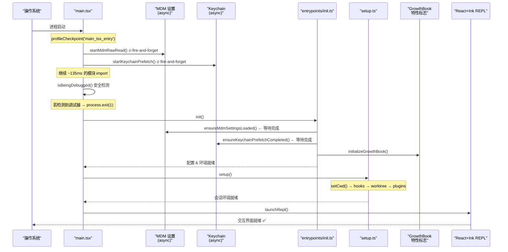
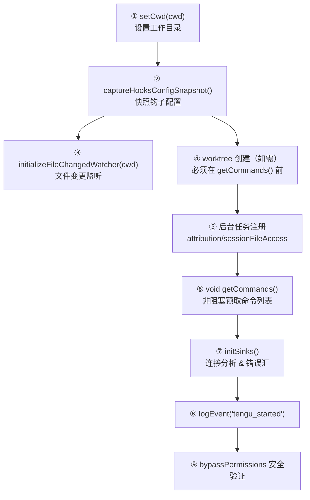
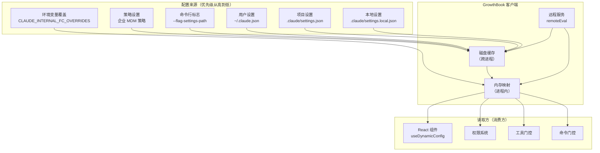

# 第02课：启动流程与初始化机制

> **阶段**：第一阶段 · 架构认知  
> **建议时长**：90 分钟  
> **难度**：⭐⭐⭐

---

## 课程信息

### 学习目标

完成本课学习后，你将能够：

1. 描述 Claude Code 从命令行启动到"交互就绪"的完整生命周期（7 个阶段）
2. 解释"并行预取"优化策略的实现原理与性能收益
3. 理解特性标志（Feature Flags）系统的架构与优先级规则
4. 分析 `setup.ts` 中工作树、钩子、插件预取的初始化顺序及其设计依据
5. 识别启动流程中的"安全门控"机制（调试检测、沙箱验证、Root 检测）

---

## 核心概念

### 1.1 启动阶段划分

Claude Code 的启动过程可以分为 7 个清晰的阶段：

| 阶段 | 时机 | 主要工作 | 关键文件 |
|------|------|----------|----------|
| ① 预取触发 | import 前 | 触发 MDM/keychain 并行读取 | `main.tsx` 顶部 |
| ② 模块加载 | import 阶段 | 加载所有依赖模块（~135ms） | `main.tsx` 全部 import |
| ③ 安全门控 | import 后立即 | 调试模式检测、版本验证 | `main.tsx` L265-271 |
| ④ CLI 解析 | Commander.js | 解析命令行参数 | `main.tsx` Commander 部分 |
| ⑤ 全局初始化 | `init()` | 配置加载、网络初始化、遥测 | `entrypoints/init.ts` |
| ⑥ 会话设置 | `setup()` | 工作树、钩子、插件预取 | `setup.ts` |
| ⑦ 渲染就绪 | `launchRepl()` | 启动 React+Ink REPL | `replLauncher.tsx` |

### 1.2 并行预取 vs. 串行读取

**串行模式**（传统 CLI）：
```
启动 → 读 MDM (~80ms) → 读 keychain (~65ms) → 开始工作
总耗时 ≈ 145ms+
```

**并行预取模式**（Claude Code）：
```
启动 → [触发 MDM 读取] → 加载模块 (135ms) → 等待完成
      [触发 keychain 读取] ↗
总耗时 ≈ max(135ms, 80ms, 65ms) ≈ 135ms
节省 ≈ 145ms - 135ms = ~10ms（实际效果更好，MDM/keychain 通常比模块加载更快）
```

### 1.3 特性标志系统的三种读取模式

| 读取模式 | 函数名 | 适用场景 | 阻塞特性 |
|----------|--------|----------|----------|
| 缓存优先 | `getFeatureValue_CACHED_MAY_BE_STALE` | 启动路径、同步上下文 | 非阻塞，返回磁盘缓存 |
| 缓存+刷新 | `getFeatureValue_CACHED_WITH_REFRESH` | 运行时权限检查 | 非阻塞，后台更新 |
| 阻塞式 | `getDynamicConfig_BLOCKS_ON_INIT` | 非启动路径需最新值 | 阻塞，等待初始化 |

---

## 架构设计与设计思想

### 2.1 启动序列全景图



### 2.2 为什么在 import 之前触发 I/O？

这是本文档中最精妙的工程设计之一。JavaScript/TypeScript 的 `import` 语句在模块评估阶段是**同步阻塞**的——当解释器处理所有 import 时，主线程无法执行任何其他 JavaScript。

但 `startMdmRawRead()` 和 `startKeychainPrefetch()` 的操作是**系统级 I/O**（进程创建、系统调用），它们在操作系统层面可以与 JavaScript 模块评估并行进行。

```
┌─────────────────────────────────────────────────────────────┐
│                    进程时间轴                                 │
├─────────────────────────────────────────────────────────────┤
│ JS 线程:  [MDM触发][KC触发]──[~135ms 模块加载]──[等待MDM/KC]│
│ 系统线程: ──────[MDM读取~80ms]──────                        │
│ 系统线程: ──────[KC读取~65ms]────────                       │
└─────────────────────────────────────────────────────────────┘
```

**设计哲学**：*在等待成本不可避免时，将等待隐藏在其他必要工作的背后。*

### 2.3 `setup()` 的初始化顺序设计

`setup()` 中的操作顺序不是随意的，而是精心设计的**依赖拓扑排序**：



**注释**：
- `setCwd()` 必须是第一步，因为所有钩子配置读取依赖正确的工作目录
- 钩子快照（`captureHooksConfigSnapshot`）必须在文件监听器初始化前，确保监听器使用最新配置
- worktree 创建必须在 `getCommands()` 前，因为 worktree 会影响可用命令（如 `/eject`）
- `logEvent('tengu_started')` 在分析汇连接后立即触发，是会话成功率的分母基准

### 2.4 特性标志系统架构



**关键设计决策**：GrowthBook 使用 `remoteEval` 模式——服务端预先计算每个用户的特性值，客户端只接收最终结果，而不是运行实验逻辑。这确保了安全性（实验逻辑不暴露给客户端）和一致性（所有客户端看到相同结果）。

---

## 关键源码深度走查

### 3.1 main.tsx：启动前的三次"先手布局"

**文件**：`src/main.tsx` 第 1-20 行

```typescript
// 这三条语句必须在所有 import 之前：
// 利用 ES module 执行特性：import 前的顶层语句先运行

profileCheckpoint('main_tsx_entry');  // ① 性能基准时间戳

startMdmRawRead();   // ② 启动 MDM 子进程（plutil/reg query）
                     //   → 与后续 ~135ms 的 import 并行执行
                     //   → 源码注释说明节省了约 80ms

startKeychainPrefetch();  // ③ 启动 macOS keychain 读取
                          //   → 两次串行读取约 65ms，并行化为近乎零等待
                          //   → 避免了 applySafeConfigEnvironmentVariables()
                          //     中的同步 spawn 阻塞
```

**执行特性**：
- Bun 的顶层代码执行模型允许 import 前的语句先执行
- 这三行代码是整个启动优化的基石
- `profileCheckpoint` 不仅用于性能分析，也用于冻结入口时间戳（重要的基准点）

> 💡 **设计点评 — profileCheckpoint 性能分析基础设施**
> 
> **好在哪里**：你可以把 `profileCheckpoint` 想象成赛跑的计时器——每段路程都打一个时间戳。整个启动过程散落着这些调用，等于给代码装了个"体检仪"，工程师随时能看出哪个阶段拖了后腿，定位性能瓶颈从"猜"变成"看数据"。
> 
> **如果不这样做**：没有检查点就像蒙眼开车，你只知道"启动慢了"，却不知道慢在哪里，每次优化都是碰运气。

---

### 3.2 main.tsx：调试模式安全门控

**文件**：`src/main.tsx` 第 232-271 行

```typescript
// 检测调试器/检查模式
function isBeingDebugged() {
  const isBun = isRunningWithBun();

  // ① 检查进程参数中的 --inspect 标志
  const hasInspectArg = process.execArgv.some(arg => {
    if (isBun) {
      // Bun 特殊处理：单文件可执行文件的参数泄露问题
      return /--inspect(-brk)?/.test(arg);
    } else {
      // Node.js：同时检测新式 --inspect 和旧式 --debug
      return /--inspect(-brk)?|--debug(-brk)?/.test(arg);
    }
  });

  // ② 检查 NODE_OPTIONS 环境变量
  const hasInspectEnv = process.env.NODE_OPTIONS &&
    /--inspect(-brk)?|--debug(-brk)?/.test(process.env.NODE_OPTIONS);

  // ③ 通过全局 require('inspector') 检测活动调试器
  try {
    const inspector = (global as any).require('inspector');
    const hasInspectorUrl = !!inspector.url();  // URL 存在 = 调试器已连接
    return hasInspectorUrl || hasInspectArg || hasInspectEnv;
  } catch {
    return hasInspectArg || hasInspectEnv;
  }
}

// 外部用户运行时检测到调试器 → 立即退出
if ("external" !== 'ant' && isBeingDebugged()) {
  process.exit(1);  // ④ 没有错误提示，静默退出
}
```

**逐行解析**：

① 进程参数检测：`--inspect-brk` 会在第一行代码前暂停，允许调试器附加。  
② 环境变量检测：有些环境通过 `NODE_OPTIONS` 传递调试标志。  
③ Inspector URL 检测：最可靠的方式——如果调试器已连接，`inspector.url()` 返回 WebSocket 地址。  
④ `"external" !== 'ant'`：这是构建时常量替换。对于 `ant` 内部构建，`USER_TYPE` 被替换为 `'ant'`，条件变为 `false`，调试门控被禁用。对于外部发布版本，门控始终生效。

**设计动机**：通过调试器可以绕过 JavaScript 层面的所有权限检查。静默退出（无提示）是刻意为之——避免给潜在攻击者任何信息。

> 💡 **设计点评 — 编译期常量替换的安全门控**
> 
> **好在哪里**：`"external" !== 'ant'` 这行看起来奇怪，实际上是一把"隐形开关"。构建工具在打包时把字符串 `"external"` 换成真实的用户类型，如果是内部构建，这段代码在打包产物里根本不存在（Dead Code Elimination 消掉了）。这意味着内部开发时调试不受影响，外部用户拿到的版本里调试门永远关着。
> 
> **如果不这样做**：如果用运行时 `if (process.env.USER_TYPE !== 'ant')` 判断，用户可以轻松通过修改环境变量绕过检查，安全形同虚设。

---

### 3.3 setup.ts：工作树创建的完整流程

**文件**：`src/setup.ts` 第 176-285 行

```typescript
if (worktreeEnabled) {
  // ① 检查 VCS 支持：git 或自定义钩子二选一
  const hasHook = hasWorktreeCreateHook()
  const inGit = await getIsGit()
  if (!hasHook && !inGit) {
    process.stderr.write(chalk.red(`Error: Can only use --worktree in a git repository...`))
    process.exit(1)
  }

  // ② 生成工作树分支名（基于 PR 编号或用户命名）
  const slug = worktreePRNumber
    ? `pr-${worktreePRNumber}`
    : (worktreeName ?? getPlanSlug())  // 自动生成计划 slug

  // ③ 在 git 仓库中：解析到 canonical 根（处理嵌套工作树情况）
  if (inGit) {
    const mainRepoRoot = findCanonicalGitRoot(getCwd())
    // 如果当前在某个工作树内，切换到主仓库根目录
    if (mainRepoRoot !== (findGitRoot(getCwd()) ?? getCwd())) {
      process.chdir(mainRepoRoot)
      setCwd(mainRepoRoot)
    }
  }

  // ④ 实际创建工作树（可能触发 WorktreeCreate 钩子）
  const worktreeSession = await createWorktreeForSession(
    getSessionId(), slug, tmuxSessionName,
    worktreePRNumber ? { prNumber: worktreePRNumber } : undefined,
  )

  // ⑤ 切换到新工作树目录，更新所有路径状态
  process.chdir(worktreeSession.worktreePath)
  setCwd(worktreeSession.worktreePath)
  setOriginalCwd(getCwd())
  setProjectRoot(getCwd())          // 工作树是独立项目根
  saveWorktreeState(worktreeSession) // 保存状态用于恢复

  // ⑥ 清理 & 重新初始化（路径变了，缓存要刷新）
  clearMemoryFileCaches()     // 记忆文件缓存依赖路径
  updateHooksConfigSnapshot() // 工作树可能有不同的钩子配置
}
```

**逐行解析**：

① 双模式支持：普通 git 工作树或自定义 `WorktreeCreate` 钩子（用于非 git VCS 系统）  
② `getPlanSlug()` 自动生成简洁的计划描述作为工作树名称  
③ `findCanonicalGitRoot` 处理"已经在工作树中"的情况——避免在工作树里再创建工作树  
⑤ 三个路径状态需要同步更新：进程工作目录、shell 工作目录、项目根  
⑥ 路径改变后必须清理缓存：记忆文件路径是相对于 `originalCwd` 计算的  

**设计原则**：**路径状态的一致性维护**——系统中有多处存储工作目录（`process.cwd()`、`getCwd()`、`getProjectRoot()`、`getOriginalCwd()`），工作树创建时必须全部同步更新。

> 💡 **设计点评 — 路径状态同步更新**
> 
> **好在哪里**：工作树创建后，代码同时更新了进程工作目录、`getCwd()`、`getProjectRoot()` 三处路径状态，并且主动清理了依赖路径的缓存。这就像搬家后除了换地址，还要主动通知快递、银行、单位——别只改了一处，让其他地方还拿着旧地址送东西。
> 
> **如果不这样做**：如果只更新了 `process.cwd()` 而忘了 `setCwd()`，记忆文件系统会用旧路径寻找配置，钩子系统会加载错误目录的钩子，导致一系列难以排查的隐性 bug。

---

### 3.4 setup.ts：bypassPermissions 的沙箱安全验证

**文件**：`src/setup.ts` 第 396-442 行

```typescript
if (permissionMode === 'bypassPermissions' || allowDangerouslySkipPermissions) {
  // ① Root 用户检测（Unix 系统）
  if (
    process.platform !== 'win32' &&
    typeof process.getuid === 'function' &&
    process.getuid() === 0 &&           // UID 0 = root
    process.env.IS_SANDBOX !== '1' &&   // 非沙箱豁免
    !isEnvTruthy(process.env.CLAUDE_CODE_BUBBLEWRAP)  // 非 bubblewrap 豁免
  ) {
    console.error(`--dangerously-skip-permissions cannot be used with root/sudo`)
    process.exit(1)
  }

  // ② 内部用户的额外安全检查（并行检测环境）
  if (
    process.env.USER_TYPE === 'ant' &&
    process.env.CLAUDE_CODE_ENTRYPOINT !== 'local-agent' &&
    process.env.CLAUDE_CODE_ENTRYPOINT !== 'claude-desktop'
  ) {
    const [isDocker, hasInternet] = await Promise.all([
      envDynamic.getIsDocker(),       // ③ 并行检测 Docker
      env.hasInternetAccess(),         // ④ 并行检测网络访问
    ])
    const isBubblewrap = envDynamic.getIsBubblewrapSandbox()
    const isSandbox = process.env.IS_SANDBOX === '1'
    const isSandboxed = isDocker || isBubblewrap || isSandbox

    // ⑤ 必须同时满足：在沙箱中 AND 无互联网访问
    if (!isSandboxed || hasInternet) {
      console.error(
        `--dangerously-skip-permissions can only be used in Docker/sandbox containers ` +
        `with no internet access but got Docker: ${isDocker}, Bubblewrap: ${isBubblewrap}, ` +
        `IS_SANDBOX: ${isSandbox}, hasInternet: ${hasInternet}`
      )
      process.exit(1)
    }
  }
}
```

**逐行解析**：

① Root 检测：以 root 权限运行 + bypass 权限 = 最高危组合。沙箱环境豁免是因为某些 TPU 开发空间需要 root 权限。  
② 内部用户受更严格限制（需要在真实的沙箱里）。外部用户没有这个检查是因为外部用户无法启用内部功能。  
③④ 两项检测并行执行（`Promise.all`），因为互相独立，并行可节省时间。  
⑤ **双重条件**：必须在沙箱 *且* 没有互联网访问——有互联网的容器不算安全沙箱，可能被渗透。

**设计哲学**：**最小权限原则（Principle of Least Privilege）** + **深度防御（Defense in Depth）**。多重独立检查，任何一项失败都拒绝执行。

> 💡 **设计点评 — 双重条件安全门**
> 
> **好在哪里**：`!isSandboxed || hasInternet` 这个条件要求"必须在沙箱里 AND 没有网络"才能放行。这就像一个保险柜需要两把钥匙——钥匙 A（沙箱隔离）和钥匙 B（断网）缺一不可。有网络的 Docker 容器不够安全，因为里面的 AI 如果被渗透，能通过网络向外泄露数据。
> 
> **如果不这样做**：如果只检查"是否在 Docker 里"，有网络访问的容器依然可以被利用作为攻击跳板，`bypassPermissions` 模式就成了一个高风险的漏洞入口。

---

### 3.5 main.tsx：调试检测中的"编译期常量"技巧

**文件**：`src/main.tsx` 第 266 行

```typescript
// "external" !== 'ant'
// 上面的字符串 "external" 在构建时被替换为实际的 USER_TYPE 值
if ("external" !== 'ant' && isBeingDebugged()) {
  process.exit(1);
}
```

这行代码展示了一个聪明的**编译期优化**技巧：

- 对于 `ant` 内部构建：`USER_TYPE` 被构建工具替换为 `'ant'`，条件变为 `'ant' !== 'ant'` = `false`，整个 if 块被 DCE 消除
- 对于外部构建：`USER_TYPE` 被替换为 `'external'`，条件变为 `'external' !== 'ant'` = `true`，门控生效

这意味着内部版本中**不存在**这段调试检测代码，不影响开发体验；外部版本中始终有效，无法绕过。

> 💡 **设计点评 — void getCommands() 的非阻塞预取**
> 
> **好在哪里**：`void getCommands(getProjectRoot())` 这行代码乍看很奇怪，用 `void` 丢掉返回值，但这正是设计意图——触发命令列表的缓存预热，不等结果。等用户真的输入 `/xxx` 时，缓存早就热了，响应是即时的。就像餐厅在午高峰到来前提前备好菜，而不是客人点单才开始备料。
> 
> **如果不这样做**：如果等到用户输入命令才开始加载，用户会看到明显的等待延迟，第一次使用斜杠命令的体验会很差。

---

## Harness Engineering

### Harness Engineering 视角

Claude Code 的启动模块是一个典型的"驾驭层"设计——它并不是 AI 本身，而是**约束、增强、编排** AI 能力的一套机制。

**1. 安全约束 AI 的边界**

`isBeingDebugged()` 安全门控和 `bypassPermissions` 的沙箱验证，本质上是在告诉 AI："你运行在什么环境里，哪些操作是被允许的"。这是 Harness 思维的核心——AI 再强大，也必须在清晰定义的约束框架内运行。

```typescript
// Harness 的体现：在 AI 启动前，先建立安全边界
if (permissionMode === 'bypassPermissions') {
  // 检查环境是否足够安全，不安全就拒绝启动
  if (!isSandboxed || hasInternet) {
    process.exit(1)  // 驾驭层拒绝为不安全的执行托底
  }
}
```

**2. 增强 AI 的响应速度**

`startMdmRawRead()` 和 `startKeychainPrefetch()` 在 AI 模型初始化前就并行预热，确保 AI 拿到配置的时候不用等待。这是 Harness 层对 AI 能力的主动增强——不是 AI 自己优化的，而是驾驭层提前准备好。

**3. 编排 AI 的初始化顺序**

`setup.ts` 中的 9 步拓扑排序，是 Harness 对 AI 运行环境的精确编排。每一步顺序都经过设计：先有工作目录，才有钩子；先有钩子，才有文件监听。这种"为 AI 铺路"的逻辑，正是驾驭工程的价值。

### 对大模型应用的启发

**1. 启动预热是用户体验的第一关**  
把 I/O 操作（配置读取、API 预连接）提前到"等待阶段"执行，而不是等用户请求才触发。`fire-and-forget` + 后续等待的模式，让等待时间和必要工作时间重叠，用户感知到的延迟可以大幅缩短。

**2. 安全验证要在最早的时机完成**  
Claude Code 在 `import` 阶段就完成调试检测，在会话初始化时完成沙箱验证。你自己的大模型应用也应该把"这个请求是否合法"的判断尽量前置，避免做了一堆昂贵的 AI 调用之后才发现请求不合法。

**3. 编译期常量比运行时检查更安全**  
通过构建工具替换字符串常量，可以实现"内外版本行为不同"且无法通过修改环境变量绕过的安全机制。如果你的应用有内外版本差异（如内部调试功能），这种方式比 `if (process.env.DEBUG)` 更可靠。

**4. 多处状态必须同步更新**  
当一个操作（如切换工作目录）影响多个系统状态时，必须有一个"统一更新入口"，并主动清理依赖旧状态的缓存。这是所有驾驭层都需要面对的状态一致性问题。

**5. 观测性从第一行代码就开始**  
`profileCheckpoint('main_tsx_entry')` 是代码的第一行。告诉你：可观测性不是"功能做完了再加"的事，而是从架构设计阶段就要考虑的基础设施。

---

## 思考题与进阶方向

### 思考题

**题目 1**：为什么 `setup.ts` 中的 `logEvent('tengu_started')` 不能放在 `setup()` 函数的最开头？分析具体原因，考虑分析汇初始化时序。

<details>
<summary>💡 参考答案</summary>

`logEvent` 依赖 `initSinks()` 初始化的分析汇（analytics sink）来真正发送事件。如果放在 `setup()` 最开头，分析汇还没连接，事件会丢失。而将 `tengu_started` 放在 `initSinks()` 之后、可能失败的操作（如 `checkForReleaseNotes()`）之前，是刻意为之的设计——这个事件成为"会话成功启动"的分母基准，后续即使崩溃，监控系统也能计算出准确的崩溃率。

</details>

**题目 2**：`findCanonicalGitRoot` vs. `findGitRoot` 的区别是什么？在工作树场景中各自返回什么？为什么工作树创建需要用 canonical 版本？

<details>
<summary>💡 参考答案</summary>

`findGitRoot` 返回当前所在 git 仓库的根（包括工作树自身的根），而 `findCanonicalGitRoot` 会识别当前是否在工作树中，如果是，会向上找到主仓库的根目录。工作树创建时必须用 canonical 版本，因为如果已经在某个工作树内再运行 `--worktree`，`findGitRoot` 会返回工作树根，导致在工作树里再嵌套创建工作树，形成混乱的嵌套结构。canonical 版本确保始终从主仓库创建工作树。

</details>

**题目 3**：`GrowthBook` 使用 `remoteEval` 而不是本地评估有什么安全隐患和好处？考虑：如果实验逻辑在客户端，攻击者可以做什么？

<details>
<summary>💡 参考答案</summary>

本地评估模式下，实验逻辑（如"用户 A 看功能 X，用户 B 看功能 Y"的判断规则）会打包到客户端，攻击者可以通过逆向工程了解灰度发布策略，甚至修改本地代码强制启用未公开功能。`remoteEval` 模式下服务端做决策后只发结果，客户端永远不知道判断逻辑。代价是需要网络请求，但磁盘缓存 + 后台刷新机制保证了可用性，离线时仍可使用缓存值。

</details>

**题目 4**：`startMdmRawRead()` 和 `startKeychainPrefetch()` 为什么不使用 `import` 语句而是 `require()` + 函数调用？思考 ESM 的 import 语义。

<details>
<summary>💡 参考答案</summary>

ESM 的 `import` 语句是静态的，必须在模块顶层声明，引擎会在执行任何代码前先处理所有 import 并等待模块加载。因此，写在 import 前面的代码在 Bun/Node.js 中实际上是不可能的——如果用 `import` 语句导入这两个函数，它们的模块加载本身就是阻塞的。源码中使用的是顶层代码（在 ESM 模块的顶层作用域）先执行，然后用 CommonJS `require()` 懒加载（`require` 是同步但可以按需调用），这样就能先触发 I/O 再做模块加载。

</details>

**题目 5**：如果 `checkForReleaseNotes()` 在 `tengu_started` 之后崩溃，监控系统看到什么？这对 SLA 计算有什么影响？

<details>
<summary>💡 参考答案</summary>

监控系统会看到一个 `tengu_started` 事件，但后续没有正常的会话交互事件，只有崩溃报告。这正是设计意图：`tengu_started` 作为分母，用于计算"启动成功但随后崩溃"的比率。如果 `tengu_started` 放在 `checkForReleaseNotes` 之后，那么在 release notes 崩溃的情况下，这个启动根本不会被计入分母，导致崩溃率被低估。当前的位置确保了 SLA 计算的准确性。

</details>

### 进阶方向

- **深入阅读**：`src/entrypoints/init.ts`——了解 `applySafeConfigEnvironmentVariables()` 如何安全地将配置注入环境变量
- **性能分析**：查看 `src/utils/startupProfiler.ts`，了解 `profileCheckpoint` 如何收集和报告启动性能数据
- **迁移系统**：查看 `src/migrations/` 目录，了解 Claude Code 如何处理配置格式迁移（如 `migrateFennecToOpus`）
- **GrowthBook 集成**：深入阅读 `src/services/analytics/growthbook.ts`，了解远程特性标志的完整生命周期
- **工作树系统**：阅读 `src/utils/worktree.ts`，了解 git worktree 的创建、管理和清理机制

---

## 小结

Claude Code 的启动流程是一个**高度优化且安全性至上**的初始化序列：

1. **性能优化**：并行预取将 I/O 等待隐藏在模块加载时间中，节省约 100-200ms 启动时间
2. **安全门控**：调试检测、Root 检测、沙箱验证三道防线，在最早时机阻止不安全执行
3. **有序初始化**：严格的拓扑顺序确保每个组件在其依赖就绪后再初始化
4. **特性标志**：GrowthBook 提供运行时可控的功能开关，磁盘缓存 + 内存映射 + 远程刷新三级机制保障可用性
5. **观测性**：`profileCheckpoint` 和 `tengu_started` 为性能分析和健康监控提供基础设施

下一课我们将深入权限系统，了解 Claude Code 如何在 AI 自主性和人类控制之间实现精妙平衡。

---

*参考源码*：`src/main.tsx`、`src/setup.ts`、`src/entrypoints/init.ts`、`src/services/analytics/growthbook.ts`
