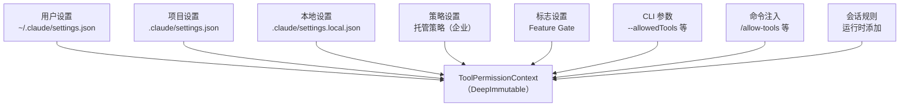
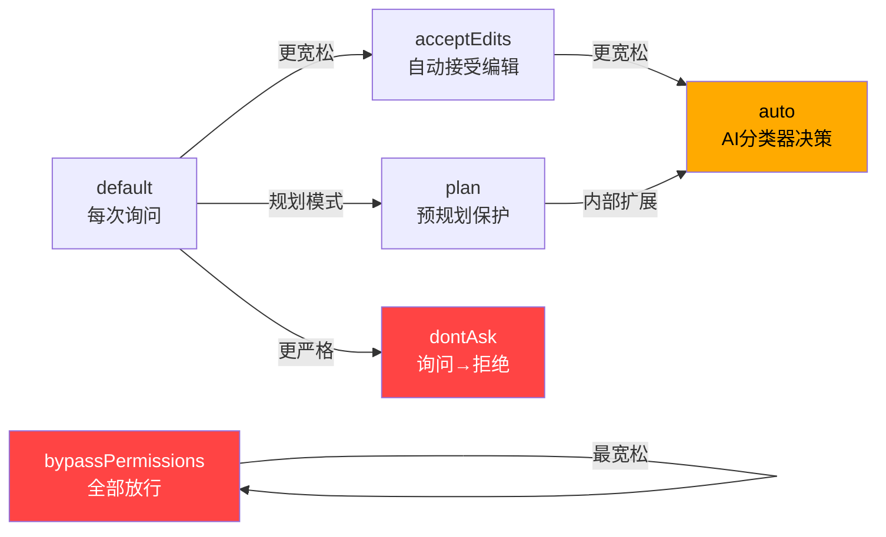
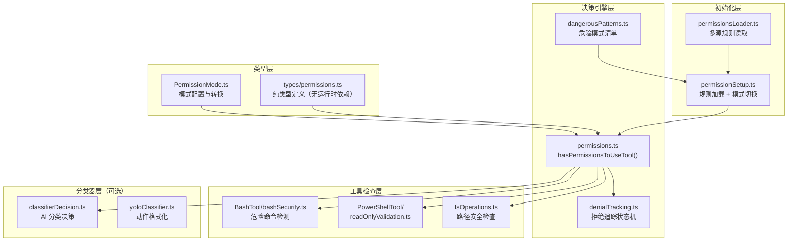
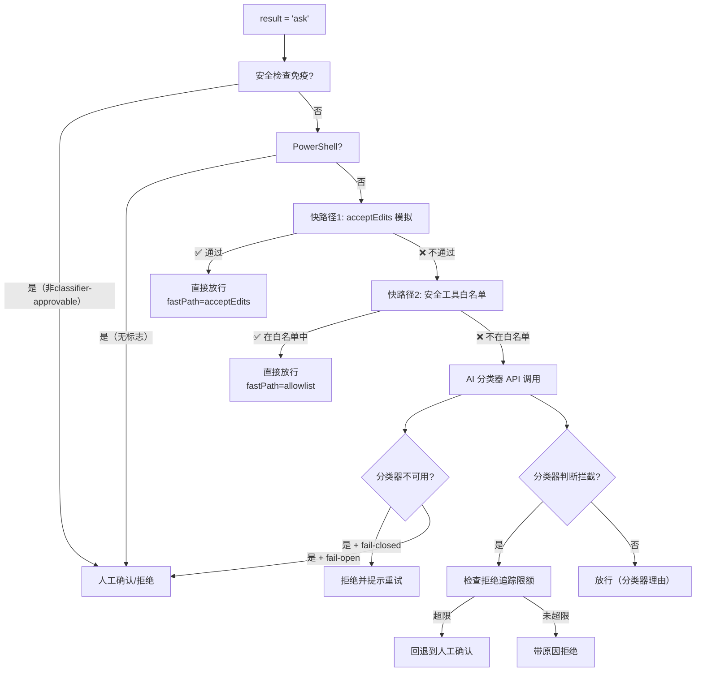
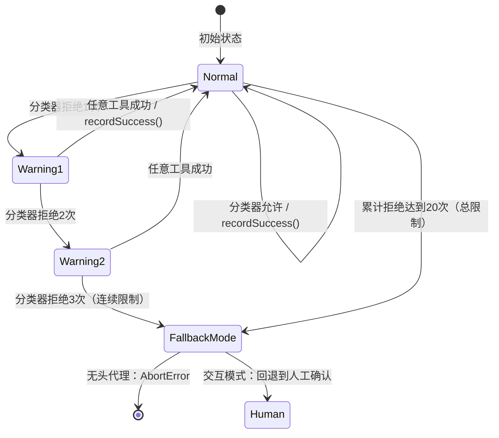
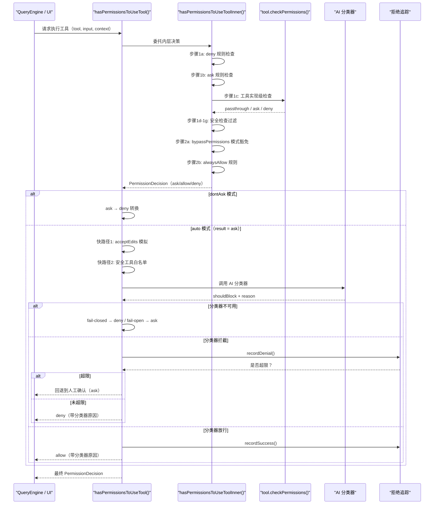

# 第03课：权限系统 — AI 安全的核心防线

---

## 课程信息

| 项目 | 内容 |
|------|------|
| **所属阶段** | 第一阶段：宏观架构与核心机制 |
| **建议时长** | 120 分钟 |
| **难度等级** | ⭐⭐⭐⭐（中高级） |
| **前置课程** | 01-全景架构解析、02-启动流程与初始化 |

### 学习目标

完成本课后，你将能够：

1. **理解权限系统的整体设计哲学**：为什么 AI 助手需要细粒度权限控制，如何在自动化效率与安全保障之间取得平衡
2. **掌握 6 种权限模式的特征与适用场景**：从最严格的 `default` 到最宽松的 `bypassPermissions`，理解每种模式的语义与安全边界
3. **深入理解多层权限决策链**：规则检查 → 工具检查 → 安全免疫检查 → 模式豁免 → 分类器评估 → 拒绝追踪的完整流程
4. **掌握危险模式检测机制**：Bash/PowerShell 危险前缀列表的设计逻辑，以及自动模式中的规则剥离与恢复策略
5. **学习工程权衡思想**：fail-closed vs fail-open 策略、拒绝追踪的自我保护机制等安全工程设计原则

---

## 核心概念

### 1. 权限系统的本质问题

Claude Code 是一个能够操作文件系统、执行 Shell 命令、访问网络的 AI 助手。这带来了一个根本性的安全问题：

**如何在 AI 高度自动化的前提下，确保用户对危险操作保有控制权？**

这不是简单的"允许"或"拒绝"二元问题。真实场景需要考虑：
- 同一操作（如 `Bash`）在不同上下文中风险级别差异巨大
- 用户期望越来越自动化，但不愿意放弃对关键操作的控制
- 团队/组织级别的安全策略需要凌驾于个人偏好之上
- AI 分类器本身可能不可用或出错

### 2. 核心抽象模型

```
PermissionDecision = allow | ask | deny
PermissionResult   = PermissionDecision | passthrough（工具返回，上层处理）
```

决策体现在三个层面：

```
用户层（模式选择）──────────────────────────── PermissionMode
规则层（静态规则集）────────────────────────── ToolPermissionContext
工具层（动态检查）──────────────────────────── Tool.checkPermissions()
```

### 3. 权限规则的多源来源



规则有三种行为：**allow**（直接放行）、**deny**（直接拒绝）、**ask**（提示用户）。

优先级顺序：`deny > ask > allow`（拒绝规则不会被允许规则覆盖）。

---

## 权限模式详解

### 6 种权限模式

| 模式 | 标题 | 符号 | 颜色 | 外部可见 | 适用场景 |
|------|------|------|------|----------|----------|
| `default` | Default | — | text | ✅ | 日常交互，每次操作前询问 |
| `plan` | Plan Mode | ⏸ | planMode | ✅ | 先规划后执行，减少误操作 |
| `acceptEdits` | Accept edits | ⏵⏵ | autoAccept | ✅ | 自动接受文件编辑，但命令仍需确认 |
| `bypassPermissions` | Bypass Permissions | ⏵⏵ | **error**（红色） | ✅ | CI/CD 全自动化，极度危险 |
| `dontAsk` | Don't Ask | ⏵⏵ | **error**（红色） | ✅ | 将所有"询问"转为"拒绝" |
| `auto` | Auto mode | ⏵⏵ | warning（黄色） | ❌（仅内部） | AI 分类器替代人工确认 |

> 注意：`auto` 模式由 `TRANSCRIPT_CLASSIFIER` 特性标志控制，仅在特定构建中启用。颜色使用 **error（红色）** 的模式标志着高风险，这是在 UI 中向用户发出的视觉警告信号。

### 模式语义图谱



### `bypassPermissions` 的安全验证

这个模式名为"绕过权限"，但启用时会经过严格的安全校验（在 `setup.ts` 中）：

```typescript
// src/setup.ts（节选）
if (toolPermissionContext.mode === 'bypassPermissions') {
  // 验证1：是否在 Docker/沙箱容器中？
  const isSandboxed = await isDockerOrSandboxed()
  
  // 验证2：是否有互联网访问？
  const hasInternetAccess = await checkInternetAccess()
  
  // 两个条件都不满足时，拒绝启用 bypassPermissions
  if (!isSandboxed && hasInternetAccess) {
    throw new Error('bypassPermissions mode requires either a sandbox or no internet access')
  }
}
```

**设计哲学**：即使用户明确要求全自动，系统仍然会验证运行环境是否足够安全。这体现了"信任但验证"（Trust but Verify）原则。

---

## 架构设计与设计思想

### 权限系统整体架构



### 核心设计原则

**1. 关注点分离**

- `types/permissions.ts`：**纯类型文件**，无任何运行时依赖，专为打破循环引用设计
- `permissions.ts`：决策引擎，只负责"做决策"
- `permissionSetup.ts`：模式切换副作用，负责规则的初始化和动态变更
- 工具文件（BashTool 等）：负责自己领域的检查逻辑

**2. 不可变上下文（Immutability）**

```typescript
// src/types/permissions.ts（节选）
export type ToolPermissionContext = {
  readonly mode: PermissionMode
  readonly additionalWorkingDirectories: ReadonlyMap<string, AdditionalWorkingDirectory>
  readonly alwaysAllowRules: ToolPermissionRulesBySource
  readonly alwaysDenyRules: ToolPermissionRulesBySource
  readonly alwaysAskRules: ToolPermissionRulesBySource
  readonly isBypassPermissionsModeAvailable: boolean
  readonly strippedDangerousRules?: ToolPermissionRulesBySource
  readonly shouldAvoidPermissionPrompts?: boolean
  readonly prePlanMode?: PermissionMode
}
```

`ToolPermissionContext` 是完全只读的，任何修改都会生成新的对象而非直接改变现有状态。这防止了在权限检查过程中的意外状态修改，是**防御性编程**的体现。

**3. 决策链的不可绕过性**

某些安全检查被设计为"免疫于模式豁免"：
- 安全路径检查（`type: 'safetyCheck'`）
- 内容级 `ask` 规则（用户明确配置的命令确认）
- 需要用户交互的工具（`tool.requiresUserInteraction()`）

这体现了**最小权限原则**：即使是全权限模式，也不应绕过用户明确设置的保护。

---

## 关键源码深度走查

### 走查 1：权限决策主函数 `hasPermissionsToUseToolInner`

> **文件**：`src/utils/permissions/permissions.ts` L1158-1319

这是整个权限系统的心脏——一个完整的决策漏斗：

```typescript
async function hasPermissionsToUseToolInner(
  tool: Tool,
  input: { [key: string]: unknown },
  context: ToolUseContext,
): Promise<PermissionDecision> {
  
  // 第一步：中止信号检查
  if (context.abortController.signal.aborted) {
    throw new AbortError()  // 快速失败，避免无效计算
  }

  let appState = context.getAppState()

  // ━━━━━━━━━━━━━━━━━━━━━━━━━━━━━━━━━━━━━━
  // 步骤 1a：整体工具拒绝规则
  // ━━━━━━━━━━━━━━━━━━━━━━━━━━━━━━━━━━━━━━
  const denyRule = getDenyRuleForTool(appState.toolPermissionContext, tool)
  if (denyRule) {
    return {
      behavior: 'deny',
      decisionReason: { type: 'rule', rule: denyRule },
      message: `Permission to use ${tool.name} has been denied.`,
    }
    // 设计原则：deny 规则是最高优先级，不可被任何模式覆盖
  }

  // ━━━━━━━━━━━━━━━━━━━━━━━━━━━━━━━━━━━━━━
  // 步骤 1b：整体工具询问规则（带沙箱例外）
  // ━━━━━━━━━━━━━━━━━━━━━━━━━━━━━━━━━━━━━━
  const askRule = getAskRuleForTool(appState.toolPermissionContext, tool)
  if (askRule) {
    // 沙箱例外：如果启用了沙箱且命令会在沙箱中运行，可以自动放行
    const canSandboxAutoAllow =
      tool.name === BASH_TOOL_NAME &&
      SandboxManager.isSandboxingEnabled() &&
      SandboxManager.isAutoAllowBashIfSandboxedEnabled() &&
      shouldUseSandbox(input)

    if (!canSandboxAutoAllow) {
      return {
        behavior: 'ask',   // 询问用户，不直接拒绝
        decisionReason: { type: 'rule', rule: askRule },
        message: createPermissionRequestMessage(tool.name),
      }
    }
    // 沙箱模式：fallthrough，让工具的 checkPermissions 决定子命令细节
  }

  // ━━━━━━━━━━━━━━━━━━━━━━━━━━━━━━━━━━━━━━
  // 步骤 1c：工具实现级权限检查
  // ━━━━━━━━━━━━━━━━━━━━━━━━━━━━━━━━━━━━━━
  let toolPermissionResult: PermissionResult = {
    behavior: 'passthrough',  // 默认 passthrough，由上层处理
    message: createPermissionRequestMessage(tool.name),
  }
  try {
    const parsedInput = tool.inputSchema.parse(input)  // Zod 类型校验
    toolPermissionResult = await tool.checkPermissions(parsedInput, context)
    // 策略模式（Strategy Pattern）：每个工具有自己的权限检查逻辑
  } catch (e) {
    if (e instanceof AbortError || e instanceof APIUserAbortError) {
      throw e  // 只重新抛出中止错误，其他错误记录后继续
    }
    logError(e)
  }

  // ━━━━━━━━━━━━━━━━━━━━━━━━━━━━━━━━━━━━━━
  // 步骤 1d：工具实现拒绝
  // ━━━━━━━━━━━━━━━━━━━━━━━━━━━━━━━━━━━━━━
  if (toolPermissionResult?.behavior === 'deny') {
    return toolPermissionResult  // 工具说不行就不行
  }

  // ━━━━━━━━━━━━━━━━━━━━━━━━━━━━━━━━━━━━━━
  // 步骤 1e：需要用户交互的工具（bypass 模式也无法跳过）
  // ━━━━━━━━━━━━━━━━━━━━━━━━━━━━━━━━━━━━━━
  if (tool.requiresUserInteraction?.() && toolPermissionResult?.behavior === 'ask') {
    return toolPermissionResult  // 某些工具（如 permission prompt）必须显示 UI
  }

  // ━━━━━━━━━━━━━━━━━━━━━━━━━━━━━━━━━━━━━━
  // 步骤 1f：内容级 ask 规则（免疫于 bypass 模式）
  // ━━━━━━━━━━━━━━━━━━━━━━━━━━━━━━━━━━━━━━
  if (
    toolPermissionResult?.behavior === 'ask' &&
    toolPermissionResult.decisionReason?.type === 'rule' &&
    toolPermissionResult.decisionReason.rule.ruleBehavior === 'ask'
  ) {
    return toolPermissionResult
    // 例：Bash(npm publish:*) → 用户明确要求确认这类命令，bypass 也不绕过
  }

  // ━━━━━━━━━━━━━━━━━━━━━━━━━━━━━━━━━━━━━━
  // 步骤 1g：安全检查（.git/, .claude/, shell 配置等）
  // ━━━━━━━━━━━━━━━━━━━━━━━━━━━━━━━━━━━━━━
  if (
    toolPermissionResult?.behavior === 'ask' &&
    toolPermissionResult.decisionReason?.type === 'safetyCheck'
  ) {
    return toolPermissionResult
    // 敏感系统文件的修改请求，必须走人工确认
  }

  // ━━━━━━━━━━━━━━━━━━━━━━━━━━━━━━━━━━━━━━
  // 步骤 2a：模式豁免（bypassPermissions 直接放行）
  // ━━━━━━━━━━━━━━━━━━━━━━━━━━━━━━━━━━━━━━
  appState = context.getAppState()  // 重新获取最新状态！
  const shouldBypassPermissions =
    appState.toolPermissionContext.mode === 'bypassPermissions' ||
    (appState.toolPermissionContext.mode === 'plan' &&
      appState.toolPermissionContext.isBypassPermissionsModeAvailable)
  
  if (shouldBypassPermissions) {
    return {
      behavior: 'allow',
      updatedInput: getUpdatedInputOrFallback(toolPermissionResult, input),
      decisionReason: {
        type: 'mode',
        mode: appState.toolPermissionContext.mode,
      },
    }
  }

  // ━━━━━━━━━━━━━━━━━━━━━━━━━━━━━━━━━━━━━━
  // 步骤 2b：全局允许规则
  // ━━━━━━━━━━━━━━━━━━━━━━━━━━━━━━━━━━━━━━
  const alwaysAllowedRule = toolAlwaysAllowedRule(appState.toolPermissionContext, tool)
  if (alwaysAllowedRule) {
    return {
      behavior: 'allow',
      updatedInput: getUpdatedInputOrFallback(toolPermissionResult, input),
      decisionReason: { type: 'rule', rule: alwaysAllowedRule },
    }
  }

  // ━━━━━━━━━━━━━━━━━━━━━━━━━━━━━━━━━━━━━━
  // 步骤 3：将 passthrough 转为 ask
  // ━━━━━━━━━━━━━━━━━━━━━━━━━━━━━━━━━━━━━━
  const result: PermissionDecision =
    toolPermissionResult.behavior === 'passthrough'
      ? {
          ...toolPermissionResult,
          behavior: 'ask' as const,
          message: createPermissionRequestMessage(tool.name, toolPermissionResult.decisionReason),
        }
      : toolPermissionResult

  return result
}
```

**设计模式解析**：
- **责任链模式（Chain of Responsibility）**：每个步骤都是一个处理节点，可以决定是否处理并返回，或将请求传递给下一节点
- **提前返回（Early Return）**：每个确定性决策都立即返回，避免不必要的后续检查
- **关注点分离**：内层函数只负责决策逻辑，外层 `hasPermissionsToUseTool` 负责 dontAsk/auto 模式转换

> 💡 **设计点评 — 类型文件提取打破循环依赖**
> 
> **好在哪里**：权限类型在很多文件中都需要。如果直接在实现文件中定义，就会形成 `Tool.ts → permissions.ts → BashTool.ts → Tool.ts` 的循环依赖链。把纯类型提到独立的 `types/permissions.ts`，所有人都依赖类型文件，但类型文件不依赖任何人，形成了干净的单向依赖图——就像建房子要先画图纸，图纸不依赖任何施工队，但所有施工队都看图纸。
> 
> **如果不这样做**：循环依赖在大型项目中会导致模块加载顺序不确定，运行时可能出现"找不到类型定义"的神秘错误，测试也很难隔离单个模块。

> 💡 **设计点评 — getAppState() 的双重调用**
> 
> **好在哪里**：在步骤 1c（异步工具检查）之后，代码会重新调用 `context.getAppState()` 获取最新状态，而不是沿用之前的快照。这是一个防御性编程细节：异步操作可能改变全局状态，用旧快照做后续判断会产生"时间窗口漏洞"——就像你核查了一次门是否上锁，但过了十分钟才去锁门，中间有人开门进来了你不知道。
> 
> **如果不这样做**：如果步骤 1c 中某个工具的异步权限检查触发了权限模式切换，步骤 2a 的模式判断就会用旧模式，可能导致错误地放行或拒绝操作。

---

### 走查 2：外层包装函数与模式转换

> **文件**：`src/utils/permissions/permissions.ts` L473-956

外层函数 `hasPermissionsToUseTool` 是装饰器，负责两大职责：**模式后处理** 和 **Auto 模式分类器调度**。

```typescript
export const hasPermissionsToUseTool: CanUseToolFn = async (
  tool, input, context, assistantMessage, toolUseID,
): Promise<PermissionDecision> => {
  
  // 调用内层决策函数
  const result = await hasPermissionsToUseToolInner(tool, input, context)

  // ━━━━━━━━━━━━━━━━━━━━━━━━━━━━━━━━━━━━━━
  // 成功路径：重置连续拒绝计数
  // ━━━━━━━━━━━━━━━━━━━━━━━━━━━━━━━━━━━━━━
  if (result.behavior === 'allow') {
    const appState = context.getAppState()
    if (feature('TRANSCRIPT_CLASSIFIER')) {
      const currentDenialState = context.localDenialTracking ?? appState.denialTracking
      if (
        appState.toolPermissionContext.mode === 'auto' &&
        currentDenialState?.consecutiveDenials > 0
      ) {
        const newDenialState = recordSuccess(currentDenialState)
        persistDenialState(context, newDenialState)
        // 成功执行一次工具 → 连续拒绝计数重置为 0
      }
    }
    return result
  }

  // ━━━━━━━━━━━━━━━━━━━━━━━━━━━━━━━━━━━━━━
  // dontAsk 模式：ask → deny 转换
  // ━━━━━━━━━━━━━━━━━━━━━━━━━━━━━━━━━━━━━━
  if (result.behavior === 'ask') {
    if (appState.toolPermissionContext.mode === 'dontAsk') {
      return {
        behavior: 'deny',
        decisionReason: { type: 'mode', mode: 'dontAsk' },
        message: DONT_ASK_REJECT_MESSAGE(tool.name),
        // 设计意图：自动化流程中不希望被打断，宁可拒绝也不弹出提示
      }
    }
    
    // ━━━━━━━━━━━━━━━━━━━━━━━━━━━━━━━━━━━━━━
    // auto 模式：AI 分类器决策
    // ━━━━━━━━━━━━━━━━━━━━━━━━━━━━━━━━━━━━━━
    if (feature('TRANSCRIPT_CLASSIFIER') && (
      appState.toolPermissionContext.mode === 'auto' ||
      (appState.toolPermissionContext.mode === 'plan' && autoModeStateModule?.isAutoModeActive())
    )) {
      // ... 分类器逻辑（见走查 3）
    }
  }

  return result
}
```

**装饰器模式（Decorator Pattern）的体现**：外层函数不修改内层逻辑，而是在其结果基础上添加额外行为（模式转换、分类器调用）。这使得 `hasPermissionsToUseToolInner` 可以被独立测试，也可以被 `checkRuleBasedPermissions` 单独复用。

> 💡 **设计点评 — checkRuleBasedPermissions 复用内部逻辑**
> 
> **好在哪里**：`checkRuleBasedPermissions` 是 `hasPermissionsToUseToolInner` 的子集，专供 `bypassPermissions` 模式使用——即使绕过了大多数权限检查，安全规则和安全路径检查仍然执行。通过提取公共逻辑为独立函数，避免了代码重复，函数命名也清晰地划定了职责边界。这就像警察有"特殊通行证"，能跳过大部分安检，但还是要过金属探测器这道底线。
> 
> **如果不这样做**：如果 `bypassPermissions` 直接复制粘贴了步骤 1a-1g 的代码，两处代码会逐渐漂移，未来修改安全检查逻辑时很容易只改了一处，埋下安全漏洞。

---

### 走查 3：Auto 模式三级快路径 + 分类器

> **文件**：`src/utils/permissions/permissions.ts` L519-927

Auto 模式是权限系统最复杂的部分，采用了"层层快路径"设计来优化性能：

```typescript
// ━━━━━━━━━━━━━━━━━━━━━━━━━━━━━━━━━━━━━━
// 安全检查豁免（非 classifier-approvable 的安全检查不进入 auto）
// ━━━━━━━━━━━━━━━━━━━━━━━━━━━━━━━━━━━━━━
if (
  result.decisionReason?.type === 'safetyCheck' &&
  !result.decisionReason.classifierApprovable
) {
  // Windows 路径绕过攻击等不可分类器审批的情况
  // 无头代理直接拒绝，交互模式回退到人工确认
  if (appState.toolPermissionContext.shouldAvoidPermissionPrompts) {
    return { behavior: 'deny', ... }
  }
  return result  // 交互模式：正常走人工确认流程
}

// PowerShell 保护：没有 POWERSHELL_AUTO_MODE 标志时拒绝自动化
if (tool.name === POWERSHELL_TOOL_NAME && !feature('POWERSHELL_AUTO_MODE')) {
  return result  // 回退到人工确认
}

// ━━━━━━━━━━━━━━━━━━━━━━━━━━━━━━━━━━━━━━
// 快路径 1：acceptEdits 模拟检查（省去 API 调用）
// ━━━━━━━━━━━━━━━━━━━━━━━━━━━━━━━━━━━━━━
// 排除 Agent 和 REPL（它们有特殊语义）
if (tool.name !== AGENT_TOOL_NAME && tool.name !== REPL_TOOL_NAME) {
  try {
    const parsedInput = tool.inputSchema.parse(input)
    // 虚构一个 acceptEdits 模式的上下文，看看是否会被允许
    const acceptEditsResult = await tool.checkPermissions(parsedInput, {
      ...context,
      getAppState: () => ({
        ...context.getAppState(),
        toolPermissionContext: {
          ...state.toolPermissionContext,
          mode: 'acceptEdits' as const,  // 假设当前在 acceptEdits 模式
        },
      }),
    })
    if (acceptEditsResult.behavior === 'allow') {
      // 在 acceptEdits 模式下能通过的操作（如常规文件编辑）
      // 不需要分类器，直接放行
      logEvent('tengu_auto_mode_decision', {
        decision: 'allowed',
        fastPath: 'acceptEdits',  // 记录命中了哪条快路径
      })
      return {
        behavior: 'allow',
        decisionReason: { type: 'mode', mode: 'auto' },
      }
    }
  } catch (e) {
    // 检查失败时降级到分类器，不崩溃
  }
}

// ━━━━━━━━━━━━━━━━━━━━━━━━━━━━━━━━━━━━━━
// 快路径 2：安全工具白名单（完全跳过 API 调用）
// ━━━━━━━━━━━━━━━━━━━━━━━━━━━━━━━━━━━━━━
if (classifierDecisionModule!.isAutoModeAllowlistedTool(tool.name)) {
  logEvent('tengu_auto_mode_decision', {
    decision: 'allowed',
    fastPath: 'allowlist',
  })
  return {
    behavior: 'allow',
    decisionReason: { type: 'mode', mode: 'auto' },
  }
}

// ━━━━━━━━━━━━━━━━━━━━━━━━━━━━━━━━━━━━━━
// 主路径 3：AI 分类器（需要 API 调用）
// ━━━━━━━━━━━━━━━━━━━━━━━━━━━━━━━━━━━━━━
const action = formatActionForClassifier(tool.name, input)
setClassifierChecking(toolUseID)  // 设置 UI 状态：显示"正在评估"
let classifierResult
try {
  classifierResult = await classifyYoloAction(
    context.messages,    // 完整对话上下文（分类器需要了解背景）
    action,              // 当前工具调用（格式化为分类器可理解的形式）
    context.options.tools,
    appState.toolPermissionContext,
    context.abortController.signal,
  )
} finally {
  clearClassifierChecking(toolUseID)  // 清除 UI 状态
}
```

**快路径设计图**：



---

### 走查 4：Iron Gate（fail-closed/fail-open 策略）

> **文件**：`src/utils/permissions/permissions.ts` L843-876

当 AI 分类器 API 不可用时，系统如何响应？这是一个经典的安全工程权衡：

```typescript
if (classifierResult.unavailable) {
  // 读取 GrowthBook 特性值：tengu_iron_gate_closed
  // 默认为 true（fail-closed），可远程热更新
  if (
    getFeatureValue_CACHED_WITH_REFRESH(
      'tengu_iron_gate_closed',
      true,                            // 默认值：fail-closed
      CLASSIFIER_FAIL_CLOSED_REFRESH_MS, // 30 分钟刷新一次
    )
  ) {
    // =============================
    // Fail-Closed 策略（默认）
    // =============================
    logForDebugging('Auto mode classifier unavailable, denying with retry guidance (fail closed)')
    return {
      behavior: 'deny',
      decisionReason: {
        type: 'classifier',
        classifier: 'auto-mode',
        reason: 'Classifier unavailable',
      },
      message: buildClassifierUnavailableMessage(tool.name, classifierResult.model),
      // 向用户提示：分类器暂时不可用，请稍后重试或切换模式
    }
  }
  
  // =============================
  // Fail-Open 策略（gate = false 时）
  // =============================
  logForDebugging('Auto mode classifier unavailable, falling back to normal permission handling (fail open)')
  return result  // 退回到正常的人工确认流程
}
```

**两种策略的权衡**：

| 策略 | 行为 | 优点 | 缺点 |
|------|------|------|------|
| **Fail-Closed**（默认） | 拒绝操作，提示重试 | 安全性最高，分类器挂了也不会放过危险操作 | 降低可用性，用户无法使用 auto 模式 |
| **Fail-Open** | 回退到人工确认 | 保持可用性，用户仍可手动批准 | 分类器失效时失去自动保护 |

**关键设计**：通过 GrowthBook 的远程特性值控制，可以在运行时无需重新部署切换策略。`CLASSIFIER_FAIL_CLOSED_REFRESH_MS = 30 * 60 * 1000`（30 分钟）的刷新间隔确保策略变更能在合理时间内生效。

> 💡 **设计点评 — 分层快路径的指标埋点**
> 
> **好在哪里**：每条快路径都有不同的 `fastPath` 标签（`acceptEdits`、`allowlist`、无值表示走分类器）。这让工程师事后能分析：有多少操作命中了快路径节省了 API 调用？分类器的拦截率如何？哪些工具最常触发分类器？这就像高速公路的流量传感器——不影响行车，但提供了优化的数据基础。
> 
> **如果不这样做**：没有分层埋点，你只知道"分类器被调用了多少次"，却不知道"哪条快路径最有效"，无法基于数据判断是否需要增加快路径，优化只能凭感觉。

---

### 走查 5：拒绝追踪状态机

> **文件**：`src/utils/permissions/denialTracking.ts` L1-46

拒绝追踪（Denial Tracking）是防止 AI 进入"无限循环尝试危险操作"的自我保护机制：

```typescript
// 两个独立的计数维度
export type DenialTrackingState = {
  consecutiveDenials: number  // 连续拒绝次数（被任意成功重置）
  totalDenials: number        // 会话总拒绝次数（单调递增）
}

// 阈值配置
export const DENIAL_LIMITS = {
  maxConsecutive: 3,   // 连续3次被拒绝 → 触发回退
  maxTotal: 20,        // 会话中累计20次被拒绝 → 触发回退
} as const

// 状态转移函数（纯函数，不可变）
export function recordDenial(state: DenialTrackingState): DenialTrackingState {
  return {
    ...state,
    consecutiveDenials: state.consecutiveDenials + 1,  // 两个计数都递增
    totalDenials: state.totalDenials + 1,
  }
}

export function recordSuccess(state: DenialTrackingState): DenialTrackingState {
  if (state.consecutiveDenials === 0) return state  // 优化：无变化不创建新对象
  return {
    ...state,
    consecutiveDenials: 0,  // 成功执行重置连续计数，但不影响总计数
  }
}

export function shouldFallbackToPrompting(state: DenialTrackingState): boolean {
  return (
    state.consecutiveDenials >= DENIAL_LIMITS.maxConsecutive ||
    state.totalDenials >= DENIAL_LIMITS.maxTotal
  )
}
```

**状态机图示**：



**为什么要两个维度**？
- **连续拒绝**：检测 AI 卡住在某个操作上反复尝试（局部异常）
- **累计总拒绝**：检测 AI 整个会话中都在进行危险操作（全局异常）

**纯函数设计的优势**：
- `recordDenial` 和 `recordSuccess` 都是纯函数，输入相同输出必然相同
- `if (state.consecutiveDenials === 0) return state` ——返回相同引用，触发 React 的 `Object.is` 优化，跳过不必要的重渲染

> 💡 **设计点评 — 连续拒绝计数的 Object.is 优化**
> 
> **好在哪里**：`recordSuccess` 在没有变化时返回相同的对象引用而不是新对象。React 用 `Object.is` 比较前后状态，相同引用意味着状态没变，整个组件树跳过重渲染。这就像你去超市购物，如果购物车里的东西没变，收银台就不需要重新扫描一遍——看似微小，但高频操作下节省了大量无效计算。
> 
> **如果不这样做**：如果总是返回新对象（`{ ...state, consecutiveDenials: 0 }`），即使数值没变，React 也会认为状态更新了，触发不必要的重渲染，在工具调用密集的会话中会明显影响性能。

---

### 走查 6：危险模式检测与自动剥离

> **文件**：`src/utils/permissions/dangerousPatterns.ts` + `src/utils/permissions/permissionSetup.ts` L94-233

当用户启用 auto 模式时，某些过于宽泛的允许规则会被自动剥离，防止 AI 分类器被绕过：

```typescript
// dangerousPatterns.ts（危险模式清单）
export const DANGEROUS_BASH_PATTERNS: readonly string[] = [
  ...CROSS_PLATFORM_CODE_EXEC,  // python, node, deno, ruby, perl, php, ssh...
  'zsh',
  'fish',
  'eval',      // eval "任意代码" — 任意代码执行的最直接形式
  'exec',      // exec 替换当前进程
  'env',       // env VAR=value command — 修改环境后执行
  'xargs',     // xargs 将管道输入作为命令参数执行
  'sudo',      // 提权执行
  // 仅 ant 用户：gh, curl, wget, git, kubectl, aws... 
  // （外部用户没有 coo，其他工具是基于实际数据的风险判断）
]
```

```typescript
// permissionSetup.ts（L94 附近）
export function isDangerousBashPermission(
  toolName: string,
  ruleContent: string | undefined,
): boolean {
  if (toolName !== BASH_TOOL_NAME) return false

  // 情形1：Bash（无内容）或 Bash(*) — 允许所有命令，最危险
  if (ruleContent === undefined || ruleContent === '' || ruleContent === '*') {
    return true
  }

  const content = ruleContent.trim().toLowerCase()

  for (const pattern of DANGEROUS_BASH_PATTERNS) {
    const lowerPattern = pattern.toLowerCase()
    
    // 检查各种匹配形式：
    // "python" 精确匹配
    // "python:*" 前缀匹配（允许所有 python 命令）
    // "python*" 通配符匹配（允许 python 开头的所有命令）
    // "python -..." 带参数的匹配
    if (
      content === lowerPattern ||
      content === `${lowerPattern}:*` ||
      content.startsWith(`${lowerPattern}:`) ||
      content.startsWith(`${lowerPattern}*`) ||
      content.startsWith(`${lowerPattern} `)
    ) {
      return true
    }
  }
  return false
}
```

**为什么要剥离这些规则**？

假设用户配置了 `Bash(python:*)` 规则（允许所有 python 命令），然后进入 auto 模式：
- AI 只要把恶意操作包装成 `python -c "import os; os.system('rm -rf /')"` 就能绕过分类器
- 因为允许规则在分类器之前生效，分类器根本看不到这个操作

**剥离与恢复机制**：
```typescript
// 进入 auto 模式时：剥离危险规则，保存到 strippedDangerousRules
context = {
  ...context,
  alwaysAllowRules: removesDangerousRules(context.alwaysAllowRules),
  strippedDangerousRules: extractedDangerousRules,  // 保留备份
}

// 退出 auto 模式时：从备份恢复
context = {
  ...context,
  alwaysAllowRules: merge(context.alwaysAllowRules, context.strippedDangerousRules),
  strippedDangerousRules: undefined,
}
```

> 💡 **设计点评 — 危险规则静默剥离与备份恢复**
> 
> **好在哪里**：进入 auto 模式时，系统悄悄把 `Bash(python:*)` 这类危险允许规则"藏起来"，不是删掉，而是存到 `strippedDangerousRules` 备份。退出 auto 模式时再还原。这就像你进手术室前，医生会没收你的手机（防止意外），手术完成后再还给你——规则没有丢失，只是暂时被驾驭层接管了。
> 
> **如果不这样做**：如果 auto 模式允许 `Bash(python:*)` 生效，AI 可以把任意恶意操作包装成 `python -c "..."` 绕过分类器，整个安全模型就崩塌了。

---

## 权限系统的完整数据流



---

## Harness Engineering

### Harness Engineering 视角

权限系统是 Claude Code 驾驭层（Harness）最重要的组成部分。它不是 AI 能力的一部分，而是**约束 AI 自主行为、让人类保持控制权**的精密机制。

**1. 多层次约束 AI 行为**

权限决策链（`hasPermissionsToUseToolInner`）本质上是一套 AI 行为约束的漏斗：危险操作被拦截，安全操作被放行，模糊区域交给人类或 AI 分类器判断。这个漏斗的顺序是精心设计的——deny 规则最优先，确保用户的禁止意愿永远被尊重。

```typescript
// Harness 的核心：先检查明确的禁止，再考虑允许
const denyRule = getDenyRuleForTool(appState.toolPermissionContext, tool)
if (denyRule) return { behavior: 'deny', ... }  // 用户说不行就不行
```

**2. 多模式渐进赋权**

6 种权限模式是 Harness 层提供的"信任刻度盘"：从完全人工审核（`default`）到完全自动（`bypassPermissions`），让用户根据场景和信任度选择合适的控制力度。这体现了 Harness Engineering 的核心理念：**AI 的自主度不是固定的，而是可配置的**。

**3. AI 分类器作为 AI 的"监考官"**

auto 模式的三级快路径 + AI 分类器，是用一个 AI 来监督另一个 AI 的行为。分类器读取完整的对话上下文，判断 AI 当前的工具调用是否符合整体任务意图。这是 Harness Engineering 的高级形态——用 AI 驾驭 AI。

### 对大模型应用的启发

**1. 权限应该有层次，不要只有"开"和"关"**  
Claude Code 的 6 种模式告诉你：真实场景的权限需求是渐进的。你的应用也可以设计"只读模式"、"受限写入模式"、"完全授权模式"，让用户根据场景选择，而不是强迫他们在"什么都不给"和"什么都给"之间二选一。

**2. 安全检查要有"免疫条款"**  
某些安全检查（安全路径保护、用户明确配置的 ask 规则）即使在最宽松的模式下也不应该被绕过。你的应用也应该识别哪些操作是"底线"，为它们添加不可覆盖的保护层。

**3. 优雅降级比硬崩更重要**  
AI 分类器不可用时，系统不是直接失败，而是 fail-closed（拒绝操作）或 fail-open（回退人工确认）。你的大模型应用也需要为 API 超时、模型不可用等情况设计兜底策略。

**4. 可观测性是安全的基础**  
每个权限决策都有 `decisionReason`，auto 模式的每个决定都有埋点。没有可观测性，你就不知道 AI 在做什么，更无法在出问题时快速定位原因。

**5. 用户规则应该有"来源"信息**  
`PermissionRuleSource` 区分了用户设置、项目设置、企业策略等来源。这让你知道一条规则"是谁给的"，在出现冲突时知道怎么处理，也能防止低优先级来源（如会话临时授权）覆盖高优先级来源（企业策略）。

---

## 思考题与进阶方向

### 基础思考题

1. **权限决策链的顺序为什么不能随意调整**？如果把"模式豁免（步骤 2a）"放到"工具检查（步骤 1c）"之前会有什么安全问题？

<details>
<summary>💡 参考答案</summary>

如果模式豁免（bypassPermissions）放在工具检查之前，那么工具的 `checkPermissions` 返回的 deny 和 safetyCheck 结果就会被跳过。比如 FileEditTool 对 `.claude/settings.json` 的安全路径保护、BashTool 对危险命令的拒绝，都会失效。这意味着即使用户配置了"询问 npm publish 命令"，在 bypass 模式下也会直接执行，完全违背了"安全路径免疫于模式豁免"的设计原则。

</details>

2. **为什么 `dontAsk` 模式的转换要放在外层函数，而不是内层的决策链中**？这种设计决策背后的逻辑是什么？

<details>
<summary>💡 参考答案</summary>

内层函数 `hasPermissionsToUseToolInner` 负责"纯粹的权限决策"，不涉及模式语义的转换。把 dontAsk 的 ask→deny 转换放在外层，是为了保持内层函数的单一职责——内层只问"这个操作需要什么权限"，外层再根据当前模式决定"如果需要询问，我们怎么处理"。这种分层让内层可以被 `checkRuleBasedPermissions` 等其他调用者复用，而不带入 dontAsk 的语义。

</details>

3. **`checkRuleBasedPermissions` 和 `hasPermissionsToUseToolInner` 的代码有相当大的重复**。为什么不直接复用，而要单独维护两份类似代码？（提示：思考 bypassPermissions 的完整语义）

<details>
<summary>💡 参考答案</summary>

`checkRuleBasedPermissions` 故意只执行步骤 1a-1g，不执行步骤 2a（bypassPermissions 豁免）和 2b（alwaysAllow 规则）。这是因为在 `bypassPermissions` 模式下，系统仍然需要检查"安全路径保护"和"用户明确的 ask 规则"——这两类规则即使在 bypass 模式下也应该执行。如果直接复用 `hasPermissionsToUseToolInner`，步骤 2a 的豁免逻辑会把这些规则也绕过。所以两份代码在语义上有本质区别，不是真正的重复。

</details>

### 进阶思考题

4. **Fast Path 的安全性保证**：`acceptEdits` 快路径跳过分类器，但它真的安全吗？哪些情况下 acceptEdits 允许但 auto 模式分类器可能会拒绝？

<details>
<summary>💡 参考答案</summary>

`acceptEdits` 模式允许文件编辑操作，但分类器在 auto 模式下会结合整个对话上下文判断意图。比如：AI 在执行一个看起来像社会工程的攻击任务（对话上下文显示 AI 在尝试修改安全配置），即使单次 FileEdit 操作本身是"常规文件编辑"，分类器也可能基于上下文拒绝。所以快路径是"操作级安全"，分类器是"意图级安全"，两者互补而非重复。

</details>

5. **两级拒绝追踪（连续 vs 总计）的博弈**：如果只有其中一种维度会有什么问题？当前的设计（连续3次 or 总计20次）如何平衡"短暂卡住"和"长期滥用"两种场景？

<details>
<summary>💡 参考答案</summary>

只有连续计数的问题：AI 可以"间歇性"地尝试危险操作——每次尝试一两次后做一个安全操作重置计数，然后再尝试，总计可以无限次尝试危险操作。只有总计计数的问题：一次偶然的误判触发了 3 次连续拒绝，AI 可能已经"卡住"，但总计数还很低，不会触发回退。当前设计用连续计数检测"短期卡住"，用总计计数防止"长期骚扰"，两个维度相互补充。

</details>

6. **子代理 localDenialTracking 的设计权衡**：子代理使用独立的拒绝计数是否意味着恶意 AI 可以通过生成大量子代理来绕过全局的拒绝限额？如何改进？

<details>
<summary>💡 参考答案</summary>

理论上是的——如果主代理能无限生成子代理，每个子代理有独立的 20 次总计配额，全局限制实际上被绕过了。改进思路：在主代理级别维护一个"所有子代理的总拒绝计数"，当子代理的 `recordDenial` 被调用时，同时更新主代理的全局计数器；当全局计数超过阈值，阻止生成新子代理或触发整个任务的中止。当前设计是为了避免子代理互相干扰，但在安全性上有这个潜在漏洞。

</details>

7. **Iron Gate 的 30 分钟刷新间隔**：为什么是 30 分钟而不是更短（如 1 分钟）或更长（如 24 小时）？GrowthBook 的 `CACHED_WITH_REFRESH` 意味着什么？

<details>
<summary>💡 参考答案</summary>

`CACHED_WITH_REFRESH` 意味着读取时立即返回缓存值（非阻塞），同时在后台异步刷新。30 分钟是平衡"响应速度"和"策略时效性"的折中：太短（1分钟）会频繁发送网络请求影响性能；太长（24小时）意味着如果分类器服务突然恢复或需要紧急从 fail-closed 切换到 fail-open，要等很久才能生效。30 分钟是"紧急情况可以接受的响应延迟"和"正常运营的网络开销"之间的平衡点。

</details>

### 进阶探索方向

8. **探索 `permissionSetup.ts`**：研究模式切换的副作用，特别是 plan 模式和 auto 模式之间切换的状态管理（`prePlanMode`、`strippedDangerousRules` 的完整生命周期）

9. **探索 `bashSecurity.ts`**：研究 Bash 命令的危险模式检测算法，了解为什么某些看似无害的命令（如 `zmodload`）被标记为危险

10. **探索 `classifierDecision.ts`**：了解 AI 分类器的工作原理，它如何使用完整的对话上下文来判断一个工具调用是否危险，以及 2 阶段（fast + thinking）分类器的设计

---

## 本课小结

Claude Code 的权限系统是 AI 安全工程的精华所在，它的核心设计思想可以归纳为：

1. **纵深防御（Defense in Depth）**：多层检查机制，任何一层都可以独立拦截危险操作

2. **最小权限原则（Principle of Least Privilege）**：安全路径检查和用户明确配置的规则免疫于任何模式豁免

3. **可观测性优先**：每个决策都有 `decisionReason`，每个 auto 模式决策都有指标埋点

4. **优雅降级（Graceful Degradation）**：分类器不可用 → 可配置 fail-closed/fail-open；拒绝次数过多 → 回退到人工确认

5. **不可变状态 + 纯函数**：`ToolPermissionContext` 只读，`denialTracking` 状态转移纯函数，使并发安全和测试简单

这个权限系统的价值不仅在于"保护用户"，更在于**让 AI 的自动化能力和人类的安全感之间找到动态平衡**——随着工具和场景的复杂化，这个平衡的拿捏将越来越重要。

---

*下一课：第04课 — 命令系统 / 工具系统架构（已有相关文档，可参考 04-命令系统.md）*
