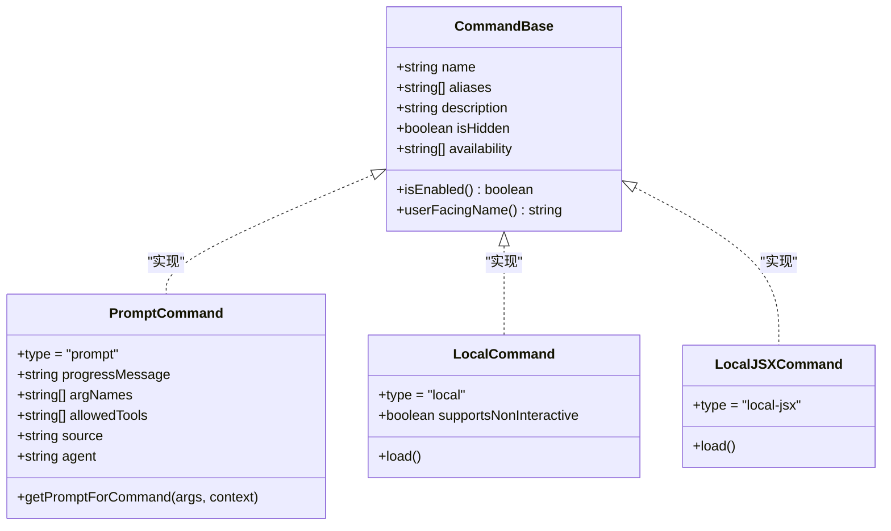
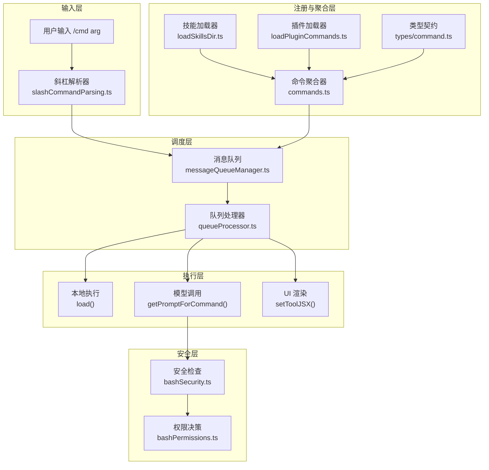
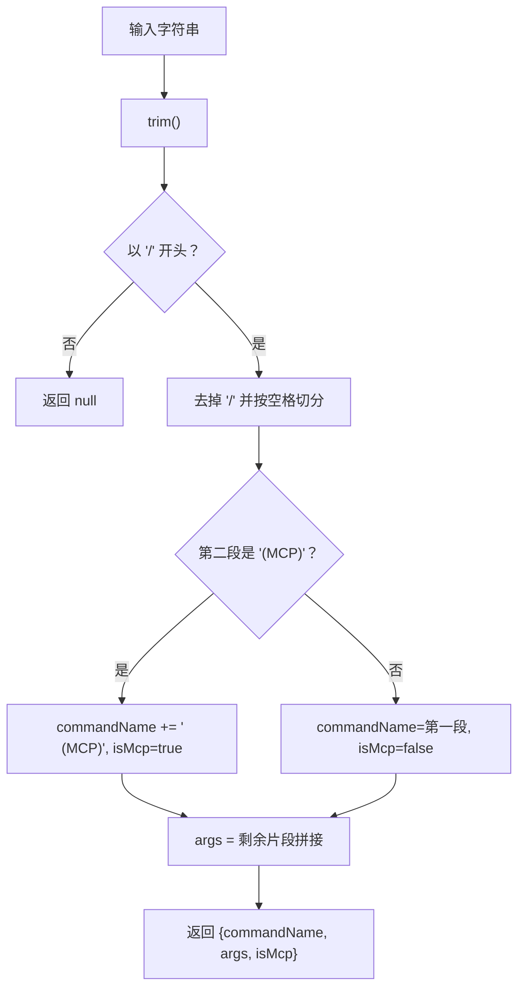
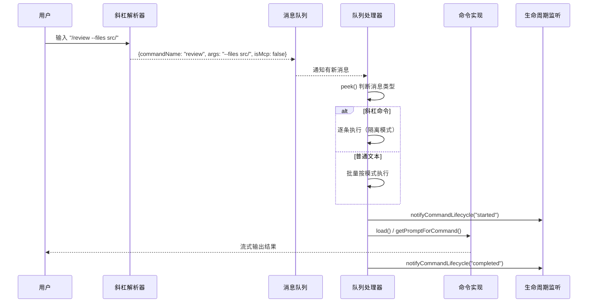

# 第04课：命令系统 — 从斜杠到执行

## 课程信息

| 属性 | 内容 |
|------|------|
| **所属阶段** | 第二阶段：核心系统深度解析 |
| **建议时长** | 90 分钟 |
| **难度等级** | ⭐⭐⭐ 中级 |
| **前置知识** | 第01-03课基础概念、TypeScript 基础、模块化思想 |

### 学习目标

1. 理解 Claude Code 命令系统的三种命令类型（prompt / local / local-jsx）及其适用场景
2. 掌握命令注册与发现的完整机制：静态内置 + 动态技能 + 插件命令的协作方式
3. 深入理解斜杠命令解析流程，从字符串输入到结构化 `{commandName, args, isMcp}`
4. 熟悉命令生命周期与队列处理器的"逐条隔离 vs 批量处理"策略
5. 了解动态技能插入的去重算法与 Feature Flag 条件导入模式

---

## 核心概念

### 命令 vs 工具 — 职责分工

很多初学者会混淆"命令"与"工具"这两个概念。在 Claude Code 中它们有清晰的分工：

| 维度 | 命令（Command） | 工具（Tool） |
|------|----------------|-------------|
| **触发方式** | 用户输入 `/xxx` | 模型在推理中调用 |
| **使用者** | 人类用户（或模型） | AI 模型 |
| **典型场景** | `/clear`、`/help`、`/review` | `Bash`、`FileRead`、`FileEdit` |
| **注册入口** | `src/commands.ts` | `src/tools.ts` |
| **类型系统** | `src/types/command.ts` | `src/Tool.ts` |

### 命令的三种类型



**三类命令的本质差异**：

- **PromptCommand（提示型）**：本质是一段提示词模板，调用后会将生成的提示词注入到对话中，触发模型推理。例如 `/review`、`/commit` 都是提示型命令。
- **LocalCommand（本地型）**：纯前端逻辑命令，直接执行 TypeScript 代码，返回文本或压缩后的结果消息，不走 AI 模型。例如 `/clear`、`/files`。
- **LocalJSXCommand（本地 JSX 型）**：渲染 React/Ink UI 组件的命令，用于复杂交互界面。例如 `/context`（彩色网格展示 token 使用）。

---

## 架构设计与设计思想

### 整体架构图



### 设计思想：为什么这样设计？

**1. 统一类型契约，分散实现**

所有命令通过 `src/types/command.ts` 定义唯一的类型契约，具体实现分散到各自目录（`src/commands/xxx/`）。这符合"**依赖倒置原则**"——高层模块（聚合器）依赖抽象（Command 类型），而不依赖具体实现。

**2. Memoize 缓存 + 动态失效**

`loadAllCommands` 使用 `memoize(cwd)` 缓存，避免每次用户输入都触发昂贵的磁盘 I/O 和动态导入。但可用性检查（`meetsAvailabilityRequirement` / `isCommandEnabled`）不缓存，保证登录状态变更后立即生效。

**3. Feature Flag 控制构建产物**

使用 `feature('FEATURE_NAME')` 的条件导入（而非 if/else 运行时检查），可以在**构建阶段**进行死代码消除（dead code elimination），未启用的功能代码完全不进入构建产物，降低包体积。

**4. 动态技能的"后插入"策略**

动态发现的技能（用户在运行时创建的 `.claude/commands/` 文件）不走 memoize 缓存，而是在每次 `getCommands()` 时进行去重后**插入内置命令之前**。这保证了用户自定义技能优先级高于内置命令，同时不破坏缓存机制。

---

## 关键源码深度走查

### 代码片段 1：Feature Flag 条件导入（commands.ts L59-122）

```typescript
import { feature } from 'bun:bundle'

// Dead code elimination: conditional imports
/* eslint-disable @typescript-eslint/no-require-imports */
const proactive =
  feature('PROACTIVE') || feature('KAIROS')
    ? require('./commands/proactive.js').default
    : null

const briefCommand =
  feature('KAIROS') || feature('KAIROS_BRIEF')
    ? require('./commands/brief.js').default
    : null

const bridge = feature('BRIDGE_MODE')
  ? require('./commands/bridge/index.js').default
  : null

const voiceCommand = feature('VOICE_MODE')
  ? require('./commands/voice/index.js').default
  : null
/* eslint-enable @typescript-eslint/no-require-imports */
```

**逐行解析**：

| 行 | 含义 |
|----|------|
| `import { feature } from 'bun:bundle'` | Bun 专属 API，在**编译时**求值，非运行时 |
| `feature('PROACTIVE')` | 编译时 Boolean 常量，为 false 时整个三元表达式的 `require(...)` 被裁剪 |
| `require('./commands/proactive.js').default` | 若 feature 启用，使用 CommonJS require（支持动态路径） |
| `: null` | 禁用时为 null，后续 `...(proactive ? [proactive] : [])` 自然跳过 |

**设计模式**：**编译时特性开关（Compile-time Feature Flags）**。区别于运行时 if/else，这种方式实现了真正的"零成本抽象"——未使用的代码连字节码都不会生成。

> 💡 **设计点评 — 编译时特性开关**
> 
> **好在哪里**：`feature('PROACTIVE')` 是构建时常量，打包时为 false 的分支整个被消除。外部用户拿到的构建产物里，未启用的功能代码根本不存在——不是运行时跳过，是物理上不存在。这就像一栋楼房按图纸建造时某些房间就没有设计进去，而不是设计了但锁上了。
> 
> **如果不这样做**：用运行时 `if (process.env.FEATURE_X)` 判断，代码虽然不执行，但仍在产物里，攻击者可以通过逆向分析了解未启用功能的实现细节，增加了攻击面。

---

### 代码片段 2：COMMANDS() 注册表与内部命令（commands.ts L258-346）

```typescript
// 声明为函数是为了延迟执行——config 在模块初始化时无法读取
const COMMANDS = memoize((): Command[] => [
  addDir,
  advisor,
  agents,
  branch,
  // ... 60+ 内置命令
  clear,
  context,
  contextNonInteractive,
  cost,
  // ...
  ...(webCmd ? [webCmd] : []),     // 条件性特性命令
  ...(forkCmd ? [forkCmd] : []),
  ...(bridge ? [bridge] : []),
  ...(process.env.USER_TYPE === 'ant' && !process.env.IS_DEMO
    ? INTERNAL_ONLY_COMMANDS         // 仅 Ant 内部用户可见的命令
    : []),
])

// 内部专用命令（外部构建中被消除）
export const INTERNAL_ONLY_COMMANDS = [
  backfillSessions,
  breakCache,
  bughunter,
  commit,
  goodClaude,
  // ...
].filter(Boolean)  // 过滤掉 null（feature 禁用时）
```

**逐行解析**：

| 关键点 | 设计意图 |
|--------|---------|
| `memoize((): Command[])` | 第一次调用后结果被缓存，避免重复构建数组（O(n) 操作） |
| `...(condition ? [cmd] : [])` | 优雅的"可选命令"插入，保持数组字面量的简洁性 |
| `INTERNAL_ONLY_COMMANDS` | 明确划分内部/外部命令边界，不通过注释约定，而是类型化隔离 |
| `.filter(Boolean)` | 处理 feature flag 导致的 null 值，防止"洞"数组（sparse array）问题 |

**设计模式**：**注册表模式（Registry Pattern）** + **惰性初始化（Lazy Initialization）**。

---

### 代码片段 3：命令聚合与动态技能去重（commands.ts L449-517）

```typescript
/**
 * 加载所有命令源（技能、插件、工作流）。以 cwd 为键进行 Memoize 缓存，
 * 因为加载代价昂贵（磁盘 I/O、动态导入）。
 */
const loadAllCommands = memoize(async (cwd: string): Promise<Command[]> => {
  const [
    { skillDirCommands, pluginSkills, bundledSkills, builtinPluginSkills },
    pluginCommands,
    workflowCommands,
  ] = await Promise.all([              // 并发加载，降低冷启动时间
    getSkills(cwd),
    getPluginCommands(),
    getWorkflowCommands ? getWorkflowCommands(cwd) : Promise.resolve([]),
  ])

  return [
    ...bundledSkills,        // 编译时内置技能（最高优先级）
    ...builtinPluginSkills,  // 内置插件提供的技能
    ...skillDirCommands,     // 用户目录扫描到的技能
    ...workflowCommands,     // 工作流脚本命令
    ...pluginCommands,       // 插件命令
    ...COMMANDS(),           // 内置命令（最后，通常优先级最低）
  ]
})

export async function getCommands(cwd: string): Promise<Command[]> {
  const allCommands = await loadAllCommands(cwd)
  const dynamicSkills = getDynamicSkills()  // 运行时文件监听发现的新技能

  // 可用性 + 启用状态过滤（不走缓存，保证实时性）
  const baseCommands = allCommands.filter(
    _ => meetsAvailabilityRequirement(_) && isCommandEnabled(_),
  )

  if (dynamicSkills.length === 0) return baseCommands

  // 去重：动态技能名称不能与已有命令重复
  const baseCommandNames = new Set(baseCommands.map(c => c.name))
  const uniqueDynamicSkills = dynamicSkills.filter(
    s =>
      !baseCommandNames.has(s.name) &&
      meetsAvailabilityRequirement(s) &&
      isCommandEnabled(s),
  )

  // 定位插入点：动态技能插入到内置命令之前
  const builtInNames = new Set(COMMANDS().map(c => c.name))
  const insertIndex = baseCommands.findIndex(c => builtInNames.has(c.name))

  return [
    ...baseCommands.slice(0, insertIndex),
    ...uniqueDynamicSkills,              // 插入动态技能
    ...baseCommands.slice(insertIndex),
  ]
}
```

**逐行解析**：

| 行 | 含义 |
|----|------|
| `Promise.all([...])` | 并发加载三类命令源，降低冷启动延迟 |
| 返回数组的顺序 | 决定了同名命令的覆盖优先级（前面的高） |
| `meetsAvailabilityRequirement(_) && isCommandEnabled(_)` | 双重过滤：订阅级别 + 特性开关 |
| `new Set(baseCommands.map(c => c.name))` | O(1) 查找，避免 O(n²) 去重 |
| `findIndex(c => builtInNames.has(c.name))` | 找到内置命令的起始位置，精确插入 |

**设计模式**：**管道过滤器（Pipeline-Filter）** + **策略模式（Strategy）** 中的可用性策略。

> 💡 **设计点评 — loadAllCommands 的并发加载顺序**
> 
> **好在哪里**：返回数组中命令的顺序直接决定了同名命令的覆盖关系——前面的优先保留。无需额外的优先级字段，**通过数组顺序隐式编码优先级**。编译时内置技能在最前，用户目录技能居中，内置命令在最后——这个设计让用户的自定义永远能"盖住"内置命令，符合用户期望。
> 
> **如果不这样做**：如果用独立的 `priority` 数字字段，排序逻辑更复杂，新加一类命令要考虑插入哪个优先级区间，而数组顺序天然表达了这种关系。

---

### 代码片段 4：可用性检查（commands.ts L417-443）

```typescript
/**
 * 过滤命令的 `availability`（auth/provider 要求）。
 * 不做 Memoize —— auth 状态可能在会话中变更（如 /login）。
 */
export function meetsAvailabilityRequirement(cmd: Command): boolean {
  if (!cmd.availability) return true  // 无限制，对所有人可见
  for (const a of cmd.availability) {
    switch (a) {
      case 'claude-ai':
        if (isClaudeAISubscriber()) return true  // claude.ai 订阅用户
        break
      case 'console':
        // Console = 直接使用 Anthropic 第一方 API 的用户
        // 排除第三方（Bedrock/Vertex）和网关代理用户
        if (
          !isClaudeAISubscriber() &&
          !isUsing3PServices() &&
          isFirstPartyAnthropicBaseUrl()
        )
          return true
        break
      default: {
        // 穷举检查：TypeScript 编译器确保枚举值都被处理
        const _exhaustive: never = a
        void _exhaustive
        break
      }
    }
  }
  return false  // 所有 availability 都不满足
}
```

**逐行解析**：

| 行 | 含义 |
|----|------|
| `if (!cmd.availability) return true` | 无 availability 字段 = 通用命令，对所有人可见 |
| `case 'claude-ai'` | 仅 claude.ai 订阅用户可见（如 `/upgrade`） |
| `case 'console'` | 仅直接 API 用户可见（如企业功能） |
| `const _exhaustive: never = a` | **穷举类型技巧**：若 availability 枚举新增值，编译器在此报错，提醒开发者处理 |

**设计模式**：**策略模式（Strategy）** + **穷举编译时检查（Exhaustive Check）**。

> 💡 **设计点评 — 穷举编译时检查**
> 
> **好在哪里**：`const _exhaustive: never = a` 是一个 TypeScript 的编译器陷阱。`never` 类型的变量只能接受"不可能存在的值"，当 switch/case 已经处理了所有枚举分支时，剩下的 `a` 就是 `never` 类型，赋值合法。一旦枚举新增了 `'bedrock'` 这样的新值，这里就会编译报错——强制开发者处理新情况，而不是静默漏掉。就像合同签署前的清单，每一项都确认过才能签字。
> 
> **如果不这样做**：没有穷举检查，新增了 `'bedrock'` 可用性类型但忘了处理，命令会静默对所有用户不可见，线上 bug 可能很难发现。

---

### 代码片段 5：斜杠命令解析（slashCommandParsing.ts 关键逻辑）

```typescript
export function parseSlashCommand(input: string): {
  commandName: string
  args: string
  isMcp: boolean
} | null {
  const trimmed = input.trim()
  if (!trimmed.startsWith('/')) return null  // 不是斜杠命令

  const withoutSlash = trimmed.slice(1)      // 去掉 '/'
  const parts = withoutSlash.split(' ')
  const firstPart = parts[0]

  // 识别 MCP 命令格式: "/cmd (MCP) args"
  if (parts[1] === '(MCP)') {
    return {
      commandName: `${firstPart} (MCP)`,    // 命令名包含 "(MCP)" 后缀
      args: parts.slice(2).join(' '),        // "(MCP)" 后的部分为参数
      isMcp: true,
    }
  }

  return {
    commandName: firstPart,
    args: parts.slice(1).join(' '),          // 第一个词后为参数
    isMcp: false,
  }
}
```

解析流程图：



---

## 设计模式提炼

### 1. 注册表模式（Registry Pattern）

**代码位置**：`commands.ts` 中的 `COMMANDS()` 函数

**特征**：集中维护命令清单，通过数组声明式注册，支持运行时查询（`findCommand`、`getCommand`）。

```typescript
// 注册
const COMMANDS = memoize((): Command[] => [
  clear, help, login, ...
])

// 查询
export function findCommand(commands: Command[], name: string): Command | undefined {
  return commands.find(c =>
    c.name === name ||
    c.aliases?.includes(name) ||
    getCommandName(c) === name
  )
}
```

### 2. 编译时特性开关（Compile-time Feature Toggle）

**代码位置**：`bun:bundle` 的 `feature()` 调用

**特征**：通过构建工具在编译阶段决定代码是否包含，实现零运行时开销的特性管理。

### 3. 惰性并发加载（Lazy Concurrent Loading）

**代码位置**：`loadAllCommands` 中的 `Promise.all()`

**特征**：首次调用时并发加载所有命令源，结果缓存以 `cwd` 为键，后续调用直接返回缓存。

### 4. 穷举编译检查（Exhaustive Check）

**代码位置**：`meetsAvailabilityRequirement` 中的 `const _exhaustive: never = a`

**特征**：利用 TypeScript 的 `never` 类型，当枚举值未被 switch/case 覆盖时，编译阶段报错，防止运行时遗漏。

---

## 命令生命周期详解



**队列处理器的两种策略**：

1. **斜杠命令/Bash 命令**：逐条处理。确保错误隔离，一条命令失败不影响下一条；进度 UI 可以准确反映单条命令状态。
2. **普通文本消息**：按模式批量处理。提升吞吐量，减少 UI 刷新频率。

---

## Harness Engineering

### Harness Engineering 视角

命令系统是 Claude Code 驾驭层的"用户接口层"——它把用户意图（`/review`、`/commit`）转化为对 AI 的精确调度，同时管控哪些命令在哪些环境下可以运行。

**1. 命令作为 AI 能力的驾驭入口**

PromptCommand 的本质是一段提示词模板，它约束了 AI 的回应范围。`/review` 命令不是让 AI 随意聊，而是注入特定的审核提示词，驱动 AI 按预期方式工作。这是 Harness 思维的体现：**通过结构化的命令接口，将 AI 的强大能力导向特定目标**。

**2. 可用性检查作为环境约束**

`meetsAvailabilityRequirement` 根据用户的身份（订阅类型、API 来源）动态决定哪些命令可见。这是 Harness 层对 AI 能力的环境约束——不同用户看到不同的命令菜单，AI 的能力边界随用户环境而变化。

**3. REMOTE_SAFE_COMMANDS 的最小权限**

远程/桥接模式下，命令白名单确保 AI 在不同网络环境中只暴露安全子集。这是 Harness 对 AI 工具集的主动裁剪——根据运行环境动态调整 AI 的"手术刀"集合。

### 对大模型应用的启发

**1. 提示词模板是连接用户意图和 AI 能力的关键桥梁**  
Claude Code 的 PromptCommand 本质就是一套"意图→提示词"的转换器。你的应用也可以为常见用户任务（代码审查、文档生成、数据分析）设计固定的提示词模板，让 AI 的行为更可预期、更符合场景。

**2. 缓存策略要与状态变化频率匹配**  
`loadAllCommands` 以 `cwd` 为键缓存，但可用性检查（auth 状态）不缓存。你的应用在设计缓存时要分清"什么变化慢"（命令列表）和"什么变化快"（用户状态），对应采用不同的缓存策略。

**3. 特性开关要做到"编译时消除"而非"运行时跳过"**  
未启用的功能不应该出现在生产构建产物中。如果你用 Bun、Webpack 等工具，可以利用 tree-shaking + 编译时常量实现这一点，减少攻击面，也减小包体积。

**4. 用户扩展点要有明确的优先级规则**  
用户自定义技能、插件命令、内置命令之间的优先级通过数组顺序隐式编码。设计你的应用时，同样需要明确"系统预设"、"用户自定义"、"临时覆盖"的优先级，并告知用户。

---

## 思考题与进阶方向

### 思考题

**题目 1**：为什么 `COMMANDS()` 设计为返回函数而非导出数组？

<details>
<summary>💡 参考答案</summary>

模块初始化时，config 系统可能还没加载完成。如果 `COMMANDS` 是导出的数组（模块加载时立即求值），其中依赖 config 值的命令（如某些 feature flag 判断）会读到未初始化的状态，出现不确定行为。设计为函数并用 `memoize` 包裹，第一次调用时才求值，此时 config 已经就绪。这是"惰性初始化"模式的典型应用。

</details>

**题目 2**：`loadAllCommands` 以 `cwd` 为缓存键，如果用户切换工作目录，会发生什么？

<details>
<summary>💡 参考答案</summary>

切换工作目录时，新的 `cwd` 会产生一个新的缓存键，`memoize` 会重新执行 `loadAllCommands`，从新目录加载技能和插件。同时，系统会调用 `clearCommandsCache()` 清除旧缓存，防止内存泄漏。这意味着不同工作目录可能有不同的可用命令（因为不同项目有不同的 `.claude/commands/` 技能文件）。

</details>

**题目 3**：为什么动态技能（运行时发现）不走 memoize 缓存，而是每次重新过滤？

<details>
<summary>💡 参考答案</summary>

动态技能是通过文件监听器（`skillChangeDetector`）在运行时发现的，用户可能随时创建新的技能文件。如果将动态技能纳入 memoize 缓存，缓存命中时新创建的技能就不会出现，用户要等缓存失效才能用新技能。将动态技能单独处理（每次查询时合并），确保了实时性，而静态命令列表依然走缓存保证性能。这是"热点数据实时，冷数据缓存"的权衡策略。

</details>

**题目 4**：`feature()` 与 `process.env.USER_TYPE === 'ant'` 两种条件导入有何本质区别？

<details>
<summary>💡 参考答案</summary>

`feature()` 是 Bun 的编译时 API，在构建阶段求值，为 false 的分支被 DCE（死代码消除）彻底从产物中移除，运行时这段代码不存在。`process.env.USER_TYPE === 'ant'` 是运行时检查，代码始终存在于产物中，只是执行时走不同分支。前者的安全性更高（攻击者看不到未启用的代码），产物体积更小；后者更灵活，可以通过环境变量在运行时改变行为，但代码无法被消除。

</details>

### 进阶方向

- **深入阅读**：`src/utils/plugins/loadPluginCommands.ts` — 了解插件命令的命名空间（`pluginName:namespace:basename`）和变量替换机制
- **实战练习**：在 `~/.claude/commands/` 创建一个 Markdown 技能文件，观察 `skillChangeDetector` 的热重载行为
- **源码追踪**：从 `src/hooks/useCommandQueue.ts` 追踪一次斜杠命令的完整执行链路
- **比较研究**：对比 prompt 型命令的 `getPromptForCommand` 与 local 型命令的 `load()` 在执行引擎中的差异
