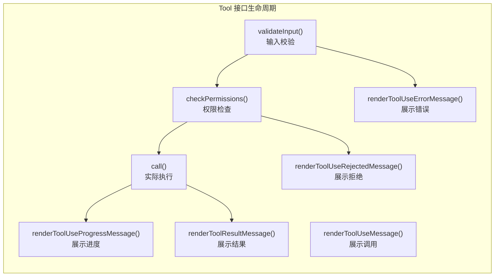
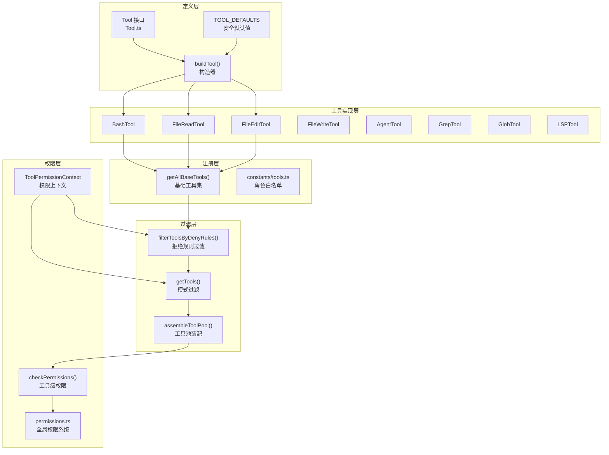
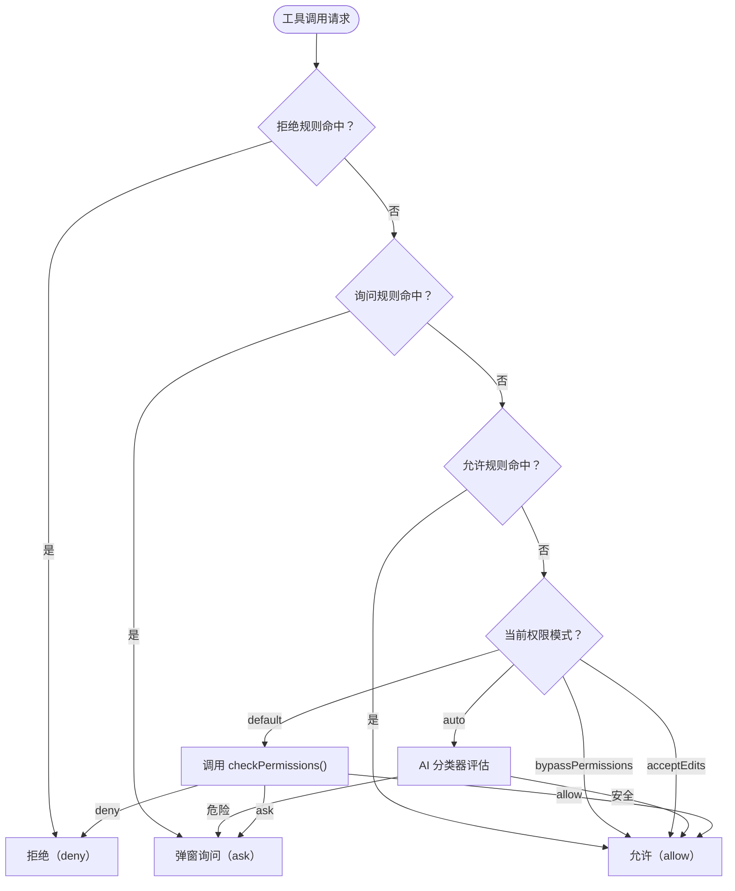

# 第05课：工具系统架构与生命周期

## 课程信息

| 属性 | 内容 |
|------|------|
| **所属阶段** | 第二阶段：核心系统深度解析 |
| **建议时长** | 90 分钟 |
| **难度等级** | ⭐⭐⭐ 中级 |
| **前置知识** | 第04课命令系统、TypeScript 泛型、Zod 类型校验基础 |

### 学习目标

1. 深入理解 `Tool` 接口的完整生命周期钩子设计（validateInput / checkPermissions / call / render*）
2. 掌握工具装配的全链路：`getAllBaseTools → filterToolsByDenyRules → getTools → assembleToolPool`
3. 理解 `buildTool` 构造器与 `TOOL_DEFAULTS` 的"失败安全"默认值策略
4. 了解 8+ 内置工具的分类职责及其在工具池中的优先级规则
5. 掌握权限规则的多源解析机制与 `ToolPermissionContext` 的设计意图

---

## 核心概念

### Tool 接口的本质

Claude Code 的工具系统建立在一个统一的 `Tool` TypeScript 接口上。每个工具（BashTool、FileReadTool 等）都是这个接口的实现，包含：

- **元数据**：名称、别名、搜索提示（searchHint）
- **生命周期方法**：验证 → 权限 → 执行 → 渲染
- **安全属性**：只读标记、破坏性标记、并发安全标记
- **UI 钩子**：进度消息、结果消息、错误消息、排队消息



### 工具的安全属性矩阵

| 工具 | isReadOnly | isDestructive | isConcurrencySafe |
|------|-----------|--------------|------------------|
| FileReadTool | ✅ 是 | ❌ 否 | ✅ 是 |
| GrepTool | ✅ 是 | ❌ 否 | ✅ 是 |
| GlobTool | ✅ 是 | ❌ 否 | ✅ 是 |
| FileEditTool | ❌ 否 | ✅ 是 | ❌ 否 |
| FileWriteTool | ❌ 否 | ✅ 是 | ❌ 否 |
| BashTool | 取决于命令 | 取决于命令 | ❌ 否 |
| AgentTool | ❌ 否 | 取决于子代理 | ❌ 否 |
| LSPTool | ✅ 是 | ❌ 否 | ✅ 是 |

---

## 架构设计与设计思想

### 工具系统整体架构



### 设计思想

**1. "失败安全"的默认值设计**

`buildTool` 中的 `TOOL_DEFAULTS` 采用"fail-closed"（失败关闭）策略：
- `isReadOnly` 默认 `false`（假设会写入，更保守）
- `isConcurrencySafe` 默认 `false`（假设不安全，避免竞态）
- `checkPermissions` 默认返回 `allow`（但 validateInput 必须先通过）

这确保新工具在未明确声明安全属性前，系统会倾向于串行执行、请求权限确认。

**2. 稳定排序保证提示缓存命中**

`assembleToolPool` 对工具按名称排序，是为了保证**系统提示（System Prompt）的稳定性**。Claude API 对相同的系统提示使用缓存，如果工具顺序随机变化，每次请求都会导致缓存失效，增加 API 成本和延迟。

**3. 角色白名单实现最小权限**

`constants/tools.ts` 定义了不同角色（异步代理、协调者、进程内队友）的工具白名单：

```typescript
// 异步代理不允许使用的工具（防止意外交互）
export const ALL_AGENT_DISALLOWED_TOOLS = ['AskUserQuestion', ...]

// 仅异步代理允许使用的工具
export const ASYNC_AGENT_ALLOWED_TOOLS = ['Agent', 'Bash', 'FileRead', ...]

// 协调者模式允许的工具
export const COORDINATOR_MODE_ALLOWED_TOOLS = ['Agent', 'TaskStop', ...]
```

---

## 关键源码深度走查

### 代码片段 1：Tool 接口核心方法（Tool.ts L362-503）

```typescript
export type Tool<
  Input extends AnyObject = AnyObject,    // Zod schema 类型
  Output = unknown,
  P extends ToolProgressData = ToolProgressData,
> = {
  readonly name: string                   // 工具唯一标识符
  aliases?: string[]                      // 向后兼容的别名

  /**
   * One-line capability phrase for ToolSearch keyword matching.
   * 3–10 words, no trailing period.
   */
  searchHint?: string                     // 语义搜索提示词（工具延迟加载时使用）

  call(
    args: z.infer<Input>,
    context: ToolUseContext,
    canUseTool: CanUseToolFn,
    parentMessage: AssistantMessage,
    onProgress?: ToolCallProgress<P>,
  ): Promise<ToolResult<Output>>          // 核心执行方法

  readonly inputSchema: Input             // Zod schema，用于类型验证和 API 描述

  isConcurrencySafe(input: z.infer<Input>): boolean  // 是否允许并发执行
  isEnabled(): boolean                    // 是否当前可用（检查 feature flag）
  isReadOnly(input: z.infer<Input>): boolean         // 是否只读操作
  isDestructive?(input: z.infer<Input>): boolean     // 是否不可逆操作

  interruptBehavior?(): 'cancel' | 'block'  // 用户发送新消息时的行为
  // - 'cancel': 立即停止并丢弃结果
  // - 'block':  继续运行，新消息等待

  validateInput?(
    input: z.infer<Input>,
    context: ToolUseContext,
  ): Promise<ValidationResult>           // 可选：工具特定的输入验证

  checkPermissions(
    input: z.infer<Input>,
    context: ToolUseContext,
  ): Promise<PermissionResult>           // 必须：检查用户是否授权

  maxResultSizeChars: number             // 结果大小上限（超出则落盘）
  // 注：FileReadTool 设置为 Infinity，因为其自身已有大小限制，
  // 落盘会导致 Read→file→Read 的循环依赖

  backfillObservableInput?(input: Record<string, unknown>): void
  // 在工具输入暴露给外部观察者前进行填充（幂等）
  // 用于添加 legacy/derived 字段，不修改原始 API 输入
}
```

**逐行解析**：

| 字段 | 设计意图 |
|------|---------|
| `searchHint` | 工具延迟加载时（defer=true），模型通过 ToolSearch 找到这个工具，searchHint 就是关键词提示 |
| `isConcurrencySafe` | 返回 true 的工具可以并发执行；false 则串行排队，防止竞态条件 |
| `interruptBehavior` | `'cancel'` 适用于轻量搜索工具；`'block'` 适用于文件写入等不能中断的操作 |
| `maxResultSizeChars: Infinity` | FileReadTool 自身有令牌限制，若再落盘会产生"读文件→生成落盘文件→再读落盘文件"的无限循环 |
| `backfillObservableInput` | 典型用例：BashTool 在 AST 解析后补充 `parsed_command` 字段，供 hooks 系统观察 |

> 💡 **设计点评 — maxResultSizeChars: Infinity 的特殊设计**
> 
> **好在哪里**：系统的"大结果落盘"机制将超大输出写入文件并告知模型文件路径。如果 FileReadTool 的输出也落盘，模型下一步会再调用 FileReadTool 读取这个文件，造成无限递归。设置 `Infinity` 不走落盘逻辑，把大小控制完全交给工具内部的令牌限制——一个环境变量解决了一个可能无限循环的 bug。
> 
> **如果不这样做**：FileReadTool 的输出一旦落盘，你就进入"读文件→写落盘→再读落盘文件→再写落盘"的死循环，模型永远读不到真正的内容，并且会不断消耗 API token。

---

### 代码片段 2：buildTool 与 TOOL_DEFAULTS（Tool.ts L757-793）

```typescript
/**
 * 默认值采用 fail-closed（失败关闭）策略：
 * - isEnabled      → true（默认启用）
 * - isConcurrencySafe → false（假设不安全并发）
 * - isReadOnly     → false（假设会写入）
 * - isDestructive  → false（假设可逆）
 * - checkPermissions → allow（交给通用权限系统处理）
 * - toAutoClassifierInput → ''（跳过分类器检查 — 安全敏感工具必须自行实现）
 * - userFacingName → name（默认使用工具名称）
 */
const TOOL_DEFAULTS = {
  isEnabled: () => true,
  isConcurrencySafe: (_input?: unknown) => false,
  isReadOnly: (_input?: unknown) => false,
  isDestructive: (_input?: unknown) => false,
  checkPermissions: (
    input: { [key: string]: unknown },
    _ctx?: ToolUseContext,
  ): Promise<PermissionResult> =>
    Promise.resolve({ behavior: 'allow', updatedInput: input }),
  toAutoClassifierInput: (_input?: unknown) => '',  // 空字符串 = 不参与分类器
  userFacingName: (_input?: unknown) => '',
}

export function buildTool<D extends AnyToolDef>(def: D): BuiltTool<D> {
  return {
    ...TOOL_DEFAULTS,             // 先铺设安全默认值
    userFacingName: () => def.name, // 默认显示名 = 工具名
    ...def,                       // 工具自定义实现覆盖默认值
  } as BuiltTool<D>
}
```

**逐行解析**：

| 行 | 含义 |
|----|------|
| `TOOL_DEFAULTS` 对象 | **单一来源**（Single Source of Truth）：所有工具的默认行为集中在此，避免每个工具重复实现 |
| `checkPermissions → allow` | 默认放行是因为通用权限系统（permissions.ts）会在工具调用前独立检查规则；工具的 checkPermissions 只负责工具特定的额外检查 |
| `toAutoClassifierInput → ''` | **重要安全设计**：默认值为空字符串意味着"跳过分类器"。只有明确实现此方法的工具（BashTool、FileEditTool 等）才会被 AI 安全分类器评估 |
| `...TOOL_DEFAULTS, ...def` | 标准的 Object Spread 覆盖：工具定义中的方法覆盖默认值 |
| 泛型 `<D extends AnyToolDef>` | 保留工具实现的精确类型，不丢失字面量类型（如 `isReadOnly` 返回的 `true` 而非 `boolean`） |

**设计模式**：**模板方法模式（Template Method）** + **原型模式（Prototype）** 的融合体。

> 💡 **设计点评 — toAutoClassifierInput 的默认空字符串**
> 
> **好在哪里**：默认值 `''` 意味着工具"跳过 AI 安全分类器"。只有明确实现此方法的工具（BashTool、FileEditTool 等）才会被分类器评估。这就像机场安检——大多数旅客走普通通道，只有持特定标记票的人才进行额外安检。默认跳过避免了 GlobTool、GrepTool 这类无安全隐患的只读工具浪费分类器 API 调用。
> 
> **如果不这样做**：如果所有工具默认都参与分类器评估，每次文件搜索都要走一次 AI 判断，性能损耗巨大，auto 模式将变得无法使用。

---

### 代码片段 3：工具注册与装配（tools.ts L193-367）

```typescript
/**
 * 获取所有基础工具，根据特性开关和环境变量动态启用/禁用
 */
export function getAllBaseTools(): Tools {
  return [
    AgentTool,
    TaskOutputTool,
    BashTool,
    // Ant 内部版本内置了 bfs/ugrep，find/grep 已被别名，Glob/Grep 工具不必要
    ...(hasEmbeddedSearchTools() ? [] : [GlobTool, GrepTool]),
    ExitPlanModeV2Tool,
    FileReadTool,
    FileEditTool,
    FileWriteTool,
    // ...
    ...(isEnvTruthy(process.env.ENABLE_LSP_TOOL) ? [LSPTool] : []),
    ...(isWorktreeModeEnabled() ? [EnterWorktreeTool, ExitWorktreeTool] : []),
    // ...
  ]
}

/**
 * 按权限上下文过滤工具，支持多种模式
 */
export const getTools = (permissionContext: ToolPermissionContext): Tools => {
  // Simple 模式：只暴露 Bash、Read、Edit 三件套
  if (isEnvTruthy(process.env.CLAUDE_CODE_SIMPLE)) {
    const simpleTools: Tool[] = [BashTool, FileReadTool, FileEditTool]
    return filterToolsByDenyRules(simpleTools, permissionContext)
  }

  const specialTools = new Set([
    ListMcpResourcesTool.name,
    ReadMcpResourceTool.name,
    SYNTHETIC_OUTPUT_TOOL_NAME,
  ])

  const tools = getAllBaseTools().filter(tool => !specialTools.has(tool.name))
  let allowedTools = filterToolsByDenyRules(tools, permissionContext)

  // REPL 模式：隐藏原始底层工具（通过 REPL 虚拟机访问）
  if (isReplModeEnabled()) {
    const replEnabled = allowedTools.some(tool => toolMatchesName(tool, REPL_TOOL_NAME))
    if (replEnabled) {
      allowedTools = allowedTools.filter(tool => !REPL_ONLY_TOOLS.has(tool.name))
    }
  }

  const isEnabled = allowedTools.map(_ => _.isEnabled())
  return allowedTools.filter((_, i) => isEnabled[i])
}

/**
 * 工具池装配：合并内置工具与 MCP 工具，去重并排序
 *
 * 设计关键：
 * 1. 内置工具优先（uniqBy 保留先插入的）
 * 2. 两组分别排序（不是混合排序），保持内置工具作为连续前缀
 * 3. 稳定排序保证系统提示缓存命中
 */
export function assembleToolPool(
  permissionContext: ToolPermissionContext,
  mcpTools: Tools,
): Tools {
  const builtInTools = getTools(permissionContext)
  const allowedMcpTools = filterToolsByDenyRules(mcpTools, permissionContext)

  const byName = (a: Tool, b: Tool) => a.name.localeCompare(b.name)

  // 关键：先对两组分别排序，再拼接，最后去重
  // 若混合排序，MCP 工具会插入内置工具中间，破坏服务端的缓存策略
  return uniqBy(
    [...builtInTools].sort(byName).concat(allowedMcpTools.sort(byName)),
    'name',   // 以 name 为去重键，内置工具（位于前面）优先保留
  )
}
```

**逐行解析**：

| 关键逻辑 | 设计意图 |
|---------|---------|
| `hasEmbeddedSearchTools()` | Ant 内部版本嵌入了高性能搜索工具，Glob/Grep 工具因此多余；外部版本需要它们 |
| `REPL_ONLY_TOOLS` 隐藏 | REPL（Read-Eval-Print-Loop）模式下，底层工具通过 VM 沙箱暴露，不能直接被模型调用 |
| 分批排序而非混合排序 | 服务端在"最后一个内置工具"后放置缓存断点；混合排序会让 MCP 工具"夹入"内置工具，破坏缓存策略 |
| `uniqBy(..., 'name')` | 内置工具在数组前面，名称冲突时内置工具保留（`lodash-es` 的 `uniqBy` 保持首个出现） |

---

### 代码片段 4：ToolPermissionContext（Tool.ts L123-148）

```typescript
export type ToolPermissionContext = DeepImmutable<{
  mode: PermissionMode              // 'default' | 'bypassPermissions' | 'acceptEdits' | 'dontAsk' | 'auto' | 'plan'
  additionalWorkingDirectories: Map<string, AdditionalWorkingDirectory>
  alwaysAllowRules: ToolPermissionRulesBySource    // 来自各配置源的"允许"规则
  alwaysDenyRules: ToolPermissionRulesBySource     // 来自各配置源的"拒绝"规则
  alwaysAskRules: ToolPermissionRulesBySource      // 来自各配置源的"询问"规则
  isBypassPermissionsModeAvailable: boolean        // 是否可切换到 bypass 模式
  isAutoModeAvailable?: boolean                    // 是否可切换到 auto 模式
  strippedDangerousRules?: ToolPermissionRulesBySource  // auto 模式下剥离的危险规则备份
  shouldAvoidPermissionPrompts?: boolean           // 后台代理：不能弹窗时自动拒绝
  awaitAutomatedChecksBeforeDialog?: boolean       // 协调者：先等分类器再弹窗
  prePlanMode?: PermissionMode                     // 进入 plan 模式前保存的模式
}>
```

**多源规则的结构**：

```typescript
type ToolPermissionRulesBySource = {
  [source in PermissionRuleSource]?: PermissionRule[]
}

type PermissionRuleSource =
  | 'user_settings'      // ~/.claude/settings.json
  | 'project_settings'   // .claude/settings.json
  | 'local_settings'     // .claude/settings.local.json
  | 'policy_settings'    // 企业策略
  | 'command_line'       // --allowedTools 等 CLI 参数
  | 'session'            // 当前会话中用户的授权选择
```

**权限决策的多层次流程**：



> 💡 **设计点评 — filterToolsByDenyRules 的预过滤**
> 
> **好在哪里**：拒绝规则（如 `mcp__my_server`）在工具池组装阶段就过滤掉整个 MCP 服务器的所有工具，不等到调用时才检查。模型甚至看不到被拒绝的工具，避免了模型尝试调用不存在工具的无效请求。就像餐厅菜单就不列没货的菜，而不是客人点了再说"没有"。
> 
> **如果不这样做**：如果工具池里包含被拒绝的工具，模型可能尝试调用它们，触发大量无效的权限检查，浪费 API 调用，也可能产生令人困惑的错误提示。

---

### 代码片段 5：工具的 UI 渲染钩子体系（Tool.ts L566-667）

```typescript
// 工具被调用时显示（参数可能还未完全流入）
renderToolUseMessage(
  input: Partial<z.infer<Input>>,   // Partial! 流式传输时参数可能不完整
  options: { theme: ThemeName; verbose: boolean; commands?: Command[] },
): React.ReactNode

// 工具执行中的实时进度
renderToolUseProgressMessage?(
  progressMessagesForMessage: ProgressMessage<P>[],
  options: {
    tools: Tools
    verbose: boolean
    terminalSize?: { columns: number; rows: number }
    inProgressToolCallCount?: number   // 并行执行的工具数量
    isTranscriptMode?: boolean
  },
): React.ReactNode

// 工具执行完成的结果
renderToolResultMessage?(
  content: Output,
  progressMessagesForMessage: ProgressMessage<P>[],
  options: {
    style?: 'condensed'            // 紧凑模式（/compact 命令下）
    theme: ThemeName
    tools: Tools
    verbose: boolean
    isTranscriptMode?: boolean
    isBriefOnly?: boolean
    input?: unknown                // 工具调用的原始输入（用于结果摘要）
  },
): React.ReactNode

// 权限被拒绝时的自定义 UI（可选）
renderToolUseRejectedMessage?(
  input: z.infer<Input>,
  options: { columns: number; messages: Message[]; ... },
): React.ReactNode

// 工具执行出错时的自定义 UI（可选）
renderToolUseErrorMessage?(
  result: ToolResultBlockParam['content'],
  options: { progressMessagesForMessage: ProgressMessage<P>[]; ... },
): React.ReactNode
```

**设计亮点**：

1. **Partial 输入**：`renderToolUseMessage` 接受 `Partial<Input>`，因为流式 API 下参数逐步到达，工具需要尽早开始渲染（如"Writing /path/to/file..."）。

2. **可选覆盖**：`renderToolUseRejectedMessage` 和 `renderToolUseErrorMessage` 为可选，只有需要自定义 UI 的工具才实现（如 FileEditTool 展示被拒绝的 diff）。

3. **双模式**：`verbose: boolean` 控制是否展示完整详情，`isTranscriptMode` 控制是否在转录（回放）模式下。

> 💡 **设计点评 — backfillObservableInput 的幂等性要求**
> 
> **好在哪里**：`backfillObservableInput` 在工具输入传给 hooks、权限检查、转录记录之前调用，可以添加从 AST 解析出的字段（如 `parsed_command`）。**幂等性**保证了在重放场景中多次调用不会产生副作用——就像照片 metadata 标注，标注一次和标注三次的结果应该完全一样。
> 
> **如果不这样做**：非幂等的 backfill 在重放或重试场景中会累积副作用，可能导致字段值翻倍、数组越来越长等难以追踪的 bug。

---

## 内置工具分类与职责

### 文件操作类（读写）

| 工具 | 职责 | 关键特性 |
|------|------|---------|
| FileReadTool | 多格式文件读取 | 支持文本/图片/PDF/Jupyter；令牌上限；缓存 |
| FileEditTool | 精确字符串替换 | diff-based；冲突检测；LSP 通知 |
| FileWriteTool | 全量覆盖写入 | 原子写入；路径安全检查 |
| GlobTool | 文件名模式匹配 | 按修改时间排序；递归搜索 |
| GrepTool | 内容正则搜索 | 基于 ripgrep；多种输出模式；结果分页 |

### Shell 执行类

| 工具 | 职责 | 关键特性 |
|------|------|---------|
| BashTool | Shell 命令执行 | 多层安全检查；流式输出；后台任务 |
| NotebookEditTool | Jupyter Notebook 编辑 | 单元格级操作；内核感知 |

### 代理与编排类

| 工具 | 职责 | 关键特性 |
|------|------|---------|
| AgentTool | 子代理创建与管理 | 工作树隔离；并行执行；进度跟踪 |
| SkillTool | 技能/工作流执行 | Fork 子代理；插件市场溯源 |
| TaskOutputTool | 任务输出传递 | 异步代理结果归档 |

### 搜索与导航类

| 工具 | 职责 | 关键特性 |
|------|------|---------|
| WebSearchTool | 网络搜索 | 安全策略；结果截断 |
| WebFetchTool | URL 内容获取 | 内容类型处理 |
| LSPTool | 语言服务器协议 | 定义跳转/引用查找；只读；并发安全 |

### 协议扩展类

| 工具 | 职责 | 关键特性 |
|------|------|---------|
| MCPTool | MCP 协议工具 | 通用输入输出；运行时动态注入 |
| ListMcpResourcesTool | MCP 资源列表 | 特殊工具，不进入标准工具池 |
| ReadMcpResourceTool | MCP 资源读取 | 特殊工具，不进入标准工具池 |

---

## Harness Engineering

### Harness Engineering 视角

Claude Code 的工具系统是驾驭层（Harness Layer）设计最集中的体现——它不直接"做事"，而是定义 AI 能做什么、能做到什么程度。

**1. Tool 接口作为能力边界契约**

`Tool` 接口的每一个字段都是驾驭层对 AI 能力的一种约束或授权：
- `isReadOnly` / `isDestructive`：驾驭层预先声明操作的危险程度，决定是否需要人工确认
- `isConcurrencySafe`：驾驭层决定哪些能力可以并发执行，哪些必须串行排队
- `interruptBehavior`：驾驭层决定用户打断时的处理策略，保护不可逆操作

```typescript
// AI 调用的是工具，但驾驭层通过 Tool 接口定义了操作的安全语义
const FileEditTool = buildTool({
  isDestructive: () => true,           // → 触发确认弹窗
  isConcurrencySafe: () => false,      // → 强制串行执行
  interruptBehavior: () => 'block',    // → 写入中途不允许中断
})
```

**2. filterToolsByDenyRules 作为能力剪裁入口**

驾驭层在工具池组装阶段就完成能力剪裁：被 deny 规则命中的工具，在传给 AI 之前就已从工具列表中移除。AI 根本看不到这些工具，从信息层面限制了其行动空间。

**3. TOOL_DEFAULTS 的 fail-closed 哲学**

`isConcurrencySafe` 默认 `false`、`isReadOnly` 默认 `false`，是典型的驾驭层保守策略：**未经声明的能力，默认受限**。开发者要主动"解锁"，而非主动"加锁"。

### 对大模型应用的启发

**1. 用接口而非规则约束 AI 能力**

与其在系统提示里写"不要做 X"，不如从 API 层面设计约束：定义 AI 能调用的工具的接口，通过接口声明（isDestructive、isReadOnly）来控制 AI 行为。规则会被遗忘，接口永远存在。

**2. 分层过滤优于运行时检查**

被拒绝的能力应在最早的环节（工具池组装）就剔除，让 AI 永远看不到不该看的工具。运行时再检查是亡羊补牢，组装时过滤是釜底抽薪。

**3. 工具的安全默认值应 fail-closed**

新工具的默认状态应该是"最受限"的，只有明确声明才能放开权限。这比"默认全开，按需限制"安全得多——工程师可能忘记加限制，但不会忘记加"我需要这个权限"。

**4. 提示缓存是大模型应用的隐性成本**

`assembleToolPool` 的稳定排序是为了 Claude API 的提示缓存命中。在你自己的大模型应用中，系统提示的稳定性也直接影响 API 成本：工具列表顺序随机变化，可能导致每次请求都是"新的"提示，缓存命中率为零。

**5. searchHint 是延迟加载的能力索引**

当工具池非常大时，不需要把所有工具的 schema 都放进系统提示。`searchHint` 机制允许驾驭层维护一个轻量的工具索引，AI 按需搜索并"加载"工具定义——这是驾驭层管理大规模能力集合的重要模式。

---

## 思考题与进阶方向

### 思考题

**题目 1**：为什么 `assembleToolPool` 要分批排序而非混合排序？

<details>
<summary>💡 参考答案</summary>

Claude API 对相同系统提示内容使用服务端缓存，缓存断点放在"最后一个内置工具"之后。如果内置工具和 MCP 工具混合排序，MCP 工具会"插入"内置工具之间，导致缓存断点前移甚至消失，每次请求都是缓存未命中，API 成本上升。分批排序（内置工具整体在前）保证了内置工具形成稳定的连续前缀，服务端可以可靠地识别并缓存这段前缀。

</details>

**题目 2**：`validateInput` 和 `checkPermissions` 都可以阻止工具执行，它们的区别是什么？

<details>
<summary>💡 参考答案</summary>

`validateInput` 是"输入格式错误"的拦截，告知模型"你传的参数有问题"，模型通常会修正参数重试，不会弹窗询问用户。`checkPermissions` 是"权限不足"的拦截，会触发用户权限弹窗（或在 auto 模式下触发 AI 分类器），最终决定是否允许执行。简单说：validateInput 是告知模型的反馈循环，checkPermissions 是告知用户的安全门卫。

</details>

**题目 3**：为什么 `renderToolUseMessage` 接受 `Partial<Input>` 而 `call` 接受完整 `Input`？

<details>
<summary>💡 参考答案</summary>

Claude API 以流式方式传输工具调用的参数——参数 JSON 是逐字节到达的，不是一次性完整传来的。`renderToolUseMessage` 在参数还未完全到达时就开始渲染 UI（如显示"正在写入 /path/to/file..."），需要接受不完整的 Partial 类型。而 `call` 是实际执行，必须等参数完全到达并通过 Zod 校验后才调用，因此接受完整 Input。

</details>

**题目 4**：`interruptBehavior: 'cancel'` 适合什么类型的工具？`'block'` 呢？

<details>
<summary>💡 参考答案</summary>

`'cancel'` 适合轻量、可重做的工具，如搜索（GrepTool、GlobTool）、只读查询——用户打断后丢弃结果无损失，重新开始即可。`'block'` 适合写入类工具（FileEditTool、FileWriteTool、BashTool 的写操作）——写入中途取消会留下半写状态的文件，造成数据损坏。`'block'` 让工具继续跑完，新消息在队列等待，保证原子性。

</details>

### 进阶方向

- **动手实验**：实现一个最简单的自定义工具（如计算器工具），通过 `buildTool` 注册到工具池
- **深入阅读**：`src/services/tools/StreamingToolExecutor.ts` — 了解工具的并发控制实现
- **权限系统**：阅读 `src/utils/permissions/permissions.ts` 中的 `hasPermissionsToUseTool` 函数，追踪完整的权限决策链
- **AI 分类器**：研究 `src/utils/permissions/yoloClassifier.ts`，了解 auto 模式下如何用 AI 评估工具操作的安全性
