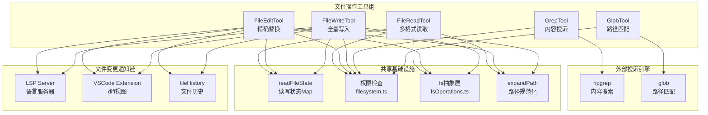
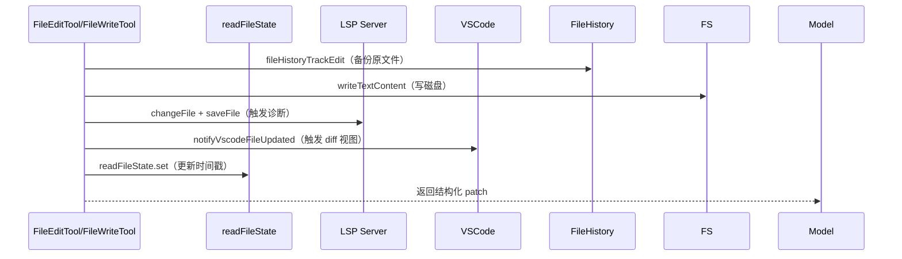

# 第07课：文件操作工具全解

---

## 1. 课程信息

| 属性 | 内容 |
|------|------|
| **所属阶段** | 第二阶段：核心子系统深度剖析 |
| **建议时长** | 120 分钟 |
| **前置课程** | 第05课（工具系统架构）、第06课（Shell执行工具） |
| **源码路径** | `src/tools/FileReadTool/`、`src/tools/FileEditTool/`、`src/tools/FileWriteTool/`、`src/tools/GrepTool/`、`src/tools/GlobTool/` |

### 学习目标

1. 掌握 **FileReadTool** 的多格式处理、令牌限制与去重缓存机制
2. 理解 **FileEditTool** 的 diff-based 编辑模型与时间戳冲突检测策略
3. 学会 **FileWriteTool** 的原子写入流程与 LSP/VSCode 通知机制
4. 掌握 **GrepTool** 基于 ripgrep 的三种输出模式与分页设计
5. 理解 **GlobTool** 的文件名模式匹配、排序与结果限制设计

---

## 2. 核心概念

### 2.1 五种工具的职责边界

```
┌──────────────────────────────────────────────────────────────┐
│                     文件操作工具组                             │
│                                                              │
│  FileReadTool     读取文件内容（文本/图像/PDF/Notebook）        │
│  FileEditTool     精确替换：用 new_string 替换 old_string      │
│  FileWriteTool    全量覆盖：用新内容完整替换旧文件              │
│  GrepTool         内容搜索：ripgrep 驱动，正则匹配             │
│  GlobTool         文件名搜索：glob 模式匹配文件路径             │
└──────────────────────────────────────────────────────────────┘
```

**关键区别：编辑 vs 写入**

| 维度 | FileEditTool | FileWriteTool |
|------|-------------|---------------|
| **操作粒度** | 字符串级替换（old→new） | 文件级全量覆盖 |
| **必须先读** | 是（已读+未被改动） | 是（已读+未被改动） |
| **适用场景** | 修改文件局部代码 | 创建新文件或重写整个文件 |
| **diff 输出** | 结构化补丁 | 结构化补丁（create 时为空） |
| **maxResultSizeChars** | 100,000 | 100,000 |

### 2.2 "读前写"强制约束

FileEditTool 和 FileWriteTool 都实现了 **读-写状态机**：

```
FileReadTool.call()
  → readFileState.set(path, { content, timestamp, offset, limit })

FileEditTool.validateInput()
  → readFileState.get(path)   // 不存在 → 拒绝
  → mtime > timestamp         // 文件被改动 → 拒绝
  → old_string 不在文件中     // 字符串不存在 → 拒绝
```

这是 **乐观锁** 模式：轻量级冲突检测，无需文件锁。

### 2.3 令牌预算 vs 字节预算

FileReadTool 有两层限制：

```
maxSizeBytes  → 控制磁盘 I/O，防止读取超大文件进内存
maxTokens     → 控制 Claude 上下文消耗，防止单次读取耗尽 context window
```

两层限制相互独立：一个文件可以体积小但高令牌密度（如 base64 encoded 数据），也可以体积大但令牌密度低。

---

## 3. 架构设计与设计思想

### 3.1 整体架构图



### 3.2 设计思想：为什么需要五个独立工具？

**单一职责原则的彻底贯彻**

Claude Code 没有设计一个大而全的 "FileOperationTool"，而是将文件操作拆分为五个专职工具。这样做有三个好处：

1. **权限最小化**：只读任务可以只授权 FileReadTool，不泄漏写权限
2. **提示缓存优化**：工具说明（prompt）按名字排序后形成稳定前缀，细粒度拆分让缓存命中率更高
3. **错误信息精确化**：每个工具的 `validateInput` 能给出针对性的失败原因，而非通用错误

### 3.3 文件变更后的副作用链

当 FileEditTool 或 FileWriteTool 写入文件后，会触发一条副作用链：



**为什么先备份再写？**

`fileHistoryTrackEdit` 在写入前调用，是幂等的（基于内容哈希），即使后续写入因冲突失败，也只是浪费了一次备份，不会产生脏状态。

---

## 4. 关键源码深度走查

### 4.1 FileReadTool：设备文件黑名单 + 令牌限制

**文件路径**：`src/tools/FileReadTool/FileReadTool.ts`

```typescript
// ① 设备文件黑名单 — 路径级检查，无 I/O，安全且高效
const BLOCKED_DEVICE_PATHS = new Set([
  // 无限输出设备 — 永远不到达 EOF
  '/dev/zero',       // 持续输出 0x00 字节
  '/dev/random',     // 持续输出随机字节（内核熵池）
  '/dev/urandom',    // 同上，但不阻塞
  '/dev/full',       // 写永远成功，读返回 0x00
  // 阻塞等待输入的设备
  '/dev/stdin',      // 挂起进程等待用户键入
  '/dev/tty',        // 当前终端设备
  '/dev/console',    // 系统控制台
  // 读没有意义的设备
  '/dev/stdout',
  '/dev/stderr',
  // stdin/stdout/stderr 的 fd 别名
  '/dev/fd/0', '/dev/fd/1', '/dev/fd/2',
])

// ② Linux /proc 路径检查 — 覆盖 /proc/self/fd/0-2 等 PID 别名
function isBlockedDevicePath(filePath: string): boolean {
  if (BLOCKED_DEVICE_PATHS.has(filePath)) return true
  if (
    filePath.startsWith('/proc/') &&            // Linux /proc 虚拟文件系统
    (filePath.endsWith('/fd/0') ||              // stdin 别名
      filePath.endsWith('/fd/1') ||             // stdout 别名
      filePath.endsWith('/fd/2'))               // stderr 别名
  ) return true
  return false
}
```

**设计原则**：
- 路径检查 **无 I/O**，在 `validateInput` 阶段（权限申请前）就拦截，不触发 NTLM 认证
- 只封禁"危险"设备，`/dev/null` 等安全设备被 **刻意放行**（注释明确说明）
- Linux `/proc/PID/fd/` 路径通过前缀+后缀双重检测，防止 PID 变化绕过

> 💡 **设计点评 — 设备文件黑名单的无 I/O 设计**
> 
> **好在哪里**：`BLOCKED_DEVICE_PATHS` 是一个静态 Set，检查在 `validateInput`（权限申请之前）就完成，不需要打开文件或调用 stat。就像保安在门口看身份证，而不是等客人进了包厢再查——早拦截，代价最小，且不会触发 Windows SMB 认证等副作用。
> 
> **如果不这样做**：如果用 `fs.open()` 检测设备文件，打开 `/dev/zero` 就会挂起进程（它会持续输出零字节，永远不到 EOF）。事后检测不但无法阻止危险，还会让工具本身陷入无法响应的状态。

---

**令牌验证**：双阶段检测 + API 精确计数

```typescript
async function validateContentTokens(
  content: string,
  ext: string,
  maxTokens?: number,
): Promise<void> {
  const effectiveMaxTokens =
    maxTokens ?? getDefaultFileReadingLimits().maxTokens

  // ① 快速路径：基于文件扩展名的粗估算
  //    若估算值 ≤ maxTokens/4，则肯定不超限，跳过 API 调用
  const tokenEstimate = roughTokenCountEstimationForFileType(content, ext)
  if (!tokenEstimate || tokenEstimate <= effectiveMaxTokens / 4) return

  // ② 慢速路径：调用 API 精确计数（有网络开销）
  const tokenCount = await countTokensWithAPI(content)
  const effectiveCount = tokenCount ?? tokenEstimate

  // ③ 超限时抛出结构化错误，指导模型使用 offset/limit 参数
  if (effectiveCount > effectiveMaxTokens) {
    throw new MaxFileReadTokenExceededError(effectiveCount, effectiveMaxTokens)
  }
}
```

**设计亮点**：4 倍安全裕量的"快速豁免"路径。小文件绝大多数都能在估算阶段放行，只有疑似超限的文件才触发 API 调用，将网络往返开销降到最低。

> 💡 **设计点评 — 令牌计数的两阶段优化**
> 
> **好在哪里**：先用粗估算（基于文件类型的字节/token 比例）做"快速豁免"，只有当估算值超过 maxTokens/4 时才调 API 精确计数。4倍安全裕量意味着：一个文件要超过精确上限的 25%，才会被"疑似超限"，触发 API 调用。大多数普通文件在估算阶段就能放行，性能消耗极低。
> 
> **如果不这样做**：如果每个文件都调用 token 计数 API，FileReadTool 的每次调用都会额外触发一个 API 请求（网络往返约 100-500ms），极大降低文件读取速度，尤其在批量读取场景下体验极差。

---

### 4.2 FileReadTool：去重缓存（dedup）机制

```typescript
// 去重逻辑：在 call() 方法最开始执行
const existingState = dedupKillswitch
  ? undefined
  : readFileState.get(fullFilePath)        // 获取上次读取的快照

// 只有 "来自 Read 工具" 的缓存条目才参与去重
// （Edit/Write 存储的是 offset=undefined 的条目，不能用于去重）
if (
  existingState &&
  !existingState.isPartialView &&          // 不是分段读（部分视图可能不完整）
  existingState.offset !== undefined       // 是 Read 工具写入的条目
) {
  const rangeMatch =
    existingState.offset === offset && existingState.limit === limit

  if (rangeMatch) {
    // 异步 stat 获取 mtime，单次系统调用
    const mtimeMs = await getFileModificationTimeAsync(fullFilePath)
    if (mtimeMs === existingState.timestamp) {
      // 文件未变：返回 file_unchanged 存根，避免重传相同内容
      return {
        data: {
          type: 'file_unchanged' as const,
          file: { filePath: file_path },
        },
      }
    }
  }
}
```

**背后的数据洞察**：注释中披露了真实数据——"2小时内 1,734 次去重命中，fleet 级 cache_creation token 节省约 2.64%"。这是 Anthropic 工程师基于生产数据做出的有据可查的优化。

**注意**：`readFileState` 同时被 FileEditTool/FileWriteTool 用于 **写冲突检测**。两个角色共用同一个 Map，以 mtime 时间戳为轴互联。这是一个精妙的双重用途设计。

> 💡 **设计点评 — readFileState 的双重角色**
> 
> **好在哪里**：`readFileState` 一个 Map 同时服务两个功能：FileReadTool 用它做"去重缓存"（避免重复传输未变化的文件内容）；FileEditTool/FileWriteTool 用它做"乐观锁检测"（检查文件是否在读后被其他进程改动）。两个功能共用同一份状态，逻辑一致，没有状态同步问题，代码量也减半了。
> 
> **如果不这样做**：如果分别维护"去重缓存 Map"和"写冲突检测 Map"，两个 Map 的 mtime 字段可能在并发场景下产生不一致（缓存认为文件没变，但冲突检测认为变了），导致诡异的 bug，而且代码量翻倍。

---

### 4.3 FileEditTool：七步写入流程

**文件路径**：`src/tools/FileEditTool/FileEditTool.ts`

```typescript
async call(input: FileEditInput, { readFileState, ... }) {
  // ─── 步骤 1：准备阶段（可 yield，在临界区外）─────────────────
  await fs.mkdir(dirname(absoluteFilePath))          // 确保父目录存在
  await fileHistoryTrackEdit(...)                    // 备份原文件（幂等）

  // ─── 步骤 2：同步读取 + 冲突检测（临界区开始）────────────────
  // 注意：readFileForEdit 用 readFileSync（同步），避免临界区内 yield
  const { content: originalFileContents, ... } = readFileForEdit(absoluteFilePath)

  if (fileExists) {
    const lastWriteTime = getFileModificationTime(absoluteFilePath)  // 同步 stat
    const lastRead = readFileState.get(absoluteFilePath)
    if (!lastRead || lastWriteTime > lastRead.timestamp) {
      // Windows 特殊处理：云同步/防病毒可能触碰 mtime 但不改内容
      const isFullRead = lastRead?.offset === undefined && lastRead?.limit === undefined
      const contentUnchanged = isFullRead && originalFileContents === lastRead.content
      if (!contentUnchanged) {
        throw new Error(FILE_UNEXPECTEDLY_MODIFIED_ERROR)  // 文件被改动，中止
      }
    }
  }

  // ─── 步骤 3：引号规范化 ──────────────────────────────────────
  // 处理模型输出直引号但文件使用弯引号的场景
  const actualOldString = findActualString(originalFileContents, old_string) || old_string
  const actualNewString = preserveQuoteStyle(old_string, actualOldString, new_string)

  // ─── 步骤 4：生成结构化 patch ────────────────────────────────
  const { patch, updatedFile } = getPatchForEdit({ ... })

  // ─── 步骤 5：写磁盘 ──────────────────────────────────────────
  writeTextContent(absoluteFilePath, updatedFile, encoding, endings)  // 同步写

  // ─── 步骤 6：通知外部服务 ────────────────────────────────────
  lspManager?.changeFile(absoluteFilePath, updatedFile)               // 异步，不阻塞
  lspManager?.saveFile(absoluteFilePath)                              // 异步，不阻塞
  notifyVscodeFileUpdated(absoluteFilePath, originalFileContents, updatedFile)

  // ─── 步骤 7：更新缓存 + 返回结果 ────────────────────────────
  readFileState.set(absoluteFilePath, {
    content: updatedFile,
    timestamp: getFileModificationTime(absoluteFilePath),  // 最新 mtime
    offset: undefined,       // 标记为 Write 条目（区分 Read 条目）
    limit: undefined,
  })
}
```

**临界区设计**：步骤 2（冲突检测）到步骤 5（写磁盘）之间 **全是同步操作**，不能有 `await`。这是注释中明确标注的 "critical section"。因为一旦在 mtime 检测和写入之间 yield，另一个并发操作就可能插入，破坏原子性。

> 💡 **设计点评 — 同步临界区保证原子性**
> 
> **好在哪里**：从读取 mtime 到写入磁盘，全程没有 `await`，Node.js 事件循环不会切换到其他任务。就像银行转账——从账户扣款和向对方账户入账必须是原子操作，中间不能有其他事务插入。同步 I/O 在性能上虽有损耗，但买来了"冲突检测窗口绝对没有并发插入"的保证。
> 
> **如果不这样做**：如果冲突检测后有一个 `await`，在等待期间另一个 FileEditTool 调用可能修改了同一文件，导致两个调用都通过了冲突检测，最后一个写入的"赢"了，但用户看到的是数据竞争导致的文件损坏。

---

### 4.4 FileEditTool：引号规范化三步法

**文件路径**：`src/tools/FileEditTool/utils.ts`

```typescript
// ─── 第一步：尝试精确匹配 ────────────────────────────────────
export function findActualString(fileContent: string, searchString: string): string | null {
  if (fileContent.includes(searchString)) {
    return searchString                            // 精确命中，直接返回
  }

  // ─── 第二步：规范化双方引号后再匹配 ─────────────────────────
  const normalizedSearch = normalizeQuotes(searchString)  // 弯引号→直引号
  const normalizedFile   = normalizeQuotes(fileContent)

  const searchIndex = normalizedFile.indexOf(normalizedSearch)
  if (searchIndex !== -1) {
    // 返回文件中的 **原始字符串**（保留弯引号），长度用 searchString.length
    return fileContent.substring(searchIndex, searchIndex + searchString.length)
  }

  return null                                      // 完全找不到
}

// ─── 第三步：向 new_string 传播同款引号风格 ─────────────────
export function preserveQuoteStyle(
  oldString: string,        // 模型给的（直引号）
  actualOldString: string,  // 文件里的（可能是弯引号）
  newString: string,        // 模型给的 new_string（直引号）
): string {
  if (oldString === actualOldString) return newString  // 引号一致，无需处理

  const hasDoubleQuotes =
    actualOldString.includes('\u201C') || actualOldString.includes('\u201D')
  const hasSingleQuotes =
    actualOldString.includes('\u2018') || actualOldString.includes('\u2019')

  // 将 new_string 中的直引号替换为对应的弯引号，保持文件排版一致
  let result = newString
  if (hasDoubleQuotes) result = result.replaceAll('"', '\u201C').replaceAll('"', '\u201D')
  if (hasSingleQuotes) result = result.replaceAll("'", '\u2018').replaceAll("'", '\u2019')
  return result
}
```

**设计哲学**：Claude 模型无法生成弯引号（Unicode 印刷引号），但用户文件（尤其是 Word 导出、macOS 自动更正等来源的文件）大量使用弯引号。不做规范化则 `old_string` 永远匹配失败；做了规范化但忽略 `new_string` 则会破坏文件排版风格。三步法优雅地解决了这个现实问题。

> 💡 **设计点评 — 引号规范化的现实主义**
> 
> **好在哪里**：这是一个"模型能力边界"和"用户文件现实"之间的桥接设计。Claude 生成的文本只有直引号（键盘上的 `"`），但用户文件可能含有 macOS 自动更正生成的弯引号（`\u201C\u201D`）。三步法先匹配再同步引号风格，让模型的"直引号搜索"能命中"弯引号文件"，同时新内容的引号风格与原文保持一致，用户看不出修改的痕迹。
> 
> **如果不这样做**：一个在 Word 里写的文档被 FileEditTool 编辑后，直引号和弯引号混用，排版风格错乱——对技术文档无所谓，但对 Word 文档、博客文章、用户界面文案这类要求排版一致的场景，这个小细节会造成明显的视觉破坏。

---

### 4.5 GrepTool：三种输出模式 + 分页设计

**文件路径**：`src/tools/GrepTool/GrepTool.ts`

```typescript
// 默认结果上限：250 行
// 注释解释了选择 250 的理由：
// "20KB 持久化阈值 ≈ 6-24K tokens/heavy-grep session"
// "250 足够探索性搜索，同时防止上下文膨胀"
// "pass head_limit=0 for unlimited（带 use sparingly 警告）"
const DEFAULT_HEAD_LIMIT = 250

// 分页辅助函数：slice + truncation detection
function applyHeadLimit<T>(
  items: T[],
  limit: number | undefined,    // undefined = 使用默认值
  offset: number = 0,
): { items: T[]; appliedLimit: number | undefined } {
  if (limit === 0) {
    // 显式传 0 = 无限制逃生阀门
    return { items: items.slice(offset), appliedLimit: undefined }
  }

  const effectiveLimit = limit ?? DEFAULT_HEAD_LIMIT
  const sliced = items.slice(offset, offset + effectiveLimit)

  // 只在真正截断时才上报 appliedLimit
  // 模型通过 appliedLimit !== undefined 判断"还有更多结果，可用 offset 翻页"
  const wasTruncated = items.length - offset > effectiveLimit
  return {
    items: sliced,
    appliedLimit: wasTruncated ? effectiveLimit : undefined,
  }
}
```

**三种输出模式的 ripgrep 参数映射**：

```typescript
// files_with_matches（默认）：-l 参数，只返回文件路径
if (output_mode === 'files_with_matches') {
  args.push('-l')               // rg -l：只输出包含匹配的文件名

// count 模式：-c 参数，统计每个文件的匹配次数
} else if (output_mode === 'count') {
  args.push('-c')               // rg -c：输出 filename:count 格式

// content 模式（默认无额外参数，但支持上下文）
}

// content 模式的上下文控制：优先级 context > -C > (-B/-A)
if (output_mode === 'content') {
  if (context !== undefined) {
    args.push('-C', context.toString())
  } else if (context_c !== undefined) {
    args.push('-C', context_c.toString())
  } else {
    if (context_before !== undefined) args.push('-B', context_before.toString())
    if (context_after !== undefined) args.push('-A', context_after.toString())
  }
}
```

**路径相对化节省 token**：

```typescript
// files_with_matches 模式排序：按 mtime 降序，让最近修改的文件排前面
const sortedMatches = results
  .map((_, i) => [_, stats[i]!] as const)
  .sort((a, b) => b[1].mtimeMs - a[1].mtimeMs)  // 最近修改优先
  .map(_ => _[0])

// 绝对路径 → 相对路径：/home/user/project/src/foo.ts → src/foo.ts
const relativeMatches = finalMatches.map(toRelativePath)
```

> 💡 **设计点评 — 分页信号与结果相对化**
> 
> **好在哪里**：`appliedLimit` 的设计很精妙——只在"真正被截断"时才返回非 undefined 值，让模型能区分"250个结果就是全部"和"250个结果是截断上限"。模型根据这个信号决定是否用 offset 翻页。同时，路径相对化节省了每条结果都重复公共前缀（如 `/home/user/project/`）的 token 浪费。
> 
> **如果不这样做**：如果总是返回 appliedLimit（即使没有截断），模型会误以为每次搜索都被截断，不断翻页直到拿到"完整结果"，产生大量无意义的 API 调用。如果使用绝对路径，一个有 250 个结果的搜索可能每条路径多出 20-30 个字符，总计超过 5000 个无效字符的 token 浪费。

---

### 4.6 GlobTool：结果截断 + 修改时间排序

**文件路径**：`src/tools/GlobTool/GlobTool.ts`

```typescript
export const GlobTool = buildTool({
  name: GLOB_TOOL_NAME,
  maxResultSizeChars: 100_000,    // 比 GrepTool(20K) 大 5 倍——路径列表更紧凑
  isConcurrencySafe() { return true },  // 只读，安全并发
  isReadOnly() { return true },

  async call(input, { abortController, getAppState, globLimits }) {
    const start = Date.now()
    const limit = globLimits?.maxResults ?? 100  // 上限 100 个文件

    const { files, truncated } = await glob(
      input.pattern,
      GlobTool.getPath(input),
      { limit, offset: 0 },                     // 内部分页
      abortController.signal,                   // 支持中止
      appState.toolPermissionContext,            // 权限过滤
    )

    const filenames = files.map(toRelativePath)  // 相对路径节省 token
    return {
      data: {
        filenames,
        durationMs: Date.now() - start,          // 用于性能监控
        numFiles: filenames.length,
        truncated,                               // 是否被截断
      },
    }
  },

  // 结果渲染：截断时附加提示信息
  mapToolResultToToolResultBlockParam(output, toolUseID) {
    return {
      tool_use_id: toolUseID,
      type: 'tool_result',
      content: [
        ...output.filenames,
        ...(output.truncated
          ? ['(Results are truncated. Consider using a more specific path or pattern.)']
          : []),
      ].join('\n'),
    }
  },
})
```

> 💡 **设计点评 — truncated 信号与 durationMs 的实用主义**
> 
> **好在哪里**：`truncated` 字段是模型的"知情同意"机制——模型知道结果可能不完整，可以用更精确的 pattern 或 path 重新搜索，而不是基于截断的结果做出错误判断。`durationMs` 字段则是性能监控的埋点，让驾驭层可以追踪 glob 操作的性能表现。
> 
> **如果不这样做**：如果静默截断而不告知模型，模型可能认为目录只有这 100 个文件，在"完整"列表上做出错误决策（如"项目里没有测试文件"）。明确告知截断让模型能主动调整搜索策略。

---

## 5. 代码设计亮点

### 5.1 macOS 截图路径自愈机制

```typescript
// macOS 不同版本在截图文件名的 AM/PM 前使用不同的空格字符：
// 旧版：常规空格 U+0020
// 新版：窄不换行空格 U+202F（NARROW NO-BREAK SPACE）
const THIN_SPACE = String.fromCharCode(8239)  // U+202F

function getAlternateScreenshotPath(filePath: string): string | undefined {
  const filename = path.basename(filePath)
  const amPmPattern = /^(.+)([ \u202F])(AM|PM)(\.png)$/
  const match = filename.match(amPmPattern)
  if (!match) return undefined

  const currentSpace = match[2]
  const alternateSpace = currentSpace === ' ' ? THIN_SPACE : ' '
  return filePath.replace(
    `${currentSpace}${match[3]}${match[4]}`,
    `${alternateSpace}${match[3]}${match[4]}`,
  )
}
```

当 FileReadTool 遇到 ENOENT 时，会自动尝试这个"备用路径"，透明处理 macOS 版本差异。这是一个**贴近用户体验**的防御性设计，普通开发者不会考虑到 Unicode 空格字符的差异。

> 💡 **设计点评 — macOS 截图路径的自愈设计**
> 
> **好在哪里**：macOS 系统更新后，截图文件名中时间部分的空格字符从普通空格（U+0020）变成了窄不换行空格（U+202F），但旧截图名字还是普通空格。`getAlternateScreenshotPath` 在找不到文件时自动尝试"备用空格版本"，用户完全感知不到这个差异。这是一个典型的"代码替用户踩坑"的防御性设计。
> 
> **如果不这样做**：用户把旧 macOS 截图路径发给 Claude 让它分析，会得到"文件不存在"的错误，用户需要自己检查是不是文件名空格的问题——这个排查过程对大多数用户来说完全不直觉，会造成无谓的困惑和挫败感。

### 5.2 图像令牌预算的三层降级压缩

```typescript
export async function readImageWithTokenBudget(filePath, maxTokens) {
  // 第一层：标准 resize（sharp 自动选择最优尺寸）
  const resized = await maybeResizeAndDownsampleImageBuffer(buffer, size, format)
  
  // 检查是否超出 token 预算（base64 长度 × 0.125 粗估）
  const estimatedTokens = Math.ceil(result.file.base64.length * 0.125)
  if (estimatedTokens > maxTokens) {
    try {
      // 第二层：激进压缩（专用压缩函数，从同一 buffer 出发，不重读文件）
      const compressed = await compressImageBufferWithTokenLimit(buffer, maxTokens, mediaType)
      return { ... compressed ... }
    } catch {
      // 第三层：终极降级（400×400, JPEG quality 20，必然成功）
      const fallbackBuffer = await sharp(buffer)
        .resize(400, 400, { fit: 'inside', withoutEnlargement: true })
        .jpeg({ quality: 20 })
        .toBuffer()
    }
  }
}
```

关键设计：三层压缩都从 **同一份 Buffer** 出发，不重新读取文件。磁盘 I/O 只发生一次，后续是纯内存操作。

> 💡 **设计点评 — 三层降级的失败安全保证**
> 
> **好在哪里**：图像压缩有可能失败（内存不足、格式不支持），三层降级保证了"总有一层能成功"。第三层（400×400, JPEG quality 20）是"绝对不失败"的保底层：分辨率极低，质量极差，但总能产出一个合法的图像。整条链从同一份 Buffer 出发，磁盘只读一次，后续全是内存操作。
> 
> **如果不这样做**：如果只有单一压缩策略，一旦压缩失败就向模型报错，模型无法看到图像内容。三层降级让"图像读取"这个操作获得了接近 100% 的成功率，代价是最差情况下图像质量较低——但低质量的图像通常比"无法读取图像"对模型有用得多。

### 5.3 GrepTool 的 VCS 目录自动排除

```typescript
const VCS_DIRECTORIES_TO_EXCLUDE = [
  '.git', '.svn', '.hg', '.bzr', '.jj', '.sl'
] as const

// 对每个 VCS 目录注入 --glob !<dir> 参数
for (const dir of VCS_DIRECTORIES_TO_EXCLUDE) {
  args.push('--glob', `!${dir}`)
}
```

注意包含了 `.jj`（Jujutsu）和 `.sl`（Sapling），这两个是较新的版本控制系统。Claude Code 在工具级别对 Git 之外的 VCS 也做了正确处理，体现了对工具生态多样性的感知。

> 💡 **设计点评 — VCS 目录排除的生态感知**
> 
> **好在哪里**：`.jj`（Jujutsu）和 `.sl`（Sapling）是 2020 年代才出现的新版本控制系统，但 Claude Code 在工具级别就已经包含了它们。不是大多数用户都用这些系统，但对于使用它们的开发者，这个小细节让 GrepTool 的行为"符合预期"。这种对工具生态多样性的关注，体现了产品的用心程度。
> 
> **如果不这样做**：使用 Jujutsu 的开发者搜索代码时，会把 `.jj` 目录下的内部文件全部包含进结果，产生大量噪音，甚至让 token 超限。

### 5.4 FileWriteTool 的行尾处理设计变更

```typescript
// Write 是完整内容替换 — 模型在 content 中明确指定了行尾，应该被尊重
// 以前的行为：保留旧文件的行尾，或从 repo 采样
// 问题：在 Linux 上覆盖 CRLF 文件，或当 cwd 中存在 CRLF 二进制文件时，会静默损坏脚本
writeTextContent(fullFilePath, content, enc, 'LF')  // 强制 LF
```

注释中记录了这个设计决策的历史背景：之前的保留行尾策略会在边缘情况（如 WSL 环境覆盖 CRLF 文件）导致 Shell 脚本损坏。简单而正确：Write 操作的内容由模型完全掌控，行尾不例外。

> 💡 **设计点评 — 行尾策略的简化决策**
> 
> **好在哪里**：与其试图"智能推断"行尾（从仓库采样、保留旧文件行尾），不如明确说"Write 就是 LF，不讨价还价"。这个决策消除了一个隐藏的 bug 来源：WSL 环境下覆盖 CRLF 文件会静默产生混合行尾的 Shell 脚本，脚本运行时报莫名其妙的错误。简单、明确、可预测，胜过复杂、智能、有时出错。
> 
> **如果不这样做**：保留旧文件行尾的策略在 99% 的场景下看似合理，但在 WSL+CRLF 文件这个组合下会静默破坏脚本，而用户排查这个 bug 需要知道"行尾字符"这个概念，这对很多非 Windows 背景的开发者来说是一个完全不直觉的坑。

---

## Harness Engineering

### Harness Engineering 视角

文件操作工具组是驾驭层中"最接近文件系统"的模块，它的设计集中体现了驾驭层如何**在保留完整能力的前提下，精确控制风险边界**。

**1. 读写状态机作为能力授权追踪**

`readFileState` 不只是一个缓存，它是驾驭层对"AI 看过什么"的记录器。FileEditTool 的"必须先读才能写"约束，是驾驭层确保 AI 在"知情"的前提下才能修改文件：

```typescript
// 驾驭层约束：写操作前必须有读取记录
const lastRead = readFileState.get(absoluteFilePath)
if (!lastRead) {
  throw new Error(FILE_NOT_READ_ERROR)  // 拒绝"不知情"的修改
}
if (lastWriteTime > lastRead.timestamp) {
  throw new Error(FILE_UNEXPECTEDLY_MODIFIED_ERROR)  // 拒绝"过期知情"的修改
}
```

这是驾驭层的"知情同意"机制：AI 必须在了解文件当前状态后，才能获得修改权。

**2. BLOCKED_DEVICE_PATHS 作为安全边界硬编码**

设备文件黑名单是驾驭层对"永远不应该发生"的事情的硬性拦截。不依赖运行时检测，不依赖权限规则，而是直接在代码中写死："这些路径，无论何时何地，都不允许"。

**3. 副作用链的显式编排**

FileEditTool 的七步写入流程中，LSP 通知、VSCode diff 视图更新、文件历史备份全是显式调用，不是隐式触发。驾驭层掌控了每一个副作用的发生时机和顺序，让整个写入流程可观测、可测试、可追踪。

### 对大模型应用的启发

**1. 用"读后才能写"的状态机控制 AI 的文件操作**

不要允许 AI 在没有先读取文件的情况下修改它。"先读取、记录快照、写时验证快照未过期"是一个非常实用的文件操作安全模式，适合任何需要 AI 修改用户数据的场景。

**2. 乐观锁比文件锁更适合 AI 工具**

在 AI 编排多工具并发场景中，悲观锁（持锁阻塞）会严重影响并发性。乐观锁（读后验证）在"读多改少"的文件编辑场景中既轻量又安全。只需在写入时检查 mtime 是否变化，冲突率低的场景下性能接近无锁。

**3. 工具结果中明确传递截断信号**

当工具结果被截断时，必须在结果中明确告知模型（如 `truncated: true` 或 `appliedLimit`），让模型能做出正确的后续决策（如翻页搜索或调整策略）。静默截断会让模型基于不完整信息做出错误判断。

**4. 设备文件黑名单要在 validateInput 阶段完成**

对于"永远不应该执行的操作"，在 validateInput 阶段就拒绝，不要等到实际执行时再处理。早拒绝成本最低，且能避免触发副作用（如 SMB NTLM 握手）。

**5. 模型的输出能力边界需要工具来弥补**

Claude 无法生成弯引号，但用户文件可能包含弯引号——这类"模型能力边界"需要工具层的规范化来弥补。在构建 AI 应用时，识别模型的输出能力边界，并在工具层做适当的容错处理，可以大幅提升用户体验的一致性。

---

## 6. 思考题与进阶方向

### 基础思考题

**Q1**：FileReadTool 的 `maxResultSizeChars: Infinity` 意味着什么？为什么其他写入工具设置为 `100_000`？

<details>
<summary>💡 参考答案</summary>

`maxResultSizeChars` 控制工具结果是否需要"落盘"（写入临时文件，告知模型文件路径）。FileReadTool 设为 Infinity 是因为：如果它的输出被落盘，模型下一步会用 FileReadTool 去读那个落盘文件，输出再次超限，再次落盘，陷入无限循环。FileReadTool 自身通过令牌限制（maxTokens）控制大小，不需要外部落盘机制。FileEditTool/FileWriteTool 设为 100K 是因为它们的结果（diff 补丁）可以落盘，模型只需知道修改成功，不会递归读取落盘的 diff。

</details>

**Q2**：为什么 FileEditTool 在 `call()` 阶段用**同步** `readFileForEdit()`，而 `validateInput` 用异步方法？

<details>
<summary>💡 参考答案</summary>

`call()` 包含一个"临界区"：从读取文件内容到写入磁盘，这段代码不能有 `await`（否则 Node.js 事件循环可能切换到另一个并发调用，破坏原子性）。同步的 `readFileForEdit()` 保证了临界区内不会 yield。`validateInput` 在临界区外，只是做格式校验和权限预检，可以用 async 方法（如异步的 `fs.stat`）提升性能，不会引入竞态问题。

</details>

**Q3**：GrepTool 在 `files_with_matches` 模式下为什么按 mtime**降序**排序（最近修改的排前面）？

<details>
<summary>💡 参考答案</summary>

这是一个基于使用场景的 UX 决策：在编码工作流中，开发者最近修改的文件通常是当前任务最相关的文件。把这些文件排在结果前面，Claude 能更快找到正确的目标文件，减少无关文件的干扰。这个排序策略隐含了对"用户通常在做什么"的理解——对于全代码库的历史搜索用户也许更想要按相关性排，但对编码助手的日常使用，mtime 是更好的相关性代理指标。

</details>

**Q4**：分析 `CYBER_RISK_MITIGATION_REMINDER` 常量的用途和实现中的特殊豁免逻辑：

```typescript
export const CYBER_RISK_MITIGATION_REMINDER =
  '\n\n<system-reminder>\nWhenever you read a file, you should consider whether it would be considered malware...\n</system-reminder>\n'

// 某些模型版本豁免此提醒
const MITIGATION_EXEMPT_MODELS = new Set(['claude-opus-4-6'])
```

<details>
<summary>💡 参考答案</summary>

`CYBER_RISK_MITIGATION_REMINDER` 是在每次文件读取结果前注入的安全提醒，防止模型被诱导去分析恶意代码并提供"改进建议"（如：优化一段看起来无害的脚本，实际上在帮助完善恶意软件）。豁免列表 `MITIGATION_EXEMPT_MODELS` 说明特定版本的模型（如 claude-opus-4-6）可能内置了更强的安全对齐，不需要在工具层重复注入这段提醒——重复提醒反而消耗 token 并可能影响模型的正常输出。这体现了驾驭层的安全机制会随模型能力的提升而动态调整。

</details>

---

### 进阶方向

**1. 扩展支持新文件格式**

仿照 `ipynb` 的处理路径（FileReadTool `callInner` 中的多 `if` 分支），添加对 DOCX、CSV 等格式的原生支持，不依赖 Bash 转换。

**2. 实现差量同步**

当前 FileWriteTool 是全量覆盖，可以考虑在写入前对比内容，只提交差量 patch 到 LSP 服务器，减少语言服务的重新分析开销。

**3. 分析 `readFileInRange` 的流式实现**

```
src/utils/readFileInRange.ts
```

这个工具函数实现了基于 `AbortController.signal` 的流式行读取，是大文件分段读取的核心。研究它如何在不将整个文件加载进内存的情况下精确读取指定行范围。

**4. 探索图像缩放策略**

```
src/utils/imageResizer.ts
```

研究 `compressImageBufferWithTokenLimit` 如何在保证 token 预算的前提下最大化图像质量，以及 `maybeResizeAndDownsampleImageBuffer` 的尺寸决策算法。

**5. 深入 ripgrep 集成**

```
src/utils/ripgrep.ts
```

研究 `ripGrep()` 函数如何处理 WSL 性能惩罚（3-5x 速度差异）、超时机制，以及 `RipgrepTimeoutError` 如何让 Claude 意识到搜索未完成（而非认为结果为空）。

---

## 附录：五工具快速对比表

| 维度 | FileReadTool | FileEditTool | FileWriteTool | GrepTool | GlobTool |
|------|-------------|-------------|--------------|---------|---------|
| **操作类型** | 只读 | 读写 | 读写 | 只读 | 只读 |
| **并发安全** | ✅ | ❌ | ❌ | ✅ | ✅ |
| **必须先读** | — | ✅ | ✅（已存在文件） | — | — |
| **maxResultSizeChars** | ∞ | 100K | 100K | 20K | 100K |
| **权限类型** | checkRead | checkWrite | checkWrite | checkRead | checkRead |
| **外部依赖** | sharp/poppler | diff | diff | ripgrep | glob |
| **支持 AbortController** | ✅ | — | — | ✅ | ✅ |
| **触发 LSP 通知** | — | ✅ | ✅ | — | — |
| **readFileState 角色** | 写入（Read条目） | 读+写（Write条目） | 读+写（Write条目） | — | — |

---

*文档版本：2024-04 | 源码版本：参见 `src/tools/` 目录*
