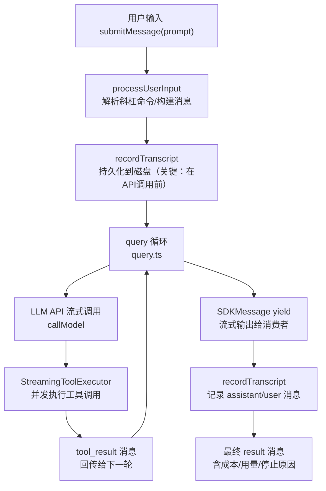

# 第08课：QueryEngine —— AI 对话的心脏

## 课程信息

| 项目 | 内容 |
|------|------|
| **所属阶段** | 第三阶段：核心引擎与扩展系统 |
| **建议时长** | 90 分钟 |
| **难度等级** | ⭐⭐⭐⭐☆ |
| **前置课程** | 第06课（工具系统）、第07课（命令系统） |

### 学习目标

1. 深刻理解 `QueryEngine` 作为"一次对话生命周期容器"的设计定位，掌握其与 `query.ts` 的职责边界
2. 掌握 `submitMessage` 的 **AsyncGenerator** 流式输出机制，理解为什么采用生成器而非回调
3. 透彻理解 tool_use / tool_result 的**消息循环编排**：LLM 如何请求工具、工具如何回馈结果
4. 了解三种**上下文压缩策略**（autocompact / microcompact / reactiveCompact）及其触发条件
5. 掌握**权限拒绝追踪**、**令牌用量累计**、**成本统计**的实现方式与设计意图

---

## 1. 核心概念

### QueryEngine vs query.ts — 职责边界

很多初学者会混淆这两个文件，以下是关键区分：

| 维度 | `QueryEngine`（类） | `query.ts`（函数） |
|------|---------------------|---------------------|
| **抽象层次** | 对话容器，跨轮次持久化状态 | 单次查询循环，无状态 |
| **生命周期** | One per conversation，跨多次 `submitMessage` | One per `submitMessage` call |
| **持有状态** | 消息历史、文件缓存、用量统计、权限拒绝 | 无持久状态 |
| **对外接口** | `submitMessage(prompt)` 返回 AsyncGenerator | 被 `QueryEngine` 内部调用 |
| **压缩触发** | 在 `submitMessage` 中决策是否压缩 | 执行压缩逻辑 |

**设计思想**：之所以把"对话状态"与"查询逻辑"分离，是为了让 `query.ts` 可以在多代理场景中被 `AgentTool` 直接复用，而不需要携带完整的对话容器。

### 关键数据结构

```
QueryEngine (src/QueryEngine.ts)
├── config: QueryEngineConfig          # 构造时注入，不可变配置
├── mutableMessages: Message[]         # 跨轮次的对话历史（唯一可变核心状态）
├── abortController: AbortController  # 会话级中断信号
├── permissionDenials: SDKPermissionDenial[]  # 权限拒绝追踪
├── totalUsage: NonNullableUsage       # 累计令牌用量（input + output + cache）
├── readFileState: FileStateCache      # LRU 文件内容缓存
├── discoveredSkillNames: Set<string>  # 当前轮次已发现的技能（Turn-scoped）
└── loadedNestedMemoryPaths: Set<string>  # 已加载的嵌套内存路径
```

---

## 2. 架构设计与设计思想

### 整体数据流



### 为什么在 API 调用前先持久化？

这是 `QueryEngine` 中最精妙的一个设计决策（源码 L436-L462 有详细注释）：

> "Persist the user's message(s) to transcript BEFORE entering the query loop."

**原因**：如果进程在 API 响应返回前被杀死（用户点击 Stop），消息历史里只有队列操作条目。`getLastSessionLog` 会过滤掉这些条目，返回 null，导致 `--resume` 失败并报错 "No conversation found"。

**解决方案**：在 API 调用前就先写入转录文件，这样即使进程被提前终止，对话也是可恢复的。

### AsyncGenerator 的设计价值

`submitMessage` 是一个 `async *` 生成器函数，这不是随机选择：

1. **背压控制**：消费者（CLI/SDK）按需 `yield`，不会一次性把所有消息缓冲在内存
2. **实时反馈**：用户能看到 AI 的流式输出，而不是等整个响应结束才看到
3. **中间状态透明**：工具调用开始、工具执行结果、中间思考步骤，消费者都能实时感知
4. **可取消性**：消费者停止迭代即等于取消，AbortController 同步传播

---

## 3. 关键源码深度走查

### 3.1 类定义与初始化

**文件**：`src/QueryEngine.ts` L184-L207

```typescript
/**
 * QueryEngine 拥有一次对话的查询生命周期和会话状态。
 * 它从 ask() 中提取核心逻辑到一个独立类，
 * 可用于无头/SDK 路径和（未来）REPL。
 *
 * 每次对话一个 QueryEngine。每次 submitMessage() 调用在同一会话内
 * 开启一个新的轮次。状态（消息、文件缓存、用量等）跨轮次持久化。
 */
export class QueryEngine {
  private config: QueryEngineConfig
  private mutableMessages: Message[]              // ⭐ 核心状态：跨轮次消息历史
  private abortController: AbortController
  private permissionDenials: SDKPermissionDenial[]
  private totalUsage: NonNullableUsage
  private hasHandledOrphanedPermission = false    // 孤儿权限只处理一次的防重入标志
  private readFileState: FileStateCache
  // Turn-scoped 技能发现追踪（在 tengu_skill_tool_invocation 中的
  // was_discovered 字段使用）。每次 submitMessage 开始时清空，
  // 避免跨多轮 SDK 模式下无限增长。
  private discoveredSkillNames = new Set<string>()
  private loadedNestedMemoryPaths = new Set<string>()

  constructor(config: QueryEngineConfig) {
    this.config = config
    this.mutableMessages = config.initialMessages ?? []  // 支持恢复会话
    this.abortController = config.abortController ?? createAbortController()
    this.permissionDenials = []
    this.readFileState = config.readFileCache    // 注入外部 LRU 缓存
    this.totalUsage = EMPTY_USAGE
  }
}
```

> 💡 **设计点评 — 状态作用域精确分离**
>
> **好在哪里**：`discoveredSkillNames` 是 Turn-scoped（每轮清空），`loadedNestedMemoryPaths` 是 Session-scoped（跨轮保留）。这就像餐厅服务员的工作记录：今天服务过哪些桌是"今天的"（Turn），但哪些食材已入库是"餐厅的"（Session）。`config.initialMessages` 支持会话恢复（`--resume` 特性的关键）。
>
> **如果不这样做**：技能发现标记跨轮次误传，会影响 `was_discovered` 分析指标准确性；嵌套内存路径每轮重复加载，造成性能浪费。

### 3.2 权限拒绝追踪包装器

**文件**：`src/QueryEngine.ts` L243-L271

```typescript
// 包装 canUseTool 以追踪权限拒绝
const wrappedCanUseTool: CanUseToolFn = async (
  tool,
  input,
  toolUseContext,
  assistantMessage,
  toolUseID,
  forceDecision,
) => {
  const result = await canUseTool(      // ① 调用真实的权限检查
    tool,
    input,
    toolUseContext,
    assistantMessage,
    toolUseID,
    forceDecision,
  )

  // 追踪拒绝用于 SDK 上报
  if (result.behavior !== 'allow') {    // ② 只有非允许时才记录
    this.permissionDenials.push({
      tool_name: sdkCompatToolName(tool.name),  // ③ 名称适配（SDK 兼容格式）
      tool_use_id: toolUseID,
      tool_input: input,
    })
  }

  return result  // ④ 透明传递原始决策，不影响正常流程
}
```

> 💡 **设计点评 — 装饰器模式（Decorator Pattern）**
>
> **好在哪里**：`wrappedCanUseTool` 就像在门口装了一个"摄像头"——保安（`canUseTool`）照常工作，摄像头只是悄悄记录谁被拒绝进门，完全不干扰保安的决策。这是 AOP（面向切面编程）思想的实际运用。
>
> **如果不这样做**：要么修改 `canUseTool` 自己记录拒绝（破坏单一职责），要么在每个调用 `canUseTool` 的地方手动记录（遗漏风险高，8+ 条调用路径）。

### 3.3 转录持久化的时机控制

**文件**：`src/QueryEngine.ts` L436-L463

```typescript
// 在进入查询循环前将用户消息持久化到转录文件
// for-await 循环只在 ask() 产出 assistant/user/compact_boundary 消息时
// 调用 recordTranscript——这直到 API 响应才会发生。如果进程在此之前
// 被杀死（例如用户在 cowork 中几秒后点击 Stop），转录文件里只有
// 队列操作条目；getLastSessionLog 会过滤掉这些，返回 null，
// --resume 就失败并报 "No conversation found"。
// 现在提前写入使对话从用户消息被接受的点就可恢复，
// 即使从未有 API 响应到达。
//
// --bare / SIMPLE: fire-and-forget。脚本调用不会在中途 kill 后 --resume。
// await 大约 4ms（SSD），30ms（磁盘争用）——是模块求值后最大的
// 可控关键路径成本。转录仍然写入（用于事后调试）；只是不阻塞。
if (persistSession && messagesFromUserInput.length > 0) {
  const transcriptPromise = recordTranscript(messages)
  if (isBareMode()) {
    void transcriptPromise           // ① 裸模式：fire-and-forget
  } else {
    await transcriptPromise          // ② 正常模式：同步等待写入完成
    if (
      isEnvTruthy(process.env.CLAUDE_CODE_EAGER_FLUSH) ||
      isEnvTruthy(process.env.CLAUDE_CODE_IS_COWORK)
    ) {
      await flushSessionStorage()    // ③ 协作场景需要立即 flush
    }
  }
}
```

> 💡 **设计点评 — 防御性编程的时机哲学**
>
> **好在哪里**："先写用户消息，再调 API" 就像外卖员接单后先发短信给商家——就算中途断网，起码商家知道有这个订单。根据运行模式区分三种策略：`--bare` 模式不阻塞（脚本不需要可恢复性），普通模式等待写入，`COWORK` 场景额外 flush 保证跨进程一致性。
>
> **如果不这样做**：用户输入后进程崩溃，`--resume` 时报 "No conversation found"，对话丢失无法恢复，用户体验极差。

### 3.4 query 循环消息处理

**文件**：`src/QueryEngine.ts` L675-L686

```typescript
for await (const message of query({
  messages,
  systemPrompt,
  userContext,
  systemContext,
  canUseTool: wrappedCanUseTool,       // 使用包装后的权限检查器
  toolUseContext: processUserInputContext,
  fallbackModel,
  querySource: 'sdk',
  maxTurns,
  taskBudget,
})) {
  // 处理 assistant、user 和 compact boundary 消息
  if (
    message.type === 'assistant' ||
    message.type === 'user' ||
    (message.type === 'system' && message.subtype === 'compact_boundary')
  ) {
    // ...记录转录、更新用量统计
  }
}
```

> 💡 **设计点评 — 链式生成器管道**
>
> **好在哪里**：`query()` 函数本身是一个 AsyncGenerator，`QueryEngine` 通过 `for await...of` 消费它，并在处理每条消息后决定是否向上游 yield。这形成了"消费-处理-再产出"的链式生成器管道，就像工厂流水线：每个环节处理自己负责的部分，不关心上下游如何工作。
>
> **如果不这样做**：如果用回调或 Promise.all，中间状态的透明传递和中断控制都会变得复杂，代码难以维护。

### 3.5 成本与用量追踪

**文件**：`src/QueryEngine.ts`（最终 result 消息构建）

```typescript
yield {
  type: 'result',
  subtype: 'success',
  is_error: false,
  duration_ms: Date.now() - startTime,        // 总耗时
  duration_api_ms: getTotalAPIDuration(),      // 纯 API 时间（排除工具执行）
  num_turns: messages.length - 1,             // 实际轮次数
  result: resultText ?? '',
  stop_reason: null,
  session_id: getSessionId(),
  total_cost_usd: getTotalCost(),             // 从 cost-tracker 全局获取
  usage: this.totalUsage,                     // 累计 input/output/cache tokens
  modelUsage: getModelUsage(),                // 按模型分类的用量
  permission_denials: this.permissionDenials, // 本次会话的权限拒绝记录
  fast_mode_state: getFastModeState(
    mainLoopModel,
    initialAppState.fastMode,
  ),
  uuid: randomUUID(),
}
```

> 💡 **设计点评 — 单一职责 + 可观测性**
>
> **好在哪里**：`QueryEngine` 自己不做成本计算，而是委托给 `cost-tracker` 模块（全局单例）。这就像餐厅不自己管账，而是交给财务部门——收银员（QueryEngine）只管服务，财务（cost-tracker）只管记账，多个收银台（多代理场景）的数据都能汇总到同一个财务系统。
>
> **如果不这样做**：多代理场景下每个 QueryEngine 自己算成本，无法跨实例聚合，SDK 报告的总成本数据会不准确。

---

## 4. Harness Engineering

### Harness Engineering 视角

QueryEngine 是 Claude Code 驾驭 AI 能力的核心枢纽，它不是"让 AI 随便跑"，而是通过精确的工程设计来**约束、增强、编排** AI 的行为：

**约束**：
- `wrappedCanUseTool` 在权限层面统一拦截，让 AI 的每个工具调用都可被审计
- 转录持久化在调用 API 前完成，确保即使 AI 响应超时也有恢复入口
- `permissionDenials` 追踪让 AI 的"越权尝试"对上游 SDK 完全可见

**增强**：
- AsyncGenerator 接口让 AI 的流式思考过程实时透明，而非黑盒等待
- 系统提示三层组合（自定义层 → 内存层 → 追加层）让 AI 的上下文可精确控制
- `readFileState` LRU 缓存让 AI 重复读取文件时不必每次走磁盘

**编排**：
- 将无状态的 `query.ts` 与有状态的 `QueryEngine` 分离，使同一个查询引擎可被主代理、子代理、SDK 复用
- `discoveredSkillNames` 的 Turn-scoped 设计确保 AI 每轮都能正确感知技能状态

### 对大模型应用的启发

1. **先持久化，再调用 API**：任何可能失败的 LLM 调用，都应在调用前先持久化用户意图。这是 AI 应用的防御性工程基线。

2. **用装饰器模式收集 AI 行为数据**：不要修改核心权限/工具逻辑来加遥测，而是用包装器透明插入。调用路径变化时不需要更新监控代码。

3. **生成器接口优于回调**：对于 LLM 的流式输出，AsyncGenerator 比回调和 Event Emitter 更自然——消费者主动拉取，背压自动管理，中断干净。

4. **成本追踪应该全局化**：在多代理架构中，每个 AI 实例的成本应汇总到统一的全局追踪器，而非各自维护。方便 SDK 调用者在任何时候拿到准确的总成本。

5. **状态作用域要显式标注**：Turn-scoped vs Session-scoped 的区分应该通过命名或注释显式说明，而非隐式约定。AI 应用的状态管理比普通应用更复杂，歧义会带来难以排查的 bug。

---

## 5. 思考题与进阶方向

### 思考题

**题目 1**：`QueryEngine` 为什么不直接暴露 `mutableMessages`，而是通过 `getMessages()` 方法获取？这体现了什么面向对象原则？

<details>
<summary>💡 参考答案</summary>

这体现了**封装原则（Encapsulation）**。`mutableMessages` 是会话状态的核心，如果直接暴露，外部代码可能在任意时机修改它，破坏 QueryEngine 对消息历史的一致性保证（比如在写入转录文件时同时被外部修改）。`getMessages()` 返回的是副本或受控视图，让 QueryEngine 保持对消息历史的独占控制权。在多代理场景中，这种封装防止了子代理误改主代理的消息历史。

</details>

**题目 2**：为什么 `discoveredSkillNames` 是 Turn-scoped 而不是 Session-scoped？如果改成 Session-scoped 会产生什么问题？

<details>
<summary>💡 参考答案</summary>

`discoveredSkillNames` 用于标记"本轮首次发现的技能"，影响 `was_discovered` 遥测字段的准确性。如果改成 Session-scoped，第一轮发现的技能会被标记为 discovered，但第二轮调用同一技能时，`was_discovered` 仍为 true（因为 Set 没有清空），导致遥测数据失真——系统会错误地认为每次调用都是"首次发现"。在 SDK 多轮模式下，这个 Set 还会无限增长，造成内存泄漏。

</details>

**题目 3**：`query()` 函数被设计成可以被 `AgentTool` 直接调用（绕过 `QueryEngine`），这种设计的优点和缺点分别是什么？

<details>
<summary>💡 参考答案</summary>

**优点**：子代理不需要完整的会话容器（转录持久化、权限拒绝追踪等是主代理才需要的），直接使用轻量的 `query()` 降低了子代理的启动成本，也让 `query.ts` 在多个场景（主代理、子代理、恢复场景）中复用。**缺点**：直接调用 `query()` 会跳过 `QueryEngine` 提供的权限拒绝追踪、技能加载、系统初始化等外围功能，调用方必须清楚自己在绕过哪些能力，这增加了使用门槛和出错风险。

</details>

**题目 4**：`submitMessage` 中有两次构建 `processUserInputContext` 的地方（L335 和 L492），为什么需要两次？能合并成一次吗？

<details>
<summary>💡 参考答案</summary>

两次构建对应两个不同的时机：第一次在解析用户输入时（L335），此时需要携带当前轮次的初始状态；第二次在进入 query 循环前（L492），此时可能经历了斜杠命令处理、消息转换等中间步骤，上下文中的某些字段（如文件缓存、技能列表）可能已更新。合并成一次会使两个阶段共享同一个上下文对象，如果后续阶段修改了它，会影响前面阶段的行为，产生隐式耦合。

</details>

### 进阶方向

- **上下文压缩深入研究**：阅读 `src/services/compact/` 目录，理解三种压缩策略的实现细节
- **流式 API 与非流式回退**：阅读 `src/services/api/claude.ts` 中的 `callModel`，理解流式失败时如何回退
- **会话恢复机制**：阅读 `src/utils/sessionStorage.ts`，理解 `--resume` 的完整实现
- **令牌预算控制**：在 `query.ts` 中搜索 `TOKEN_BUDGET`，理解动态令牌分配策略

---

## 小结

`QueryEngine` 是 Claude Code 中最核心的类之一。它的设计哲学可以概括为：

> **"对话容器"的本质是状态管理，而非逻辑执行。**

它明确地把"持有什么状态"（QueryEngine 负责）和"如何执行查询"（query.ts 负责）分开，让两者都保持专注和可复用。AsyncGenerator 接口设计使得流式输出和中断控制变得优雅而自然。

理解 QueryEngine，就是理解 Claude Code 如何将一个看似简单的"用户输入 → AI 输出"转化为一个可靠、可恢复、可观测的工程级对话系统。
