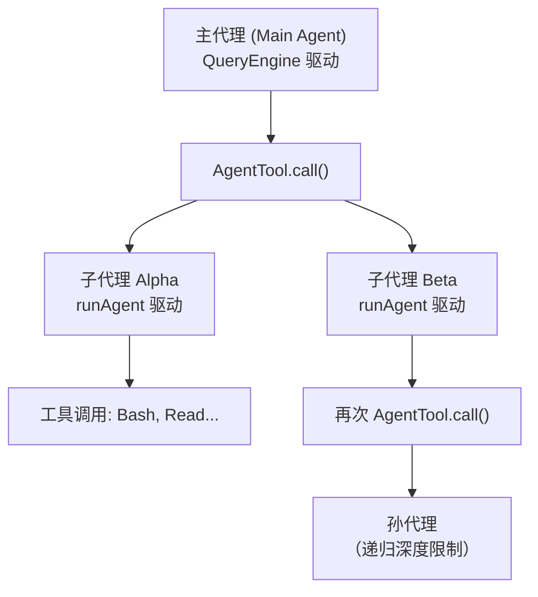
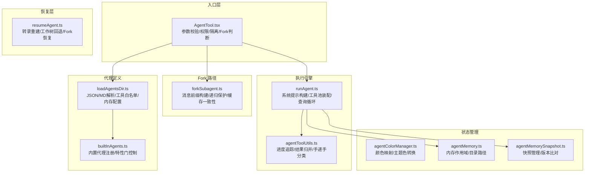
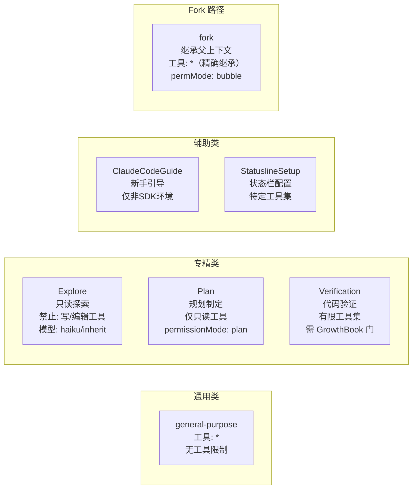

# 第09课：智能代理工具与多代理协作

## 课程信息

| 项目 | 内容 |
|------|------|
| **所属阶段** | 第三阶段：核心引擎与扩展系统 |
| **建议时长** | 120 分钟 |
| **难度等级** | ⭐⭐⭐⭐⭐ |
| **前置课程** | 第08课（QueryEngine）、第06课（工具系统） |

### 学习目标

1. 理解 `AgentTool` 的**Fork 子代理机制**：如何继承父上下文、如何最大化 prompt cache 命中
2. 掌握**多代理协作**的实现：同步 vs 异步、工作树隔离、团队模式
3. 了解所有**内置代理类型**（探索/计划/验证/通用等）的职责边界与工具限制
4. 深入理解**代理内存管理**：三种作用域（user/project/local）、快照机制
5. 掌握**代理颜色分配**体系及其在 UI 可观测性上的价值

---

## 1. 核心概念

### AgentTool 的本质：递归调用的自相似结构

`AgentTool` 是整个 Claude Code 中最复杂的工具，因为它实现了**代理递归**：一个 AI 实例可以调用另一个 AI 实例去执行子任务。这形成了一个树状的代理执行图。



**关键洞察**：`runAgent.ts` 内部调用的是与主代理相同的 `query()` 函数，这意味着子代理具有与主代理完全相同的"思考→工具→思考"能力，只是工具池和权限可以受到限制。

### 同步 vs 异步代理的抉择

| 维度 | 同步代理 | 异步代理（后台任务） |
|------|----------|----------------------|
| **触发条件** | 默认行为 | `run_in_background: true` 或超时自动切换 |
| **阻塞行为** | 阻塞当前对话轮次 | 立即返回 agentId，通知异步到达 |
| **UI 呈现** | 工具调用内嵌显示 | 独立任务通知 |
| **适用场景** | 短任务、需要结果的后续步骤 | 长时间任务、可并行的独立工作 |
| **资源隔离** | 共享父进程内存 | 独立任务注册，有清理机制 |

**设计哲学**：`getAutoBackgroundMs()` 函数实现了"自动后台化"——如果一个代理运行超过 120 秒还未完成，系统会自动将其转为后台任务，避免主对话长时间卡住。

---

## 2. 架构设计与设计思想

### AgentTool 的分层架构



### 为什么把 runAgent 从 AgentTool 中分离？

这是一个非常重要的架构决策。`runAgent.ts` 可以被以下场景复用：
1. **AgentTool** 的同步路径：直接调用 runAgent
2. **AgentTool** 的异步路径：通过 runAsyncAgentLifecycle 封装后调用
3. **resumeAgent.ts** 的恢复路径：复用相同的 runAgent 接口

如果 runAgent 的逻辑嵌在 AgentTool 内部，这些场景的代码复用就会变得极为困难。这体现了**关注点分离（Separation of Concerns）**原则。

---

## 3. 关键源码深度走查

### 3.1 Fork 子代理机制 — 最精妙的 prompt cache 优化

**文件**：`src/tools/AgentTool/forkSubagent.ts` L60-L172

```typescript
/**
 * Fork 子代理的合成定义。
 *
 * tools: ['*'] + useExactTools 意味着 fork 子代接收父代理的精确工具池
 * （保证缓存一致的 API 请求前缀）。
 * permissionMode: 'bubble' 将权限提示冒泡到父终端。
 * model: 'inherit' 保持父代理的模型以获得上下文长度一致性。
 */
export const FORK_AGENT = {
  agentType: FORK_SUBAGENT_TYPE,
  whenToUse: 'Implicit fork — inherits full conversation context...',
  tools: ['*'],          // ① 通配符：接收父代理的完整工具集
  maxTurns: 200,
  model: 'inherit',      // ② 继承父代理模型，保证缓存前缀一致性
  permissionMode: 'bubble',  // ③ 权限冒泡到父终端
  source: 'built-in',
  baseDir: 'built-in',
  getSystemPrompt: () => '',  // ④ 系统提示从父代理注入，不重建
} satisfies BuiltInAgentDefinition
```

**关键函数**：`buildForkedMessages`

```typescript
/**
 * 为子代理构建 fork 对话消息。
 *
 * 为了 prompt cache 共享，所有 fork 子代必须产生字节完全相同的
 * API 请求前缀。此函数：
 * 1. 保留完整父 assistant 消息（所有 tool_use 块、思考、文本）
 * 2. 为每个 tool_use 块构建一个使用相同占位符的 tool_result 单条用户消息，
 *    然后追加每个子代独有的指令文本块
 *
 * 结果: [...history, assistant(all_tool_uses), user(placeholder_results..., directive)]
 * 只有最后的文本块不同，最大化缓存命中。
 */
export function buildForkedMessages(
  directive: string,
  assistantMessage: AssistantMessage,
): MessageType[] {
  // 克隆 assistant 消息，保留所有内容块（思考、文本、每个 tool_use）
  const fullAssistantMessage: AssistantMessage = {
    ...assistantMessage,
    uuid: randomUUID(),
    message: {
      ...assistantMessage.message,
      content: [...assistantMessage.message.content],
    },
  }
  // ...构建 placeholder tool_result 用户消息
  // ...追加 directive 专属文本块
}
```

**设计原理图**：

```
父代理的对话历史:
┌─────────────────────────────────────────────────┐
│ user: "请同时分析三个文件夹"                       │
│ assistant: [tool_use: fork子代A] [tool_use: 子代B] │ ← 完整保留
│ user: [tool_result: PLACEHOLDER] [tool_result: PH] │ ← 占位符，所有子代相同
│       [text: "你负责分析 src/ 文件夹..."]           │ ← 每个子代唯一的指令
└─────────────────────────────────────────────────┘

子代A API请求前缀:  ████████████████████████████│不同
子代B API请求前缀:  ████████████████████████████│不同
                   ←── 相同部分，命中 cache ──→
```

> 💡 **设计点评 — 享元模式（Flyweight Pattern）**
>
> **好在哪里**：Claude API 的 prompt cache 按请求前缀缓存。多个并发子代通过共享相同的历史前缀 + 占位符结果，只在最后的指令块上区别——就像多个快递员共享同一张地图，只有最后的目的地不同。大幅减少 API 成本和延迟。
>
> **如果不这样做**：每个子代的请求前缀都不同，无法共享缓存，并发子代的 API 成本是 N 倍，延迟也无法利用缓存加速。

### 3.2 递归 Fork 保护

**文件**：`src/tools/AgentTool/forkSubagent.ts` L73-L88

```typescript
/**
 * 防止递归 fork。Fork 子代在工具池中保留 Agent 工具
 * 以获得缓存一致的工具定义，因此我们在调用时通过检测
 * 对话历史中的 fork boilerplate 标签来拒绝 fork 尝试。
 */
export function isInForkChild(messages: MessageType[]): boolean {
  return messages.some(m => {
    if (m.type !== 'user') return false
    const content = m.message.content
    if (!Array.isArray(content)) return false
    return content.some(
      block =>
        block.type === 'text' &&
        block.text.includes(`<${FORK_BOILERPLATE_TAG}>`),  // ① 检测特殊标签
    )
  })
}
```

> 💡 **设计点评 — 用历史消息代替上下文传参**
>
> **好在哪里**：用"历史消息中是否有特殊标签"来判断是否在 fork 子代中，比传递 `isInFork: boolean` 参数更简洁——消息历史本身就是最好的"执行上下文记录"。就像侦探看犯罪现场留下的痕迹，不需要嫌疑人自己招供。
>
> **如果不这样做**：需要在调用链上显式传递"是否在 fork 中"的上下文参数，每次重构调用栈都要同步更新，容易遗漏。

### 3.3 代理颜色管理 — UI 可观测性的工程设计

**文件**：`src/tools/AgentTool/agentColorManager.ts`

```typescript
export const AGENT_COLORS: readonly AgentColorName[] = [
  'red', 'blue', 'green', 'yellow', 'purple', 'orange', 'pink', 'cyan',
] as const  // ① 8种颜色，用于不同代理类型

// 颜色名 → 主题色 的类型安全映射
export const AGENT_COLOR_TO_THEME_COLOR = {
  red:    'red_FOR_SUBAGENTS_ONLY',
  blue:   'blue_FOR_SUBAGENTS_ONLY',
  // ...
} as const satisfies Record<AgentColorName, keyof Theme>
// ② `satisfies` 关键字保证类型约束，同时保留更窄的字面量类型

export function getAgentColor(agentType: string): keyof Theme | undefined {
  if (agentType === 'general-purpose') {
    return undefined  // ③ 通用代理不分配颜色（太常见，不需要区分）
  }

  const agentColorMap = getAgentColorMap()  // ④ 从全局状态读取颜色映射
  const existingColor = agentColorMap.get(agentType)
  
  if (existingColor && AGENT_COLORS.includes(existingColor)) {
    return AGENT_COLOR_TO_THEME_COLOR[existingColor]  // ⑤ 颜色名 → 主题键
  }
  return undefined
}
```

> 💡 **设计点评 — `satisfies` 运算符的精妙运用**
>
> **好在哪里**：`satisfies` 在 TypeScript 4.9 引入，它在保留字面量类型（而非扩宽为 string）的同时，验证对象符合指定接口。这使 `AGENT_COLOR_TO_THEME_COLOR.red` 的类型是 `'red_FOR_SUBAGENTS_ONLY'` 而不是 `string`，为后续使用提供更精确的类型推断。`_FOR_SUBAGENTS_ONLY` 后缀防止颜色被主题全局覆盖，颜色存储在全局状态中（持久化跨调用）。就像公寓楼的门牌号——颜色是固定的，但每次来访的租户（agentType）都有自己的号码。
>
> **如果不这样做**：用 `as Record<AgentColorName, keyof Theme>` 类型断言会丢失字面量类型，后续代码无法利用精确的字面量类型做编译时检查。

### 3.4 代理内存的三种作用域

**文件**：`src/tools/AgentTool/agentMemory.ts` L52-L65

```typescript
/**
 * 返回给定代理类型和作用域的内存目录。
 * - 'user' scope: <memoryBase>/agent-memory/<agentType>/     ← 用户级，跨项目
 * - 'project' scope: <cwd>/.claude/agent-memory/<agentType>/ ← 项目级，通过 VCS 共享
 * - 'local' scope: see getLocalAgentMemoryDir()              ← 本地级，不入 VCS
 */
export function getAgentMemoryDir(
  agentType: string,
  scope: AgentMemoryScope,
): string {
  const dirName = sanitizeAgentTypeForPath(agentType)
  switch (scope) {
    case 'project':
      return join(getCwd(), '.claude', 'agent-memory', dirName) + sep
    case 'local':
      return getLocalAgentMemoryDir(dirName)
    case 'user':
      return join(getMemoryBaseDir(), 'agent-memory', dirName) + sep
  }
}
```

**三种作用域的设计意图**：

| 作用域 | 位置 | 适用场景 | VCS 状态 |
|--------|------|----------|----------|
| `user` | `~/.claude/agent-memory/` | 跨项目学习，通用知识 | 不入 VCS |
| `project` | `.claude/agent-memory/` | 项目专属，团队共享 | 入 VCS |
| `local` | `.claude/agent-memory-local/` | 本机特定，不共享 | .gitignore |

**内存加载提示设计**：
```typescript
// scope 注释被注入到内存提示中，指导代理记忆什么内容
case 'user':
  scopeNote = '- Since this memory is user-scope, keep learnings general...'
  break
case 'project':
  scopeNote = '- Since this memory is project-scope and shared with your team via VCS...'
  break
case 'local':
  scopeNote = '- Since this memory is local-scope (not checked into VCS)...'
  break
```

> 💡 **设计点评 — 内存作用域影响记忆策略**
>
> **好在哪里**：内存的作用域不仅影响存储位置，还影响代理"记忆什么内容"的策略——这是非常精妙的设计。就像你在家和在公司记笔记的侧重点不同：家里记的是私人事项，公司记的是团队协作信息。另外 `sanitizeAgentTypeForPath` 处理了 `plugin:agent-name` 格式的跨平台路径安全（冒号在 Windows 禁止），这是防御性编程的体现。
>
> **如果不这样做**：代理在不同作用域的内存里存储同样的内容，project 内存里可能包含本机路径等本地信息，导致团队其他成员使用时出错。

### 3.5 内置代理体系：工具白名单的精确控制

**文件**：`src/tools/AgentTool/built-in/exploreAgent.ts` L64-L82

```typescript
export const EXPLORE_AGENT: BuiltInAgentDefinition = {
  agentType: 'Explore',
  whenToUse: 'Fast agent specialized for exploring codebases...',
  
  // ① 精确工具黑名单（保证只读）
  disallowedTools: [
    AGENT_TOOL_NAME,          // 禁止 Fork 子代（防止递归扩散）
    EXIT_PLAN_MODE_TOOL_NAME, // 禁止修改权限模式
    FILE_EDIT_TOOL_NAME,      // ← 核心：禁止文件修改
    FILE_WRITE_TOOL_NAME,     // ← 核心：禁止文件写入
    NOTEBOOK_EDIT_TOOL_NAME,  // ← 核心：禁止 Notebook 编辑
  ],
  source: 'built-in',
  baseDir: 'built-in',
  
  // ② 模型选择策略：内部 inherit（利用父缓存），外部 haiku（速度优先）
  model: process.env.USER_TYPE === 'ant' ? 'inherit' : 'haiku',
}
```

**通用代理（GeneralPurposeAgent）的不同策略**：
```typescript
export const GENERAL_PURPOSE_AGENT: BuiltInAgentDefinition = {
  agentType: 'general-purpose',
  tools: ['*'],   // 通配符：接受所有可用工具
  // model 意图省略：使用 getDefaultSubagentModel() 动态决策
  getSystemPrompt: getGeneralPurposeSystemPrompt,
}
```

> 💡 **设计点评 — 工程约束优于 AI 自律**
>
> **好在哪里**：Explore 代理是"只读探索代理"，通过精确的 `disallowedTools` 黑名单，从架构上保证它不可能修改文件系统——这比"相信 AI 不会修改文件"要可靠得多。环境自适应的模型选择（`ant` 内部用 `inherit` 利用 KV cache，外部用 `haiku` 速度优先）是多租户架构设计的典范。
>
> **如果不这样做**：仅靠系统提示中的"只读模式"指令，AI 偶尔还是可能尝试修改文件；工具限制是硬约束，系统提示是软约束，两者结合才是真正的安全保障。

### 3.6 工具过滤策略

**文件**：`src/tools/AgentTool/agentToolUtils.ts` L70-L116

```typescript
export function filterToolsForAgent({
  tools,
  isBuiltIn,
  isAsync = false,
  permissionMode,
}: {
  tools: Tools
  isBuiltIn: boolean
  isAsync?: boolean
  permissionMode?: PermissionMode
}): Tools {
  return tools.filter(tool => {
    // MCP 工具对所有代理开放
    if (tool.name.startsWith('mcp__')) {
      return true
    }
    // plan 模式下的代理允许 ExitPlanMode（绕过黑名单）
    if (
      toolMatchesName(tool, EXIT_PLAN_MODE_V2_TOOL_NAME) &&
      permissionMode === 'plan'
    ) {
      return true
    }
    // 全局代理禁用工具（安全基线）
    if (ALL_AGENT_DISALLOWED_TOOLS.has(tool.name)) {
      return false
    }
    // 自定义代理额外禁用工具（比内置代理限制更多）
    if (!isBuiltIn && CUSTOM_AGENT_DISALLOWED_TOOLS.has(tool.name)) {
      return false
    }
    // 异步代理只允许特定工具（后台任务场景的最小权限）
    if (isAsync && !ASYNC_AGENT_ALLOWED_TOOLS.has(tool.name)) {
      // ...Swarm 模式的特殊例外处理
      return false
    }
    return true
  })
}
```

> 💡 **设计点评 — 最小权限原则的分层实现**
>
> **好在哪里**：工具过滤分四层：全局黑名单（所有代理都不能用的危险工具）→ 自定义代理黑名单（自定义比内置受更多限制）→ 异步代理白名单（后台任务只允许安全工具集）→ 场景例外（plan 模式、Swarm 模式的必要例外）。就像门禁系统：访客卡 < 员工卡 < 管理员卡，每层都有自己的权限范围，而不是一刀切。
>
> **如果不这样做**：用一个大的 if-else 处理所有情况，代码难以维护，新增代理类型时容易遗漏安全限制，产生权限漏洞。

---

## 4. 内置代理全景图



每种代理类型都是"为特定任务优化的专用 AI"，通过工具限制、模型选择和系统提示三者的组合来实现能力的精确边界控制。这是 Claude Code 多代理架构的核心设计哲学：**不依赖 AI 的"自律"，而是通过工程约束来保证行为边界**。

---

## 5. 快照三状态机

代理内存快照（`agentMemorySnapshot.ts`）实现了三状态机：
- `action: 'none'`：无快照，不操作
- `action: 'initialize'`：有快照但无本地内存，从快照初始化
- `action: 'prompt-update'`：有快照且有本地内存，提示更新

```typescript
export async function checkAgentMemorySnapshot(
  agentType: string,
  scope: AgentMemoryScope,
): Promise<{
  action: 'none' | 'initialize' | 'prompt-update'
  snapshotTimestamp?: string
}>
```

这个三状态设计避免了盲目覆盖用户的本地内存，同时提醒用户有可用的团队快照。

---

## 6. Harness Engineering

### Harness Engineering 视角

`AgentTool` 是 Claude Code 中最体现"驾驭工程"思想的模块——它把 AI 的递归自组织能力关在一个精确设计的笼子里：

**约束**：
- 工具黑白名单从架构上划定每个代理的能力边界，而非依赖 AI 的"自我克制"
- `isInForkChild` 通过历史消息检测防止代理指数爆炸式递归
- 三层访问控制（代理工具限制 → 权限模式 → 用户确认）形成纵深防御

**增强**：
- Fork 机制通过精心构造的消息前缀，让多个并发子代共享 prompt cache，大幅降低 API 成本
- 快照机制让团队的 AI 代理可以共享经验，个体代理的学习可以泛化到整个团队
- 颜色分配系统让多代理并发时的输出对人类操作者保持可区分、可追踪

**编排**：
- `runAgent.ts` 与 `AgentTool` 分离，使同一执行引擎可被同步路径、异步路径、恢复路径复用
- 自动后台化（120 秒超时）让 AI 的长任务不会阻塞用户的主对话流程
- 三种内存作用域（user/project/local）精确匹配团队协作的不同共享需求

### 对大模型应用的启发

1. **工程约束优于提示约束**：要限制 AI 的行为边界，工具黑名单比系统提示更可靠。系统提示是"请求"，工具限制是"命令"。

2. **设计消息格式来最大化缓存**：并发 AI 调用时，提前规划请求前缀的结构，让尽可能多的部分可以共享缓存。这在大规模多代理系统中能节省大量成本。

3. **递归 AI 调用必须有终止条件**：任何允许 AI 调用 AI 的系统都必须有明确的递归深度限制或终止检测，否则指数爆炸风险是真实的。

4. **AI 的内存需要分层**：用户级（个人经验）、项目级（团队共享）、本地级（机器特定）三层分离，是实际工程中必须考虑的设计维度。

5. **可观测性要从设计时就规划**：颜色分配、agentId 追踪、权限拒绝记录——这些不是事后的调试工具，而是在设计多代理系统时就应该内置的可观测性基础设施。

---

## 7. 思考题与进阶方向

### 思考题

**题目 1**：Fork 子代为什么要保留父代理的 `AgentTool` 工具定义（即使它不能使用 fork）？这对 prompt cache 有什么影响？

<details>
<summary>💡 参考答案</summary>

Fork 子代保留 AgentTool 工具定义是为了保证 API 请求中的工具列表与父代理完全相同，从而让请求前缀字节一致——这是 prompt cache 共享的前提。如果 Fork 子代移除了 AgentTool，工具列表不同，请求前缀就不同，多个并发子代无法共享同一个 cache 条目，缓存优化完全失效。通过 `isInForkChild` 检测来拒绝实际的 fork 行为（而非移除工具定义），是一个聪明的解耦——缓存优化和行为限制各自通过不同机制实现。

</details>

**题目 2**：代理内存的三种作用域（user/project/local）分别对应团队协作的哪种场景？如果团队里有多个项目，应该用哪个作用域存储"跨项目的最佳实践"？

<details>
<summary>💡 参考答案</summary>

user 作用域对应"个人经验"（跨所有项目、不共享给团队），project 作用域对应"项目共识"（团队共享、随代码库版本化），local 作用域对应"机器特定配置"（本机路径、环境特有设置）。"跨项目的最佳实践"应存储在 user 作用域——因为它是个人的通用知识，适用于所有项目，但每个人的最佳实践可能不同（所以不放 project），也不是本机特有（所以不放 local）。如果是团队共同总结的跨项目规范，则应存放在每个相关项目的 project 作用域，或通过技能系统分发。

</details>

**题目 3**：`filterToolsForAgent` 中，为什么异步代理（`isAsync: true`）受到比同步代理更严格的工具限制？这背后有什么安全考量？

<details>
<summary>💡 参考答案</summary>

异步代理在后台运行，用户无法实时监控其行为——这是关键的安全差异。同步代理的每一步用户都能看到并随时中断；异步代理则在"无监督"状态下执行。因此异步代理只能使用"安全工具集"（ASYNC_AGENT_ALLOWED_TOOLS），避免在用户无法干预的情况下执行破坏性操作（如大量文件删除、网络请求等）。这是最小权限原则在"可监督性"维度的应用：监督程度越低，权限应越受限。

</details>

**题目 4**：Explore 代理的系统提示中使用大写的 `=== CRITICAL: READ-ONLY MODE ===`，这是必要的吗？仅靠 `disallowedTools` 不够吗？两者结合的价值是什么？

<details>
<summary>💡 参考答案</summary>

`disallowedTools` 是硬约束，防止 AI 调用写入类工具；但 AI 在思考过程中仍可能产生"我想修改文件"的意图，并尝试用其他方式绕过（比如通过 Bash 命令间接修改）。大写的系统提示是软约束，在语义层面告知 AI 当前是只读模式，引导 AI 从一开始就不产生修改意图，而非等到工具调用时才被拒绝。两者结合的价值：硬约束保证安全底线，软约束提升 AI 的任务理解准确性，减少无效的"尝试写入→被拒绝"循环，提高效率。

</details>

### 进阶方向

- **Coordinator 模式**：阅读 `src/coordinator/coordinatorMode.ts`，理解多代理"协调者"模式的实现
- **Swarm 模式**：阅读 `src/utils/swarm/spawnInProcess.ts`，理解 in-process 多代理协作
- **异步任务系统**：阅读 `src/tasks/LocalAgentTask/LocalAgentTask.ts`，理解后台任务的完整生命周期
- **恢复机制**：阅读 `src/tools/AgentTool/resumeAgent.ts`，理解代理会话如何从中断恢复

---

## 小结

`AgentTool` 代表了 Claude Code 最前沿的架构设计：

1. **递归代理**：主代理调用子代理，子代理可以再调用孙代理，形成任意深度的执行树
2. **缓存工程**：Fork 机制精心设计消息格式，最大化 prompt cache 共享
3. **最小权限**：工具白名单/黑名单从架构上保证代理能力边界
4. **状态管理**：三种内存作用域满足不同持久化需求
5. **可观测性**：颜色分配让多代理并发时的输出可区分

理解 AgentTool，就是理解如何用工程手段驾驭 AI 的递归自组织能力，在赋予 AI 足够自由度的同时，保持对行为边界的精确控制。
