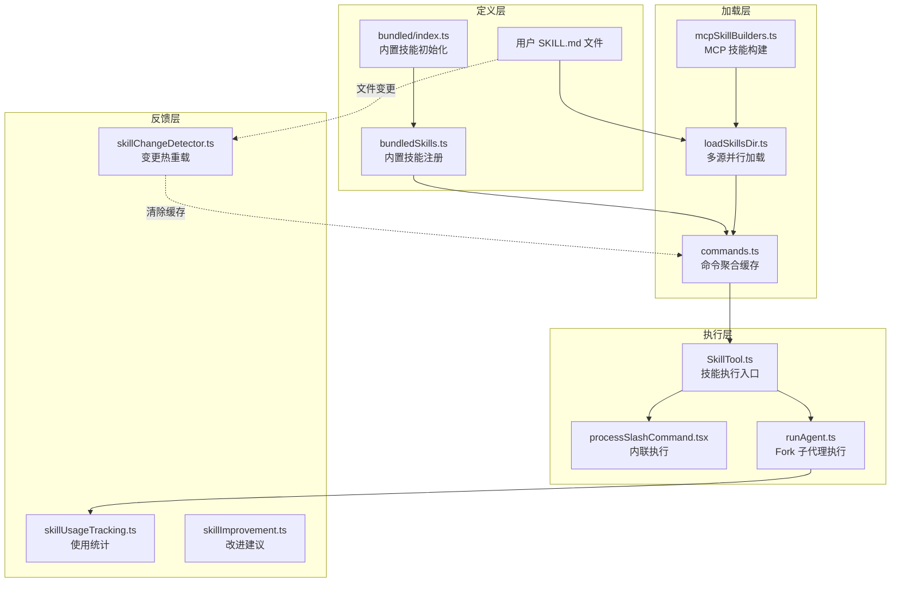

# 第10课：技能系统 — 可扩展的能力框架

## 课程信息

| 项目 | 内容 |
|------|------|
| **所属阶段** | 第三阶段：核心引擎与高级特性 |
| **建议时长** | 120 分钟 |
| **难度级别** | ⭐⭐⭐⭐ 高级 |
| **前置知识** | 第05课（工具系统架构）、第09课（智能代理工具） |
| **核心文件** | `src/skills/`、`src/tools/SkillTool/SkillTool.ts` |

### 学习目标

完成本课后，你将能够：

1. **理解技能 vs 命令的概念区分**：掌握斜杠命令（Slash Command）与技能（Skill）的演化关系，以及为何技能是"超级命令"
2. **掌握多源并行加载与去重机制**：理解五路并行扫描、`realpath` 去重策略和条件技能延迟激活
3. **深入 Frontmatter 解析体系**：了解技能元数据的完整字段体系及其对执行行为的控制
4. **理解 Fork 子代理执行隔离**：掌握 `SkillTool` 如何通过 `runAgent` 将技能在独立上下文中运行
5. **学习 Skillify 自动生成技能**：理解从对话会话中自动沉淀可复用工作流的设计哲学

---

## 核心概念

### 技能（Skill）vs 命令（Command）：两个时代

理解技能系统，首先要理解它的历史脉络：

```
旧时代（Command 时代）         新时代（Skill 时代）
─────────────────              ──────────────────
/commands/                     /skills/
  review.md                      review/
  deploy.md                        SKILL.md
  test.md                        deploy/
                                   SKILL.md
                                 test/
                                   SKILL.md
```

**关键区别**：

| 维度 | 旧版命令（Command） | 新版技能（Skill） |
|------|-------------------|-----------------|
| 目录结构 | 单个 `.md` 文件 | `技能名/SKILL.md` 目录格式 |
| 关联文件 | 不支持 | 支持 `files` 字段附带参考文件 |
| 执行隔离 | 仅内联 | 支持 `context: fork`（子代理隔离） |
| 条件激活 | 不支持 | 支持 `paths` 字段按文件路径激活 |
| 使用统计 | 无 | 有（7天半衰期评分） |
| 去重机制 | 无 | `realpath` 规范路径去重 |

**设计哲学**：技能系统是对命令系统的**超集扩展**——旧的 `.md` 命令文件仍被兼容加载（通过 `loadedFrom: 'commands_DEPRECATED'`），但新功能只在 `/skills/` 格式下可用。

### 技能来源层次

技能系统支持五个来源层次，优先级从高到低：

```
┌─────────────────────────────────────────────────────┐
│                    技能来源体系                       │
├─────────────────────────────────────────────────────┤
│ 1. 策略（managed）    ~/.managed/.claude/skills/      │
│    企业IT管控，用户不可覆盖                             │
├─────────────────────────────────────────────────────┤
│ 2. 用户（user）       ~/.claude/skills/               │
│    个人工作流，跨所有项目生效                           │
├─────────────────────────────────────────────────────┤
│ 3. 项目（project）    ./.claude/skills/               │
│    项目专属工作流，随代码库分发                          │
├─────────────────────────────────────────────────────┤
│ 4. 附加目录（add-dir） --add-dir 指定的路径             │
│    动态注入的额外工作流目录                              │
├─────────────────────────────────────────────────────┤
│ 5. 内置（bundled）    二进制内嵌                       │
│    官方预置技能，随 Claude Code 分发                    │
└─────────────────────────────────────────────────────┘
```

另外还有两类特殊来源：
- **MCP 技能**：通过 Model Context Protocol 服务器提供的远程技能
- **遗留命令**：`/commands/` 目录的向下兼容加载

---

## 架构设计与设计思想

### 技能系统全景架构



### 设计思想：为什么这样设计？

#### 1. 目录格式强制约束，而非选项

新版 `/skills/` 目录**只支持** `技能名/SKILL.md` 格式，不支持单个 `.md` 文件：

```typescript
// src/skills/loadSkillsDir.ts: L424-428
if (!entry.isDirectory() && !entry.isSymbolicLink()) {
  // Single .md files are NOT supported in /skills/ directory
  return null
}
```

**为什么**：目录格式允许技能携带附属文件（参考手册、脚本等），也为将来扩展留有空间（例如加入 `hooks/` 子目录）。强制目录格式避免了"技能有时有附属文件、有时没有"的歧义。

#### 2. realpath 去重而非 inode 去重

```typescript
// src/skills/loadSkillsDir.ts: L107-124
async function getFileIdentity(filePath: string): Promise<string | null> {
  try {
    return await realpath(filePath)  // 解析符号链接到规范路径
  } catch {
    return null
  }
}
```

**为什么选 `realpath` 而非 inode**：inode 在虚拟文件系统（NFS、ExFAT、容器）中可能不可靠（甚至全部为 0）。`realpath` 是文件系统无关的，只要路径可访问就能正确去重。这个决策专门为了修复 [GitHub Issue #13893](https://github.com/anthropics/claude-code/issues/13893)。

#### 3. Fork 执行隔离：技能不应污染主会话

当技能标注 `context: fork` 时，它在独立的子代理中运行：

```
主会话                    Fork 子代理
 ───────                   ───────────
 [用户消息历史]             [干净的上下文]
 [系统提示]                [技能 Prompt]
 [工具权限]                [技能声明的 allowedTools]
      │                         │
      └──── SkillTool ──────────┘
                  │
                  └── 返回最终结果文本
```

**为什么**：复杂的自动化任务（如"帮我做 code review 并开 PR"）需要大量工具调用，这些中间步骤不应污染用户的对话历史，结果只需返回摘要。

#### 4. 条件技能：按需激活而非全量加载

`paths` 字段允许技能只在操作特定文件时才激活：

```yaml
---
paths: src/rust/**
---
# Rust 代码风格检查技能
```

**为什么**：如果一个大型 monorepo 有数十个子项目，每个子项目都有自己的技能，全量加载不仅浪费 token（技能列表占用系统提示空间），还会干扰模型的判断。按文件路径延迟激活实现了"就近原则"。

---

## 3. 关键源码深度走查

### 源码1：`bundledSkills.ts` — 内置技能注册的惰性提取机制

**文件路径**：`src/skills/bundledSkills.ts`

```typescript
// L53-100: registerBundledSkill 核心逻辑
export function registerBundledSkill(definition: BundledSkillDefinition): void {
  const { files } = definition
  // ① 提取根目录的确定性路径
  let skillRoot: string | undefined
  let getPromptForCommand = definition.getPromptForCommand

  if (files && Object.keys(files).length > 0) {
    skillRoot = getBundledSkillExtractDir(definition.name)
    // ② 闭包局部 memoization：Promise 级别的并发安全
    // 关键：记忆的是 Promise 本身，而非结果
    // 这样并发调用者等待的是同一个 Promise，不会出现竞态写入
    let extractionPromise: Promise<string | null> | undefined
    const inner = definition.getPromptForCommand

    getPromptForCommand = async (args, ctx) => {
      // ③ ??= 懒初始化：首次调用才启动提取
      extractionPromise ??= extractBundledSkillFiles(definition.name, files)
      const extractedDir = await extractionPromise
      const blocks = await inner(args, ctx)
      // ④ 提取失败时优雅降级：技能仍可运行，只是没有 baseDir 前缀
      if (extractedDir === null) return blocks
      // ⑤ 自动注入"Base directory for this skill: ..." 前缀
      return prependBaseDir(blocks, extractedDir)
    }
  }
  // ⑥ 构造标准 Command 对象加入注册表
  const command: Command = {
    type: 'prompt',
    name: definition.name,
    source: 'bundled',        // 来源标记
    loadedFrom: 'bundled',    // 加载方式标记
    isHidden: !(definition.userInvocable ?? true),
    // ...其余字段
    getPromptForCommand,
  }
  bundledSkills.push(command)
}
```

**设计模式标注**：

- **模式①：惰性初始化（Lazy Initialization）**  
  `extractionPromise ??= ...` 确保文件提取只发生一次，之后复用同一个 Promise。这是"惰性单例"的 Promise 版本。

- **模式②：装饰器模式（Decorator Pattern）**  
  `getPromptForCommand` 被包装了一层：先提取文件到磁盘，再调用原始实现，最后注入路径前缀。调用者无感知，行为被透明增强。

- **模式③：优雅降级（Graceful Degradation）**  
  文件提取失败（磁盘只读等情况）时返回 `null`，技能仍然可用，只是缺少参考文件。这避免了因磁盘问题导致整个技能不可用。

> 💡 **设计点评 — `??=` Promise 惰性单例**
>
> **好在哪里**：`extractionPromise ??= extractBundledSkillFiles(...)` 这一行同时实现了惰性初始化、单例复用、并发安全三件事。就像餐厅只雇一个人去采购食材——第一个需要食材的厨师出发采购，其他厨师等同一个人回来，而不是每人都跑一趟。
>
> **如果不这样做**：多个并发调用会重复提取文件，造成竞态写入，最终文件内容可能不一致。

```typescript
// L176-193: 安全文件写入（防路径穿越攻击）
const O_NOFOLLOW = fsConstants.O_NOFOLLOW ?? 0
const SAFE_WRITE_FLAGS =
  process.platform === 'win32'
    ? 'wx'    // Windows: 字符串标志
    : fsConstants.O_WRONLY |
      fsConstants.O_CREAT |
      fsConstants.O_EXCL |    // 文件已存在则失败（不覆盖）
      O_NOFOLLOW              // 不跟随最终路径组件的符号链接

async function safeWriteFile(p: string, content: string): Promise<void> {
  // O_EXCL + O_NOFOLLOW: 双重防御符号链接攻击
  const fh = await open(p, SAFE_WRITE_FLAGS, 0o600)
  // 0o600: 只有文件所有者可读写（不可执行，不可被其他用户访问）
  try {
    await fh.writeFile(content, 'utf8')
  } finally {
    await fh.close()  // finally 确保文件句柄总是被关闭
  }
}
```

**安全注释**：
- `O_EXCL`：文件已存在时报 `EEXIST`，防止覆盖已有文件（可能是攻击者预先创建的）
- `O_NOFOLLOW`：不跟随最终路径组件的符号链接，防止通过符号链接写入任意位置
- 使用带随机数的临时目录（`getBundledSkillsRoot()`），使攻击者无法预测文件位置

---

### 源码2：`loadSkillsDir.ts` — 五路并行加载与 realpath 去重

**文件路径**：`src/skills/loadSkillsDir.ts`

```typescript
// L638-803: getSkillDirCommands 核心加载逻辑
export const getSkillDirCommands = memoize(  // ① lodash memoize 按 cwd 缓存
  async (cwd: string): Promise<Command[]> => {
    const userSkillsDir = join(getClaudeConfigHomeDir(), 'skills')
    const managedSkillsDir = join(getManagedFilePath(), '.claude', 'skills')
    const projectSkillsDirs = getProjectDirsUpToHome('skills', cwd)

    // ② 五路并行加载：所有 I/O 同时发起，互不等待
    const [
      managedSkills,
      userSkills,
      projectSkillsNested,
      additionalSkillsNested,
      legacyCommands,
    ] = await Promise.all([
      // 策略技能（可被环境变量禁用）
      isEnvTruthy(process.env.CLAUDE_CODE_DISABLE_POLICY_SKILLS)
        ? Promise.resolve([])
        : loadSkillsFromSkillsDir(managedSkillsDir, 'policySettings'),
      // 用户技能（可被锁定策略禁用）
      isSettingSourceEnabled('userSettings') && !skillsLocked
        ? loadSkillsFromSkillsDir(userSkillsDir, 'userSettings')
        : Promise.resolve([]),
      // 项目技能（向上遍历至 home 目录的所有层级）
      projectSettingsEnabled
        ? Promise.all(projectSkillsDirs.map(dir =>
            loadSkillsFromSkillsDir(dir, 'projectSettings')))
        : Promise.resolve([]),
      // --add-dir 指定的附加目录
      projectSettingsEnabled
        ? Promise.all(additionalDirs.map(dir =>
            loadSkillsFromSkillsDir(join(dir, '.claude', 'skills'), 'projectSettings')))
        : Promise.resolve([]),
      // 遗留 /commands/ 目录（向下兼容）
      skillsLocked ? Promise.resolve([]) : loadSkillsFromCommandsDir(cwd),
    ])

    // ③ 合并所有来源
    const allSkillsWithPaths = [
      ...managedSkills, ...userSkills,
      ...projectSkillsNested.flat(),
      ...additionalSkillsNested.flat(),
      ...legacyCommands,
    ]

    // ④ 并行解析所有文件的规范路径（realpath 调用独立，可并发）
    const fileIds = await Promise.all(
      allSkillsWithPaths.map(({ skill, filePath }) =>
        skill.type === 'prompt'
          ? getFileIdentity(filePath)
          : Promise.resolve(null),
      ),
    )

    // ⑤ 同步去重：先到先得（有序去重，保留高优先级来源）
    const seenFileIds = new Map<string, SettingSource | 'builtin' | ...>()
    const deduplicatedSkills: Command[] = []
    for (let i = 0; i < allSkillsWithPaths.length; i++) {
      const { skill } = allSkillsWithPaths[i]!
      const fileId = fileIds[i]
      if (fileId === null || fileId === undefined) {
        deduplicatedSkills.push(skill)  // 无法 realpath 的文件直接保留
        continue
      }
      const existingSource = seenFileIds.get(fileId)
      if (existingSource !== undefined) {
        logForDebugging(`Skipping duplicate skill '${skill.name}'...`)
        continue  // 同一规范路径已存在，跳过
      }
      seenFileIds.set(fileId, skill.source)
      deduplicatedSkills.push(skill)
    }

    // ⑥ 分离条件技能与无条件技能
    const unconditionalSkills: Command[] = []
    const newConditionalSkills: Command[] = []
    for (const skill of deduplicatedSkills) {
      if (skill.type === 'prompt' && skill.paths?.length > 0
          && !activatedConditionalSkillNames.has(skill.name)) {
        newConditionalSkills.push(skill)  // 存入"待激活"池
      } else {
        unconditionalSkills.push(skill)
      }
    }

    // ⑦ 条件技能存入模块级 Map，等待文件操作触发激活
    for (const skill of newConditionalSkills) {
      conditionalSkills.set(skill.name, skill)
    }

    return unconditionalSkills  // 只返回无条件技能
  },
)
```

**核心设计原则**：

- **原则①：并行 I/O 最大化**  
  五路 `Promise.all` + 内部每个目录的并行 `Promise.all(entries.map(...))` 形成两级并行。大型 monorepo 有数十个 `.claude/skills/` 目录时，串行会很慢，并行使加载时间接近单次 I/O 的延迟。

- **原则②：先到先得去重（有序保留）**  
  数组顺序为 `[managed, user, project, additional, legacy]`，managed 先添加，project 后添加。当 user 和 project 都有同一个（通过符号链接引用的）技能文件时，user 的版本胜出（先插入 `seenFileIds`）。这是策略覆盖的隐式实现。

- **原则③：异步并行 → 同步去重**  
  先用 `Promise.all` 并行计算所有 `fileIds`，然后同步 `for` 循环去重。不能把去重逻辑放在 `Promise.all` 内部（会有竞态），也不能串行计算 `fileIds`（太慢）。这是经典的"fork-join"模式。

> 💡 **设计点评 — 并行 I/O + 同步去重的黄金组合**
>
> **好在哪里**：五路 `Promise.all` 就像让五个人同时去不同地方取快递，取回来后统一清点去重。先到先得的去重顺序（managed 最先，legacy 最后）隐式实现了优先级策略——managed 技能总是比用户技能优先级高。
>
> **如果不这样做**：串行加载在大型 monorepo 中可能慢 5-10 倍；在 Promise.all 内部去重会产生竞态，导致随机性的重复技能进入结果。

---

### 源码3：`loadSkillsDir.ts` — Frontmatter 解析与条件激活

**文件路径**：`src/skills/loadSkillsDir.ts`

```typescript
// L185-265: parseSkillFrontmatterFields — 解析所有支持的 Frontmatter 字段
export function parseSkillFrontmatterFields(
  frontmatter: FrontmatterData,
  markdownContent: string,
  resolvedName: string,
  descriptionFallbackLabel: 'Skill' | 'Custom command' = 'Skill',
) {
  // ① description 字段有完整的回退策略
  const validatedDescription = coerceDescriptionToString(
    frontmatter.description, resolvedName,
  )
  const description = validatedDescription
    ?? extractDescriptionFromMarkdown(markdownContent, descriptionFallbackLabel)
    // 回退顺序：frontmatter.description → Markdown 首段 → 生成默认描述

  // ② user-invocable 字段：控制技能是否对用户可见
  const userInvocable = frontmatter['user-invocable'] === undefined
    ? true  // 默认可被用户调用
    : parseBooleanFrontmatter(frontmatter['user-invocable'])

  // ③ model 字段：'inherit' 表示不覆盖（用 undefined 表示）
  const model = frontmatter.model === 'inherit'
    ? undefined
    : frontmatter.model ? parseUserSpecifiedModel(frontmatter.model as string) : undefined

  // ④ effort 字段：控制模型推理预算
  const effortRaw = frontmatter['effort']
  const effort = effortRaw !== undefined ? parseEffortValue(effortRaw) : undefined
  if (effortRaw !== undefined && effort === undefined) {
    logForDebugging(`Skill ${resolvedName} has invalid effort '${effortRaw}'...`)
    // 无效值静默忽略，记录调试日志而非报错（容错性）
  }

  return {
    // 完整字段集合...
    executionContext: frontmatter.context === 'fork' ? 'fork' : undefined,
    agent: frontmatter.agent as string | undefined,  // 指定使用哪个内置代理
    effort,
    shell: parseShellFrontmatter(frontmatter.shell, resolvedName),  // ⑤ 内联 Shell
  }
}

// L997-1058: activateConditionalSkillsForPaths — 条件技能触发激活
export function activateConditionalSkillsForPaths(
  filePaths: string[],
  cwd: string,
): string[] {
  const activated: string[] = []

  for (const [name, skill] of conditionalSkills) {
    if (skill.type !== 'prompt' || !skill.paths?.length) continue

    // ① 使用 `ignore` 库（gitignore 语法匹配）
    const skillIgnore = ignore().add(skill.paths)
    for (const filePath of filePaths) {
      // ② 将绝对路径转为相对路径（ignore 库只支持相对路径）
      const relativePath = isAbsolute(filePath)
        ? relative(cwd, filePath) : filePath

      // ③ 安全过滤：跳过逃逸路径（../）和绝对路径
      if (!relativePath || relativePath.startsWith('..')
          || isAbsolute(relativePath)) continue

      if (skillIgnore.ignores(relativePath)) {
        // ④ 激活：从"待激活"池移入"动态技能"池
        dynamicSkills.set(name, skill)
        conditionalSkills.delete(name)
        // ⑤ 记录已激活名称，防止缓存清除后重复激活
        activatedConditionalSkillNames.add(name)
        activated.push(name)
        break  // 一个文件匹配即激活，无需继续检查
      }
    }
  }

  if (activated.length > 0) {
    logEvent('tengu_dynamic_skills_changed', {
      source: 'conditional_paths',
      addedCount: activated.length,
    })
    skillsLoaded.emit()  // ⑥ 通知监听者（触发缓存清除等）
  }
  return activated
}
```

**Frontmatter 字段速查表**：

| 字段 | 类型 | 用途 | 默认值 |
|------|------|------|--------|
| `name` | `string` | 显示名（不影响调用名） | 目录名 |
| `description` | `string` | 技能描述 | Markdown 首段 |
| `allowed-tools` | `string[]` | 可用工具白名单 | `[]` |
| `arguments` | `string[]` | 参数名列表 | 无 |
| `argument-hint` | `string` | 参数格式提示 | 无 |
| `when_to_use` | `string` | 模型自动调用的触发条件 | 无 |
| `context` | `'fork'\|'inline'` | 执行隔离方式 | `inline` |
| `agent` | `string` | 指定使用的内置代理 | 无 |
| `model` | `string\|'inherit'` | 模型覆盖 | `inherit` |
| `effort` | `string\|number` | 推理预算等级 | 无 |
| `paths` | `string[]` | 条件激活路径模式 | 无（全量加载） |
| `user-invocable` | `boolean` | 是否对用户可见 | `true` |
| `disable-model-invocation` | `boolean` | 禁止 AI 调用（纯用户命令） | `false` |
| `shell` | `object` | 内联 Shell 配置 | 无 |
| `hooks` | `object` | 技能级 Hooks | 无 |
| `version` | `string` | 技能版本标识 | 无 |

> 💡 **设计点评 — Frontmatter 驱动行为而非仅描述**
>
> **好在哪里**：`context: fork`、`paths`、`effort`、`disable-model-invocation` 这些字段直接控制运行时行为，而不只是元数据。就像招聘 JD 不只是描述岗位，还规定了权限级别和工作范围。无效的 `effort` 值会被静默忽略并记录调试日志（容错而非报错），让技能文件的小错误不会导致整个系统崩溃。
>
> **如果不这样做**：需要在每个技能实现中硬编码这些行为，技能作者必须了解底层框架细节，扩展变得复杂；或者通过约定俗成的命名规范（容易被遗忘）来控制行为。

---

### 源码4：`SkillTool.ts` — Fork 执行与权限决策

**文件路径**：`src/tools/SkillTool/SkillTool.ts`

```typescript
// L122-289: executeForkedSkill — Fork 子代理执行技能
async function executeForkedSkill(
  command: Command & { type: 'prompt' },
  commandName: string,
  args: string | undefined,
  context: ToolUseContext,
  canUseTool: CanUseToolFn,
  parentMessage: AssistantMessage,
  onProgress?: ToolCallProgress<Progress>,
): Promise<ToolResult<Output>> {
  const agentId = createAgentId()  // ① 每次执行生成唯一 agentId
  
  // ② 遥测字段计算：内置/官方技能记录真实名称，自定义技能只记录 'custom'
  const isBuiltIn = builtInCommandNames().has(commandName)
  const isOfficialSkill = isOfficialMarketplaceSkill(command)
  const isBundled = command.source === 'bundled'
  const forkedSanitizedName =
    isBuiltIn || isBundled || isOfficialSkill ? commandName : 'custom'

  logEvent('tengu_skill_tool_invocation', {
    command_name: forkedSanitizedName,  // 脱敏名称（通用仪表盘）
    _PROTO_skill_name: commandName,     // 原始名称（PII 标记，高权限列）
    execution_context: 'fork',
    query_depth: context.queryTracking?.depth ?? 0,  // 嵌套深度
  })

  // ③ 准备 Fork 上下文：技能提示词 + 隔离的 AppState
  const { modifiedGetAppState, baseAgent, promptMessages, skillContent } =
    await prepareForkedCommandContext(command, args || '', context)

  // ④ 合并 effort 配置
  const agentDefinition = command.effort !== undefined
    ? { ...baseAgent, effort: command.effort }
    : baseAgent

  const agentMessages: Message[] = []

  try {
    // ⑤ 启动子代理，流式收集消息
    for await (const message of runAgent({
      agentDefinition,
      promptMessages,
      toolUseContext: { ...context, getAppState: modifiedGetAppState },
      canUseTool,
      isAsync: false,
      querySource: 'agent:custom',
      model: command.model as ModelAlias | undefined,
      override: { agentId },
    })) {
      agentMessages.push(message)

      // ⑥ 进度上报：有工具调用的消息才上报（减少 UI 噪声）
      if ((message.type === 'assistant' || message.type === 'user') && onProgress) {
        const normalizedNew = normalizeMessages([message])
        for (const m of normalizedNew) {
          const hasToolContent = m.message.content.some(
            c => c.type === 'tool_use' || c.type === 'tool_result',
          )
          if (hasToolContent) {
            onProgress({
              toolUseID: `skill_${parentMessage.message.id}`,
              data: { message: m, type: 'skill_progress', prompt: skillContent, agentId },
            })
          }
        }
      }
    }

    // ⑦ 提取最终结果文本（取最后一条 assistant 消息的文本）
    const resultText = extractResultText(agentMessages, 'Skill execution completed')
    agentMessages.length = 0  // ⑧ 立即释放消息内存

    return {
      data: { success: true, commandName, status: 'forked', agentId, result: resultText },
    }
  } finally {
    // ⑨ 清理已调用技能的状态（防止内存泄漏）
    clearInvokedSkillsForAgent(agentId)
  }
}
```

**权限决策逻辑**（`checkPermissions` 方法）：

```typescript
// L432-578: 权限检查的层次结构
async checkPermissions({ skill, args }, context): Promise<PermissionDecision> {
  // 第一层：检查 deny 规则（优先于一切）
  for (const [ruleContent, rule] of denyRules.entries()) {
    if (ruleMatches(ruleContent)) {
      return { behavior: 'deny', message: 'Skill execution blocked by permission rules' }
    }
  }

  // 第二层：内置/官方技能自动放行（信任由来源决定）
  const isBuiltIn = builtInCommandNames().has(commandName)
  const isBundled = command?.source === 'bundled'
  const isOfficialSkill = isOfficialMarketplaceSkill(command)
  if (isBuiltIn || isBundled || isOfficialSkill) {
    return { behavior: 'allow', updatedInput: { skill, args } }
  }

  // 第三层：检查 allow 规则
  for (const [ruleContent, rule] of allowRules.entries()) {
    if (ruleMatches(ruleContent)) {
      return { behavior: 'allow', updatedInput: { skill, args } }
    }
  }

  // 第四层：默认需要用户确认
  return {
    behavior: 'ask',
    message: `Allow skill: ${commandName}?`,
    // 建议添加的规则（便于用户一键放行）
    ruleToSuggest: { tool: SkillTool, ruleValue: commandName }
  }
}
```

**权限设计原则**：
- **显式 deny 优先于 allow**：即使是官方技能，也可以被用户 deny 规则拦截
- **来源可信度分层**：bundled > official > 自定义（自定义技能默认需要询问）
- **规则建议降低摩擦**：弹出权限询问时，自动生成建议规则，用户一键即可永久放行

> 💡 **设计点评 — 权限弹窗自带"永久放行"建议**
>
> **好在哪里**：弹出权限询问时自动生成 `ruleToSuggest`，让用户能一键添加规则永久放行这个技能。就像银行 APP 问"允许位置权限"时顺带给个"下次不再询问"的选项——减少了用户的摩擦，同时保持了安全控制。
>
> **如果不这样做**：用户每次运行同一个自定义技能都要手动确认，要么烦死用户，要么用户被迫把所有技能都设为 bypassPermissions，反而失去了精细控制的意义。

---

### 源码5：`skillify.ts` — 从对话中自动生成技能

**文件路径**：`src/skills/bundled/skillify.ts`

```typescript
// L158-197: registerSkillifySkill — 注册 /skillify 技能
export function registerSkillifySkill(): void {
  if (process.env.USER_TYPE !== 'ant') {
    return  // ① 功能门控：仅 Anthropic 内部用户可用
  }

  registerBundledSkill({
    name: 'skillify',
    description: "Capture this session's repeatable process into a skill.",
    allowedTools: [
      'Read', 'Write', 'Edit', 'Glob', 'Grep',
      'AskUserQuestion',          // ② 关键：必须有交互权限
      'Bash(mkdir:*)',            // ③ 只允许 mkdir，不允许任意 shell
    ],
    userInvocable: true,
    disableModelInvocation: true, // ④ 禁止 AI 直接调用（只能用户主动触发）
    argumentHint: '[description of the process you want to capture]',
    
    async getPromptForCommand(args, context) {
      // ⑤ 从 SessionMemory 获取对话摘要
      const sessionMemory =
        (await getSessionMemoryContent()) ?? 'No session memory available.'
      
      // ⑥ 只提取上次 compact 边界之后的用户消息
      const userMessages = extractUserMessages(
        getMessagesAfterCompactBoundary(context.messages),
      )

      // ⑦ 构建动态 Prompt（将会话上下文注入模板）
      const prompt = SKILLIFY_PROMPT
        .replace('{{sessionMemory}}', sessionMemory)
        .replace('{{userMessages}}', userMessages.join('\n\n---\n\n'))
        .replace('{{userDescriptionBlock}}', args ? `The user described this process as: "${args}"` : '')

      return [{ type: 'text', text: prompt }]
    },
  })
}
```

**Skillify 的四轮采访设计**（`SKILLIFY_PROMPT` L22-156）：

```
Round 1: 高层确认
  → 建议技能名和描述
  → 确认高层目标和成功标准

Round 2: 细节确认
  → 展示步骤清单（编号列表）
  → 建议参数化方案
  → 确认执行方式（inline vs fork）
  → 确认保存位置（项目 vs 个人）

Round 3: 逐步骤细化
  → 每步的成功标准（必填）
  → 步骤间的数据依赖
  → 并发步骤识别（可用 3a/3b 表示）
  → 人工确认点标注（不可逆操作）
  → 硬约束和偏好规则

Round 4: 最终确认
  → 触发短语建议
  → when_to_use 字段内容
  → 最终 gotchas
```

**生成的 SKILL.md 格式示例**：

```markdown
---
name: cherry-pick-to-release
description: Cherry-pick a PR to a release branch
allowed-tools:
  - Bash(gh:*)
  - Bash(git:*)
when_to_use: Use when the user wants to cherry-pick a PR to a release branch.
  Examples: 'cherry-pick to release', 'CP this PR', 'hotfix.'
argument-hint: "<PR-number> <release-branch>"
arguments:
  - PR_NUMBER
  - RELEASE_BRANCH
context: fork
---

# Cherry-pick PR to Release Branch

## Inputs
- `$PR_NUMBER`: The PR number to cherry-pick
- `$RELEASE_BRANCH`: Target release branch

## Steps

### 1. Fetch PR commits
Use `gh pr view $PR_NUMBER --json commits` to get commit SHAs.

**Success criteria**: Have a list of commits to cherry-pick.

### 2. Cherry-pick commits
```bash
git cherry-pick <sha1> <sha2>...
```

**Human checkpoint**: Before pushing, show diff and ask user to confirm.
```

**设计亮点**：
- `disableModelInvocation: true` 防止模型在普通对话中误触发 Skillify
- 使用 `getMessagesAfterCompactBoundary` 而非全部消息历史，避免提取过期上下文
- 采访使用 `AskUserQuestion`（而非普通文本）确保交互的结构化

> 💡 **设计点评 — Skillify 的四轮采访哲学**
>
> **好在哪里**：Skillify 把"从对话沉淀技能"分解为4轮结构化采访（高层确认 → 细节确认 → 逐步细化 → 最终确认），而不是一次性让 AI 生成完整技能。这就像产品经理做需求评审——分阶段确认，避免在错误方向上走太远。`Bash(mkdir:*)` 的精确工具限制体现了最小权限原则。
>
> **如果不这样做**：一次性生成的技能往往缺少边界条件和人工确认点，运行时失败率高；用户也难以在生成过程中纠正方向。

---

### 源码6：`skillUsageTracking.ts` — 7天半衰期评分算法

**文件路径**：`src/utils/suggestions/skillUsageTracking.ts`

```typescript
// L13-55: 使用统计记录与评分

// ① 进程级防抖缓存：60秒内同一技能不重复写入
const SKILL_USAGE_DEBOUNCE_MS = 60_000
const lastWriteBySkill = new Map<string, number>()

export function recordSkillUsage(skillName: string): void {
  const now = Date.now()
  const lastWrite = lastWriteBySkill.get(skillName)
  
  // ② 防抖：避免在 60 秒内多次触发磁盘写入
  // "排名算法使用 7 天半衰期，分钟级粒度已无意义"
  if (lastWrite !== undefined && now - lastWrite < SKILL_USAGE_DEBOUNCE_MS) {
    return  // 直接返回，不更新磁盘
  }
  lastWriteBySkill.set(skillName, now)
  
  // ③ 原子更新全局配置：读-改-写模式
  saveGlobalConfig(current => ({
    ...current,
    skillUsage: {
      ...current.skillUsage,
      [skillName]: {
        usageCount: (current.skillUsage?.[skillName]?.usageCount ?? 0) + 1,
        lastUsedAt: now,
      },
    },
  }))
}

export function getSkillUsageScore(skillName: string): number {
  const usage = getGlobalConfig().skillUsage?.[skillName]
  if (!usage) return 0

  // ④ 指数衰减：7天后分值减半
  const daysSinceUse = (Date.now() - usage.lastUsedAt) / (1000 * 60 * 60 * 24)
  const recencyFactor = Math.pow(0.5, daysSinceUse / 7)
  // Math.pow(0.5, d/7):
  //   d=0天  → 1.0 （今天使用）
  //   d=7天  → 0.5 （一周前使用）
  //   d=30天 → 0.05（一个月前使用）
  //   d=∞    → 0.0

  // ⑤ 最小保底因子 0.1：防止重度使用的技能彻底沉底
  return usage.usageCount * Math.max(recencyFactor, 0.1)
  // 例：usageCount=100, 30天前 → 100 * max(0.05, 0.1) = 10
  // 例：usageCount=5,   今天   → 5   * max(1.0,  0.1) = 5
  // 频繁使用的历史技能仍然比新使用的技能得分高
}
```

**算法解析**：

| 场景 | usageCount | 距今天数 | recencyFactor | 最终得分 |
|------|-----------|---------|--------------|---------|
| 今天首次使用 | 1 | 0 | 1.00 | **1.0** |
| 一周内5次 | 5 | 3 | 0.71 | **3.5** |
| 一个月内100次 | 100 | 30 | ≤0.1 | **10.0** |
| 今天使用10次 | 10 | 0 | 1.00 | **10.0** |

> 💡 **设计点评 — 7天半衰期的工程智慧**
>
> **好在哪里**：指数衰减 + 保底因子 0.1 的组合，让评分算法既重视最近使用频率，又不让重度使用过的技能彻底沉底。60 秒防抖是根据算法精度倒推的工程决策——7天半衰期下，分钟级粒度已无意义，60 秒窗口避免了高频调用时的磁盘写入风暴。
>
> **如果不这样做**：纯粹的使用次数计数（不考虑时间衰减）会让3年前大量使用但现在已废弃的技能永远排名靠前；没有保底因子则让历史上重度使用但近期未用的技能突然消失，让用户找不到自己熟悉的工具。

---

## 7. Harness Engineering

### Harness Engineering 视角

技能系统是 Claude Code 中"能力扩展"与"能力约束"并重的典型模块：

**约束**：
- gitignore 安全检查防止 `node_modules` 中的恶意技能注入
- MCP 技能禁用内联 Shell（远程来源不可信）
- 来源可信度梯度（bundled > official > 自定义）让安全默认是"询问用户"
- `disableModelInvocation` 防止 AI 误触发元工具

**增强**：
- 五路并行加载 + realpath 去重让大型 monorepo 的技能加载速度接近单次 I/O
- Promise 惰性单例（`??=` 运算符）让内置技能文件提取只发生一次，并发安全
- 条件激活（`paths` 字段）让技能按需出现，不污染无关场景的系统提示

**编排**：
- Frontmatter 体系（14+ 字段）让技能作者以声明式方式控制执行行为，无需深入框架
- Fork 执行隔离让复杂自动化任务的中间步骤不污染用户对话历史
- 使用统计的 7 天半衰期评分让最近活跃的技能在建议列表中自然排名靠前

### 对大模型应用的启发

1. **来源可信度分层是安全的基础**：用户编写的扩展默认需要确认，官方扩展自动放行——这种设计让系统默认安全，同时不给可信来源增加摩擦。

2. **并行 I/O + 同步去重是聚合多源数据的标准模式**：先 `Promise.all` 并发收集，再同步处理（去重、过滤），避免了串行的慢和并发的竞态。

3. **扩展的元数据要驱动行为，不只是描述**：Frontmatter 的 `context: fork`、`paths`、`effort` 等字段直接控制运行时行为，这是比"配置文件"更深度的集成。

4. **防御远程内容的方式是"最小功能集"**：MCP 技能不是被完全禁止，而是禁止了最危险的能力（内联 Shell 执行）。给予最小必要权限，而非全部或全无。

5. **高频变更场景需要防抖**：文件监听器在 IDE 保存时可能触发数十次事件，防抖将这些事件合并为单次处理。任何订阅文件系统变更的 AI 应用都应该考虑这个问题。

---

## 8. 思考题与进阶方向

### 基础理解题

**题目 1**：为什么 `/skills/` 目录只支持目录格式，不支持单个 `.md` 文件？

<details>
<summary>💡 参考答案</summary>

目录格式允许技能携带附属文件（参考手册、脚本、数据文件等），存放在同一目录下通过 `files` 字段引用。单文件格式无法携带附属资产，技能的功能就被限制在提示词文本本身。强制目录格式也为将来扩展留有空间（如加入 `hooks/` 子目录、`tests/` 子目录），避免了"有时有附属文件、有时没有"的格式歧义。向下兼容的旧 `/commands/` 目录仍支持单文件格式。

</details>

**题目 2**：`realpath` 去重相比 `inode` 去重有哪些优缺点？在什么文件系统上两者会产生不同结果？

<details>
<summary>💡 参考答案</summary>

`realpath` 优点：文件系统无关，只要路径可访问就能正确去重；可以处理符号链接（将多个符号链接指向同一文件的情况正确去重）。缺点：跨文件系统的硬链接（不同挂载点上的同一 inode）无法去重。`inode` 的问题：在 NFS 挂载（inode 可能冲突）、ExFAT（不支持 inode）、Docker 容器（overlay 文件系统的 inode 行为）、Windows（NTFS 的 inode 语义不同）等场景下行为不可靠，甚至 inode 全为 0。

</details>

**题目 3**：条件技能（`paths` 字段）为什么在激活后不会因为缓存清除而重置？

<details>
<summary>💡 参考答案</summary>

`activatedConditionalSkillNames` 是一个模块级的 `Set`，记录所有已激活过的技能名称。当 `getSkillDirCommands` 缓存被清除后重新加载时，它会检查 `activatedConditionalSkillNames`——如果技能名已在其中，就不会再将其放回 `conditionalSkills`（待激活池），而是直接放入无条件技能列表返回。这个 Set 的生命周期是进程级别的，重启后清空。

</details>

### 设计分析题

**题目 4**：Skillify 的 `disableModelInvocation: true` 和 `allowedTools: ['AskUserQuestion', ...]` 组合，体现了什么设计原则？

<details>
<summary>💡 参考答案</summary>

这个组合体现了**最小权限原则**和**明确意图表达**两个原则。`disableModelInvocation: true` 确保只有用户主动触发才能启动 Skillify（防止 AI 在执行任务时误判"现在是个好时机把当前工作流沉淀为技能"，导致任务中断）；`Bash(mkdir:*)` 的精确限制确保 Skillify 只能创建目录，不能运行任意 shell 命令（降低被恶意输入利用的风险）。两者一起把"什么时候能运行"和"运行时能做什么"都锁定在最小必要范围内。

</details>

**题目 5**：`getSkillDirCommands` 使用 `memoize` 缓存结果，但当技能文件变更时如何失效？

<details>
<summary>💡 参考答案</summary>

技能文件变更由 `skillChangeDetector.ts` 监听（使用 chokidar 文件监听器），变更事件经过 50ms 防抖合并后，调用 `clearSkillCaches()` 清除 `getSkillDirCommands` 的 memoize 缓存。然后通过 `skillsLoaded.emit()` 事件通知消费者重新加载技能列表。这是"主动失效"模式：文件系统事件驱动的精确失效，既保证了实时性，又避免了不必要的重新加载。

</details>

**题目 6**：比较 `executeForkedSkill` 中的进度上报逻辑和 `AgentTool` 的进度上报逻辑，有何相似之处？这揭示了什么架构规律？

<details>
<summary>💡 参考答案</summary>

两者都使用了相同的模式：通过 `onProgress` 回调上报有工具调用内容的消息（`hasToolContent` 过滤），并使用 `agentId` 标识来源，上报的消息格式也高度相似。这揭示了一个架构规律：**技能和代理在执行层面共享相同的基础设施**——它们都通过 `runAgent` 运行子代理，都产生相同格式的进度消息，都需要区分"有意义的中间状态"和"噪音"。这种一致性让 UI 层可以用统一的代码展示来自技能和代理的进度，而不需要区分来源。

</details>

### 进阶探索方向

**方向1：MCP 技能的可信度模型扩展**  
当前 MCP 技能被视为完全不可信。如果要引入"可信 MCP 服务器"的概念（类似 SSH 已知主机），应如何扩展权限模型？

**方向2：技能版本管理**  
当前 `version` 字段只是元数据，没有版本检查逻辑。如果要实现"技能升级检测"（用户本地技能 v1.0，官方有 v1.2），需要哪些基础设施？

**方向3：并发技能执行**  
当前技能执行是串行的（`// Only one skill/command should run at a time` 注释）。在什么架构改变下，技能可以并发执行？

**方向4：技能使用分析**  
基于 `skillUsageTracking.ts` 的数据，如何构建一个"技能发现"功能？让系统主动建议用户可能感兴趣但未使用的技能？

---

## 本课小结

技能系统是 Claude Code 可扩展能力框架的核心，体现了多个精妙的工程设计：

```
定义层（SKILL.md + Frontmatter）
    ↓
加载层（五路并行 + realpath 去重 + 条件激活）
    ↓
执行层（SkillTool + 权限决策 + Fork 隔离）
    ↓
反馈层（使用统计 + 改进建议 + 热重载）
```

**核心设计理念**：
1. **向下兼容**：旧命令文件无缝兼容，新技能格式扩展能力
2. **默认安全**：自定义技能需要权限确认，来源越可信越少摩擦
3. **就近原则**：条件技能按文件路径激活，避免全量加载污染上下文
4. **执行隔离**：Fork 模式保护主会话，技能的工具调用不影响用户视角
5. **可观测性**：使用统计、遥测、调试日志覆盖完整

下一课（第11课：状态管理系统）将深入探讨全局状态（`AppState`）与会话状态的管理，以及 React 状态树与底层 AI 状态的同步机制。

---

*本课相关源码文件：*
- *`src/skills/bundledSkills.ts` — 内置技能注册机制*
- *`src/skills/bundled/index.ts` — 内置技能初始化*
- *`src/skills/bundled/skillify.ts` — Skillify 实现*
- *`src/skills/loadSkillsDir.ts` — 技能加载与目录发现*
- *`src/tools/SkillTool/SkillTool.ts` — 技能执行工具*
- *`src/utils/suggestions/skillUsageTracking.ts` — 使用统计*
- *`src/skills/mcpSkillBuilders.ts` — MCP 技能构建器*
