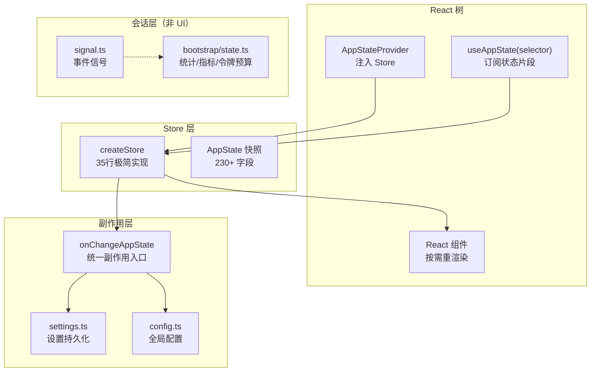
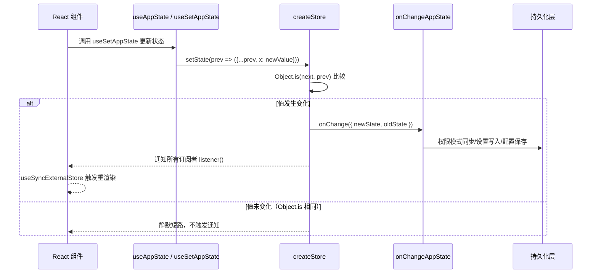

# 第11课：状态管理系统设计精要

---

## 课程信息

| 项目 | 内容 |
|------|------|
| **所属阶段** | 第四阶段：深度架构解析 |
| **建议时长** | 90～120 分钟 |
| **前置课程** | 第7课（工具系统）、第9课（Hook 系统） |
| **核心文件** | `src/state/store.ts`、`src/state/AppState.tsx`、`src/state/AppStateStore.ts`、`src/state/selectors.ts`、`src/state/onChangeAppState.ts` |

### 学习目标

1. **理解** `createStore` 的极简设计哲学——如何用 35 行代码支撑 230+ 字段的全局状态
2. **掌握** `useSyncExternalStore` 在 Claude Code 中的订阅模式，理解为什么不用 Zustand/Redux
3. **分析** `onChangeAppState` 副作用链的设计——如何将 8+ 个状态变更路径收敛到单一出口
4. **熟悉** `AppState` 的复杂嵌套结构与分层设计思想（UI 状态 vs 会话级状态）
5. **学会** 状态选择器的最佳实践，理解 `Object.is` 比较机制如何影响渲染性能

---

## 核心概念

### 状态管理的三大关切

在 Claude Code 这类复杂 CLI 应用中，状态管理需要同时解决三个维度的问题：

| 维度 | 挑战 | Claude Code 的方案 |
|------|------|-------------------|
| **UI 响应性** | 组件如何高效订阅状态切片 | `useSyncExternalStore` + 选择器 |
| **副作用同步** | 状态变更如何触发持久化/外部同步 | `onChangeAppState` 统一回调 |
| **状态隔离** | UI 状态 vs 会话级状态如何分离 | `AppState` vs `bootstrap/state.ts` |

### 关键术语辨析

- **AppState**：全局 UI 状态快照，存储在 `createStore` 创建的 Store 中，React 组件通过 `useSyncExternalStore` 订阅
- **Store**：状态容器抽象，提供 `getState`/`setState`/`subscribe` 三件套
- **Selector（选择器）**：从全量状态中提取所需片段的纯函数，`useAppState(s => s.verbose)` 中的箭头函数就是选择器
- **onChangeAppState**：Store 的 `onChange` 回调，在每次状态变更后执行副作用（持久化、外部同步等）
- **bootstrap/state.ts**：会话级非 UI 状态（如统计、指标、令牌预算），不在 React 树中，独立于 AppState



---

## 架构设计与设计思想

### 核心架构图



### 设计思想：为什么不用成熟状态库？

**问题**：既然 Zustand、Redux Toolkit 这些库已经非常成熟，为什么 Claude Code 要手写一个 35 行的 `createStore`？

**答案有三层**：

1. **捆绑体积控制**：Claude Code 作为 CLI 工具，启动速度极关键。自研 Store 零依赖，相比引入 Redux（~3KB gzip）节省了每次启动的解析开销。

2. **单一 `onChange` 钩子**：Zustand 等库的副作用通常通过 `subscribe` + `diff` 手动实现。Claude Code 的 `createStore` 内置 `onChange` 参数，状态变更时自动调用，让 `onChangeAppState` 这一副作用聚合点得以优雅实现。

3. **与 React 18 Concurrent Mode 的完美契合**：`useSyncExternalStore` 是 React 官方推荐的外部 Store 订阅 API，能正确处理 Concurrent Mode 下的撕裂（tearing）问题。自研 Store 暴露 `subscribe` 和 `getState`，天然匹配这一 API。

### 设计思想：AppState 为何有 230+ 字段？

这看起来是反模式，但背后有深思熟虑的原因：

**Claude Code 是单进程应用**，所有功能（MCP 客户端、插件、远程桥接、团队协作、推测执行、主题设置……）共享同一个 React 树。将状态拆分到多个 Store 会引入跨 Store 同步的复杂性，而集中管理则可以通过选择器做精确订阅。

**关键设计决策**：`AppState` 用 `DeepImmutable<{...}>` 包裹大部分字段，但 `tasks` 和 `agentNameRegistry` 被显式排除在外——因为它们包含函数类型（`TaskState` 中有回调），而 TypeScript 的深度只读无法正确处理函数。这一细节体现了类型系统使用的务实态度。

---

## 关键源码深度走查

### 代码片段 1：createStore — 35 行撑起整个状态系统

```typescript
// src/state/store.ts
type Listener = () => void
type OnChange<T> = (args: { newState: T; oldState: T }) => void

export type Store<T> = {
  getState: () => T
  setState: (updater: (prev: T) => T) => void
  subscribe: (listener: Listener) => () => void
}

export function createStore<T>(
  initialState: T,
  onChange?: OnChange<T>,   // ← 副作用钩子：状态变更时回调
): Store<T> {
  let state = initialState
  const listeners = new Set<Listener>()  // ← Set 而非数组：O(1) 增删

  return {
    getState: () => state,

    setState: (updater: (prev: T) => T) => {
      const prev = state
      const next = updater(prev)        // ← 函数式更新，避免直接修改
      if (Object.is(next, prev)) return // ← 引用相等则短路，避免无效通知
      state = next
      onChange?.({ newState: next, oldState: prev }) // ← 先触发副作用
      for (const listener of listeners) listener()   // ← 再通知订阅者
    },

    subscribe: (listener: Listener) => {
      listeners.add(listener)
      return () => listeners.delete(listener)  // ← 返回取消订阅函数
    },
  }
}
```

**逐行解析**：

| 行 | 关键点 | 设计意图 |
|----|--------|---------|
| `new Set<Listener>()` | 用 Set 存储监听者 | O(1) 增删，避免数组 indexOf 遍历 |
| `updater: (prev: T) => T` | 函数式更新 | 确保更新基于最新状态，避免闭包陈旧值 |
| `Object.is(next, prev)` | 引用相等检查 | 对象引用未变则跳过通知，防止无限循环 |
| `onChange?.({...})` | 先回调副作用 | 副作用（持久化）优先于 UI 通知，保证一致性 |
| `return () => listeners.delete(listener)` | 返回取消订阅 | 符合 React `useEffect` 清理函数约定 |

**设计模式**：**观察者模式（Observer Pattern）** + **函数式更新**。

> 💡 **设计点评 — 35 行代码撑起整个状态系统**
>
> **好在哪里**：`createStore` 的极简设计（Set 存监听者、函数式更新、Object.is 短路、先触发副作用再通知订阅者）就像一个精密小弹簧——虽然小，但每个细节都有道理。用 Set 而非数组存监听者是 O(1) 增删；`onChange` 先于 `listener()` 执行是保证持久化早于 UI 更新的关键。
>
> **如果不这样做**：用数组存监听者，删除时要 O(n) 查找；如果先通知 UI 再持久化，用户可能在持久化失败前就看到了"已保存"的界面，造成数据不一致。

---

### 代码片段 2：useSyncExternalStore 订阅机制

```typescript
// src/state/AppState.tsx（源码注释还原版）
export function useAppState<T>(selector: (state: AppState) => T): T {
  const store = useAppStore()

  const get = () => {
    const state = store.getState()
    const selected = selector(state)

    // 开发模式保护：禁止返回整个 state 对象
    if ("ant" === 'ant' && state === selected) {
      throw new Error(
        `Your selector returned the original state, which is not allowed.`
      )
    }
    return selected
  }

  // useSyncExternalStore(subscribe, getSnapshot, getServerSnapshot)
  // React 18 官方外部 Store 订阅 API
  return useSyncExternalStore(store.subscribe, get, get)
}
```

**为什么必须用 `useSyncExternalStore` 而不是 `useEffect` + `useState`？**

```
useEffect + useState 方案（有问题）:
  Render phase → useState(selector(store.getState()))
  ↓
  Store 变更 → useEffect 监听 → setState
  ↓
  问题：React Concurrent Mode 下，render 和 effect 之间
       store 可能被更新，导致渲染结果与 store 不一致（撕裂）

useSyncExternalStore 方案（正确）:
  React 在同一个渲染阶段多次调用 getSnapshot
  如果值不一致，强制同步渲染（跳过 Concurrent 优化）
  保证任何时刻组件看到的都是一致的 store 快照
```

**关键约束**（源码注释直接体现）：
```typescript
// DO NOT return new objects from the selector -- Object.is will always see
// them as changed. Instead, select an existing sub-object reference:
// const { text, promptId } = useAppState(s => s.promptSuggestion) // good
// const obj = useAppState(s => ({ text: s.text })) // BAD! Always new object
```

> 💡 **设计点评 — useSyncExternalStore 避免 Concurrent Mode 撕裂**
>
> **好在哪里**：`useSyncExternalStore` 是 React 官方为外部 Store 提供的订阅 API，专门解决 Concurrent Mode 下的"撕裂"问题（render 和 effect 之间 store 被更新，导致渲染结果与 store 不一致）。禁止返回新对象的约束（`// DO NOT return new objects`）是必要的工程纪律——对象引用每次都变，`Object.is` 就认为"值改变了"，组件无限重渲染。
>
> **如果不这样做**：用 `useEffect + useState` 订阅 store，在 React Concurrent Mode 下会出现组件看到"过时的状态快照"的 bug，且这类 bug 很难复现和调试。

---

### 代码片段 3：AppState 结构——复杂嵌套的设计哲学

```typescript
// src/state/AppStateStore.ts（精简版，突出设计结构）
export type AppState = DeepImmutable<{
  // 基础 UI 状态
  settings: SettingsJson
  verbose: boolean
  mainLoopModel: ModelSetting

  // 视图状态
  expandedView: 'none' | 'tasks' | 'teammates'
  footerSelection: FooterItem | null

  // 权限与工具
  toolPermissionContext: ToolPermissionContext

  // 远程桥接（replBridge 前缀的字段集中管理）
  replBridgeEnabled: boolean
  replBridgeConnected: boolean
  replBridgeSessionUrl: string | undefined
  // ... 8个 replBridge 相关字段

  // 功能开关
  thinkingEnabled: boolean | undefined
  fastMode: boolean
  effortValue: EffortValue
}> & {
  // ↑ DeepImmutable 包裹的部分

  // ↓ 显式排除 DeepImmutable 的部分（含函数类型）
  tasks: { [taskId: string]: TaskState }
  agentNameRegistry: Map<string, AgentId>

  // 复杂嵌套对象（也排除在外）
  mcp: {
    clients: MCPServerConnection[]
    tools: Tool[]
    commands: Command[]
    pluginReconnectKey: number  // ← 巧妙设计：版本键触发 effects 重跑
  }
  plugins: {
    enabled: LoadedPlugin[]
    errors: PluginError[]
    needsRefresh: boolean  // ← 脏标记模式
  }
  teamContext?: { /* 团队协作相关 */ }
}
```

**结构设计亮点**：

1. **前缀分组**：`replBridge*` 前缀的 8 个字段形成逻辑组，虽然没有嵌套，但命名清晰。这是一个权衡——嵌套对象在 `setState` 时需要额外展开，前缀分组更新更简洁。

2. **版本键模式**：`mcp.pluginReconnectKey: number` 不存储实际数据，只是一个递增版本号。组件将其作为 `useEffect` 依赖，当值变化时 effects 自动重跑。这避免了显式触发重新加载的复杂逻辑。

3. **脏标记模式**：`plugins.needsRefresh: boolean` 表示"磁盘状态已变更，需要刷新"。交互模式下用户手动触发 `/reload-plugins`，无头模式下自动消费。将"通知"和"执行"解耦。

> 💡 **设计点评 — AppState 的三个精妙细节**
>
> **好在哪里**：前缀分组（`replBridge*` 8个字段）比嵌套对象更新更简洁；版本键（`pluginReconnectKey`）让"触发重连"这个命令式操作以声明式方式表达——组件不需要暴露 `reload()` 方法，只需订阅版本键变化；`IDLE_SPECULATION_STATE` 常量复用同一引用，避免每次重置都创建新对象（新对象让 `Object.is` 误判为"状态变化"，触发无效重渲染）。
>
> **如果不这样做**：版本键如果用函数调用代替（`triggerReconnect()`），就需要在状态外维护命令通道，增加复杂性；每次 `{status: 'idle'}` 都新建对象，Speculation 完成时的状态重置会触发一次不必要的重渲染。

---

### 代码片段 4：onChangeAppState — 副作用的统一出口

```typescript
// src/state/onChangeAppState.ts（精简版）
export function onChangeAppState({
  newState,
  oldState,
}: {
  newState: AppState
  oldState: AppState
}) {
  // ① 权限模式同步——8+ 个变更路径的统一出口
  const prevMode = oldState.toolPermissionContext.mode
  const newMode = newState.toolPermissionContext.mode
  if (prevMode !== newMode) {
    const prevExternal = toExternalPermissionMode(prevMode)
    const newExternal = toExternalPermissionMode(newMode)
    if (prevExternal !== newExternal) {
      notifySessionMetadataChanged({
        permission_mode: newExternal,
        is_ultraplan_mode: isUltraplan,
      })
    }
    notifyPermissionModeChanged(newMode)  // SDK 状态流
  }

  // ② 主循环模型持久化
  if (newState.mainLoopModel !== oldState.mainLoopModel) {
    if (newState.mainLoopModel === null) {
      updateSettingsForSource('userSettings', { model: undefined })
    } else {
      updateSettingsForSource('userSettings', { model: newState.mainLoopModel })
    }
  }

  // ③ 视图偏好持久化（expandedView → 全局配置）
  // ④ 详细日志开关持久化（verbose → 全局配置）
  // ⑤ 面板可见性持久化（tungstenPanelVisible → 全局配置）

  // ⑥ 设置变更后的认证缓存清理
  if (newState.settings !== oldState.settings) {
    clearApiKeyHelperCache()
    clearAwsCredentialsCache()
    clearGcpCredentialsCache()
    applyConfigEnvironmentVariables(newState.settings)
  }
}
```

**这段代码解决了一个真实存在的 Bug**（源码注释详细描述）：

> *Prior to this block, mode changes were relayed to CCR by only 2 of 8+ mutation paths: a bespoke setAppState wrapper in print.ts and a manual notify in the set_permission_mode handler. Every other path — Shift+Tab cycling, ExitPlanModePermissionRequest dialog options, the /plan slash command, rewind, the REPL bridge's onSetPermissionMode — mutated AppState without telling CCR.*

**设计意义**：这是一个典型的"将散乱副作用收敛到单一入口"的重构案例。原来 8+ 个变更路径各自为政，现在通过 `onChange` 钩子，任何 `setState` 调用都会自动触发同步，**调用方无需任何改动**。

> 💡 **设计点评 — 副作用收归单口的威力**
>
> **好在哪里**：`onChangeAppState` 就像公司里的"行政总台"——不管谁修改了权限模式（8+ 条代码路径），总台都会自动同步到所有相关系统（SDK、外部监控）。原来每条路径自己处理同步，就像每个部门各自给税务局报税，遗漏是大概率的。
>
> **如果不这样做**：就像源码注释描述的真实 bug——8+ 条权限变更路径中只有 2 条通知了 CCR，其他 6+ 条静默丢失，导致多代理场景下权限不同步的 bug 极难发现。

---

### 代码片段 5：状态选择器设计

```typescript
// src/state/selectors.ts
/**
 * Selectors for deriving computed state from AppState.
 * Keep selectors pure and simple - just data extraction, no side effects.
 */

export function getViewedTeammateTask(
  // ← 使用 Pick 类型：只要求传入所需字段，便于测试与复用
  appState: Pick<AppState, 'viewingAgentTaskId' | 'tasks'>,
): InProcessTeammateTaskState | undefined {
  const { viewingAgentTaskId, tasks } = appState

  if (!viewingAgentTaskId) return undefined

  const task = tasks[viewingAgentTaskId]
  if (!task) return undefined

  // 类型守卫确保返回正确类型
  if (!isInProcessTeammateTask(task)) return undefined

  return task  // ← 返回现有对象引用，Object.is 稳定
}

// 判别联合类型（Discriminated Union）：类型安全的输入路由
export type ActiveAgentForInput =
  | { type: 'leader' }
  | { type: 'viewed'; task: InProcessTeammateTaskState }
  | { type: 'named_agent'; task: LocalAgentTaskState }

export function getActiveAgentForInput(appState: AppState): ActiveAgentForInput {
  const viewedTask = getViewedTeammateTask(appState)
  if (viewedTask) return { type: 'viewed', task: viewedTask }

  const { viewingAgentTaskId, tasks } = appState
  if (viewingAgentTaskId) {
    const task = tasks[viewingAgentTaskId]
    if (task?.type === 'local_agent') {
      return { type: 'named_agent', task }
    }
  }

  return { type: 'leader' }
}
```

**选择器的两个关键约束**（注释明确规定）：
1. **纯函数**：不产生副作用
2. **返回现有引用**：不创建新对象，确保 `Object.is` 比较结果稳定

> 💡 **设计点评 — Pick 类型约束的三重价值**
>
> **好在哪里**：`appState: Pick<AppState, 'viewingAgentTaskId' | 'tasks'>` 只声明所需字段而非整个 AppState，既是文档（函数依赖一眼看清），也方便测试（只需提供2个字段），还防止滥用（函数无法意外访问未声明字段）。就像向同事借书时只说"借一本红色的书"而不是"给我钥匙"——权限最小化。
>
> **如果不这样做**：参数类型为完整 AppState，单元测试需要构造 230+ 字段的对象，测试成本极高，实际上没人会写测试，选择器就成了"无法测试的黑盒"。

---

### 代码片段 6：多源设置合并——层叠优先级系统

AppState 中的 `settings` 字段并非来自单一文件，而是多个来源深度合并的结果。

```typescript
// src/utils/settings/constants.ts — 优先级从低到高
export const SETTING_SOURCES = [
  'userSettings',    // 用户全局配置（~/.claude/settings.json）
  'projectSettings', // 项目共享配置（.claude/settings.json）
  'localSettings',   // 本地覆盖（.claude/settings.local.json，已 gitignore）
  'flagSettings',    // --settings CLI 标志
  'policySettings',  // 企业管理策略（最高优先级）
] as const
```

**policySettings 的特殊处理——"首源胜"（First Source Wins）**：

```typescript
// src/utils/settings/settings.ts — loadSettingsFromDisk 节选
for (const source of getEnabledSettingSources()) {
  if (source === 'policySettings') {
    let policySettings: SettingsJson | null = null

    // ① 远程 API 托管设置（最高优先级）
    const remoteSettings = getRemoteManagedSettingsSyncFromCache()
    if (remoteSettings && Object.keys(remoteSettings).length > 0) {
      const result = SettingsSchema().safeParse(remoteSettings)
      if (result.success) policySettings = result.data
    }

    // ② MDM（HKLM / macOS plist）— 管理员写入，用户无法修改
    if (!policySettings) {
      const mdmResult = getMdmSettings()
      if (Object.keys(mdmResult.settings).length > 0) {
        policySettings = mdmResult.settings
      }
    }

    // ③ managed-settings.json（文件系统，需要管理员权限）
    if (!policySettings) {
      const { settings } = loadManagedFileSettings()
      if (settings) policySettings = settings
    }

    // ④ HKCU（用户可写，优先级最低）
    if (!policySettings) {
      const hkcu = getHkcuSettings()
      if (Object.keys(hkcu.settings).length > 0) {
        policySettings = hkcu.settings
      }
    }

    // 将最高优先级的策略源合并进来
    if (policySettings) {
      mergedSettings = mergeWith(mergedSettings, policySettings, settingsMergeCustomizer)
    }
  }
}
```

**合并规则——`settingsMergeCustomizer`**：

```typescript
// 自定义合并策略
function settingsMergeCustomizer(objValue, srcValue, key, object) {
  // 数组：直接替换（不是追加）——调用方负责计算最终期望的数组状态
  if (Array.isArray(srcValue)) return srcValue

  // undefined：视为"删除"语义，从对象中移除键
  if (srcValue === undefined && object && typeof key === 'string') {
    delete object[key]
    return undefined
  }

  // 其他类型：委托给 lodash 默认深度合并
  return undefined
}
```

**设置变更的响应链**：

```
文件系统变更（inotify/FSEvents）
    ↓
useSettingsChange Hook 检测到变更
    ↓
applySettingsChange(source, store.setState)
    ↓ 重新从磁盘加载并合并所有 source
    ↓ 同步权限规则（syncPermissionRulesFromDisk）
    ↓ 同步 effortValue（避免 CLI 标志被覆盖）
    ↓
store.setState({settings: newSettings, toolPermissionContext: newContext})
    ↓
onChangeAppState → 清理 auth 缓存（clearApiKeyHelperCache）
                 → 重新应用环境变量（applyConfigEnvironmentVariables）
```

**设计亮点**：`applySettingsChange` 用**条件传播**避免 CLI 标志被配置文件覆盖：
```typescript
// 只有当磁盘上的 effortLevel 确实改变，且新值不为 undefined，才传播
...(effortChanged && newEffort !== undefined
  ? { effortValue: newEffort }
  : {})
// 说明：写入 undefined 时（/effort max for non-ants），保留 CLI --effort 设置
```

> 💡 **设计点评 — 层叠优先级合并的企业级设计**
>
> **好在哪里**：六层优先级（pluginSettings → ... → policySettings）加上 `undefined` 删除语义和数组完全替换策略，让企业通过 MDM 锁定的设置无法被用户配置文件覆盖，同时用户的个人配置又高于项目共享配置。就像公司规章（policySettings）> 部门规定（projectSettings）> 个人习惯（userSettings）的现实层级。`applySettingsChange` 的条件传播防止 CLI 标志被热重载覆盖，是"用户明确指定 > 配置文件"原则的体现。
>
> **如果不这样做**：用户用 `--effort max` 启动后，一旦有其他设置变更触发热重载，`effortValue` 会被重置回配置文件中的值，CLI 标志形同虚设。

---

### 代码片段 7：AppState 深度特性——SpeculationState 与投机执行

AppState 中的 `speculation` 字段揭示了一个高级功能——**投机执行（Speculative Execution）**：

```typescript
// src/state/AppStateStore.ts — SpeculationState 类型
export type SpeculationState =
  | { status: 'idle' }
  | {
      status: 'active'
      id: string
      abort: () => void        // ← 函数类型，无法被 DeepImmutable 包裹
      startTime: number
      messagesRef: { current: Message[] }    // ← 可变 ref：避免每条消息都展开数组
      writtenPathsRef: { current: Set<string> } // ← 可变 ref：追踪已写入文件
      boundary: CompletionBoundary | null
      suggestionLength: number
      toolUseCount: number
      isPipelined: boolean
      contextRef: { current: REPLHookContext }
      pipelinedSuggestion?: {
        text: string
        promptId: 'user_intent' | 'stated_intent'
        generationRequestId: string | null
      } | null
    }
```

**为什么用 `messagesRef: { current: Message[] }` 而不是直接 `messages: Message[]`**？

这是一个性能优化设计：如果 `messages` 是 AppState 的直接字段，每次推送一条消息都需要 `setState(prev => ({...prev, speculation: {...prev.speculation, messages: [...prev.speculation.messages, newMsg]}}))`。

用 `messagesRef` 可以直接 `messagesRef.current.push(newMsg)` 修改，**零状态变更开销**。投机完成后才一次性读取 `messagesRef.current` 结果，避免了每条消息触发一次重渲染。

这是 AppState 中**罕见的"受控可变性"**——在不可变状态树中，有意地引入一个可变 ref 来优化高频写入场景。

```typescript
export const IDLE_SPECULATION_STATE: SpeculationState = { status: 'idle' }
// ↑ 常量复用：idle 状态共享同一引用
//   避免每次重置时 Object.is 检查失败（新建 {} !== 旧建 {}）
```

> 💡 **设计点评 — 受控可变性的工程边界**
>
> **好在哪里**：`messagesRef: { current: Message[] }` 在大型不可变状态树中引入了一个"可变口袋"，让投机执行期间的高频消息写入不触发 setState（避免 N 次消息 = N 次 O(N) 数组展开 = O(N²) 内存操作）。`IDLE_SPECULATION_STATE` 常量复用同一引用，让状态重置不产生新对象，Object.is 不会误判为"值变化"。
>
> **如果不这样做**：每条流式消息都触发一次完整的状态展开和 UI 重渲染，在 100+ 条消息的长响应中，渲染性能会严重下降，甚至导致 UI 卡顿。

---

## Harness Engineering

### Harness Engineering 视角

Claude Code 的状态管理系统体现了"驾驭 AI 状态"的核心思想——把复杂的多路状态变更收拢到可预测的管道中：

**约束**：
- `AppStateProvider` 的防嵌套保护（双层哨兵 Context）确保全局状态只有一个来源
- 选择器约束（禁止返回新对象）防止开发者无意中造成无限重渲染
- `DeepImmutable` 包裹大部分字段，让意外的状态突变在编译时被发现

**增强**：
- 35 行的 `createStore` 零依赖，相比引入 Redux/Zustand 节省启动解析开销
- `useSyncExternalStore` 正确处理 React 18 Concurrent Mode 的撕裂问题
- `policySettings` 层允许企业通过 MDM 锁定 AI 的配置，这是企业级 AI 应用的必要控制面

**编排**：
- `onChangeAppState` 将 8+ 条权限变更路径的副作用收归单一出口，任何调用方都自动获得正确的同步行为
- `bootstrap/state.ts` 的会话级状态（统计、令牌预算）独立于 React 树，防止 AI 内部统计数据污染 UI 层
- `messagesRef` 的受控可变性在 AI 流式输出期间避免 O(N²) 的状态展开操作

### 对大模型应用的启发

1. **AI 配置必须支持企业级锁定**：任何面向企业的 AI 应用都应该设计配置优先级体系，允许 IT 管理员通过 MDM 或策略文件覆盖用户配置——这是企业采购的基本要求。

2. **副作用要收归单口**：AI 应用的状态变更路径（用户操作、API 响应、权限变更、模型切换）比普通应用复杂得多。把副作用聚合到 `onChange` 这样的单一入口，可以防止"8+ 条路径只有 2 条通知了外部系统"这类难以发现的 bug。

3. **流式输出需要特殊的状态设计**：LLM 的流式响应是高频写入场景，每条 token 都触发一次 `setState` 会导致 O(N²) 性能问题。应使用 mutable ref 缓冲中间状态，只在完成时一次性更新 UI 状态。

4. **状态隔离 UI 层与 AI 运行时层**：统计、成本、令牌预算等 AI 运行时数据不应与 UI 状态混在同一个 Store。分层可以让 AI 运行时在无头模式（无 React 树）下独立工作。

5. **版本键是命令式操作的声明式代理**：需要触发"重新连接 MCP"、"重载插件"等命令式操作时，在状态中维护一个版本键比暴露命令方法更符合 React 的数据流思想，也更容易调试（直接观察状态变化）。

---

## 思考题与进阶方向

### 思考题

**题目 1**：如果一个组件订阅了 `s => s.tasks`，而 `tasks` 对象每次有任何子任务更新就会创建新引用，这个组件会频繁重渲染。如何设计选择器来避免这个问题？

<details>
<summary>💡 参考答案</summary>

可以选择具体的子任务而非整个 tasks 对象：`useAppState(s => s.tasks[taskId])`。如果组件确实需要所有任务，可以用 `useAppState(s => s.tasks)` 配合 `React.memo` 和深度比较，但这会有性能开销。更好的做法是将"订阅任务列表"和"展示单个任务"分离成不同组件，父组件只订阅 taskIds 数组，子组件分别订阅各自的 `tasks[id]`。这样单个任务更新只触发对应子组件重渲染，而不是整个列表重渲染。

</details>

**题目 2**：`onChangeAppState` 是同步执行的，这意味着每次 `setState` 都会同步写文件（设置持久化）。这在高频状态变更场景下会有性能问题吗？Claude Code 是如何处理的？

<details>
<summary>💡 参考答案</summary>

`updateSettingsForSource` 内部有防抖/写透缓存机制——实际的磁盘写入不是立即发生的，而是通过 `saveGlobalConfig` 维护一个内存缓存，多次快速更新会合并后再写入磁盘（类似写缓冲）。`onChangeAppState` 只是同步更新内存中的状态，磁盘 I/O 是异步的、合并的。这是"写透缓存（write-through cache）+ 防抖写入"模式的结合，既保证内存状态立即一致，又避免了磁盘 I/O 的高频触发。

</details>

**题目 3**：`bootstrap/state.ts` 中的会话级状态（统计、指标、令牌预算）为什么不放入 `AppState`？如果放进去，会带来什么问题？

<details>
<summary>💡 参考答案</summary>

会话级状态（统计、令牌预算）需要在无头模式（没有 React 树）下工作，放入 AppState 则它们必须依赖 React。另外，这些数据更新极频繁（每条 AI 消息都更新令牌计数），放入 AppState 会导致每次 token 累计都触发 React 重渲染。`bootstrap/state.ts` 使用 `signal.ts` 的事件通信机制，只在 UI 需要时推送快照，而不是每次更新都通知 React，这是更高效的设计。

</details>

**题目 4**：`AppState` 用 `DeepImmutable` 包裹了大部分字段，但 `tasks` 和 `mcp` 却没有。这个设计决策带来了什么便利，又带来了什么风险？

<details>
<summary>💡 参考答案</summary>

**便利**：`tasks` 中的 `TaskState` 包含回调函数（TypeScript 的深度只读无法正确处理函数类型），`mcp` 包含 `MCPServerConnection`（含方法）；强加 DeepImmutable 会导致类型错误。排除这些字段让代码能正常编译和运行。**风险**：排除后，外部代码可以直接修改 `tasks[id]` 的属性而不通过 `setState`，这种修改不会触发 `onChange` 回调，也不会通知 React 订阅者，可能导致 UI 与状态不一致。需要靠团队约定（只通过 `setState` 更新）来维护正确性。

</details>

### 进阶方向

- **阅读** `src/utils/settings/settings.ts`，理解多源设置合并策略（用户设置、项目设置、本地覆盖的优先级）
- **追踪** `src/utils/config.ts` 中的 `saveGlobalConfig`，理解写透缓存（write-through cache）和文件系统监听机制
- **研究** `src/bootstrap/state.ts`，理解会话级状态如何通过 `signal.ts` 进行事件通信而非共享 AppState
- **对比** 本课的状态管理方案与 Zustand 的实现，分析两者在 `useSyncExternalStore` 使用上的异同

---

## 小结

Claude Code 的状态管理系统体现了"**够用即可，不过度抽象**"的工程哲学：

- **Store 层**极简（35行），只做必要的事（存储、更新、通知）
- **AppState 层**复杂，但有明确的分层逻辑（DeepImmutable 边界、前缀分组、排除函数类型）
- **副作用层**集中（onChangeAppState），将散乱的同步逻辑收敛到单一出口
- **Hook 层**精准，利用 React 18 的 `useSyncExternalStore` 实现精确订阅

理解这套系统，是深入理解 Claude Code 架构的关键基础。
