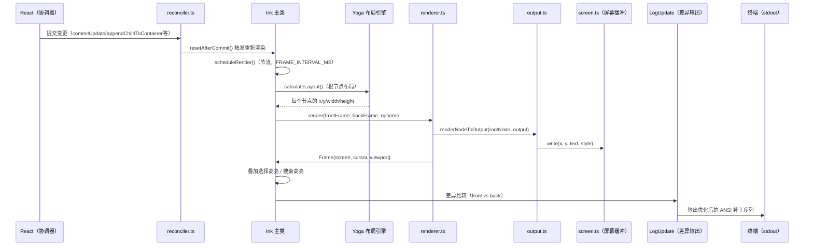
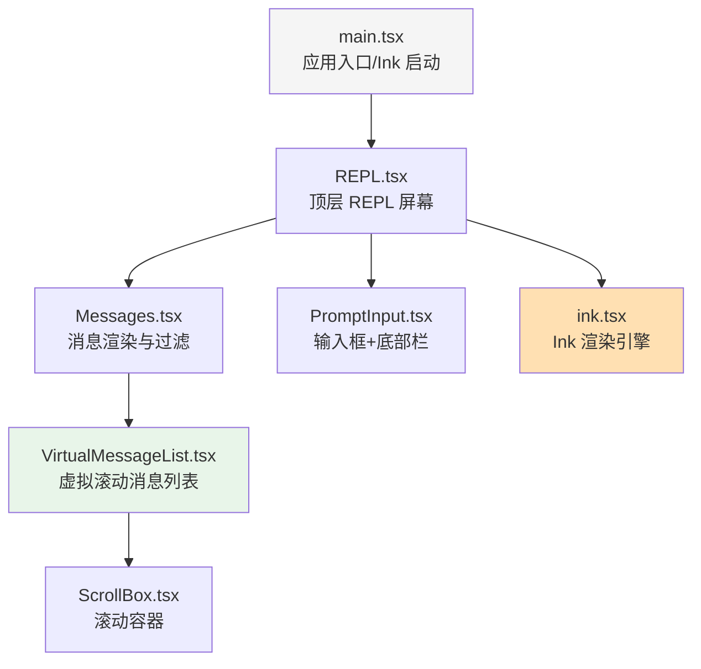

# 第12课：React + Ink 终端 UI 架构

---

## 课程信息

| 项目 | 内容 |
|------|------|
| **所属阶段** | 第四阶段：深度架构解析 |
| **建议时长** | 120～150 分钟 |
| **前置课程** | 第11课（状态管理系统）、第3课（REPL 交互模型） |
| **核心文件** | `src/ink/ink.tsx`、`src/ink/reconciler.ts`、`src/ink/renderer.ts`、`src/ink/screen.ts`、`src/screens/REPL.tsx`、`src/components/VirtualMessageList.tsx` |

### 学习目标

1. **理解** React Reconciler 如何在终端环境中工作——Ink 如何将 React 组件树转换为字符缓冲区
2. **掌握** Ink 渲染管道的完整流程：React 提交 → Yoga 布局 → DOM 渲染 → 屏幕缓冲 → 差异比较 → 终端输出
3. **分析** 双缓冲（double-buffering）、损坏区域（damage region）、增量渲染等终端 UI 特有的性能优化策略
4. **熟悉** REPL 界面的组件层次结构与虚拟滚动的实现原理
5. **理解** 终端特有约束（光标管理、Alt 屏幕、宽字符、ANSI 序列）对架构设计的影响

---

## 核心概念

### Web 浏览器 vs 终端渲染的根本差异

```
Web 浏览器渲染（React DOM）         终端渲染（React + Ink）
──────────────────────────          ──────────────────────────
像素级坐标系                         字符网格坐标系（行×列）
GPU 加速合成                         ANSI 转义序列驱动
CSS 盒模型 + Flexbox（浏览器原生）   Yoga（Flexbox 的 C++ 实现，WASM/native）
DOM = HTML 节点树                    DOM = 自定义 DOMElement 节点树
浏览器处理脏区域                     Ink 手动追踪 damage 区域
滚动由浏览器实现                     滚动需自行实现（DECSTBM 或重绘）
```

### 关键术语辨析

- **React Reconciler（协调器）**：React 的核心算法，负责比较虚拟 DOM 差异并提交变更。Ink 通过 `react-reconciler` 包自定义了宿主环境（Host Environment），将 `<Box>` 和 `<Text>` 映射到自定义的 `DOMElement` 而非 HTML 元素。
- **Yoga**：Facebook 开发的 Flexbox 布局引擎（C++/WASM），用于计算每个 DOM 节点的精确尺寸和位置。
- **Screen Buffer（屏幕缓冲）**：字符网格的内存表示，每个单元格存储字符、样式 ID、超链接 ID 等。Ink 使用双缓冲（front/back）实现高效差异比较。
- **LogUpdate**：终端差异输出工具，对比前后两帧，只输出变化的行，避免整屏重刷。
- **Damage Region（损坏区域）**：上一帧到本帧之间可能发生变化的区域。只对损坏区域进行差异比较，避免全屏扫描。
- **ANSI 转义序列**：终端控制码，用于移动光标、设置颜色、清除行等操作（如 `\x1b[2J` 清屏）。

---

## 架构设计与设计思想

### Ink 渲染管道总览



### 设计思想：为什么需要自定义 Reconciler？

React 的核心是协调算法（Fiber），但它将"如何操作 DOM"抽象为**宿主配置（Host Config）**。`react-dom` 是 Web 宿主，`react-native` 是移动端宿主，Ink 则是**终端宿主**。

通过自定义 Reconciler，Ink 将 React 的声明式组件模型带入终端，使开发者可以像写 Web 组件一样写 CLI 界面：

```tsx
// 开发者写的组件（看起来像 React Web）
function MyComponent() {
  return (
    <Box flexDirection="column" borderStyle="round">
      <Text color="green">Hello Terminal!</Text>
      <Text dimColor>Powered by Ink</Text>
    </Box>
  )
}
```

```
// 最终输出到终端（字符艺术 + ANSI 颜色）
╭──────────────────╮
│ Hello Terminal!  │
│ Powered by Ink   │
╰──────────────────╯
```

### 设计思想：双缓冲的意义

```
front frame（前帧）= 上一次实际写入终端的内容
back frame（后帧）= 本次新渲染的内容

差异比较：
  对每一行，比较 front 和 back 的单元格
  只输出不同的行（避免全屏重刷）

Damage Region 优化：
  只对"可能变化"的区域做精确比较
  未标记为 dirty 的区域直接从 front frame 复用（blit 操作）
```

### REPL 界面的组件层次



---

## 关键源码深度走查

### 代码片段 1：React Reconciler 的宿主配置

```typescript
// src/ink/reconciler.ts（精简展示核心宿主方法）

// react-reconciler 要求实现的宿主环境接口
const reconcilerConfig = {
  // 1. 创建实例：<Box> 创建 DOMElement，<Text> 创建文本节点
  createInstance(type, props, rootContainer, hostContext, internalHandle) {
    const node = createNode(type)  // 创建自定义 DOMElement
    for (const [key, value] of Object.entries(props)) {
      applyProp(node, key, value)  // 应用 style、事件处理等属性
    }
    return node
  },

  // 2. 创建文本节点
  createTextInstance(text) {
    return createTextNode(text)
  },

  // 3. 提交阶段：属性更新（React diff 后调用）
  commitUpdate(node, updatePayload, type, oldProps, newProps) {
    for (const [key, value] of Object.entries(updatePayload)) {
      applyProp(node, key, value)  // 增量更新属性
    }
  },

  // 4. 提交阶段：将子节点追加到容器
  appendChildToContainer(container, child) {
    appendChildNode(container, child)
    markDirty(child)  // 标记 Yoga 节点需要重新计算布局
  },

  // 5. 提交完成后触发渲染（核心钩子！）
  resetAfterCommit(container) {
    // 告知 Ink 主类：React 树已更新，需要重新渲染到终端
    container.isLayoutDirty = true
    // Ink 类内部会检查这个标志并调度 render
  }
}

// applyProp：将 React props 分发到不同处理器
function applyProp(node: DOMElement, key: string, value: unknown): void {
  if (key === 'children') return  // children 由 React 管理，不直接处理

  if (key === 'style') {
    setStyle(node, value as Styles)
    if (node.yogaNode) {
      applyStyles(node.yogaNode, value as Styles)  // 同步到 Yoga 节点
    }
    return
  }

  if (EVENT_HANDLER_PROPS.has(key)) {
    setEventHandler(node, key, value)  // 注册事件处理器
    return
  }

  setAttribute(node, key, value as DOMNodeAttribute)
}
```

**关键洞察**：`resetAfterCommit` 是 React 提交阶段完成后的钩子，Ink 在这里触发重新渲染。这意味着每次 React 状态更新都会导致 Ink 重新渲染，但通过**节流（throttle）**限制帧率，避免过于频繁的终端写入。

> 💡 **设计点评 — 自定义 Reconciler：用 React 的"插槽"接管终端**
>
> **好在哪里**：Ink 没有重写 React，而是把 React 变成了一个"语言框架"——把 `<Box>/<Text>` 的声明式写法原封不动地保留，只替换底层"输出目标"。就像同一套乐谱，可以交给交响乐团演奏，也可以交给电子合成器演奏，听起来风格不同，但写曲子的人不用改任何东西。`resetAfterCommit` 这个钩子就是"乐谱交接口"，React 弹完一个小节就交给 Ink 决定怎么输出。
>
> **如果不这样做**：要么自己实现一套 diff 算法（重复造轮子），要么放弃声明式模型改用命令式操作终端（代码量倍增，状态同步是噩梦）。

---

### 代码片段 2：Ink 主类的渲染循环

```typescript
// src/ink/ink.tsx（精简版，展示核心渲染逻辑）

export default class Ink {
  private frontFrame: Frame  // 上一帧（已写入终端）
  private backFrame: Frame   // 本帧（新渲染）
  private scheduleRender: () => void  // 节流后的渲染调度

  constructor(options: Options) {
    // 节流渲染：最小帧间隔 FRAME_INTERVAL_MS（约16ms，60fps）
    this.scheduleRender = throttle(
      () => this.onRender(),
      FRAME_INTERVAL_MS,
      { leading: false, trailing: true }  // 尾部节流：确保最后一次变更被渲染
    )

    // 创建 React FiberRoot（并发模式）
    this.container = reconciler.createContainer(
      this.rootNode,
      ConcurrentRoot,  // React 18 并发模式
      null,
      false,
      null,
      '',
      {},
      null,
    )
  }

  private onRender(): void {
    if (this.isUnmounted || this.isPaused) return

    // Step 1: 计算 Yoga 布局
    this.rootNode.yogaNode?.calculateLayout(
      this.terminalColumns,
      undefined,  // 高度由内容决定（非 alt-screen 模式）
      yoga.DIRECTION_LTR,
    )

    // Step 2: 渲染 DOM 树到屏幕缓冲（Back Buffer）
    const newFrame = this.renderer({
      frontFrame: this.frontFrame,  // 前帧用于 blit 优化
      backFrame: this.backFrame,
      isTTY: this.terminal.isTTY,
      terminalWidth: this.terminalColumns,
      terminalRows: this.terminalRows,
      altScreen: this.isAltScreen,
      prevFrameContaminated: this.prevFrameContaminated,
    })

    // Step 3: 叠加搜索高亮和选择高亮（在差异比较之前）
    if (this.searchHighlight) {
      applySearchHighlight(newFrame.screen, this.searchHighlight)
    }
    if (hasSelection(this.selectionState)) {
      applySelectionOverlay(newFrame.screen, this.selectionState, newFrame)
    }

    // Step 4: 差异比较 + 输出（LogUpdate）
    const patches = writeDiffToTerminal(
      this.frontFrame,
      newFrame,
      this.terminal,
      this.log,
    )

    // Step 5: 交换缓冲区
    this.frontFrame = newFrame
  }
}
```

**渲染节流策略分析**：

```
trailing: true 的意义：
  假设连续状态变更：update1 → update2 → update3（间隔 < 16ms）
  
  throttle(leading: false, trailing: true) 的行为：
  - leading: false → 第一次 update1 不立即渲染（等待后续聚合）
  - trailing: true → 最后一次 update3 之后渲染一帧
  
  结果：
  - update1、update2 被"吸收"（跳过）
  - update3 触发最终渲染
  
  适合 CLI 场景：用户不关心中间态，只关心最终结果
```

> 💡 **设计点评 — 尾部节流：只输出最终态**
>
> **好在哪里**：`trailing: true` 的节流策略就像快递员派件——一天内你下了 10 个订单，快递员不会送 10 次，而是攒到一起只送一次。对终端渲染来说，用户根本不需要看中间帧，最终状态才是有效信息。这个设计把"渲染噪音"降到最低。
>
> **如果不这样做**：每次 `setState` 都立即渲染，流式 AI 输出（每秒数十次 token）会把终端写入带宽打满，还可能出现可见的闪烁和渲染撕裂。

---

### 代码片段 3：Renderer — DOM 树到屏幕缓冲

```typescript
// src/ink/renderer.ts（核心逻辑）

export default function createRenderer(
  node: DOMElement,
  stylePool: StylePool,
): Renderer {
  // ← 关键优化：Output 对象跨帧复用，保留 charCache（字符缓存）
  let output: Output | undefined

  return options => {
    const { frontFrame, backFrame, terminalWidth, terminalRows } = options

    // 保护性检查：Yoga 布局无效时返回空帧
    const computedHeight = node.yogaNode?.getComputedHeight()
    const computedWidth = node.yogaNode?.getComputedWidth()
    if (!node.yogaNode || !Number.isFinite(computedHeight) || computedHeight < 0) {
      return emptyFrame(terminalWidth, terminalRows, stylePool, ...)
    }

    const width = Math.floor(computedWidth)
    // Alt-screen 模式下高度固定为终端行数（防止溢出导致布局混乱）
    const height = options.altScreen ? terminalRows : Math.floor(computedHeight)

    // 重置或创建 Output 对象
    if (output) {
      output.reset(backFrame.screen)  // 复用，只清空写入队列
    } else {
      output = new Output(backFrame.screen, frontFrame.screen, stylePool)
    }

    // 渲染 DOM 树到 Output（递归遍历节点）
    renderNodeToOutput(node, output, {
      offsetX: 0,
      offsetY: 0,
      clip: { x1: 0, y1: 0, x2: width, y2: height },
      transformers: [],
      skippedDueToOverflow: false,
    })

    // 消费滚动提示（用于 DECSTBM 快路径优化）
    const scrollHint = getScrollHint()
    resetScrollHint()

    return {
      screen: backFrame.screen,
      viewport: { width, height: terminalRows },
      cursor: { x: cursorX, y: cursorY, visible: cursorVisible },
      scrollHint,
    }
  }
}
```

**Output 复用的性能意义**：

```
Output 对象内部维护 charCache（字符→ANSI序列的缓存）
  
  帧1: "Hello World" → 计算 ANSI 序列 → 缓存
  帧2: "Hello World" 未变化 → 直接命中缓存，跳过计算
  
  对于大段不变的文本（如历史消息），缓存命中率极高
  避免了大量重复的字符串拼接和 ANSI 序列生成
```

> 💡 **设计点评 — Output 跨帧复用：用记忆换速度**
>
> **好在哪里**：Output 对象不随帧销毁，而是保留内部的 `charCache`，就像办公室里那本翻旧了的电话本——虽然每次你可以重新查名单，但保留老本更快。历史消息内容不变，ANSI 序列计算一次就永久复用，越用越快。
>
> **如果不这样做**：每帧都要重新把所有字符转换成 ANSI 序列，渲染 100 条历史消息等于做 100 次无用功，渲染延迟随消息数线性增长。

---

### 代码片段 4：屏幕缓冲的高效存储

```typescript
// src/ink/screen.ts（精简版展示核心数据结构）

// 每个单元格用 2 个 Int32 存储（64 位打包）
// Int32[0]: 高16位=字符索引, 低16位=样式ID
// Int32[1]: 高16位=超链接ID, 低16位=宽度标记(1=正常, 2=宽字符首格, 3=宽字符尾格)

export function createScreen(
  width: number,
  height: number,
  stylePool: StylePool,
  charPool?: CharPool,
  hyperlinkPool?: HyperlinkPool,
): Screen {
  const cellCount = width * height
  const cells = new Int32Array(cellCount * 2)  // 打包存储
  const cells64 = new BigInt64Array(cells.buffer)  // 64位视图，便于整行比较

  // 损坏区域：初始为空（无变化）
  const damage: Rectangle = { x1: 0, y1: 0, x2: 0, y2: 0 }

  return {
    width, height,
    cells, cells64,
    damage,
    charPool: charPool ?? new CharPool(),       // 字符字符串池化
    hyperlinkPool: hyperlinkPool ?? new HyperlinkPool(),  // 超链接 URL 池化
    stylePool,                                  // ANSI 样式序列池化
    noSelect: new Uint8Array(cellCount),        // 不可选区域标记
    softWrap: new Int32Array(height),           // 软换行标记
  }
}

// CharPool：字符串去重池
// 相同的字符串（如 " "、"│"）只存储一次，其他地方存 ID
class CharPool {
  private chars: string[] = ['']  // index 0 = 空字符
  private index = new Map<string, number>()

  intern(str: string): number {
    let id = this.index.get(str)
    if (id === undefined) {
      id = this.chars.length
      this.chars.push(str)
      this.index.set(str, id)
    }
    return id
  }

  get(id: number): string {
    return this.chars[id] ?? ''
  }
}
```

**数据结构设计亮点**：

| 技术 | 作用 | 好处 |
|------|------|------|
| `Int32Array` 打包存储 | 每格 8 字节（而非对象） | 内存连续，缓存友好 |
| `BigInt64Array` 视图 | 整格 64 位比较 | 一次操作比较全部元数据 |
| `CharPool` 字符串池化 | 相同字符共享 ID | 减少字符串内存和比较开销 |
| `StylePool` 样式池化 | ANSI 序列缓存 | 避免重复生成颜色序列 |
| Damage Region | 标记变化区域 | 只扫描可能变化的区域 |

> 💡 **设计点评 — TypedArray + 字符串池化：向内存要性能**
>
> **好在哪里**：用 `Int32Array` 存屏幕单元格，相比"每格一个对象"，内存布局是连续的——CPU 预取缓存时能一次捞一整行，而不是四处散乱地跳。`CharPool` 字符串池化更是把"每格存字符串"变成"每格存 ID"，重复字符（比如满屏的空格、边框字符）只在内存里存一份。这就是为什么 Ink 处理 200×50 的终端比你想象的快。
>
> **如果不这样做**：每格一个 JS 对象，GC 压力剧增；每格一个字符串，重复内容占用数倍内存，差异比较也变成字符串比较（慢），而不是整数比较（快）。

---

### 代码片段 5：虚拟消息列表（VirtualMessageList）

```typescript
// src/components/VirtualMessageList.tsx（架构要点）

function VirtualMessageList({ messages, scrollRef, ... }) {
  // useVirtualScroll：核心虚拟化 Hook
  const { range, topSpacer, bottomSpacer, updateHeights } = useVirtualScroll({
    itemCount: messages.length,
    getItemHeight: (index) => heightCache.current[index] ?? 0,  // 高度缓存
    scrollTop: scrollRef.current?.scrollTop ?? 0,
    viewportHeight: scrollRef.current?.viewportHeight ?? 0,
  })

  // 只渲染可视区域的消息（range.start 到 range.end）
  const visibleMessages = messages.slice(range.start, range.end)

  return (
    <Box flexDirection="column">
      {/* 顶部占位符：代替未渲染的上方消息 */}
      <Box height={topSpacer} />

      {visibleMessages.map((msg, idx) => (
        <MessageItem
          key={msg.id}
          message={msg}
          // 高度测量回调：渲染后更新高度缓存
          onHeightMeasured={(h) => {
            const realIdx = range.start + idx
            if (heightCache.current[realIdx] !== h) {
              heightCache.current[realIdx] = h
              updateHeights()  // 触发虚拟滚动重新计算
            }
          }}
        />
      ))}

      {/* 底部占位符：代替未渲染的下方消息 */}
      <Box height={bottomSpacer} />
    </Box>
  )
}
```

**虚拟滚动的性能意义**：

```
没有虚拟滚动（100条消息）：
  Yoga 布局计算 100 个消息节点
  screen.ts 写入所有 100 条消息的字符
  大量不可见内容参与渲染

有虚拟滚动（只渲染可视的 10 条）：
  Yoga 只计算 10 个消息节点 + 2 个占位符
  screen.ts 只写入可视区域
  性能提升 10x（消息越多效果越显著）
```

> 💡 **设计点评 — 虚拟滚动：终端里的"窗户"技巧**
>
> **好在哪里**：虚拟滚动就像火车窗户——窗外的风景无限长，但你只看得到窗口大小那一片。`VirtualMessageList` 只渲染可见区域的消息，顶部和底部用"占位 Box"撑开空间，让 Yoga 以为所有消息都在那里。从用户角度看完全无感，但 Yoga 和屏幕缓冲只处理了 10% 的数据量。
>
> **如果不这样做**：100 条消息全量渲染，Yoga 要计算 100 个节点的 flexbox 布局；300 条消息时帧率明显下降；随着对话越来越长，CLI 会越来越卡。

---

### 代码片段 6：设计系统组件库——Dialog 与 BaseTextInput

Claude Code 在 Ink 基础之上构建了完整的设计系统（`src/components/design-system/`），以下剖析两个核心组件的设计决策。

**Dialog 组件——键盘焦点协调**：

```typescript
// src/components/design-system/Dialog.tsx（源码还原版）

type DialogProps = {
  title: React.ReactNode
  subtitle?: React.ReactNode
  children: React.ReactNode
  onCancel: () => void
  color?: keyof Theme              // ← 主题感知：使用语义颜色令牌
  hideInputGuide?: boolean
  /**
   * 控制 Dialog 内置的取消键（Esc/n）和退出键（Ctrl+C/D）是否激活。
   * 当嵌入的文本输入框正在编辑时设为 false，让这些键到达输入框。
   * TextInput 有自己的 ctrl+c/d 处理器。默认为 true。
   */
  isCancelActive?: boolean
}

export function Dialog({ title, subtitle, children, onCancel, isCancelActive = true, ... }: DialogProps) {
  // 双重退出保护：第一次 Ctrl+C 显示"再按一次退出"提示
  const exitState = useExitOnCtrlCDWithKeybindings(undefined, undefined, isCancelActive)

  // 键位绑定到 "Confirmation" 上下文（优先级高于其他上下文）
  useKeybinding("confirm:no", onCancel, {
    context: "Confirmation",
    isActive: isCancelActive    // ← isCancelActive 为 false 时，键位让渡给子组件
  })

  return (
    <Pane>
      <Box flexDirection="column">
        <Text bold color={color}>{title}</Text>
        {subtitle && <Text dimColor>{subtitle}</Text>}
      </Box>
      {children}
      {/* 输入引导条：显示 Enter/Esc 键提示 */}
      {!hideInputGuide && (
        exitState.pending
          ? <Text>Press {exitState.keyName} again to exit</Text>
          : <Byline>
              <KeyboardShortcutHint shortcut="Enter" action="confirm" />
              <ConfigurableShortcutHint action="confirm:no" context="Confirmation" fallback="Esc" description="cancel" />
            </Byline>
      )}
    </Pane>
  )
}
```

**Dialog 的关键设计**：
- `isCancelActive` 控制键位让渡——当子组件（TextInput）需要 Esc 键时，Dialog 放弃对该键的响应
- `context: "Confirmation"` 绑定高优先级上下文，确保 Dialog 开启时 Esc 不会被其他处理器抢走
- 双重退出防护：防止用户意外按 Ctrl+C 退出整个应用

**BaseTextInput 组件——光标声明与粘贴处理**：

```typescript
// src/components/BaseTextInput.tsx（核心逻辑）

export function BaseTextInput({ inputState, terminalFocus, ... }: BaseTextInputComponentProps) {
  const { onInput, renderedValue, cursorLine, cursorColumn } = inputState

  // ① 光标声明（useDeclaredCursor）：向 Ink 宣告"我拥有光标"
  // Ink 统一管理光标位置，在渲染时将光标移动到正确位置
  const cursorRef = useDeclaredCursor({
    line: cursorLine,
    column: cursorColumn,
    active: props.focus && props.showCursor && terminalFocus
  })

  // ② 粘贴处理（usePasteHandler）：检测 bracketed paste 序列
  // 终端粘贴模式下，粘贴的文本会被 \x1b[200~ ... \x1b[201~ 括起来
  const { wrappedOnInput, isPasting } = usePasteHandler({
    onPaste: props.onPaste,          // 纯文本粘贴回调
    onInput: (input, key) => {
      if (isPasting && key.return) return  // 粘贴中忽略 Enter 键（避免意外提交）
      onInput(input, key)
    },
    onImagePaste: props.onImagePaste  // 图片粘贴（base64 捕获）
  })

  // ③ 渲染：renderedValue 是经过语法高亮处理的 ANSI 字符串
  return (
    <Box>
      <Ansi>{renderedValue}</Ansi>  {/* 输出预渲染的 ANSI 序列 */}
      {/* 光标可视化由 useDeclaredCursor 统一处理 */}
    </Box>
  )
}
```

**BaseTextInput 的关键设计**：

| 机制 | 实现 | 目的 |
|------|------|------|
| `useDeclaredCursor` | 向 Ink 声明光标位置而非直接操作 | 避免多个组件竞争光标控制权 |
| `usePasteHandler` | 检测 bracketed paste 序列 | 正确处理多行粘贴（不误触发 Enter） |
| `renderedValue` | 预计算的 ANSI 字符串 | 高亮、Shimmer 效果与输入逻辑解耦 |
| `terminalFocus` | 外部注入的焦点状态 | 与 Ink 的全局 TTY 焦点状态同步 |

**组件库的分层策略**：
```
BaseTextInput（基础行为：输入/光标/粘贴）
    ↑ extends
TextInput（单行输入，支持历史记录）
    ↑ extends
VimTextInput（Vim 模式：Normal/Insert/Visual）
    ↑ combines with
PromptInput（完整的提示框，含底部工具栏）
```

> 💡 **设计点评 — isCancelActive 键位让渡：键盘焦点的"礼让"机制**
>
> **好在哪里**：Dialog 和 TextInput 都想响应 Esc 键，但 Esc 在 Dialog 是"取消对话框"，在 TextInput 是"清空输入"，两者冲突。`isCancelActive` 就是 Dialog 的"礼让开关"——当你在对话框里打字时，Dialog 主动放弃 Esc，把控制权还给输入框。这是 UI 组件"协作而非竞争"的典范。
>
> **如果不这样做**：Dialog 和 TextInput 都抢 Esc，结果是用户按一下 Esc，既清空了输入，又关了对话框——不符合预期，难以调试，而且每个新对话框都要手动协调按键优先级。

---

## 性能考量：完整优化链路

```
输入：React 状态变更（setState）
      ↓
① 节流：throttle(16ms) 合并高频变更
      ↓
② 增量布局：Yoga 只重算脏节点（markDirty 机制）
      ↓
③ 增量渲染：只渲染 damage region 内的节点
      ↓
④ 缓存复用：Output charCache 命中则跳过字符处理
      ↓
⑤ 双缓冲 diff：BigInt64Array 整格比较，跳过未变化行
      ↓
⑥ 补丁优化：optimizer.ts 合并相邻补丁，减少 write 调用
      ↓
输出：最小化的 ANSI 补丁序列写入终端
```

---
---

## Harness Engineering

### Harness Engineering 视角

React + Ink 的终端 UI 系统是 AI 能力的"驾驭层"——它不直接决定 AI 说什么，但完全控制用户怎么看、怎么交互。从 Harness Engineering 三维度看：

**约束（Constrain）**：
- **渲染节流**：`throttle(16ms)` 把 AI 的输出频率强制降到人眼可接受的帧率，避免终端输出变成不可读的乱流。你无法让 AI 每秒刷新 1000 次——渲染系统限制了它。
- **Alt Screen 高度上限**：`Math.min(computedHeight, terminalRows)` 确保 AI 输出内容不会超出终端视口——AI 不能用无限输出撑爆屏幕。
- **虚拟滚动上限**：即使对话有 1000 条消息，每帧只渲染可见的 ~10 条——保证了 AI 无论输出多少，UI 响应始终稳定。

**增强（Enhance）**：
- **双缓冲 diff**：用户看到的是流畅的流式输出，背后是精确的补丁序列，而不是整屏闪烁——Ink 的渲染层把"AI 打字"体验做到近似原生终端。
- **搜索高亮叠加**：在 AI 输出基础上再叠加搜索高亮，不影响 AI 内容本身，是非侵入式的 UI 增强。
- **Bracketed Paste**：`usePasteHandler` 检测粘贴序列，让用户可以把多行代码粘贴给 AI，而不是误触发一堆 Enter 提交。

**编排（Orchestrate）**：
- **键盘上下文系统**：`useKeybinding` 的 `context` 参数让不同组件在不同场景下抢占键盘控制权——对话框打开时 Esc 归 Dialog，输入时 Esc 归 TextInput，系统自动协调，不需要人工仲裁。
- **光标声明机制**：`useDeclaredCursor` 让多个组件都能声明"我需要光标"，由 Ink 统一决定最终光标位置，避免组件间的光标竞争。
- **Yoga 脏标记传播**：React 状态变化 → `markDirty` → Yoga 增量布局 → 只重算受影响的节点，整条链路的调度由 Ink 自动完成。

### 对大模型应用的启发

1. **渲染层要限制 AI 的输出频率**：流式 LLM 输出每秒可能产生数十次 token，不加节流直接渲染会让 UI 失控。在你的应用里，用 throttle 或 requestAnimationFrame 聚合 token 再渲染，而不是每个 token 触发一次 React setState。

2. **双缓冲思维可以用在任何流式 UI**：不只是终端。Web 应用的流式 Markdown 渲染也可以用"前帧/后帧"模型——把 AI 输出攒到后帧，diff 之后只更新变化的 DOM 节点，而不是每次替换整个 innerHTML。

3. **虚拟化是 AI 长对话的必选项**：AI 对话天然会越来越长。不管你用什么 UI 框架，超过 50 条消息就应该考虑虚拟滚动，否则性能会线性下降。

4. **键盘焦点管理要设计成"声明式 + 仲裁器"**：多 AI 工具并发工作时，每个工具都想要用户注意力（键盘输入、确认按键）。用集中式键盘上下文管理（像 Ink 的 `context` 系统），而不是每个组件自己监听 keydown，能避免大量冲突和竞态条件。

5. **把终端/UI 约束当成 AI 输出的质量保证**：Alt Screen 高度限制、宽字符截断保护、ANSI 序列清理——这些约束不是"麻烦"，而是保证 AI 输出在真实环境里可用的最后一道防线。AI 可以输出任意内容，但 UI 层决定了什么内容能被用户正确看到。

---

## 思考题与进阶方向

### 思考题

**题目 1**：Ink 使用 `Object.is` 比较整个 `Frame` 对象来决定是否跳过渲染。如果 `Frame` 很大，这个比较本身会不会成为瓶颈？Ink 是如何处理的？

<details>
<summary>💡 参考答案</summary>

`Object.is` 比较的是引用而非内容，对大对象来说是 O(1) 操作——不管 Frame 多大都不慢。真正的"内容比较"发生在 `writeDiffToTerminal` 阶段，这里用 `BigInt64Array` 逐格比较前后帧的单元格（每格 64 位一次比较），而不是逐字符比较字符串。`damage` 区域进一步缩小了需要比较的范围：只有被标记为"可能变化"的矩形区域才做精确比较，未变化的区域直接从前帧 blit 复用，完全跳过比较。

</details>

**题目 2**：Yoga 的 `calculateLayout` 是否每次都重新计算所有节点？还是有增量计算机制？如果有，`markDirty` 的作用是什么？

<details>
<summary>💡 参考答案</summary>

Yoga 有增量计算机制。每个 Yoga 节点都有"脏标记"，只有被标记为脏的节点及其祖先节点才会重新计算布局，未被标记的节点直接使用上次缓存的布局结果。`markDirty` 就是这个标记入口——当 React 更新了某个组件的属性（比如文本内容、尺寸），reconciler 调用 `markDirty` 告诉 Yoga"这个节点需要重算"。这样一来，100 个节点的树里，只有 2-3 个节点变化时，Yoga 只需重算那 2-3 个节点及其父链，而不是全部 100 个。

</details>

**题目 3**：React 18 的 Concurrent Mode 允许中断和重启渲染，但终端输出是顺序的（不能回滚已写入的字符）。Ink 如何保证在 Concurrent Mode 下的输出一致性？

<details>
<summary>💡 参考答案</summary>

Ink 的关键一点是：React 的并发中断只发生在"协调阶段"（计算 Fiber 树差异），而真正写入终端发生在"提交阶段"（commit phase）。提交阶段在 React 中是同步且不可中断的——一旦开始提交，就会一次性完成所有 DOM 操作，不会中途被打断。Ink 的 `resetAfterCommit` 钩子在提交完成后才触发渲染，此时 React 树已经处于一致状态。所以并发模式的中断对终端输出没有影响——终端永远只看到完整、一致的帧。

</details>

**题目 4**：对比 Ink 的自定义 Reconciler 方案与"直接在 Node.js 中用 blessed/neo-blessed 等库"的方案，各有什么优缺点？为什么 Claude Code 选择了 Ink 方案？

<details>
<summary>💡 参考答案</summary>

**blessed 方案**：命令式 API（`box.setContent()`），直接控制终端，性能可以更极致，但状态管理全靠手写，复杂 UI 很快变成意大利面条代码；组件复用困难，没有生态。**Ink 方案**：声明式 React 组件，状态驱动，可以用 hooks/context 等全套 React 生态，组件可测试可复用，开发体验远胜命令式。Claude Code 选择 Ink 是因为它的 UI 复杂度远超普通 CLI——虚拟滚动、搜索高亮、多面板布局、键盘焦点协调，这些用命令式实现会极其难以维护，而 React 组件模型正是为处理这类复杂状态管理而生的。

</details>

### 进阶方向

- **深入 Yoga 布局**：阅读 `src/ink/styles.ts`，理解 React 样式属性如何映射到 Yoga 的 C API（`setWidth`、`setFlexDirection` 等）
- **研究 LogUpdate**：阅读 `src/ink/log-update.ts`，理解如何通过移动光标、清除行的方式实现行级差异输出
- **探索 ScrollBox**：阅读 `src/ink/components/ScrollBox.tsx`，理解终端滚动的完整实现（软件滚动 vs 硬件滚动 DECSTBM）
- **分析搜索高亮**：阅读 `src/ink/hooks/use-search-highlight.ts`，理解两阶段扫描（DOM 子树渲染到新屏幕 → 提取位置）的工作原理

---

## 小结

React + Ink 的终端 UI 架构是一个精心设计的**分层抽象系统**：

| 层次 | 职责 | 关键技术 |
|------|------|---------|
| **React 层** | 声明式 UI + 状态驱动 | Concurrent Mode + useSyncExternalStore |
| **Reconciler 层** | 虚拟 DOM diff + 提交 | 自定义宿主配置（react-reconciler） |
| **布局层** | 精确尺寸计算 | Yoga（Flexbox in C++/WASM） |
| **渲染层** | DOM → 屏幕缓冲 | 双缓冲 + 损坏区域 + 增量渲染 |
| **输出层** | 高效写入终端 | 行级差异 + 补丁优化 + ANSI 序列 |

这一架构的核心价值在于：让开发者用熟悉的 React 组件模式编写终端 UI，同时通过层层优化（节流、增量、缓存、双缓冲）保证终端渲染的高效性和稳定性。

理解这一架构，不仅有助于贡献 Claude Code 代码，更能让你掌握一套可移植的"将 React 带入非 Web 环境"的完整方法论。
