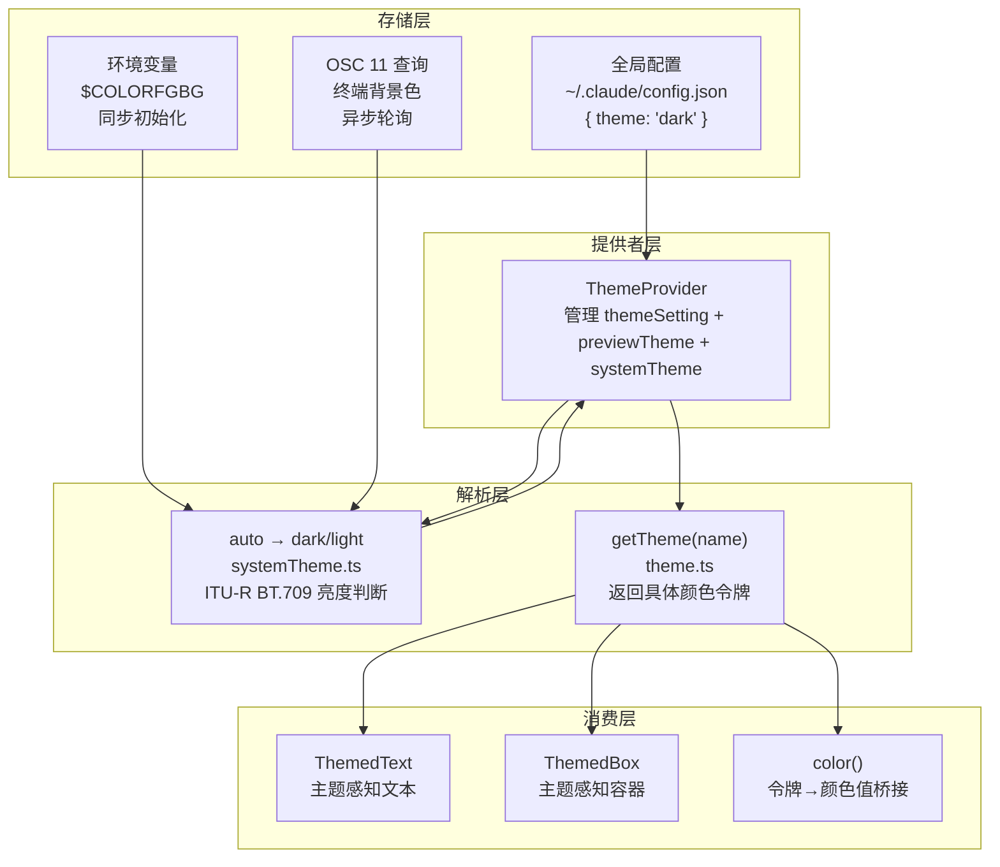
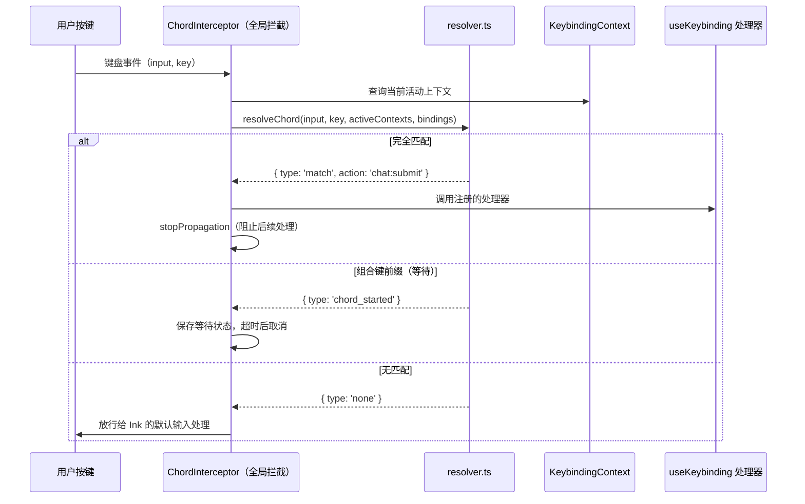

# 第13课：主题系统与键盘快捷键

---

## 课程信息

| 项目 | 内容 |
|------|------|
| **所属阶段** | 第四阶段：深度架构解析 |
| **建议时长** | 90～120 分钟 |
| **前置课程** | 第12课（React+Ink终端UI）、第11课（状态管理系统） |
| **核心文件** | `src/utils/theme.ts`、`src/components/design-system/ThemeProvider.tsx`、`src/utils/systemTheme.ts`、`src/keybindings/defaultBindings.ts`、`src/keybindings/parser.ts`、`src/keybindings/resolver.ts`、`src/keybindings/reservedShortcuts.ts` |

### 学习目标

1. **理解** 主题系统的三层架构：主题令牌（Token）→ 主题名（ThemeName）→ 解析值（具体颜色）
2. **掌握** `auto` 主题的实现原理——如何通过 OSC 11 查询终端背景色，并回退到 COLORFGBG
3. **分析** ThemeProvider 的预览-持久化生命周期：预览、保存、取消的状态机
4. **熟悉** 快捷键系统的分层架构：配置层 → 解析层 → 匹配层 → React 集成层
5. **理解** 组合键（Chord）机制、上下文优先级和保留键的设计思想

---

## 核心概念

### 主题系统的三类概念

```
ThemeSetting（用户偏好）
  ├── 'auto'          ← 跟随系统/终端
  ├── 'dark'          ← 暗色主题
  ├── 'light'         ← 亮色主题
  ├── 'dark-daltonized'   ← 暗色色盲友好
  ├── 'light-daltonized'  ← 亮色色盲友好
  ├── 'dark-ansi'     ← 暗色纯 ANSI（降级兼容）
  └── 'light-ansi'    ← 亮色纯 ANSI（降级兼容）
        ↓ resolve（'auto' → 具体名称）
ThemeName（渲染用主题名，永不为 'auto'）
  ├── 'dark' | 'light' | 'dark-daltonized' | ...
        ↓ getTheme(name)
Theme（颜色令牌对象）
  ├── text: 'rgb(230,237,243)'
  ├── background: '#1a1a2e'
  ├── success: 'rgb(87,201,88)'
  ├── error: 'rgb(255,85,85)'
  └── ... 80+ 个语义化颜色令牌
```

### 快捷键系统的分层

```
配置层（Config Layer）
  ├── defaultBindings.ts  ← 内置默认绑定（代码定义）
  └── loadUserBindings.ts ← 用户配置文件（~/.claude/keybindings.json）

解析层（Parse Layer）
  ├── parser.ts    ← "ctrl+shift+k" → ParsedKeystroke
  └── match.ts     ← 键盘事件 vs ParsedKeystroke 比较

路由层（Routing Layer）
  └── resolver.ts  ← 上下文过滤 + 优先级裁决 → action 字符串

集成层（Integration Layer）
  ├── KeybindingContext.tsx    ← React Context 提供绑定注册表
  ├── KeybindingProviderSetup.tsx ← 全局键盘事件拦截
  └── useKeybinding.ts         ← 组件注册动作处理器
```

---

## 架构设计与设计思想

### 主题系统架构



### 快捷键系统架构



### 设计思想：为什么主题令牌使用语义化命名？

Claude Code 的主题令牌不是 `color1`、`color2` 这样的直译名称，而是：

```typescript
// src/utils/theme.ts
export type Theme = {
  text: string           // 主文本颜色
  inactive: string       // 非活动/禁用状态颜色
  success: string        // 成功状态
  error: string          // 错误状态
  diffAdded: string      // diff 新增行
  diffRemoved: string    // diff 删除行
  claude: string         // Claude 品牌颜色（橙色）
  permission: string     // 权限模式指示颜色
  // ...
}
```

**语义化命名的价值**：
1. **跨主题复用**：`diffAdded` 在暗色主题中是绿色，在亮色中是深绿，但组件代码不需要改变
2. **维护性**：修改"所有成功状态颜色"只需改 `success` 令牌，一处修改全局生效
3. **色盲友好版本**：`dark-daltonized` 主题将红/绿区分替换为蓝/橙，组件代码无感知

### 设计思想：为什么快捷键系统是纯函数解析？

```
resolver.ts 的 resolveKey 函数是纯函数：
  - 输入：键盘事件 + 当前上下文 + 绑定列表
  - 输出：匹配结果
  - 无副作用，无外部状态依赖

好处：
  1. 单元测试极其简单（不需要 DOM、React 或 Ink）
  2. 解析逻辑与 React 完全解耦，可在非 React 环境使用
  3. 并发安全（无可变状态竞争）
  
对比：如果 resolver 内部维护"当前等待组合键状态"，
      则需要处理并发、清理、超时等复杂问题
      实际的等待状态由 KeybindingProviderSetup 的 React state 管理
```

---

## 关键源码深度走查

### 代码片段 1：主题令牌定义与 RGB 颜色策略

```typescript
// src/utils/theme.ts

export type Theme = {
  // 基础颜色令牌
  text: string          // 主文本
  inverseText: string   // 反色文本
  inactive: string      // 非活动状态
  subtle: string        // 低调/辅助信息
  background: string    // 背景色
  suggestion: string    // 建议/提示

  // 语义状态
  success: string
  error: string
  warning: string

  // Diff 颜色族（含暗化版本用于上下文行）
  diffAdded: string
  diffRemoved: string
  diffAddedDimmed: string     // diff 上下文中的新增行（不那么显眼）
  diffRemovedDimmed: string   // diff 上下文中的删除行
  diffAddedWord: string       // 单词级 diff 高亮（新增）
  diffRemovedWord: string     // 单词级 diff 高亮（删除）

  // Shimmer 变体（用于动画效果）
  claude: string
  claudeShimmer: string      // Claude 颜色的更浅版本，用于微光动画

  // Agent 专用颜色（严格限制用途）
  red_FOR_SUBAGENTS_ONLY: string
  blue_FOR_SUBAGENTS_ONLY: string
  // ...
}

/**
 * 亮色主题：使用显式 RGB 值而非 ANSI 颜色名
 * 原因：避免用户自定义终端 ANSI 颜色导致的显示不一致
 */
const lightTheme: Theme = {
  text: 'rgb(30,30,30)',                    // 深灰（非纯黑，更柔和）
  background: 'rgb(245,245,245)',           // 浅灰背景
  claude: 'rgb(215,119,87)',                // Claude 橙色
  claudeShimmer: 'rgb(245,149,117)',        // 更浅的橙色（用于微光效果）
  success: 'rgb(0,128,0)',
  error: 'rgb(200,0,0)',
  diffAdded: 'rgb(0,120,0)',
  diffRemoved: 'rgb(160,0,0)',
  // ...
}
```

**关键设计决策：为什么用 `rgb(...)` 而非 ANSI 颜色名？**

> 注释明确说明：*"using explicit RGB values to avoid inconsistencies from users' custom terminal ANSI color definitions"*

用户可以在终端配置中修改 ANSI 颜色（如 iTerm2、Alacritty 的颜色主题）。如果 Claude Code 使用 `chalk.green('text')`，在不同用户的终端上"绿色"会是完全不同的颜色。使用 RGB 值则确保视觉一致性。

> 💡 **设计点评 — 语义化令牌 + RGB 锁色**
>
> **好在哪里**：你可以把这个设计想象成"品牌色规范书"——UI设计师给你一本色卡说"错误用这个红、成功用这个绿"，不管你用什么显示器，颜色就是这个颜色。而不是说"用terminal的红色"——人家的红可能是粉色。
>
> **如果不这样做**：不同终端（iTerm2 换肤后、Alacritty、kitty）里 Claude Code 的配色方案各不相同，用户截图分享时别人看到的是另一个样子，品牌感荡然无存。

---

### 代码片段 2：ThemeProvider — 三状态主题机制

```typescript
// src/components/design-system/ThemeProvider.tsx

export function ThemeProvider({ children, initialState, onThemeSave = defaultSaveTheme }) {
  // ① 持久化设置（存入全局配置）
  const [themeSetting, setThemeSetting] = useState(initialState ?? defaultInitialTheme)

  // ② 预览状态（仅在主题选择器打开期间有效）
  const [previewTheme, setPreviewTheme] = useState<ThemeSetting | null>(null)

  // ③ 系统主题（用于解析 'auto'）
  //    初始值从 $COLORFGBG 同步读取（避免 OSC 异步等待造成闪烁）
  const [systemTheme, setSystemTheme] = useState<SystemTheme>(() =>
    (initialState ?? themeSetting) === 'auto' ? getSystemThemeName() : 'dark'
  )

  // 活跃设置：预览优先于持久化设置
  const activeSetting = previewTheme ?? themeSetting

  // 监听系统主题变化（仅在 'auto' 模式下）
  // feature('AUTO_THEME') 控制是否编译此代码（外部构建时 DCE 删除）
  useEffect(() => {
    if (feature('AUTO_THEME')) {
      if (activeSetting !== 'auto' || !internal_querier) return
      // 动态导入：只在需要时加载 OSC 监听器，减少启动开销
      let cancelled = false
      void import('../../utils/systemThemeWatcher.js').then(({ watchSystemTheme }) => {
        if (cancelled) return
        const cleanup = watchSystemTheme(internal_querier, setSystemTheme)
        return cleanup
      })
      return () => { cancelled = true }
    }
  }, [activeSetting, internal_querier])

  // 解析最终渲染用主题名（永不为 'auto'）
  const currentTheme: ThemeName = activeSetting === 'auto' ? systemTheme : activeSetting

  const value = useMemo<ThemeContextValue>(() => ({
    themeSetting,
    // setThemeSetting：持久化保存并清除预览
    setThemeSetting: (newSetting: ThemeSetting) => {
      setThemeSetting(newSetting)
      setPreviewTheme(null)
      // 切换到 'auto' 时立即从缓存读取，避免 OSC 异步造成的颜色闪烁
      if (newSetting === 'auto') setSystemTheme(getSystemThemeName())
      onThemeSave?.(newSetting)  // 写入全局配置
    },
    // setPreviewTheme：只更新预览状态，不写入配置
    setPreviewTheme: (newSetting: ThemeSetting) => {
      setPreviewTheme(newSetting)
      if (newSetting === 'auto') setSystemTheme(getSystemThemeName())
    },
    // savePreview：将当前预览持久化
    savePreview: () => {
      if (previewTheme !== null) {
        setThemeSetting(previewTheme)
        setPreviewTheme(null)
        onThemeSave?.(previewTheme)
      }
    },
    // cancelPreview：取消预览，恢复持久化设置
    cancelPreview: () => { if (previewTheme !== null) setPreviewTheme(null) },
    currentTheme,
  }), [themeSetting, previewTheme, currentTheme, onThemeSave])

  return <ThemeContext.Provider value={value}>{children}</ThemeContext.Provider>
}
```

**三个 Hook 的职责分工**：

```typescript
// 用于渲染的组件：只需要"当前要用哪个主题"
const [currentTheme, setThemeSetting] = useTheme()
// currentTheme 永不为 'auto'，可以直接传给 getTheme()

// 用于显示配置界面的组件：需要显示用户存储的原始偏好
const themeSetting = useThemeSetting()
// themeSetting 可能是 'auto'，用于在 UI 中显示"自动"选项

// 用于主题选择器的组件：需要预览和保存/取消能力
const { setPreviewTheme, savePreview, cancelPreview } = usePreviewTheme()
```

> 💡 **设计点评 — 预览-提交状态机**
>
> **好在哪里**：就像你在淘宝换购物车商品，所有改动先放进"购物车"，最后再统一结账（写入配置）。预览期间随便换，不满意直接取消，配置文件丝毫不动。
>
> **如果不这样做**：每次预览主题都立刻写入配置文件，用户浏览了10个主题就写了10次磁盘，而且取消时还要"撤回"上一次写入，逻辑复杂且容易出错。

---

### 代码片段 3：系统主题检测 — OSC 11 + COLORFGBG 双路径

```typescript
// src/utils/systemTheme.ts

// 模块级缓存：首次检测后直接返回，避免重复查询
let cachedSystemTheme: SystemTheme | undefined

export function getSystemThemeName(): SystemTheme {
  if (cachedSystemTheme === undefined) {
    // 优先从 $COLORFGBG 同步读取（部分终端在启动时设置此变量）
    cachedSystemTheme = detectFromColorFgBg() ?? 'dark'  // 回退为暗色
  }
  return cachedSystemTheme
}

/**
 * 解析 OSC 颜色响应（OSC 11 查询终端背景色的返回格式）
 * 
 * 支持两种格式：
 * - rgb:RRRR/GGGG/BBBB（xterm、iTerm2、Ghostty、kitty 等）
 * - #RRGGBB / #RRRRGGGGBBBB
 */
export function themeFromOscColor(data: string): SystemTheme | undefined {
  const rgb = parseOscRgb(data)
  if (!rgb) return undefined

  // ITU-R BT.709 相对亮度公式
  // 这是人眼感知亮度的标准加权公式（绿色感知最强，蓝色最弱）
  const luminance = 0.2126 * rgb.r + 0.7152 * rgb.g + 0.0722 * rgb.b
  return luminance > 0.5 ? 'light' : 'dark'  // 大于 0.5 为亮色背景
}

function parseOscRgb(data: string): Rgb | undefined {
  // rgb:RRRR/GGGG/BBBB 格式（可选 alpha: rgba:...）
  const rgbMatch = /^rgba?:([0-9a-f]{1,4})\/([0-9a-f]{1,4})\/([0-9a-f]{1,4})/i.exec(data)
  if (rgbMatch) {
    return {
      r: hexComponent(rgbMatch[1]!),
      g: hexComponent(rgbMatch[2]!),
      b: hexComponent(rgbMatch[3]!),
    }
  }
  // #RRGGBB 或 #RRRRGGGGBBBB（将等长三段归一化）
  const hashMatch = /^#([0-9a-f]+)$/i.exec(data)
  if (hashMatch && hashMatch[1]!.length % 3 === 0) {
    const hex = hashMatch[1]!
    const n = hex.length / 3
    return {
      r: hexComponent(hex.slice(0, n)),
      g: hexComponent(hex.slice(n, 2 * n)),
      b: hexComponent(hex.slice(2 * n)),
    }
  }
  return undefined
}

/** 将 1-4 位十六进制颜色分量归一化到 [0, 1] */
function hexComponent(hex: string): number {
  const max = 16 ** hex.length - 1  // 4位: max=65535, 2位: max=255
  return parseInt(hex, 16) / max
}

// $COLORFGBG 解析（同步，用于初始化）
// 格式：fg;bg 或 fg;other;bg，取最后一部分
function detectFromColorFgBg(): SystemTheme | undefined {
  const colorfgbg = process.env['COLORFGBG']
  if (!colorfgbg) return undefined
  const parts = colorfgbg.split(';')
  const bg = parts[parts.length - 1]
  const bgNum = Number(bg)
  if (!Number.isInteger(bgNum) || bgNum < 0 || bgNum > 15) return undefined
  // ANSI 颜色 0-6 和 8 是深色（黑、红、绿…），7 和 9-15 是浅色
  return bgNum <= 6 || bgNum === 8 ? 'dark' : 'light'
}
```

**双路径检测策略分析**：

```
问题：如何在启动时就知道终端是暗色还是亮色，而不等待 OSC 异步查询？

解决方案（两阶段）：

第一阶段（同步，启动时立即可用）：
  读取 $COLORFGBG 环境变量
  → 部分终端（iTerm2 with 选项、Konsole、rxvt 系列）在启动时设置此变量
  → 语义：fg;bg，bg 是 ANSI 颜色索引
  → 优点：同步，零延迟
  → 缺点：非标准，许多现代终端不设置（如 Terminal.app、Ghostty）

第二阶段（异步，几百毫秒后生效）：
  发送 OSC 11 查询到终端
  → 标准 XTERM 协议，几乎所有现代终端支持
  → 返回格式：\033]11;rgb:RRRR/GGGG/BBBB\a
  → 解析颜色 → 用 ITU-R BT.709 公式判断亮度
  → 通过 setSystemTheme 更新 ThemeProvider 状态
  → 优点：准确（直接查询实际背景色）
  → 缺点：异步，有延迟（但用缓存防止闪烁）

防闪烁策略：
  切换到 'auto' 时立即调用 getSystemThemeName()（返回缓存值）
  OSC 查询异步完成后才更新，如果与缓存不同则发生一次跳变
  实践中极少发生（缓存值通常正确）
```

> 💡 **设计点评 — 双路径 + ITU-R BT.709 亮度公式**
>
> **好在哪里**：用 `$COLORFGBG` 先快速猜一下（同步无延迟），再用 OSC 11 精确确认（异步）。就像进屋先拍一下电灯开关再四处找插座——先快速给个大概答案，再慢慢精确。而 ITU-R BT.709 系数（绿0.7152>红0.2126>蓝0.0722）对应人眼真实感知，不是随便凑的数字。
>
> **如果不这样做**：用简单的 `(R+G+B)/3` 判断亮度，你会把纯蓝背景判断成暗色（蓝色很暗但人眼感觉不是那么暗）。用只等 OSC 11 的方案，启动时有几百毫秒会显示错误主题，产生闪烁感。

---

### 代码片段 4：快捷键解析 — 从字符串到结构化表示

```typescript
// src/keybindings/parser.ts

/**
 * 将 "ctrl+shift+k" 解析为 ParsedKeystroke 结构
 * 支持多种修饰键别名（兼容不同平台的术语）
 */
export function parseKeystroke(input: string): ParsedKeystroke {
  const parts = input.split('+')
  const keystroke: ParsedKeystroke = {
    key: '',
    ctrl: false, alt: false, shift: false, meta: false, super: false,
  }

  for (const part of parts) {
    const lower = part.toLowerCase()
    switch (lower) {
      // Ctrl 别名
      case 'ctrl': case 'control':
        keystroke.ctrl = true; break

      // Alt/Option 别名（macOS 用 option，Linux 用 alt，Emacs 用 meta）
      case 'alt': case 'opt': case 'option':
        keystroke.alt = true; break

      // Super/Cmd/Win 别名
      case 'cmd': case 'command': case 'super': case 'win':
        keystroke.super = true; break

      // 特殊键名规范化
      case 'esc': keystroke.key = 'escape'; break
      case 'return': keystroke.key = 'enter'; break
      case 'space': keystroke.key = ' '; break

      // Unicode 方向键符号（为方便手写配置而支持）
      case '↑': keystroke.key = 'up'; break
      case '↓': keystroke.key = 'down'; break
      case '←': keystroke.key = 'left'; break
      case '→': keystroke.key = 'right'; break

      default: keystroke.key = lower; break  // 普通字母/数字/符号
    }
  }

  return keystroke
}

/**
 * 解析组合键（Chord）：空格分隔的多步序列
 * 例如："ctrl+x ctrl+k" → [ParsedKeystroke1, ParsedKeystroke2]
 */
export function parseChord(input: string): Chord {
  return input.trim().split(/\s+/).map(parseKeystroke)
}

/**
 * 解析整个绑定块（KeybindingBlock）到扁平的 ParsedBinding 列表
 * 绑定块格式：{ context: 'Chat', bindings: { 'ctrl+enter': 'chat:submit', ... } }
 */
export function parseBindingBlock(block: KeybindingBlock): ParsedBinding[] {
  const results: ParsedBinding[] = []
  for (const [keyStr, action] of Object.entries(block.bindings)) {
    results.push({
      context: block.context,
      chord: parseChord(keyStr),  // 可能是组合键
      action: action,  // null = 显式解绑
      rawKey: keyStr,
    })
  }
  return results
}
```

> 💡 **设计点评 — 纯函数解析 + Unicode 箭头别名**
>
> **好在哪里**：`parseKeystroke` 是个纯函数，输入字符串输出结构体，没有任何副作用。你在 Node REPL 里直接调用它测试就行，不需要启动 React、Ink 或模拟终端。同时支持 `↑↓←→` Unicode 箭头，键盘映射对不习惯英文键名的用户更直观。
>
> **如果不这样做**：解析逻辑混在 React 组件里，测试要启动整个 UI 框架，一个简单的字符串解析函数要 mock 十几个依赖，写完就不想再改了。

---

### 代码片段 5：快捷键匹配 — 修饰键的终端限制

```typescript
// src/keybindings/match.ts

/**
 * 修饰键匹配：终端协议的限制与解决方案
 *
 * 关键限制：
 * - Alt 和 Meta：在 Ink 中统一映射为 key.meta
 *   （终端不能区分 Alt 和 Meta，历史遗留）
 * - Super（Cmd/Win）：只在 Kitty 键盘协议终端中可用
 *   （在标准 VT100 终端中永远不到达应用层）
 */
function modifiersMatch(inkMods: InkModifiers, target: ParsedKeystroke): boolean {
  if (inkMods.ctrl !== target.ctrl) return false
  if (inkMods.shift !== target.shift) return false

  // Alt 和 meta 都映射到 key.meta（终端限制）
  // 用户配置 'alt+v' 或 'meta+v' 效果相同
  const targetNeedsMeta = target.alt || target.meta
  if (inkMods.meta !== targetNeedsMeta) return false

  // Super 只在 Kitty 协议终端中可达
  // 绑定了 'cmd+k' 的用户，在不支持的终端中这个键位永远不会触发
  if (inkMods.super !== target.super) return false

  return true
}

// 特殊处理：Escape 键的 meta 标志
// 原因：Ink 设置 key.meta=true 当 Escape 被按下（历史兼容问题）
// 不处理会导致 "escape" 绑定永远无法匹配（因为 meta 不匹配）
export function matchesKeystroke(input: string, key: Key, target: ParsedKeystroke): boolean {
  const keyName = getKeyName(input, key)
  if (keyName !== target.key) return false

  const inkMods = getInkModifiers(key)

  if (key.escape) {
    // Escape 键：忽略 Ink 错误设置的 meta 标志
    return inkMods.ctrl === target.ctrl && inkMods.shift === target.shift
  }

  return modifiersMatch(inkMods, target)
}
```

> 💡 **设计点评 — 终端协议限制的显式建模**
>
> **好在哪里**：代码里直接注释了"终端不能区分 Alt 和 Meta（历史遗留）"、"Super 只在 Kitty 协议终端中可用"。这些不是 bug，是终端协议的物理限制，通过注释把约束固化在代码里，下一个维护者不会试图去"修复"这个"bug"。
>
> **如果不这样做**：某个开发者看到 alt 和 meta 映射到同一个字段，以为是合并 bug，改了之后在所有终端上 alt 键都失效——因为大多数终端根本区分不了 alt 和 meta。

---

### 代码片段 6：保留键 — 三级约束体系

```typescript
// src/keybindings/reservedShortcuts.ts

/**
 * 第一级：不可重绑（Claude Code 硬编码）
 * 这些键的处理逻辑在代码中无法绕过
 */
export const NON_REBINDABLE: ReservedShortcut[] = [
  {
    key: 'ctrl+c',
    reason: 'Cannot be rebound - used for interrupt/exit (hardcoded)',
    severity: 'error',  // 错误：用户尝试重绑时显示错误
  },
  {
    key: 'ctrl+d',
    reason: 'Cannot be rebound - used for exit (hardcoded)',
    severity: 'error',
  },
  {
    key: 'ctrl+m',
    reason: 'Cannot be rebound - identical to Enter in terminals (both send CR)',
    severity: 'error',  // 终端物理限制：ctrl+m 和 Enter 产生相同字节序列
  },
]

/**
 * 第二级：终端保留（OS/终端拦截，通常到达不了应用）
 * 允许用户尝试重绑，但会显示警告
 */
export const TERMINAL_RESERVED: ReservedShortcut[] = [
  {
    key: 'ctrl+z',
    reason: 'Unix process suspend (SIGTSTP)',
    severity: 'warning',  // 警告：可能不生效但不是错误
  },
  {
    key: 'ctrl+\\',
    reason: 'Terminal quit signal (SIGQUIT)',
    severity: 'error',
  },
]

/**
 * 第三级：平台特定（macOS 系统级）
 * cmd+c 等被 macOS 自身拦截，不会传到终端应用
 */
export const MACOS_RESERVED: ReservedShortcut[] = [
  { key: 'cmd+c', reason: 'macOS system copy', severity: 'error' },
  { key: 'cmd+v', reason: 'macOS system paste', severity: 'error' },
  { key: 'cmd+q', reason: 'macOS quit application', severity: 'error' },
  // ...
]

export function getReservedShortcuts(): ReservedShortcut[] {
  const platform = getPlatform()
  const reserved = [...NON_REBINDABLE, ...TERMINAL_RESERVED]
  if (platform === 'macos') reserved.push(...MACOS_RESERVED)
  return reserved
}
```

> 💡 **设计点评 — 三级约束体系**
>
> **好在哪里**：把"不能绑"的原因分三层：Claude Code 自己硬编码的、终端/OS 拦截的、macOS 系统级的。这就像门禁系统：有些门你公司没钥匙（NON_REBINDABLE），有些门物业管（TERMINAL_RESERVED），有些门是消防门（MACOS_RESERVED）。分清层次，提示信息才能说清楚"为什么不行"。
>
> **如果不这样做**：把所有保留键混在一起，用户尝试绑 `cmd+c` 时只告诉他"这个键已被占用"，但不知道是谁占的、能不能改。分层后错误信息可以说"macOS 系统级拦截，应用层无法处理"。

---

### 代码片段 7：defaultBindings — 平台适配与功能开关

```typescript
// src/keybindings/defaultBindings.ts（精选部分）

// 平台适配：图片粘贴快捷键
// Windows: ctrl+v 是系统粘贴，不会传到应用；用 alt+v 代替
const IMAGE_PASTE_KEY = getPlatform() === 'windows' ? 'alt+v' : 'ctrl+v'

// Windows Terminal VT 模式检测
// shift+tab 在 Windows 没有 VT 模式时不能可靠传到应用
// Node.js >= 22.17.0 和 Bun >= 1.2.23 启用了 VT 模式
const SUPPORTS_TERMINAL_VT_MODE =
  getPlatform() !== 'windows' ||
  (isRunningWithBun()
    ? satisfies(process.versions.bun, '>=1.2.23')
    : satisfies(process.versions.node, '>=22.17.0 <23.0.0 || >=24.2.0'))

const MODE_CYCLE_KEY = SUPPORTS_TERMINAL_VT_MODE ? 'shift+tab' : 'meta+m'

export const DEFAULT_BINDINGS: KeybindingBlock[] = [
  {
    context: 'Global',
    bindings: {
      'ctrl+c': 'app:interrupt',   // 中断（在保留键列表中，但仍然定义以便显示文本）
      'ctrl+d': 'app:exit',
      'ctrl+l': 'app:redraw',
      'ctrl+t': 'app:toggleTodos',
      'ctrl+o': 'app:toggleTranscript',
      'ctrl+r': 'history:search',

      // 功能开关（feature flag 控制）
      // 这些键只在特定功能启用时才定义
      ...(feature('QUICK_SEARCH') ? {
        'ctrl+shift+f': 'app:globalSearch' as const,
        'cmd+shift+f': 'app:globalSearch' as const,  // Kitty 协议
      } : {}),
    },
  },
  {
    context: 'Chat',
    bindings: {
      'escape': 'chat:cancel',
      [MODE_CYCLE_KEY]: 'chat:cycleMode',   // 模式切换（平台适配）
      'enter': 'chat:submit',
      'ctrl+x ctrl+k': 'chat:killAgents',  // 组合键！
      [IMAGE_PASTE_KEY]: 'chat:imagePaste', // 图片粘贴（平台适配）
    },
  },
  // ...更多上下文
]
```

**功能开关（feature flag）的意义**：

```
feature('QUICK_SEARCH') → 布尔值
  在构建时通过 bun:bundle 替换
  外部构建（external）：false → 整块代码被 DCE（死代码消除）
  内部构建（ant）：true → 功能可用

优点：
  1. 公开版本和内部版本共享代码库
  2. 未启用的功能不占用键位（避免冲突）
  3. 构建时消除，零运行时开销
```

> 💡 **设计点评 — 构建时 feature flag + 平台适配**
>
> **好在哪里**：`IMAGE_PASTE_KEY` 在 Windows 用 `alt+v`，在其他平台用 `ctrl+v`，这个判断写在代码里，不是靠文档说明。就像菜谱直接写"如果用电磁炉，火力调到中高；用燃气灶，用中火"——判断条件和做法都在一个地方。
>
> **如果不这样做**：默认绑定表里写死 `ctrl+v`，然后 Windows 用户发现粘贴不了，来提 issue，维护者翻 issue 才知道要加平台分支。构建时 DCE 的好处是外部用户的包里根本不存在内部功能的代码，反编译也找不到。

---


## 用户自定义指南

### 主题自定义

Claude Code 当前支持内置主题（dark/light/daltonized/ansi），自定义颜色值需要修改 `src/utils/theme.ts` 源码。对于不同显示环境的适配：

```typescript
// 在 theme.ts 中选择合适的颜色格式：
// RGB（推荐，精确，不受终端 ANSI 颜色配置影响）
text: 'rgb(230,237,243)'

// ANSI 名称（兼容性好，但受用户终端配置影响）
text: 'white'

// ANSI 256 色（比 16 色更精确，比真彩色兼容性更广）
text: 'ansi256(252)'
```

### 快捷键自定义

创建 `~/.claude/keybindings.json`（当前仅限内部员工）：

```json
{
  "bindings": [
    {
      "context": "Chat",
      "bindings": {
        "ctrl+enter": "chat:submit",
        "ctrl+k": null
      }
    },
    {
      "context": "Global",
      "bindings": {
        "ctrl+shift+t": "app:toggleTodos"
      }
    }
  ]
}
```

**配置规则**：
- `null` 值：显式解绑（将键位从系统中移除，防止意外触发）
- 后定义覆盖先定义（用户配置在默认配置之后加载，自动覆盖）
- 支持修饰键别名：`ctrl/control`、`alt/opt/option`、`cmd/command/super/win`、`shift`

---

## Harness Engineering

### Harness Engineering 视角

本课的主题系统和快捷键系统，从驾驭工程的角度看，都体现了一个共同思想：**把变化点和不变点分开，让不变的部分稳定、让变化的部分可替换**。

- **语义令牌**是不变的接口（`success`、`error`），具体颜色值是可替换的实现。你在上面叠主题变体，下面的组件代码一行不改。
- **纯函数解析**把"解析字符串键名"这个不变的逻辑抽出来，与 React 生命周期解耦。想换 UI 框架？解析器不动。
- **上下文覆盖**让局部关注点（ThemePicker 的 `ctrl+t`）不污染全局关注点，组件卸载就自动清理，不留后患。

这种"层次清晰、变化点隔离"的工程哲学，比任何设计模式的名字都重要。

### 对大模型应用的启发

1. **语义化而非直译**：提示词里的变量名也该语义化——不是 `{var1}` 而是 `{user_intent}`、`{context_summary}`。模型理解语义，语义化命名让提示更健壮、更易维护。

2. **预览-提交模式**适用于任何"试错成本高"的场景：给模型 draft→review→commit 的工作流，在最终写入前保留撤销空间，和主题预览是同一个哲学。

3. **上下文优先级**：当你的 AI 应用有多个提示层（系统提示、用户偏好、当前任务），用同样的"局部覆盖全局"思路管理优先级，而不是把所有内容混在一个字符串里。

4. **构建时 DCE**：AI 应用里也有"内部功能"（如更强的工具调用权限），通过功能开关而不是分叉代码库来管理，构建时剪掉外部不需要的代码。

5. **双路径降级**：大模型推理有时会超时或返回错误，用"先同步快路径、再异步精确路径"的两阶段思路，可以让用户感知到更快的响应，同时最终获得准确结果。

---

## 思考题与进阶方向

### 思考题

**题目 1**：主题扩展性——当前主题系统是"枚举式"的（dark/light/...），如果要支持完全自定义的用户主题（允许用户指定每个令牌的颜色），需要改动哪些模块？有什么潜在的挑战？

<details>
<summary>💡 参考答案</summary>

主要改动三处：① `theme.ts` 中的 `ThemeSetting` 类型扩展为允许自定义对象；② `getTheme()` 需要支持传入自定义令牌并做验证（防止非法颜色值导致渲染崩溃）；③ 配置存储层（`~/.claude/config.json`）要能序列化/反序列化自定义主题对象。挑战在于 80+ 个令牌用户很难手动填全，需要提供"基于暗/亮模板扩展"的机制，同时色盲友好版本的令牌语义也需要用户理解才能正确配置。

</details>

**题目 2**：快捷键与 Vim 模式——Claude Code 支持 Vim 模式（`/vim` 命令）。在 Vim 模式下，`h/j/k/l` 会有特殊含义。快捷键系统如何处理"字符输入"与"快捷键动作"的冲突？（提示：看 `context` 的使用）

<details>
<summary>💡 参考答案</summary>

Vim 模式通过注册专属的上下文（如 `VimNormal`、`VimInsert`）来处理这个问题。在 VimNormal 上下文中，`h/j/k/l` 被绑定为导航动作，`resolver` 优先在当前活跃上下文中查找匹配，找到就触发动作并 stopPropagation，不会传递给 Ink 的默认字符输入处理器。切换到 VimInsert 时注销 VimNormal 上下文，`h/j/k/l` 就回归普通字符输入。

</details>

**题目 3**：动态模式下的上下文——打开帮助面板时活动上下文变为 `['Help', 'Global']`，如果用户按了 `q`（关闭帮助的快捷键），但 Chat 上下文也有 `q` 的绑定，优先级如何决定？

<details>
<summary>💡 参考答案</summary>

`resolver.ts` 按照上下文注册顺序（后注册的上下文优先级更高）依次查找。帮助面板打开时，它会调用 `registerContext('Help')`，并且由于帮助面板是最后注册的，它的 `q` 绑定会优先于 Chat 的 `q`。帮助面板关闭后自动注销，`q` 就还给了 Chat 上下文处理。这是基于 React 组件生命周期的自动资源管理，无需手动维护优先级表。

</details>

**题目 4**：主题的 Shimmer 动画——`claudeShimmer` 等 Shimmer 变体是如何在动画中使用的？能否用 CSS `animation` 类比理解这个机制，在终端中它是如何实现"微光扫描"效果的？

<details>
<summary>💡 参考答案</summary>

终端没有 CSS 动画，只能通过定时器周期性重渲染来模拟动画。Spinner 组件每帧交替渲染主色和 Shimmer 色的字符，或在不同位置渲染亮色块来产生"扫光"感。把两个颜色预定义在主题里，动画组件直接读取 `theme.claude` 和 `theme.claudeShimmer` 即可，不需要每帧计算"亮一点的颜色是什么"——这既节省了 CPU 也保证了主题一致性。

</details>

### 进阶方向

- **深入 ThemePicker**：阅读 `src/components/ThemePicker.tsx`，理解完整的主题选择界面实现，以及如何与 `usePreviewTheme` 配合实现实时预览
- **探索 Vim 模式**：阅读 `src/vim/` 目录，理解 Vim 模式是如何通过上下文机制与快捷键系统集成的
- **研究 KeybindingProviderSetup**：阅读 `src/keybindings/KeybindingProviderSetup.tsx`，理解组合键等待状态是如何在 React state 中管理的
- **分析 validate.ts**：阅读 `src/keybindings/validate.ts`，理解用户配置的校验逻辑（如何检测保留键冲突、无效上下文/动作等）

---

## 小结

主题系统和快捷键系统都体现了 Claude Code 的**可扩展性设计哲学**：

| 维度 | 主题系统 | 快捷键系统 |
|------|---------|-----------|
| **核心抽象** | 语义令牌 → 具体颜色 | 字符串键名 → 结构化动作 |
| **用户定制** | 选择预置主题 | 覆盖/新增键绑定 |
| **平台适配** | ANSI vs RGB vs 自动检测 | Windows VT 模式/macOS Super 键 |
| **预览机制** | 预览-提交状态机 | 上下文注册/注销 |
| **可测试性** | 纯函数颜色解析 | 纯函数键名解析和匹配 |

两个系统都遵循了**最小知识原则**（Least Knowledge Principle）：组件只需要知道"要用什么语义颜色/触发什么动作"，不需要知道"颜色的具体值是多少/用什么键位触发"。这种关注点分离使得主题切换和快捷键自定义可以在不修改业务组件代码的情况下实现。
