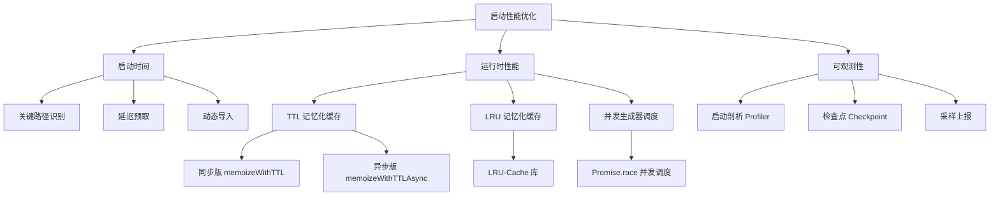
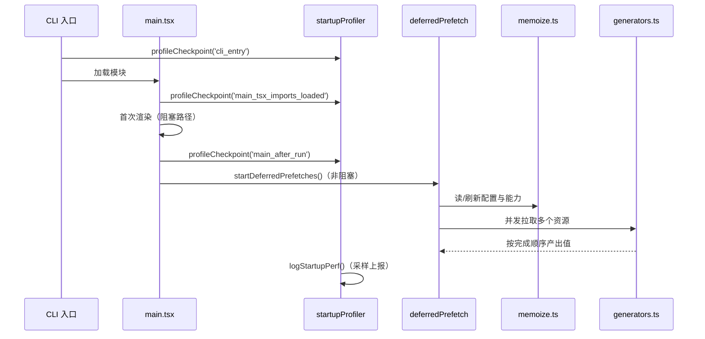
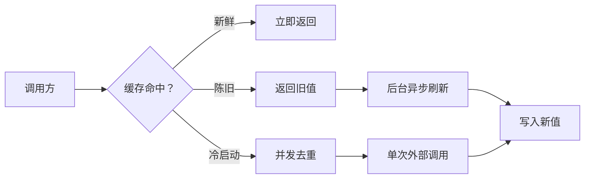
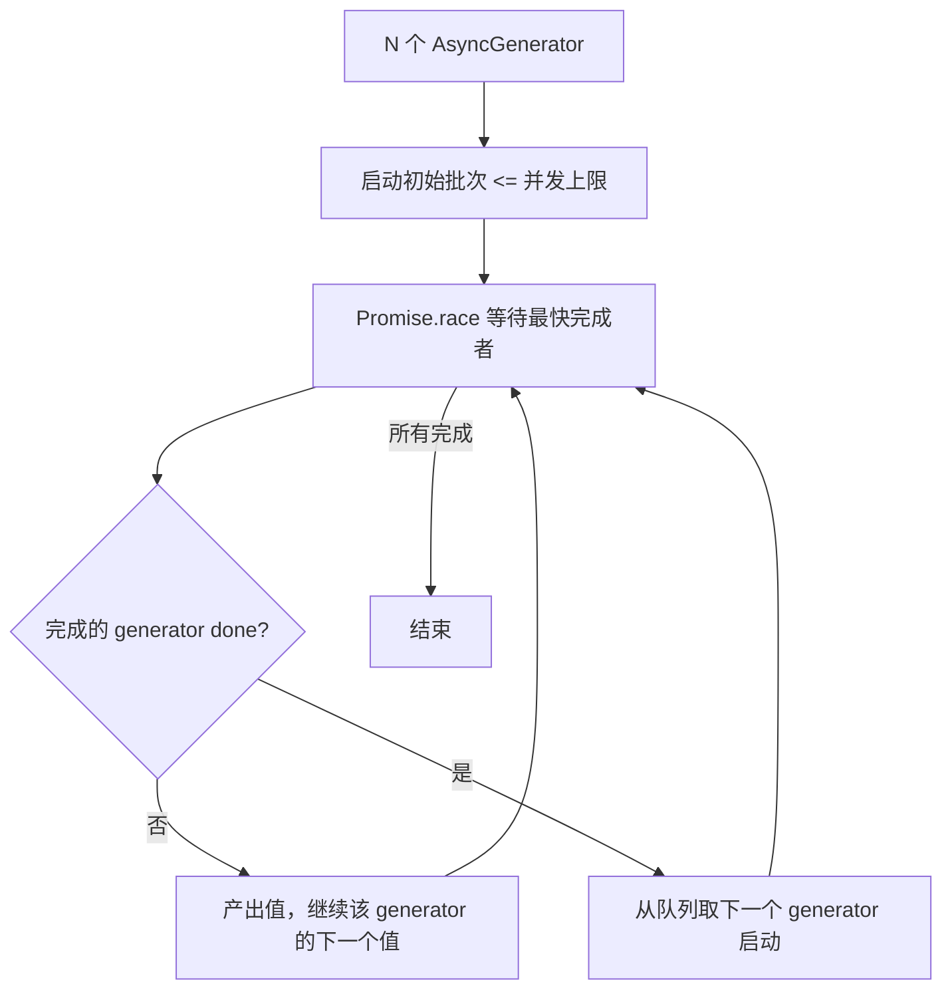

# 第14课：启动性能优化与缓存策略

---

## 一、课程信息

| 项目 | 内容 |
|------|------|
| **所属阶段** | 第五阶段：性能工程与可观测性 |
| **建议时长** | 90 分钟 |
| **难度等级** | ⭐⭐⭐⭐（进阶） |
| **前置课程** | 第3课（启动流程）、第8课（异步模式） |

### 学习目标

1. 理解 Claude Code 延迟预取（Deferred Prefetch）架构，掌握"非关键即延迟"的启动优化思想
2. 深入分析三种记忆化缓存策略（TTL、TTL-Async、LRU）的实现细节与适用场景
3. 掌握并发生成器调度算法，能够识别事件循环阻塞的根本原因
4. 学会使用启动性能剖析工具（startupProfiler）定位关键路径瓶颈
5. 提炼"写穿透缓存+并发冷击去重+LRU 淘汰"组合策略，并在实际项目中落地

---

## 二、核心概念

### 2.1 概念图谱



### 2.2 关键概念辨析

| 概念 | 定义 | 与普通方案的区别 |
|------|------|----------------|
| **延迟预取** | 首次渲染完成后才异步拉取非关键资源 | 普通预取在启动时同步阻塞 |
| **写穿透缓存** | 陈旧值可立即返回，后台异步刷新 | 传统缓存要等待刷新完成 |
| **冷击去重** | N 个并发冷启动只触发一次外部调用 | 无去重会产生 N 次外部调用（如 AWS SSO） |
| **LRU 淘汰** | 超过容量上限时驱逐最近最少使用的条目 | 无界 Map 会导致内存持续增长 |
| **事件循环阻塞** | 主线程同步执行超过阈值（如 100ms）导致 I/O 饥饿 | 异步代码可能因 CPU 密集操作阻塞事件循环 |

---

## 三、架构设计与设计思想

### 3.1 启动路径全景架构



**设计思想：关键路径最小化原则**

> "首屏必须的，同步执行；首屏之后的，全部推迟。"

Claude Code 把所有非展示性的初始化工作（用户上下文、模型能力、特性开关等）移出了关键路径。用户感知到的"启动时间"只是加载模块 + 首次渲染，其余工作在后台并行完成。

### 3.2 缓存层次结构



**为什么需要三层策略？**

- **TTL（同步）**：适用于同步函数，配置读取、格式化等无需 await 的场景
- **TTL-Async（异步）**：适用于需要网络/IO 的函数，并发冷击去重是核心亮点
- **LRU（大对象）**：适用于消息处理等需要限制内存上限的场景（否则 300MB+）

### 3.3 并发调度设计



**为什么用 Promise.race 而不是 Promise.all？**

`Promise.all` 只能在所有 generator 都完成后才能产出值，无法流式处理。`Promise.race` 允许"谁先完成谁先处理"，实现流式背压控制，用户在第一个结果就绪时即可看到响应。

---

## 四、关键源码深度走查

### 4.1 启动剖析器：采样驱动的双模式设计

**文件**：`src/utils/startupProfiler.ts`

```typescript
// 模块级别的决策 — 只做一次，之后沿用
const DETAILED_PROFILING = isEnvTruthy(process.env.CLAUDE_CODE_PROFILE_STARTUP)

// 采样决策：100% ant 用户 + 0.5% 外部用户
// 关键：在模块加载时决定，非采样用户完全不付出剖析成本
const STATSIG_SAMPLE_RATE = 0.005
const STATSIG_LOGGING_SAMPLED =
  process.env.USER_TYPE === 'ant' || Math.random() < STATSIG_SAMPLE_RATE

// 启用剖析 = 详细模式 OR 采样命中
const SHOULD_PROFILE = DETAILED_PROFILING || STATSIG_LOGGING_SAMPLED

// 内存快照仅在详细模式下采集，避免 GC 压力
const memorySnapshots: NodeJS.MemoryUsage[] = []

// 模块加载时即记录第一个检查点（如果需要剖析）
if (SHOULD_PROFILE) {
  profileCheckpoint('profiler_initialized')
}
```

**逐行解析：**

| 代码 | 设计意图 |
|------|---------|
| `Math.random() < STATSIG_SAMPLE_RATE` | 在模块加载瞬间决策，后续调用不再计算随机数 |
| `SHOULD_PROFILE = DETAILED || SAMPLED` | 两种模式共用同一采集路径，避免代码重复 |
| `if (SHOULD_PROFILE) profileCheckpoint(...)` | 非采样用户：函数体第一行 return，零开销 |
| `memorySnapshots` 仅在 DETAILED_PROFILING 下填充 | 内存快照成本高，不能混入采样路径 |

```typescript
// 阶段定义：用 [开始检查点, 结束检查点] 描述一个阶段
const PHASE_DEFINITIONS = {
  import_time: ['cli_entry', 'main_tsx_imports_loaded'],
  init_time:   ['init_function_start', 'init_function_end'],
  settings_time: ['eagerLoadSettings_start', 'eagerLoadSettings_end'],
  total_time:  ['cli_entry', 'main_after_run'],
} as const
```

**设计模式：声明式阶段配置**

不在代码中硬编码时间差计算，而是声明"开始—结束检查点对"，由 `logStartupPerf()` 统一计算 diff。新增阶段只需加一行配置，无需修改计算逻辑——这是**数据驱动（Data-Driven）**设计模式的典型应用。

```typescript
export function logStartupPerf(): void {
  if (!STATSIG_LOGGING_SAMPLED) return  // 快速退出

  const perf = getPerformance()
  const marks = perf.getEntriesByType('mark')

  // 建立名称 → 时间戳的查找表
  const checkpointTimes = new Map<string, number>()
  for (const mark of marks) {
    checkpointTimes.set(mark.name, mark.startTime)
  }

  // 按阶段定义计算耗时
  const metadata: Record<string, number | undefined> = {}
  for (const [phaseName, [startCP, endCP]] of Object.entries(PHASE_DEFINITIONS)) {
    const startTime = checkpointTimes.get(startCP)
    const endTime   = checkpointTimes.get(endCP)
    if (startTime !== undefined && endTime !== undefined) {
      metadata[`${phaseName}_ms`] = Math.round(endTime - startTime)
    }
  }

  logEvent('tengu_startup_perf', metadata as AnalyticsMetadata_...)
}
```

**亮点：容错设计** — `startTime !== undefined && endTime !== undefined` 的双重检查确保即使某个检查点因异常未被记录，也不会产生 NaN 值进入遥测系统。

> 💡 **设计点评 — 采样驱动 + 声明式阶段配置**
>
> **好在哪里**：在模块加载时一次性决定是否采样，就像餐厅开门前确定"今天参加美食节打折活动"，之后每桌客人都享受一致的折扣政策，而不是每道菜上来都随机抽签。`PHASE_DEFINITIONS` 把"哪两个检查点之间算一个阶段"写成数据，新增监控指标只加一行配置，不改逻辑。
>
> **如果不这样做**：每个 `profileCheckpoint` 调用都跑一次 `Math.random()`，同一会话的检查点有些被采样有些没有，计算出来的阶段时间要么 undefined 要么负数，遥测数据一塌糊涂。

---

### 4.2 TTL 记忆化：写穿透 + 并发冷击去重

**文件**：`src/utils/memoize.ts`

#### 同步版 memoizeWithTTL

```typescript
export function memoizeWithTTL<Args extends unknown[], Result>(
  f: (...args: Args) => Result,
  cacheLifetimeMs: number = 5 * 60 * 1000,
): MemoizedFunction<Args, Result> {
  const cache = new Map<string, CacheEntry<Result>>()

  const memoized = (...args: Args): Result => {
    const key = jsonStringify(args)   // 参数序列化为 key
    const cached = cache.get(key)
    const now = Date.now()

    // 情况1：缓存为空（冷启动）→ 阻塞计算
    if (!cached) {
      const value = f(...args)
      cache.set(key, { value, timestamp: now, refreshing: false })
      return value
    }

    // 情况2：缓存陈旧且未在刷新中
    if (now - cached.timestamp > cacheLifetimeMs && !cached.refreshing) {
      cached.refreshing = true  // 标记，防止并发重复刷新

      // 异步后台刷新（非阻塞）
      Promise.resolve()
        .then(() => {
          const newValue = f(...args)
          // 身份守卫：只有当前缓存条目仍然是原来的那个才覆盖
          if (cache.get(key) === cached) {
            cache.set(key, { value: newValue, timestamp: Date.now(), refreshing: false })
          }
        })
        .catch(e => {
          logError(e)
          // 刷新失败 → 删除旧缓存（比保留错误数据更安全）
          if (cache.get(key) === cached) {
            cache.delete(key)
          }
        })

      return cached.value  // 立即返回旧值，用户无感知
    }

    return cache.get(key)!.value
  }

  memoized.cache = { clear: () => cache.clear() }
  return memoized
}
```

**身份守卫（Identity Guard）模式解析**

```
时间线示例：
t=0   caller A 请求 key='foo'，缓存陈旧，启动后台刷新 R1，返回旧值 v0
t=1   caller B 调用 cache.clear()（如技能目录变更），清空缓存
t=2   caller C 请求 key='foo'，冷启动，计算新值 v2 写入缓存
t=3   R1 完成，得到刷新值 v1
      没有身份守卫 → cache.set('foo', v1) 覆盖 v2，污染缓存！
      有身份守卫   → cache.get('foo') !== cached(R1 的 entry)，跳过
```

这正是注释中说的：".then overwriting with the stale refresh's result is worse than .catch deleting"。

> 💡 **设计点评 — 身份守卫 + 写穿透缓存**
>
> **好在哪里**：想象一下超市货架管理员——他离开去取货时（后台刷新），如果有人在货架上放了更新的商品（cache.clear 后重新写入），他回来时会先确认"这货架上的还是我原来那批货吗？"不是就不覆盖。`cache.get(key) === cached` 就是这个确认动作，引用相等比内容比较快得多。
>
> **如果不这样做**：后台刷新完成后无条件写入缓存，可能把用户刚刚手动刷新的新数据覆盖成旧的，导致配置读取到过期值，这比"旧值多用一会儿"还要糟糕。

#### 异步版 memoizeWithTTLAsync：冷击去重

```typescript
export function memoizeWithTTLAsync<Args extends unknown[], Result>(
  f: (...args: Args) => Promise<Result>,
  cacheLifetimeMs: number = 5 * 60 * 1000,
) {
  const cache = new Map<string, CacheEntry<Result>>()
  // 关键：in-flight 映射，冷击去重的核心
  const inFlight = new Map<string, Promise<Result>>()

  const memoized = async (...args: Args): Promise<Result> => {
    const key = jsonStringify(args)
    const cached = cache.get(key)

    if (!cached) {
      // 检查是否已有正在进行的请求
      const pending = inFlight.get(key)
      if (pending) return pending  // 多个并发请求共享同一个 Promise！

      const promise = f(...args)   // 真正发起一次外部调用
      inFlight.set(key, promise)

      try {
        const result = await promise
        // 身份守卫：防止 clear() 后的旧结果覆盖新数据
        if (inFlight.get(key) === promise) {
          cache.set(key, { value: result, timestamp: Date.now(), refreshing: false })
        }
        return result
      } finally {
        // 无论成功/失败都清理 inFlight
        if (inFlight.get(key) === promise) {
          inFlight.delete(key)
        }
      }
    }
    // 陈旧处理同步版，省略...
  }

  // clear() 同时清空 inFlight，确保下次冷启动获取最新数据
  memoized.cache = {
    clear: () => { cache.clear(); inFlight.clear() },
  }
  return memoized
}
```

**为什么同步版不需要 inFlight Map？**

同步函数 `f(...args)` 在 `cache.set` 之前完成，不存在并发窗口。而异步函数在 `await promise` 期间，事件循环可被其他任务抢占，多个 `memoized(sameArgs)` 调用都能在缓存写入前到达 `if (!cached)` 分支——这是异步版必须额外维护 `inFlight` 的根本原因。

> 💡 **设计点评 — 冷击去重（inFlight Map）**
>
> **好在哪里**：就像星巴克同时来了10个人点同款饮品，收银员不会起10口锅——记录"这款正在做了"，后面9个人等同一杯。`inFlight` Map 就是这个"正在做"的记录本。多个并发调用共享同一个 Promise，外部服务只被调用一次。
>
> **如果不这样做**：10个并发冷启动会发出10次 AWS SSO 请求，不仅慢，还可能触发速率限制被拒绝，然后10个请求都失败。

---

### 4.3 LRU 记忆化：防内存膨胀

```typescript
export function memoizeWithLRU<Args extends unknown[], Result extends NonNullable<unknown>>(
  f: (...args: Args) => Result,
  cacheFn: (...args: Args) => string,  // 自定义 key 生成函数
  maxCacheSize: number = 100,
): LRUMemoizedFunction<Args, Result> {
  const cache = new LRUCache<string, Result>({
    max: maxCacheSize,  // 超过 100 条自动淘汰最近最少使用的
  })

  const memoized = (...args: Args): Result => {
    const key = cacheFn(...args)
    const cached = cache.get(key)
    if (cached !== undefined) return cached

    const result = f(...args)
    cache.set(key, result)
    return result
  }

  memoized.cache = {
    // peek() 不更新 LRU 顺序，仅观察不提升
    get: (key: string) => cache.peek(key),
    ...
  }
  return memoized
}
```

**注释中的背景故事**：曾使用 lodash memoize（无界 Map），消息处理函数导致内存占用 300MB+。改用 LRU-100 后内存显著下降，代价是极端情况下缓存命中率降低（对话轮次超过 100 时旧消息被淘汰）。这是**工程权衡（Engineering Trade-off）**：以可接受的命中率下降换取内存可预测性。

> 💡 **设计点评 — LRU + peek() 观察不提升**
>
> **好在哪里**：`cache.peek()` 读取值但不更新"最近使用"顺序，就像图书馆员工查目录时不算"借阅"——不影响淘汰决策。这对调试/监控接口很重要：你只是想看看缓存里有什么，不是真的"使用"它，如果用 `get()` 会意外延长热数据的生命周期，影响 LRU 的淘汰效果。
>
> **如果不这样做**：监控代码每次打印缓存状态都在刷新 LRU 顺序，把本来应该被淘汰的旧消息"续命"，内存膨胀问题复现。

---

### 4.4 并发生成器调度：流式背压控制

**文件**：`src/utils/generators.ts`

```typescript
export async function* all<A>(
  generators: AsyncGenerator<A, void>[],
  concurrencyCap = Infinity,  // 并发上限，防止过度并发
): AsyncGenerator<A, void> {

  // 核心辅助：将 generator.next() 的 Promise 包装成带有 generator 引用的结构
  const next = (generator: AsyncGenerator<A, void>) => {
    const promise: Promise<QueuedGenerator<A>> = generator
      .next()
      .then(({ done, value }) => ({
        done,
        value,
        generator,  // 携带 generator 引用，知道"是谁完成了"
        promise,    // 自引用，用于从 Set 中精确删除
      }))
    return promise
  }

  const waiting = [...generators]                          // 等待启动的队列
  const promises = new Set<Promise<QueuedGenerator<A>>>() // 当前活跃的 Promise

  // 启动初始批次，数量不超过并发上限
  while (promises.size < concurrencyCap && waiting.length > 0) {
    const gen = waiting.shift()!
    promises.add(next(gen))
  }

  // 主循环：用 Promise.race 等待最快完成者
  while (promises.size > 0) {
    const { done, value, generator, promise } = await Promise.race(promises)
    promises.delete(promise)  // 精确删除，不影响其他 Promise

    if (!done) {
      promises.add(next(generator))  // 该 generator 还有值，继续监听
      if (value !== undefined) yield value  // 立即产出
    } else if (waiting.length > 0) {
      // 一个 generator 完成 → 从队列取下一个补充（保持并发度）
      const nextGen = waiting.shift()!
      promises.add(next(nextGen))
    }
  }
}
```

**自引用 Promise 技巧解析**

```typescript
const promise: Promise<QueuedGenerator<A>> = generator
  .next()
  .then(({ done, value }) => ({
    done,
    value,
    generator,
    promise,   // promise 引用自身！
  }))
```

这利用了 JavaScript 的闭包特性：`promise` 变量在 `.then` 回调执行时已经被赋值，因此可以在结果中携带自身引用。这样在 `Promise.race` 返回结果后，可以用 `promises.delete(promise)` 精确删除，而不是遍历整个 Set。

> 💡 **设计点评 — 自引用 Promise + 流式背压**
>
> **好在哪里**：`promise` 变量在 `.then` 的闭包里引用自身，就像信封里装了"这个信封的地址"——`Promise.race` 完成后你能精确找到并删除这个 Promise，不需要遍历整个 Set（O(1) vs O(n)）。`Promise.race` 而不是 `Promise.all` 的选择让第一个结果立即可用，用户不需要等最慢的那个任务完成。
>
> **如果不这样做**：用 Promise.all 等所有 generator 都跑完再输出，在流式响应场景里用户要等最慢的数据源完成，体验降级；遍历 Set 删除 Promise 是 O(n) 操作，在高并发场景下累积成性能瓶颈。

---

## 五、Harness Engineering

### Harness Engineering 视角

本课的启动优化和缓存策略，本质上都在做同一件事：**把"贵"的操作推迟到真正需要的时候，然后用缓存避免重复付出这个代价**。

- **延迟预取**：首屏渲染前只做最少工作，其余推后。用户感知的启动时间就是关键路径长度，与关键路径无关的都可以移出去。
- **写穿透缓存**：过期不代表无效，旧值先用，后台悄悄刷新。这是"好够用原则"——不完美的数据也比阻塞等待强。
- **身份守卫**：后台刷新完成时先确认"缓存还是我的那份"，避免覆盖了别人新写的数据。

这种"关键路径极简化 + 非关键路径异步化 + 缓存层保障一致性"的三段式思路，可以直接套用到任何需要快速响应的系统设计里。

### 对大模型应用的启发

1. **大模型的"冷启动"也可以延迟预取**：模型的工具列表、用户历史摘要、系统提示片段等在首轮回复前不是必须的，可以在返回第一个 token 后再加载，不阻塞用户看到响应。

2. **写穿透缓存适合工具结果缓存**：`read_file` 等确定性工具的结果可以缓存，TTL 过期后先返回旧值同时触发后台刷新。对于读代码这类场景，用户提问时代码基本不会改变。

3. **冷击去重对 embedding 服务很重要**：多个并发的 embedding 请求如果参数相同，只发一次远程调用，其余等待结果。这在 RAG 场景下能显著减少 embedding API 的费用和延迟。

4. **采样遥测的一次性决策**：AI 应用的遥测日志成本高，用模块加载时一次性采样决策，而不是每条 log 单独决策，保证一个用户会话的数据完整性。

5. **Generator 调度适合多工具并发**：当 AI 需要并发调用多个工具时，用类似 `all(generators, cap)` 的调度策略，控制并发上限（避免 API 限流），同时流式返回每个工具的结果。

---

## 六、思考题与进阶方向

### 思考题

**基础**

**题目 1**：`memoizeWithTTL` 中的 `refreshing` 标志位有什么作用？如果去掉它，可能发生什么问题？

<details>
<summary>💡 参考答案</summary>

`refreshing` 标志防止并发的后台刷新任务。如果缓存陈旧且 10 个调用同时到来，没有这个标志每个调用都会启动一个后台刷新任务，最终有 10 个 Promise 并发执行相同的 `f(...args)`，白白浪费资源。`refreshing = true` 确保只有第一个发现"陈旧"的调用会启动刷新，其余调用直接返回旧值。

</details>

**题目 2**：为什么 `memoizeWithLRU` 的 `get` 方法使用 `cache.peek()` 而不是 `cache.get()`？

<details>
<summary>💡 参考答案</summary>

`cache.get()` 会更新 LRU 顺序，把被访问的条目标记为"最近使用"，延迟其被淘汰的时间。对于调试/监控接口来说，你只是在观察缓存状态，不是真正"使用"数据，不应该影响淘汰决策。`peek()` 只读取值不更新顺序，是"无副作用"的观察操作。如果用 `get()`，每次监控检查都会让被观察的数据续命，导致 LRU 无法正常淘汰。

</details>

**进阶**

**题目 3**：如果并发生成器的某一个 generator 抛出异常，`all()` 函数会怎么处理？如何改进错误隔离？

<details>
<summary>💡 参考答案</summary>

当前实现中 generator 的异常会通过 `await Promise.race(promises)` 传播出去，导致整个 `all()` 函数抛出异常，其他 generator 的结果也丢失了。改进方案：在 `next()` 辅助函数里 `try/catch` 每个 generator 的 `.next()` 调用，异常时产出一个 `{ done: true, value: undefined, error }` 的特殊结果，让调用方可以选择忽略错误继续处理其他 generator。

</details>

**架构**

**题目 4**：延迟预取（Deferred Prefetch）与懒加载（Lazy Load）的本质区别是什么？

<details>
<summary>💡 参考答案</summary>

懒加载是"用到时才加载"——第一次访问时触发加载，调用方要等待。延迟预取是"首屏渲染后主动提前加载，不等用到"——预判用户接下来会用的数据，在空闲时提前取好。懒加载会让第一次使用慢（冷启动代价），适合不常用的功能。延迟预取把冷启动代价摊销到后台，第一次使用时已经有缓存，适合启动后必然会用到的数据（如用户配置、模型能力）。

</details>

### 进阶方向

1. **研究 HTTP stale-while-revalidate**：RFC 5861 定义的缓存指令与 `memoizeWithTTL` 的思想完全一致，了解浏览器实现有助于加深理解
2. **Node.js 性能 API**：深入 `perf_hooks` 模块，了解 `PerformanceObserver`、`PerformanceMark`、`PerformanceMeasure` 的底层机制
3. **LRU-Cache 实现原理**：研究 `lru-cache` 库的内部实现（双向链表 + 哈希表），理解 O(1) 淘汰的数据结构设计
4. **Bun vs Node.js 运行时差异**：深入研究 Bun 中 FSWatcher 死锁问题和堆快照 API 的差异，理解跨运行时兼容性工程

---

## 附录：关键 API 速查

| API | 文件 | 功能 |
|-----|------|------|
| `profileCheckpoint(name)` | `startupProfiler.ts` | 记录一个命名检查点 |
| `profileReport()` | `startupProfiler.ts` | 触发报告生成和 Statsig 上报 |
| `memoizeWithTTL(f, ms)` | `memoize.ts` | 同步函数 TTL 缓存 |
| `memoizeWithTTLAsync(f, ms)` | `memoize.ts` | 异步函数 TTL 缓存 + 冷击去重 |
| `memoizeWithLRU(f, keyFn, max)` | `memoize.ts` | LRU 有界缓存 |
| `all(generators, cap)` | `generators.ts` | 并发生成器调度 |
| `lastX(generator)` | `generators.ts` | 取生成器最后一个值 |
| `toArray(generator)` | `generators.ts` | 生成器转数组 |

---

*本课源码文件：`src/utils/startupProfiler.ts`、`src/utils/memoize.ts`、`src/utils/generators.ts`*
