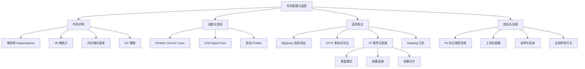
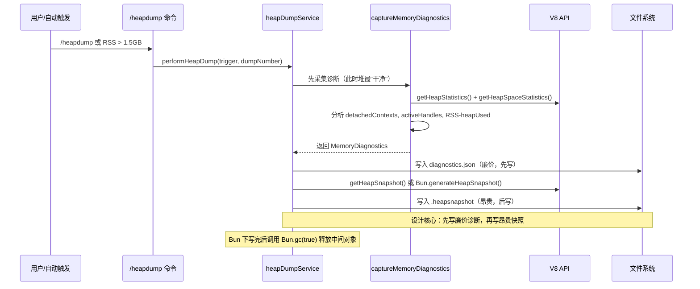
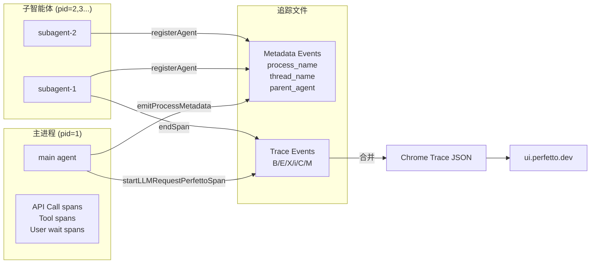
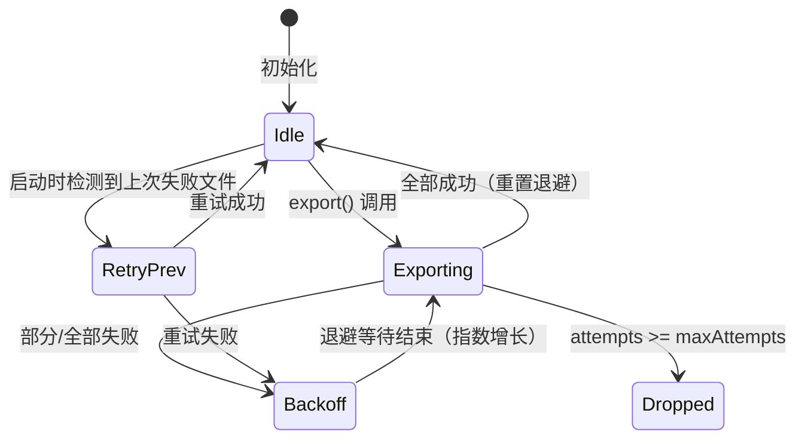
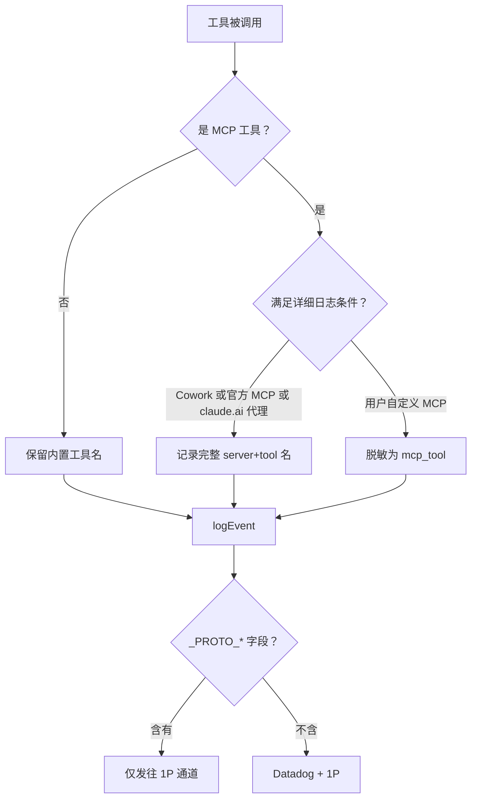

# 第15课：内存管理、监控与诊断

---

## 一、课程信息

| 项目 | 内容 |
|------|------|
| **所属阶段** | 第五阶段：性能工程与可观测性 |
| **建议时长** | 100 分钟 |
| **难度等级** | ⭐⭐⭐⭐⭐（专家） |
| **前置课程** | 第14课（启动性能优化）、Node.js V8 堆模型基础 |

### 学习目标

1. 掌握 Claude Code 堆转储（Heap Dump）的完整流程，学会利用 V8 诊断数据定位内存泄漏
2. 理解 Perfetto 追踪的 Chrome Trace Event 格式，能够使用 ui.perfetto.dev 分析多智能体会话性能
3. 深入分析 OTel（OpenTelemetry）遥测导出体系：BigQuery、OTLP、1P 事件记录器的分层设计
4. 掌握采样策略与隐私脱敏的工程实践，理解 PII 标记类型系统的设计哲学
5. 理解 GC 策略与缓存生命周期管理，建立"内存健康指标体系"的思维框架

---

## 二、核心概念

### 2.1 概念体系全图



### 2.2 关键术语辨析

| 术语 | 定义 | 在 Claude Code 中的含义 |
|------|------|------------------------|
| **RSS** | Resident Set Size，进程实际占用的物理内存 | 包含 V8 堆 + Native 内存 + 代码段 |
| **Heap Used** | V8 管理的活跃对象总大小 | 能被 heapsnapshot 捕获的部分 |
| **External** | V8 外部的 ArrayBuffer / Native 绑定内存 | node-pty、sharp 等 native addon 的内存 |
| **Detached Context** | 已删除但未被 GC 回收的 V8 Context | 是 iframe/模块泄漏的关键指标 |
| **Active Handle** | 保持事件循环运转的资源（Timer/Socket/Pipe） | >100 个时提示潜在的 Timer/Socket 泄漏 |
| **Delta Temporality** | OTel 指标每次导出的增量（而非累积值） | 避免产品仪表盘被累积值破坏 |
| **PII** | 个人身份信息 | MCP 工具名、用户 ID、代码路径等 |

---

## 三、架构设计与设计思想

### 3.1 内存诊断架构



**核心设计思想：防御性顺序**

> "先写廉价的，再写昂贵的。"

堆快照序列化（`getHeapSnapshot()`）对于大堆可能消耗数 GB 内存，并在序列化过程中分配大量临时对象，极端情况下会 OOM 崩溃。通过先写入诊断 JSON（几 KB），即使快照写入失败，也能保留最关键的内存统计数据（堆大小、活跃句柄、泄漏指标），让运维人员有数据可分析。

### 3.2 遥测导出分层架构

```mermaid
graph TB
    subgraph 应用层
        App[应用代码] -->|logEvent| API[analytics/index.ts]
    end

    subgraph 路由层
        API -->|附加后| Sink[analytics/sink.ts]
        Sink -->|采样决策| Sample{shouldSampleEvent}
        Sample -->|保留| Route{路由判断}
        Route -->|stripProtoFields| DD[Datadog]
        Route -->|完整字段| FP[1P 事件记录器]
    end

    subgraph 导出层
        DD -->|HTTP POST| DDApi[Datadog API]
        FP -->|OTel BatchProcessor| Exp[FirstPartyEventLoggingExporter]
        Exp -->|成功| BQ[/api/event_logging/batch]
        Exp -->|失败| Disk[落盘 JSONL]
        Disk -->|下次启动| Retry[指数退避重试]
    end

    subgraph 基础设施层
        OTel[OTel SDK] --> BQ2[BigQuery 指标]
        OTel --> OTLP[OTLP gRPC/HTTP]
        OTel --> Prom[Prometheus]
    end
```

**三层分离的设计原因：**

| 层次 | 职责 | 不耦合的理由 |
|------|------|------------|
| **入口 API** | 无依赖的纯接口，事件队列 | 避免循环依赖，启动路径零成本 |
| **路由层** | 采样、脱敏、后端分发 | 可热替换，测试时可 mock |
| **导出层** | 协议适配、重试、持久化 | 每种后端独立演化，互不影响 |

### 3.3 Perfetto 多智能体追踪架构



---

## 四、关键源码深度走查

### 4.1 堆转储服务：诊断数据结构设计

**文件**：`src/utils/heapDumpService.ts`

```typescript
export type MemoryDiagnostics = {
  timestamp: string
  sessionId: string
  trigger: 'manual' | 'auto-1.5GB'
  dumpNumber: number          // 本会话第几次自动转储（0=手动）

  memoryUsage: {
    heapUsed: number          // V8 堆活跃对象 → 能在 heapsnapshot 中找到
    heapTotal: number         // V8 堆总分配
    external: number          // Native 绑定内存 → 不在 heapsnapshot 中！
    arrayBuffers: number      // ArrayBuffer 占用
    rss: number               // 进程总物理内存
  }

  memoryGrowthRate: {
    bytesPerSecond: number    // RSS / uptime
    mbPerHour: number         // 换算为 MB/小时，方便判断泄漏速度
  }

  v8HeapStats: {
    heapSizeLimit: number     // V8 最大堆上限
    mallocedMemory: number    // V8 外部 malloc 内存
    peakMallocedMemory: number// 峰值 malloc 内存（历史高水位）
    detachedContexts: number  // ⚠️ 关键泄漏指标：已分离但未回收的 Context
    nativeContexts: number    // 活跃的 V8 Context 数量
  }

  v8HeapSpaces?: Array<{      // 各堆空间详情（Bun 不支持，可能 undefined）
    name: string              // new_space/old_space/code_space 等
    size: number
    used: number
    available: number
  }>

  activeHandles: number       // ⚠️ 活跃 Handle 数（Timer/Socket/Pipe）
  activeRequests: number      // 待完成的异步操作数
  openFileDescriptors?: number // Linux 专属：打开的文件描述符数

  analysis: {
    potentialLeaks: string[]  // 自动分析出的泄漏提示
    recommendation: string    // 人类可读的建议
  }

  smapsRollup?: string        // Linux 专属：/proc/self/smaps_rollup 详细内存映射
}
```

**数据结构设计亮点：**

1. **RSS - heapUsed = nativeMemory**：如果差值很大，说明泄漏在 Native 层（node-pty、sharp 等），需要专门检查原生插件
2. **detachedContexts**：大于 0 是明确的泄漏信号，通常来自模块动态导入/卸载不净
3. **smapsRollup**：Linux 独有，提供匿名映射、文件映射、堆、栈的精细分类，是排查 Native 泄漏的利器

```typescript
export async function captureMemoryDiagnostics(
  trigger: 'manual' | 'auto-1.5GB',
  dumpNumber = 0,
): Promise<MemoryDiagnostics> {
  const usage = process.memoryUsage()
  const heapStats = getHeapStatistics()
  const uptimeSeconds = process.uptime()

  // getHeapSpaceStatistics() 在 Bun 中不可用，需要跨运行时兼容
  let heapSpaceStats: HeapSpaceInfo[] | undefined
  try {
    heapSpaceStats = getHeapSpaceStatistics()
  } catch {
    // Bun 运行时不支持，静默忽略
  }

  // 使用内部 API 获取 Handle/Request 计数（稳定的内部接口）
  const activeHandles = (process as any)._getActiveHandles().length
  const activeRequests = (process as any)._getActiveRequests().length

  // 尝试读取 Linux /proc/self/fd 计数文件描述符
  let openFileDescriptors: number | undefined
  try {
    openFileDescriptors = (await readdir('/proc/self/fd')).length
  } catch {
    // 非 Linux 或无权限，跳过
  }

  // 计算内存增长速率（简化估算：RSS/uptime）
  const bytesPerSecond = uptimeSeconds > 0 ? usage.rss / uptimeSeconds : 0
  const mbPerHour = (bytesPerSecond * 3600) / (1024 * 1024)

  // 自动分析潜在泄漏
  const potentialLeaks: string[] = []
  if (heapStats.number_of_detached_contexts > 0) {
    potentialLeaks.push(
      `${heapStats.number_of_detached_contexts} detached context(s) - possible iframe/context leak`,
    )
  }
  if (activeHandles > 100) {
    potentialLeaks.push(`${activeHandles} active handles - possible timer/socket leak`)
  }
  if (usage.rss - usage.heapUsed > usage.heapUsed) {
    potentialLeaks.push('Native memory > heap - leak may be in native addons')
  }
  if (mbPerHour > 100) {
    potentialLeaks.push(`High memory growth rate: ${mbPerHour.toFixed(1)} MB/hour`)
  }
  // ...
}
```

**自动分析阈值的工程选择：**

| 指标 | 阈值 | 选择依据 |
|------|------|---------|
| activeHandles > 100 | 100 | 正常的 Node.js 应用约有 5-20 个 Handle；>100 明显异常 |
| nativeMemory > heapUsed | 1x | RSS 中非堆部分超过堆本身，Native 泄漏概率高 |
| mbPerHour > 100 | 100 MB/h | 按 8 小时工作日计算，会增长 800MB，不可接受 |
| openFDs > 500 | 500 | 默认 fd 上限 1024，超 500 说明资源释放有问题 |

> 💡 **设计点评 — 防御性诊断数据结构**
>
> **好在哪里**：`MemoryDiagnostics` 把能收集的内存指标统统放进去，包括"RSS - heapUsed = nativeMemory"这个推算值。这就像医院的全身体检报告——比你"觉得哪里不舒服"再去单查更全面。`analysis.potentialLeaks` 字段直接给出分析结论，运维不需要手动查阈值表。
>
> **如果不这样做**：出问题时只有原始数字，值班工程师凌晨两点对着 RSS=1.5GB 不知道该看哪里，还需要翻文档查阈值、手算 nativeMemory，排查时间翻倍。

---

### 4.2 performHeapDump：防御性写入顺序

```typescript
export async function performHeapDump(
  trigger: 'manual' | 'auto-1.5GB' = 'manual',
  dumpNumber = 0,
): Promise<HeapDumpResult> {
  try {
    // STEP 1: 先采集诊断（在任何其他 I/O 之前！）
    // 堆转储本身会分配内存，会影响诊断数据的准确性
    const diagnostics = await captureMemoryDiagnostics(trigger, dumpNumber)

    // 打印关键信息（调试模式）
    logForDebugging(`[HeapDump] Memory state:
  heapUsed: ${toGB(diagnostics.memoryUsage.heapUsed)} GB (in snapshot)
  external: ${toGB(diagnostics.memoryUsage.external)} GB (NOT in snapshot)
  rss: ${toGB(diagnostics.memoryUsage.rss)} GB (total process)
  ${diagnostics.analysis.recommendation}`)

    const suffix = dumpNumber > 0 ? `-dump${dumpNumber}` : ''
    const heapFilename = `${sessionId}${suffix}.heapsnapshot`
    const diagFilename = `${sessionId}${suffix}-diagnostics.json`

    // STEP 2: 先写诊断 JSON（几 KB，几乎不会失败）
    await writeFile(diagPath, jsonStringify(diagnostics, null, 2), { mode: 0o600 })

    // STEP 3: 再写堆快照（可能几百 MB，可能 OOM 崩溃）
    await writeHeapSnapshot(heapPath)

    // STEP 4: 上报遥测（知道发生了转储）
    logEvent('tengu_heap_dump', {
      triggerManual: trigger === 'manual',
      triggerAuto15GB: trigger === 'auto-1.5GB',
      dumpNumber,
      success: true,
    })

    return { success: true, heapPath, diagPath }
  } catch (err) {
    // 即使快照失败，也要上报（诊断文件可能已经写入）
    logEvent('tengu_heap_dump', { ..., success: false })
    return { success: false, error: error.message }
  }
}
```

**跨运行时的堆快照实现：**

```typescript
async function writeHeapSnapshot(filepath: string): Promise<void> {
  if (typeof Bun !== 'undefined') {
    // Bun：堆快照是同步 API，不支持流式输出
    // 使用同步 writeFileSync 避免跨线程复制大字符串
    writeFileSync(filepath, Bun.generateHeapSnapshot('v8', 'arraybuffer'), {
      mode: 0o600,
    })

    // 关键：写完后主动触发 GC，尽快释放快照中间对象
    // 防止快照序列化产生的临时对象触发下一次自动转储（形成循环）
    Bun.gc(true)
    return
  }

  // Node.js：堆快照是流式 API，内存效率更高
  const writeStream = createWriteStream(filepath, { mode: 0o600 })
  const heapSnapshotStream = getHeapSnapshot()
  await pipeline(heapSnapshotStream, writeStream)  // 自动处理流错误与清理
}
```

**为什么 Bun 用同步 writeFileSync？**

注释解释得很清楚：Bun 的 `generateHeapSnapshot` 返回的是一个大字符串/ArrayBuffer。如果用异步写入，Node.js 的跨线程传递需要复制整个字符串（可能 > 1GB）。同步写入避免了这次内存复制，是这里的正确权衡。

> 💡 **设计点评 — 先写廉价再写昂贵的防御性顺序**
>
> **好在哪里**：先写几KB的诊断JSON，再写几百MB的堆快照。就像考试先把会的题做了，不会的题放后面——即使最后没时间做完（OOM崩溃），已完成的部分（诊断数据）还在。Bun 下写完快照立即 `Bun.gc(true)` 主动释放，防止堆快照的中间对象反过来触发下一次自动转储（自我循环）。
>
> **如果不这样做**：先写堆快照，OOM 崩溃时什么诊断信息都没有，运维面对一个空目录；或者不主动 GC，堆快照产生的几百MB临时对象积压，触发再一次自动转储，系统陷入转储循环。

---

### 4.3 Perfetto 追踪：事件环形缓冲区设计

**文件**：`src/utils/telemetry/perfettoTracing.ts`

```typescript
// 全局状态：分为元数据事件和业务事件两个池
const metadataEvents: TraceEvent[] = []  // 不被淘汰（进程/线程名等）
const events: TraceEvent[] = []          // 有上限，超出时淘汰旧事件

// 设计注释：22 个推送点 × 多轮对话 = 无界增长
// 100,000 条 × ~300 B/条 ≈ 30MB，足够任何调试场景
const MAX_EVENTS = 100_000

/**
 * 淘汰最旧的一半事件（摊销 O(1)）
 * 每 60 秒由 stale span 清理定时器触发
 */
function evictOldestEvents(): void {
  if (events.length < MAX_EVENTS) return

  // 一次淘汰 50%，而不是 1 条
  // 这样平均 50,000 次 push 才需要一次 splice，摊销代价低
  const dropped = events.splice(0, MAX_EVENTS / 2)

  // 插入标记事件，让 Perfetto UI 显示"这里有数据丢失"
  events.unshift({
    name: 'trace_truncated',
    cat: '__metadata',
    ph: 'i',      // Instant event
    ts: dropped[dropped.length - 1]?.ts ?? 0,
    pid: 1,
    tid: 0,
    args: { dropped_events: dropped.length },
  })
}
```

**三重退出保障：**

```typescript
export function initializePerfettoTracing(): void {
  // ...

  // 保障1：cleanupRegistry（正常退出路径）
  registerCleanup(async () => {
    await writePerfettoTrace()
  })

  // 保障2：process.beforeExit（事件循环清空时）
  process.on('beforeExit', () => {
    void writePerfettoTrace()
  })

  // 保障3：process.exit（最后兜底，同步写入）
  process.on('exit', () => {
    if (!traceWritten) {
      writePerfettoTraceSync()  // 同步版本，强制在进程退出前完成
    }
  })
}
```

这三重保障对应不同的退出场景：
- `cleanupRegistry`：处理正常的优雅关闭
- `beforeExit`：处理 `process.exit()` 调用前的异步清理窗口
- `exit`：最后防线，捕获所有情况（包括未捕获异常导致的退出）

**陈旧 Span 清理机制：**

```typescript
const STALE_SPAN_TTL_MS = 30 * 60 * 1000  // 30 分钟

function evictStaleSpans(): void {
  const now = getTimestamp()
  const ttlUs = STALE_SPAN_TTL_MS * 1000

  for (const [spanId, span] of pendingSpans) {
    if (now - span.startTime > ttlUs) {
      // 不是静默删除，而是发射一个 End 事件（标记为 evicted）
      // 这样在 Perfetto UI 中仍然可以看到这个 span（但会显示很长）
      events.push({
        name: span.name,
        cat: span.category,
        ph: 'E',
        ts: now,
        pid: span.agentInfo.processId,
        tid: span.agentInfo.threadId,
        args: { ...span.args, evicted: true, duration_ms: ... },
      })
      pendingSpans.delete(spanId)
    }
  }
}
```

**设计决策：强制关闭 vs 静默删除**

如果静默删除悬空 Span，Perfetto UI 会显示"未关闭的 B 事件"警告，影响可读性。通过发射带 `evicted: true` 标记的 E 事件，让 UI 显示一个"非常长但明确结束"的 span，调试者可以立即看出哪个操作卡住了超过 30 分钟。

> 💡 **设计点评 — 三重退出保障 + 摊销淘汰**
>
> **好在哪里**：三个进程退出钩子（`cleanupRegistry`、`beforeExit`、`exit`）覆盖了从优雅关闭到强制退出的所有路径，就像三道安全门——任意一道都能确保追踪文件写入。摊销淘汰（一次删50%而不是1条）让 100,000 次 push 只有一次 O(n/2) 的重操作，平均下来接近 O(1)。
>
> **如果不这样做**：只有一个退出钩子的追踪系统，Ctrl+C 时可能丢失最后几分钟的数据；每次 push 都检查是否超限并删一条，在高频场景下每次 push 都是 O(n) 操作，追踪代码本身成了性能瓶颈。

---

### 4.4 OTel 遥测导出：动态协议选择与懒加载

**文件**：`src/utils/telemetry/instrumentation.ts`

```typescript
// 文件头注释解释了为什么用动态导入：
// OTLP/Prometheus exporters are dynamically imported inside the protocol
// switch statements below. A process uses at most one protocol variant per
// signal, but static imports would load all 6 (~1.2MB) on every startup.

async function getOtlpReaders() {
  const exporterTypes = parseExporterTypes(process.env.OTEL_METRICS_EXPORTER)

  const exporters = []
  for (const exporterType of exporterTypes) {
    if (exporterType === 'otlp') {
      const protocol = process.env.OTEL_EXPORTER_OTLP_PROTOCOL?.trim()

      switch (protocol) {
        case 'grpc': {
          // 延迟导入：@grpc/grpc-js 约 700KB，只在需要 gRPC 时才加载
          const { OTLPMetricExporter } = await import(
            '@opentelemetry/exporter-metrics-otlp-grpc'
          )
          exporters.push(new OTLPMetricExporter())
          break
        }
        case 'http/json': {
          const { OTLPMetricExporter } = await import(
            '@opentelemetry/exporter-metrics-otlp-http'
          )
          exporters.push(new OTLPMetricExporter(httpConfig))
          break
        }
        case 'http/protobuf': {
          // ant 默认协议
          const { OTLPMetricExporter } = await import(
            '@opentelemetry/exporter-metrics-otlp-proto'
          )
          exporters.push(new OTLPMetricExporter(httpConfig))
          break
        }
      }
    }
  }
  // ...
}
```

**动态导入的性能收益：**

每种协议的导出器加载约 200-700KB 的依赖。如果静态导入 3 种协议 × 3 种信号（metrics/logs/traces）= 9 个导出器模块，但实际每个进程只使用其中 1-2 种，节省约 1.2MB 的初始化开销，对 CLI 工具的启动时间影响显著。

**BigQuery 指标导出器的 Delta 时间性（Temporality）：**

```typescript
// src/utils/telemetry/bigqueryExporter.ts
selectAggregationTemporality(): AggregationTemporality {
  // ⚠️ 警告注释：DO NOT CHANGE THIS TO CUMULATIVE
  // It would mess up the aggregation of metrics
  // for CC Productivity metrics dashboard
  return AggregationTemporality.DELTA
}
```

**为什么必须用 DELTA 而不是 CUMULATIVE？**

```
CUMULATIVE 问题示例：
  t=0  会话启动，counter = 0
  t=5  记录 5 次 API 调用，导出 counter = 5
  t=10 重启会话，counter 重置为 0
  t=15 记录 3 次 API 调用，导出 counter = 3
  BigQuery 聚合：5 + 3 = 8 ✅ (看起来对)

  但如果进程没有重启：
  t=0  counter = 0
  t=5  counter = 5，导出 5
  t=10 counter = 12，导出 12（累积）
  BigQuery SUM：5 + 12 = 17 ❌ 实际只有 12 次！

DELTA 正确结果：
  t=5  导出 delta=5
  t=10 导出 delta=7（5→12 的增量）
  BigQuery SUM：5 + 7 = 12 ✅
```

> 💡 **设计点评 — 动态协议导入 + Delta 时间性**
>
> **好在哪里**：`grpc` 依赖包约 700KB，用动态导入只在真正需要 gRPC 时才加载，其他协议用户的启动时间不受影响。DELTA 指标语义上等同于"这段时间内新增了多少"，BigQuery SUM 聚合才有意义——注释里大写加粗的 "DO NOT CHANGE" 就是给未来的你看的，防止一次无心的"优化"把 dashboard 搞坏。
>
> **如果不这样做**：静态导入所有协议变体，哪怕你只用 HTTP，也要加载 gRPC 的 700KB 依赖，CLI 启动变慢。用 CUMULATIVE 后 BigQuery 的指标仪表盘数字会随进程累积单调增长，A/B 实验的对照/实验组增量计算全部错误。

---

### 4.5 第一方事件记录器：可靠性工程

**文件**：`src/services/analytics/firstPartyEventLoggingExporter.ts`

```typescript
export class FirstPartyEventLoggingExporter implements LogRecordExporter {
  // 退避参数（可通过 GrowthBook 动态调整）
  private readonly baseBackoffDelayMs: number   // 默认 500ms
  private readonly maxBackoffDelayMs: number    // 默认 30000ms（30秒）
  private readonly maxAttempts: number          // 默认 8 次

  constructor(options) {
    // ...
    // 构造时自动重试上一会话遗留的失败批次
    void this.retryPreviousBatches()
  }

  async export(logs, resultCallback): Promise<void> {
    const exportPromise = this.doExport(logs, resultCallback)

    // pendingExports 列表：forceFlush 时等待所有进行中的导出完成
    this.pendingExports.push(exportPromise)
    void exportPromise.finally(() => {
      const index = this.pendingExports.indexOf(exportPromise)
      if (index > -1) void this.pendingExports.splice(index, 1)
    })
  }

  private async doExport(logs, resultCallback): Promise<void> {
    // ...
    const failedEvents = await this.sendEventsInBatches(events)

    if (failedEvents.length > 0) {
      // 失败路径：先落盘，再安排退避重试
      await this.queueFailedEvents(failedEvents)
      this.scheduleBackoffRetry()
      resultCallback({ code: ExportResultCode.FAILED, ... })
      return
    }

    // 成功路径：重置退避，并立即重试之前积压的失败事件
    this.resetBackoff()
    if ((await this.getQueuedEventCount()) > 0 && !this.isRetrying) {
      void this.retryFailedEvents()
    }
    resultCallback({ code: ExportResultCode.SUCCESS })
  }
}
```

**退避重试的状态机：**



**短路失败优化：**

```typescript
private async sendEventsInBatches(events): Promise<FailedEvents[]> {
  const batches = chunk(events, this.maxBatchSize)
  const failedBatchEvents: FailedEvents[] = []

  for (let i = 0; i < batches.length; i++) {
    const success = await this.sendBatch(batches[i])

    if (!success) {
      // 关键设计：首个批次失败 → 假设服务不可用
      // 将剩余未发送的批次直接加入失败队列，不再浪费网络请求
      failedBatchEvents.push(...batches.slice(i).flat())
      break  // 短路退出
    }
  }

  return failedBatchEvents
}
```

**设计洞察**：如果发送 5 个批次时第 2 个失败，继续尝试第 3-5 个几乎必然也会失败（服务端故障），白白消耗网络资源和超时时间。短路优化让系统更快进入退避状态，减少无效网络请求。

> 💡 **设计点评 — 可靠消息传输三段式 + 短路优化**
>
> **好在哪里**：发送→失败落盘→退避重试，就像快递寄失败了不直接扔掉，而是放在仓库等下次重发。`BATCH_UUID` 让进程重启后只捡"上次没发完的"，不会捡自己刚写的。短路优化（第一批失败就不发后面的）是"快速放弃"原则——服务端挂了，继续发只是浪费自己的时间。
>
> **如果不这样做**：无落盘机制，网络故障期间的遥测事件永久丢失，你永远不知道那段时间用户做了什么；没有 BATCH_UUID，重试循环捡起自己刚写的失败文件，形成自我干扰死循环。

---

### 4.6 隐私脱敏：类型系统驱动的安全架构

**文件**：`src/services/analytics/metadata.ts`、`src/services/analytics/index.ts`

```typescript
// ===== 双层 Marker 类型系统 =====

// 类型1：已验证不含代码/路径的普通指标
export type AnalyticsMetadata_I_VERIFIED_THIS_IS_NOT_CODE_OR_FILEPATHS = never

// 类型2：已验证是 PII 标记数据（有权限控制的列）
export type AnalyticsMetadata_I_VERIFIED_THIS_IS_PII_TAGGED = never

// 使用示例：强制开发者在代码中明确声明意图
logEvent('tool_use', {
  toolName: sanitizedName as AnalyticsMetadata_I_VERIFIED_THIS_IS_NOT_CODE_OR_FILEPATHS,
  userId: userId as AnalyticsMetadata_I_VERIFIED_THIS_IS_PII_TAGGED,
})
```

**工具名脱敏逻辑：**

```typescript
export function sanitizeToolNameForAnalytics(toolName: string) {
  // MCP 工具名格式：mcp__<server>__<tool>
  // server 名可能包含用户私有配置（PII-medium）
  if (toolName.startsWith('mcp__')) {
    return 'mcp_tool' as AnalyticsMetadata_I_VERIFIED_THIS_IS_NOT_CODE_OR_FILEPATHS
  }
  // 内置工具名（Bash、Read、Write 等）固定字符串，安全
  return toolName as AnalyticsMetadata_I_VERIFIED_THIS_IS_NOT_CODE_OR_FILEPATHS
}
```

**多级脱敏策略：**



**`stripProtoFields` 实现：**

```typescript
export function stripProtoFields<V>(
  metadata: Record<string, V>,
): Record<string, V> {
  let result: Record<string, V> | undefined

  for (const key in metadata) {
    if (key.startsWith('_PROTO_')) {
      // 懒复制：只有在找到 _PROTO_ 字段时才分配新对象
      // 没有 _PROTO_ 字段时返回原始引用（零内存开销）
      if (result === undefined) {
        result = { ...metadata }
      }
      delete result[key]
    }
  }

  return result ?? metadata  // 没有 _PROTO_ 字段时返回原始引用
}
```

**懒复制（Copy-on-Detect）模式**：普通事件（99% 情况）没有 `_PROTO_` 字段，函数直接返回原引用，零分配。只有包含 PII 标记字段的事件才会触发 `{ ...metadata }` 展开，节省了大量无效拷贝开销。

> 💡 **设计点评 — 类型系统驱动的安全审查**
>
> **好在哪里**：`AnalyticsMetadata_I_VERIFIED_THIS_IS_NOT_CODE_OR_FILEPATHS = never` 这个类型名字就是审查记录，任何往分析接口里传字符串的开发者都必须通过类型断言"宣誓"自己已经确认过数据安全。这比"在 Code Review 里检查"要可靠得多——编译器不会累，不会漏看。`stripProtoFields` 的懒复制让 99% 没有 PII 的事件零开销通过。
>
> **如果不这样做**：依靠人工 Review 检查隐私数据，某个开发者加了一个包含文件路径的字段没人发现，用户的私有代码路径上报到 Datadog，合规风险。

---

## 五、Harness Engineering

### Harness Engineering 视角

本课的源码展示了一种"可观测优先"的工程哲学——先把诊断能力建设好，问题发生时才有抓手。`MemoryDiagnostics` 结构体就是一份标准化的"健康报告单"，你不需要在 OOM 发生后才开始慌乱找日志，而是在任意时刻都能用 `/heapdump` 拿到一份结构化的快照。这就是驾驭（Harness）内存的本质：**不是防止问题发生，而是确保问题发生时你能立刻看清楚**。

可靠消息传输的三段式（发送→失败落盘→退避重试）是另一个驾驭思路：与其假设网络永远可靠，不如从设计上假设网络会失败，然后把"失败恢复"变成默认路径，而不是异常处理。BATCH_UUID 防止自我干扰，最大重试次数防止无限循环，这些都是"给系统设置安全栏杆"的典型手法。

### 对大模型应用的启发

- **诊断先于功能**：你的 AI 应用在生产上遇到内存增长时，如果没有预先埋点，你只能猜。学 Claude Code 的做法：在 Agent 启动时就开始采集内存基线，每隔固定时间检查增长速率，超阈值时自动触发堆转储。这是主动防御，不是事后补救。
- **类型系统是最便宜的 Code Review**：`AnalyticsMetadata_I_VERIFIED_THIS_IS_NOT_CODE_OR_FILEPATHS = never` 这个模式告诉你：编译器不会累，不会漏看。隐私合规检查如果只靠人工 Review，早晚会出问题。把安全约束编码进类型，让编译器替你站岗。
- **摊销设计让热路径不卡顿**：追踪事件的批量淘汰（每次淘汰 50%）而不是每次 push 都检查，就是为了让高频路径保持 O(1)。你的 AI 应用如果有高频日志记录，也要考虑批量写盘而不是每条实时落盘。
- **可靠性≠不出错，而是能恢复**：三段式重试+JSONL 落盘的组合告诉你：大模型应用的网络调用必然会偶发失败，与其把错误处理当特殊情况，不如把"失败→落盘→重试"设计成标准流程。
- **Delta 还是 Cumulative，这是个承诺**：你的监控指标一旦上线，就很难改聚合方式，因为历史数据的语义会变。在设计阶段就写清楚"这个指标是 delta 语义，不要改成 cumulative"，比事后在 PR 里发现问题要便宜得多。

---

## 六、思考题与进阶方向

### 思考题

**基础**

**题目 1**：`diagnostics.json` 为什么必须在 `.heapsnapshot` 之前写入？如果顺序颠倒，在什么场景下会产生问题？

<details>
<summary>💡 参考答案</summary>

`.heapsnapshot` 可能高达几百 MB，写入时本身也会消耗内存，如果在低内存场景下写快照失败甚至触发 OOM，后续的 `diagnostics.json`（包含 `heapUsed`、`detachedContexts` 等关键诊断字段）就永远写不进去了。而 `diagnostics.json` 只有几 KB，几乎不会失败。先写轻量的，再写重量的，这是"防御性写入顺序"——即使后续步骤失败，你至少还有最基础的诊断数据能读取，不会两手空空。

</details>

**题目 2**：Perfetto 的 `metadataEvents` 和 `events` 为什么要分开存储？如果合并存储，会有什么问题？

<details>
<summary>💡 参考答案</summary>

`metadataEvents` 存储进程名、线程名等 M 类事件，Perfetto UI 需要它们来渲染轨道标签。如果合并存储，当 `events` 超限触发批量淘汰（`splice(0, MAX/2)`）时，M 类事件会被随机淘汰。结果就是 Perfetto 里所有轨道变成 "Process 2"、"Thread 1234" 这样的匿名数字，追踪数据完全无法阅读。元数据量是有界的（每个 Agent 约 3 个 M 类事件），单独维护没有内存风险，但能保证可读性。

</details>

**题目 3**：`interval.unref()` 的作用是什么？如果不调用它，会发生什么？

<details>
<summary>💡 参考答案</summary>

Node.js 的事件循环只有在还有"活跃工作"时才不退出，`setInterval` 创建的定时器默认是"活跃的"，会阻止进程退出。`unref()` 把定时器标记为"弱引用"——如果它是唯一剩余的工作，进程可以正常退出。如果不调用，用户 Ctrl+C 后，即使所有业务逻辑已完成，事件循环仍会被 Perfetto 的写盘定时器保活，进程就是退不掉，只能 kill -9。

</details>

**进阶**

**题目 4**：`stripProtoFields` 函数使用了"懒复制"优化（只有在找到 `_PROTO_` 字段时才 `{ ...metadata }`）。请分析这个优化在实际场景中能节省多少内存分配，何时值得这样设计？

<details>
<summary>💡 参考答案</summary>

在实际场景中，99% 以上的分析事件不包含 `_PROTO_` 字段，这意味着懒复制避免了绝大多数对象复制开销。每次 `{ ...metadata }` 都是一次对象分配和浅复制，在高频事件流（Claude Code 每次 API 调用都会触发多个分析事件）中，这个开销会显著增加 GC 压力。值得这样设计的条件是：热路径中的空操作频率远高于需要实际操作的频率（如 > 90%），且操作本身的开销不可忽略（对象分配会触发 GC 标记）。

</details>

**题目 5**：`BATCH_UUID` 机制解决了自我干扰问题，但如果同一会话（相同 sessionId）同时启动了两个 Claude Code 进程，会发生什么？BATCH_UUID 能保护这种情况吗？

<details>
<summary>💡 参考答案</summary>

两个进程各自有不同的 `BATCH_UUID`，所以互不干扰——进程 A 不会捡起进程 B 的落盘文件，反之亦然。但这两个进程会**并发写入同一个 sessionId 的分析事件**，导致事件重复上报、计数翻倍。`BATCH_UUID` 的设计目标仅是防止单进程的自我干扰，不是防止多进程竞争。这种情况下，需要更上层的进程锁或单例检测来阻止同一会话多次启动。

</details>

**题目 6**：BigQuery 指标导出器中，如果 `selectAggregationTemporality` 被改为 `CUMULATIVE`，而后端 BigQuery 仍按 delta 语义聚合，会产生什么具体的数据错误？

<details>
<summary>💡 参考答案</summary>

DELTA 语义下，每个数据点代表"这段时间内新增了多少"，BigQuery 按天求和得到当日总量。改为 CUMULATIVE 后，每个数据点代表"从程序启动到现在的累积量"，BigQuery 再求和就变成了"把一个递增数列加起来"，结果会是 1+2+3+...+N 这样的三角数，完全失真。仪表板上的"今日 API 调用次数"会变成一个持续膨胀的天文数字，A/B 实验对照组的数据差异会被噪声完全掩盖，无法做任何有意义的分析。

</details>

**架构**

**题目 7**：第一方事件记录器使用了 OTel `BatchLogRecordProcessor`，而不是直接实现批量逻辑。这个选择有什么优缺点？在什么场景下可能需要绕过 OTel 直接实现？

<details>
<summary>💡 参考答案</summary>

优点：复用 OTel 成熟的批量逻辑（队列满时 flush、定时 flush、优雅关闭时 flush），避免重复造轮子，且与 OTel 生态兼容，未来可以无缝切换导出后端。缺点：OTel 的 Processor 是通用设计，在 Claude Code 的特殊场景（如失败落盘重试、BATCH_UUID 隔离）中需要额外包装层。需要绕过 OTel 的场景：事件需要特殊序列化格式（如 JSONL 而非 protobuf）、需要进程级唯一标识来防止重试干扰、或者 OTel 的批量窗口策略不满足业务的实时性要求。

</details>

**题目 8**：当前的内存增长速率估算是 `RSS / uptime`，这是一个简化公式，在什么情况下会产生误判？如何设计更准确的增长速率估算？

<details>
<summary>💡 参考答案</summary>

`RSS / uptime` 把所有时间段的平均值当作当前速率，会低估"最近快速增长"的情况：如果程序跑了 10 小时都很稳定，最后 1 小时突然开始泄漏，这个公式算出来的速率远低于实际当前速率。更准确的方案是滑动窗口：记录最近 N 个采样点的 RSS，用最新值和最旧值的差除以时间跨度，只反映最近一段时间的趋势。或者更精细地，维护两次堆快照的 `heapUsed` 差值，而不是用 RSS（RSS 包含了很多 Node.js 运行时的固定开销，会干扰判断）。

</details>

### 进阶方向

1. **Chrome DevTools 堆快照分析**：学习使用 Chrome DevTools 的 Memory 面板，掌握 Summary/Comparison/Containment/Statistics 四种视图，能够从 `.heapsnapshot` 文件中找到内存泄漏源
2. **Perfetto UI 深度使用**：访问 [ui.perfetto.dev](https://ui.perfetto.dev)，学习 SQL 查询（Perfetto 支持 SQLite 查询 trace）和火焰图分析
3. **OpenTelemetry 规范阅读**：研究 [OTel 指标聚合时间性规范](https://opentelemetry.io/docs/reference/specification/metrics/data-model/#temporality)，理解 DELTA vs CUMULATIVE 的完整语义
4. **Node.js 内存模型**：深入研究 V8 的 New Space/Old Space/Code Space/Map Space 的不同生命周期策略，理解增量 GC 和 Major GC 的触发条件
5. **可观测性三支柱**：研究 Metrics / Logs / Traces 三者在故障诊断中的互补关系，Claude Code 同时使用了这三者的典型模式

---

## 附录一：内存健康指标阈值速查

| 指标 | 正常范围 | 警戒 | 严重 |
|------|---------|------|------|
| Heap Used | < 500MB | 500-1000MB | > 1000MB（自动转储触发：1500MB） |
| Detached Contexts | 0 | 1-5 | > 5 |
| Active Handles | < 50 | 50-100 | > 100 |
| Open FDs（Linux） | < 200 | 200-500 | > 500 |
| Memory Growth Rate | < 50 MB/h | 50-100 MB/h | > 100 MB/h |
| Native Memory / Heap | < 0.5x | 0.5-1x | > 1x |

---

## 附录二：Perfetto 事件类型速查

| ph 值 | 名称 | 用途 | 配对 |
|-------|------|------|------|
| `B` | Begin | 开始一个持续事件 | 需 `E` 关闭 |
| `E` | End | 结束一个持续事件 | 配合 `B` |
| `X` | Complete | 完整事件（含 dur） | 单独使用 |
| `i` | Instant | 瞬时事件（单点） | 单独使用 |
| `C` | Counter | 计数器值变化 | 单独使用 |
| `M` | Metadata | 进程/线程名称 | 单独使用 |
| `b`/`e` | Async Begin/End | 跨线程异步事件 | 需相同 id |

---

## 附录三：关键环境变量速查

| 变量 | 值 | 效果 |
|------|-----|------|
| `CLAUDE_CODE_PROFILE_STARTUP` | `1` | 启用详细启动剖析，输出完整时间线 + 内存快照 |
| `CLAUDE_CODE_PERFETTO_TRACE` | `1` | 启用 Perfetto 追踪，写入 `~/.claude/traces/` |
| `CLAUDE_CODE_PERFETTO_TRACE` | `/path/to/file.json` | 追踪写入指定路径 |
| `CLAUDE_CODE_PERFETTO_WRITE_INTERVAL_S` | `60` | 每 60 秒定期写入追踪文件（默认仅退出时写） |
| `OTEL_METRICS_EXPORTER` | `otlp` | 启用 OTLP 指标导出 |
| `OTEL_LOG_TOOL_DETAILS` | `1` | 启用 MCP 工具名详细日志（调试用） |

---

*本课源码文件：`src/utils/heapDumpService.ts`、`src/utils/telemetry/perfettoTracing.ts`、`src/utils/telemetry/bigqueryExporter.ts`、`src/utils/telemetry/instrumentation.ts`、`src/services/analytics/firstPartyEventLoggingExporter.ts`、`src/services/analytics/metadata.ts`、`src/services/analytics/index.ts`、`src/services/analytics/sink.ts`、`src/services/analytics/config.ts`*
