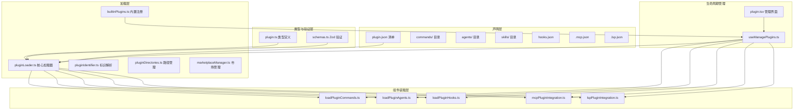
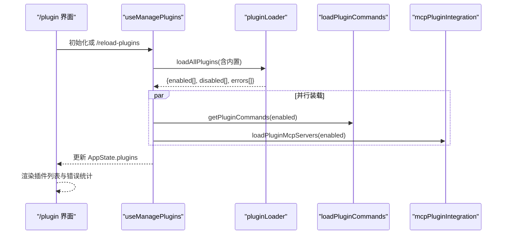

# 第16课：插件系统架构与开发

## 课程信息

| 项目 | 内容 |
|------|------|
| **所属阶段** | 第六阶段：高级功能与系统集成 |
| **建议时长** | 4-5 小时 |
| **难度级别** | ⭐⭐⭐⭐ 高级 |
| **前置知识** | TypeScript、模块系统、Zod 验证、React Hooks |

### 学习目标

1. **理解插件类型系统**：掌握 `BuiltinPluginDefinition`、`LoadedPlugin`、`PluginError` 等核心类型的设计意图
2. **掌握插件加载生命周期**：从来源发现、缓存验证、组件装载到运行时激活的完整流程
3. **理解内置插件与市场插件的信任边界**：`builtin` vs `marketplace` 在安全模型上的本质差异
4. **学会插件沙箱隔离设计**：路径校验、环境变量展开、高风险字段禁止等安全策略
5. **掌握 MCP/LSP 协议集成**：插件如何声明并激活外部服务器，作用域前缀避免命名冲突

---

## 核心概念

### 插件类型体系

Claude Code 的插件分为三类，这三类有截然不同的信任级别和管理方式：

| 类型 | 标识格式 | 信任级别 | 来源 |
|------|----------|----------|------|
| **内置插件** | `{name}@builtin` | 最高（随 CLI 分发） | `src/plugins/builtinPlugins.ts` |
| **市场插件** | `{name}@{marketplace}` | 中等（来源可信市场） | 市场 Git 仓库 |
| **会话级插件** | 内联路径 | 最低（本地开发用） | 本地文件系统 |

**关键区分**：`builtin` 后缀是硬编码在源码中的标识符，不经过网络，绝对可信；而市场插件需要经过来源校验、清单验证、环境变量展开等一系列安全检查。

### 插件组件类型

每个插件可以声明多种组件：

```
commands/    → 对话命令（/slash 命令）
skills/      → 技能目录（Markdown 文件）
agents/      → 自定义代理（系统提示 + 工具组合）
hooks/       → 生命周期钩子（工具调用前后）
mcp/         → MCP 服务器配置
lsp/         → LSP 服务器配置
```

### 声明式架构与运行时装配

插件系统的核心设计思想：**声明式清单 + 运行时装配**。

插件本身只声明"我能提供什么"（清单驱动），而运行时加载器负责将这些声明转化为真实可用的能力（命令、工具、钩子等）。这种解耦使得插件本身无需了解 Claude Code 内部实现，只需遵循清单规范。

---

## 架构设计与设计思想

### 整体架构图



### 为什么这样设计？

**1. 分层职责分离**

每一层只做一件事：
- 声明层不涉及任何运行时逻辑
- 加载层只负责发现、校验、缓存
- 装载层只负责把 LoadedPlugin 映射为核心对象
- 生命周期层只负责协调整体状态

这样当某层出问题时，定位非常准确。

**2. LoadedPlugin 作为统一契约**

`LoadedPlugin` 是跨层通信的核心数据结构。无论是内置插件还是市场插件，最终都被统一表示为 `LoadedPlugin`，后续的装载层完全不需要关心插件来源。

**3. 错误不应阻断其他插件**

每个插件加载失败只影响自身，错误被收集到 `errors[]` 数组，其他插件正常加载。这体现了**容错优先**的设计原则。

### 插件加载生命周期



---

## 关键源码深度走查

### 代码片段 1：内置插件注册表设计

**文件**：[builtinPlugins.ts](file:///Users/zhengk/GitProjects/claw-code-dev-rust/src/plugins/builtinPlugins.ts)

```typescript
/**
 * Built-in Plugin Registry
 * Plugin IDs use the format `{name}@builtin` to distinguish them from
 * marketplace plugins (`{name}@{marketplace}`).
 */
const BUILTIN_PLUGINS: Map<string, BuiltinPluginDefinition> = new Map()

export const BUILTIN_MARKETPLACE_NAME = 'builtin'

export function registerBuiltinPlugin(
  definition: BuiltinPluginDefinition,
): void {
  BUILTIN_PLUGINS.set(definition.name, definition)
}

export function getBuiltinPlugins(): {
  enabled: LoadedPlugin[]
  disabled: LoadedPlugin[]
} {
  const settings = getSettings_DEPRECATED()
  const enabled: LoadedPlugin[] = []
  const disabled: LoadedPlugin[] = []

  for (const [name, definition] of BUILTIN_PLUGINS) {
    // 可用性检查：某些插件只在特定系统条件下才能用
    if (definition.isAvailable && !definition.isAvailable()) {
      continue  // ← 完全跳过，不出现在 UI 中
    }

    const pluginId = `${name}@${BUILTIN_MARKETPLACE_NAME}`
    const userSetting = settings?.enabledPlugins?.[pluginId]
    // 三层优先级：用户偏好 > 插件默认值 > true
    const isEnabled =
      userSetting !== undefined
        ? userSetting === true
        : (definition.defaultEnabled ?? true)

    const plugin: LoadedPlugin = {
      name,
      manifest: { name, description: definition.description, version: definition.version },
      path: BUILTIN_MARKETPLACE_NAME,  // 哨兵值，无文件系统路径
      source: pluginId,
      repository: pluginId,
      enabled: isEnabled,
      isBuiltin: true,        // ← 标记为内置，影响 UI 展示和信任逻辑
      hooksConfig: definition.hooks,
      mcpServers: definition.mcpServers,
    }

    isEnabled ? enabled.push(plugin) : disabled.push(plugin)
  }

  return { enabled, disabled }
}
```

**逐行解析**：

- `BUILTIN_PLUGINS: Map<string, BuiltinPluginDefinition>`：模块级私有注册表，Map 而非数组，便于按名字快速查找和覆盖
- `isAvailable()` 检查：在注册时不做检查，而是在获取时检查，这允许运行时环境的动态判断（如系统能力、License 状态）
- `path: BUILTIN_MARKETPLACE_NAME`：使用哨兵字符串 `'builtin'` 作为路径，而非实际文件路径，这让后续代码能快速判断是内置插件无需进行文件系统操作
- `isBuiltin: true`：这个标志在 `loadPluginAgents.ts` 中被检查，禁止内置插件代理中声明高危字段

**设计模式**：**注册表模式（Registry Pattern）** + **哨兵值（Sentinel Value）**

> 💡 **设计点评 — 注册表 + 哨兵值**
>
> **好在哪里**：`BUILTIN_PLUGINS` 是模块级私有 Map，外部只能通过 `registerBuiltinPlugin` 注册，不能直接操作注册表。`path: 'builtin'` 用一个特殊字符串代替 null，让下游代码能用 `===` 做快速判断，避免了处处写 `if (plugin.path !== null && plugin.path !== undefined)` 的繁琐。三层优先级（用户偏好 > 插件默认值 > true）用一行表达式清晰呈现，类型安全——`userSetting === true` 而不是 `!!userSetting`，不会把 undefined 误判为 false。
>
> **如果不这样做**：直接暴露 Map 给外部操作，某段代码在错误时机覆盖了内置插件定义，排查时你找不到谁改了；path 用 null 时，下游每处都要处理空值，`loadPluginAgents.ts` 里还会多出一堆 `?.` 链，可读性急剧下降。

---

### 代码片段 2：LoadedPlugin 类型——统一契约

**文件**：[plugin.ts](file:///Users/zhengk/GitProjects/claw-code-dev-rust/src/types/plugin.ts)

```typescript
export type LoadedPlugin = {
  name: string
  manifest: PluginManifest        // 清单元数据
  path: string                    // 文件系统路径（内置插件为哨兵值）
  source: string                  // 来源标识，如 "myplugin@official"
  repository: string              // 仓库标识符，通常与 source 相同
  enabled?: boolean
  isBuiltin?: boolean             // true 表示随 CLI 分发的内置插件

  // 可选路径声明（来自清单）
  commandsPath?: string
  commandsPaths?: string[]        // 支持多个命令目录
  commandsMetadata?: Record<string, CommandMetadata>
  agentsPath?: string
  agentsPaths?: string[]
  skillsPath?: string
  skillsPaths?: string[]

  hooksConfig?: HooksSettings
  mcpServers?: Record<string, McpServerConfig>
  lspServers?: Record<string, LspServerConfig>
  settings?: Record<string, unknown>
}
```

**设计亮点**：

- **可选复数路径**：`commandsPath`（单数，向后兼容）+ `commandsPaths`（复数，新格式），同时支持两种格式，这是**兼容性优先**的设计
- **settings 字段**：预留给插件的任意自定义配置，`unknown` 类型确保类型安全的同时允许灵活扩展
- **hooksConfig 直接内联**：内置插件的 hooks 可以直接在 LoadedPlugin 中内联，无需从文件系统加载

> 💡 **设计点评 — 统一契约类型**
>
> **好在哪里**：`LoadedPlugin` 是整个插件系统的"通行证"，无论内置还是市场插件，都被统一转换为这个类型。装载层（`loadPluginCommands.ts` 等）完全不需要关心插件来源，写一套代码处理所有插件。单数路径 + 复数路径并存，是一种"老格式也能用"的向后兼容设计，就像 USB-A 接口虽然旧，但你不会因为买了新电脑就强迫所有旧设备报废。
>
> **如果不这样做**：装载层要判断 `if (plugin.isBuiltin) { ... } else { ... }` 到处做分支，随着插件类型增加，代码会越来越难维护，每新加一种来源就要改所有装载层文件。

---

### 代码片段 3：判别式联合错误类型（Discriminated Union）

**文件**：[plugin.ts](file:///Users/zhengk/GitProjects/claw-code-dev-rust/src/types/plugin.ts)

```typescript
export type PluginError =
  | {
      type: 'path-not-found'
      source: string
      plugin?: string
      path: string
      component: PluginComponent  // 'commands' | 'agents' | 'skills' | 'hooks'
    }
  | {
      type: 'git-auth-failed'
      source: string
      plugin?: string
      gitUrl: string
      authType: 'ssh' | 'https'
    }
  | {
      type: 'network-error'
      source: string
      plugin?: string
      url: string
      httpStatus?: number
    }
  | {
      type: 'manifest-validation-error'
      source: string
      plugin?: string
      field: string
      issue: string
    }
  // ... 更多类型
```

**为什么用判别式联合而不是字符串错误**？

```typescript
// ❌ 旧方式：字符串匹配容易出错
if (error.message.includes('git auth')) { ... }

// ✅ 新方式：类型安全的判别
switch (error.type) {
  case 'git-auth-failed':
    // TypeScript 知道这里有 error.gitUrl 和 error.authType
    showGitAuthHelp(error.authType, error.gitUrl)
    break
  case 'manifest-validation-error':
    // TypeScript 知道这里有 error.field 和 error.issue
    showValidationError(error.field, error.issue)
    break
}
```

这个设计让错误处理在编译期就能发现问题，而不是在运行时的字符串匹配失败后才发现。

**设计模式**：**判别式联合（Discriminated Union）** + **穷举检查（Exhaustive Check）**

> 💡 **设计点评 — 判别式联合错误类型**
>
> **好在哪里**：每种错误类型携带不同的字段（`git-auth-failed` 有 `gitUrl`，`manifest-validation-error` 有 `field` 和 `issue`），TypeScript 在 switch 分支里自动收窄类型，写代码时就知道哪些字段可用。这比用 `error.message.includes('git auth')` 做字符串匹配要安全得多，不会因为一个换行符或大小写差异就匹配失败。
>
> **如果不这样做**：用字符串错误消息的代码，某个下游系统检查 `error.message.includes('auth')` 来决定是否弹出重新认证对话框，某天错误文本改了措辞，弹框消失了，用户只能看到一个莫名其妙的报错，根本不知道需要重新登录。

---

### 代码片段 4：内置插件中 skill → Command 的转换

**文件**：[builtinPlugins.ts](file:///Users/zhengk/GitProjects/claw-code-dev-rust/src/plugins/builtinPlugins.ts)

```typescript
function skillDefinitionToCommand(definition: BundledSkillDefinition): Command {
  return {
    type: 'prompt',
    name: definition.name,
    description: definition.description,
    hasUserSpecifiedDescription: true,
    allowedTools: definition.allowedTools ?? [],
    // ...

    // 注意这里的来源标记：用 'bundled' 而不是 'builtin'
    // 'builtin' 在 Command.source 中专指 /help, /clear 这样的硬编码命令
    // 使用 'bundled' 保留技能在 Skill 工具列表中的位置、分析日志和提示截断豁免
    // 用户可切换性通过 LoadedPlugin.isBuiltin 来追踪
    source: 'bundled',
    loadedFrom: 'bundled',

    hooks: definition.hooks,
    context: definition.context,
    agent: definition.agent,
    isEnabled: definition.isEnabled ?? (() => true),
    isHidden: !(definition.userInvocable ?? true),
    progressMessage: 'running',
    getPromptForCommand: definition.getPromptForCommand,
  }
}
```

**设计亮点**：

代码注释揭示了一个微妙但重要的决定：内置插件的技能使用 `'bundled'` 而不是 `'builtin'` 作为 `Command.source`。这是因为 `'builtin'` 在整个代码库中被用于特指 `/help`、`/clear` 这类硬编码的 slash 命令，将内置插件技能混入会破坏多个下游系统（分析、提示截断、工具列表）的判断逻辑。

这体现了**命名即契约**的工程实践——同一个概念在不同上下文中需要严格区分。

> 💡 **设计点评 — 命名即契约**
>
> **好在哪里**：一个词 `'builtin'` 在整个代码库里只有一个含义：硬编码的 slash 命令（/help、/clear）。内置插件的技能另起名字叫 `'bundled'`，保证了含义不混淆。这就像公司里"总监"和"VP"是两个不同的职级，你不能因为觉得差不多就混用——下游系统（分析统计、工具列表过滤）依赖这个命名做精确判断。
>
> **如果不这样做**：误用 `'builtin'` 导致内置插件技能被提示截断逻辑豁免，或被分析系统统计到错误的桶里，Bug 极难复现——因为只有同时满足多个条件时才触发，代码审查几乎不可能发现。

---

### 代码片段 5：CapacityWake——双信号合并原语

**文件**：[capacityWake.ts](file:///Users/zhengk/GitProjects/claw-code-dev-rust/src/bridge/capacityWake.ts)

```typescript
export function createCapacityWake(outerSignal: AbortSignal): CapacityWake {
  let wakeController = new AbortController()

  function wake(): void {
    wakeController.abort()          // 触发现有的唤醒信号
    wakeController = new AbortController()  // 重新创建，供下次使用
  }

  function signal(): CapacitySignal {
    const merged = new AbortController()
    const abort = (): void => merged.abort()

    // 如果任一信号已经 abort，立即返回已 abort 的信号
    if (outerSignal.aborted || wakeController.signal.aborted) {
      merged.abort()
      return { signal: merged.signal, cleanup: () => {} }
    }

    // 监听两个信号，任一触发则合并的信号也触发
    outerSignal.addEventListener('abort', abort, { once: true })
    const capSig = wakeController.signal
    capSig.addEventListener('abort', abort, { once: true })

    return {
      signal: merged.signal,
      cleanup: () => {
        // 正常退出时清理监听器，避免内存泄漏
        outerSignal.removeEventListener('abort', abort)
        capSig.removeEventListener('abort', abort)
      },
    }
  }

  return { signal, wake }
}
```

**这段代码解决了什么问题？**

在"容量满载"时，桥接轮询循环需要等待，但有两种情况需要提前唤醒：
1. 外部关闭信号（程序退出）
2. 容量释放（某个会话结束）

如果为每个等待单独写 `AbortController` 合并逻辑，代码会在 `replBridge.ts` 和 `bridgeMain.ts` 中重复。`createCapacityWake` 将这个"两信号合并"逻辑封装为可复用的原语。

**设计模式**：**信号合并模式（Signal Merging）** + **工厂函数（Factory Function）**

> 💡 **设计点评 — 信号合并原语**
>
> **好在哪里**：`wake()` 里 abort + 立即新建 AbortController 是原子操作——下一次等待拿到的是全新的控制器，不存在"刚唤醒但新的睡眠还没开始监听"的竞态窗口。`{ once: true }` 让监听器自动销毁，`cleanup` 在未触发时主动清理，两道防线确保监听器不会在 outerSignal 上无限积累。这个原语把复杂的并发协调问题封装成了两个简单的方法：等就 `signal()`，醒就 `wake()`。
>
> **如果不这样做**：两处等待逻辑各自实现，某天一处漏了清理监听器，Node.js 报 "MaxListenersExceededWarning"，你要查半天才能找到是哪个 AbortController 没清。

---

## Harness Engineering

### Harness Engineering 视角

插件系统最核心的工程思路是：**信任是有边界的，边界要编码在类型里**。`isBuiltin: boolean` 这个字段不只是个标志位，它是整个权限模型的锚点——装载层看到这个字段就知道该不该检查高危字段，UI 看到它就知道该不该显示"来源不可信"警告。`LoadedPlugin` 作为统一契约是另一个驾驭思路：无论插件从哪来，最终都被压缩成同一个形态，后续所有代码只需要和这一个类型打交道，扩展新的插件来源不需要改动任何装载层。

`FlushGate` 和 `CapacityWake` 这两个原语展示了"把并发复杂性封装成简单接口"的能力——用的人不需要知道 AbortController 怎么合并、splice(0) 为什么比重赋值更安全，只需要 `start()/end()/enqueue()`，或者 `signal()/wake()`。

### 对大模型应用的启发

- **插件架构让 Agent 能力可插拔**：Claude Code 的 MCP/LSP 插件是给 AI 添加工具的标准方式。你的 AI 应用如果需要让用户自定义能力，可以参考这套"声明式清单 + 运行时装配"的设计，而不是把所有工具硬编码在主进程里。
- **容错优先于完整性**：插件加载失败只影响自身，其他插件正常运行。这个原则用在 AI 工具集上同样成立——某个 MCP 工具启动失败不应该导致整个 Agent 启动失败，错误收集到 `errors[]` 里，用户看到警告但还能继续工作。
- **信任分级是必须的**：内置能力（随代码分发）、已验证插件（来源可信）、用户本地插件（开发调试用）天然有不同的风险级别，不要把它们混为一谈。给 AI 添加工具时也要思考：这个工具能访问什么？能执行什么命令？权限最小化是基本原则。
- **哨兵值比 null 更可读**：`path: 'builtin'` 比 `path: null` 更容易被 `===` 判断，也更方便在日志里识别。你的代码里如果有"这个值不存在"的概念，可以考虑用语义明确的特殊字符串代替 null，避免处处 `?.` 和 `?? ''`。
- **并行装载是默认选择**：`Promise.all` 并行加载所有插件组件，总时间等于最慢那个而不是所有之和。AI 应用中初始化多个工具、加载多个配置时，能并行的就别串行。

---

## 思考题与进阶方向

### 思考题

**题目 1**：为什么内置插件可以声明 `mcpServers`，而市场插件只能通过 `.mcp.json` 声明，且用户需要手动配置凭证？这背后的安全考量是什么？

<details>
<summary>💡 参考答案</summary>

内置插件随 CLI 一起分发，经过 Anthropic 自己的代码审查，相当于"出厂预装的软件"，信任级别等同于 CLI 本身。而市场插件来自第三方 Git 仓库，Anthropic 无法对每个插件的 `mcpServers` 配置做安全审查——一个恶意插件可以声明一个自己控制的 MCP 服务器，拦截所有工具调用并窃取上下文数据。要求用户手动配置凭证是故意设置的摩擦力：让用户在给第三方插件网络访问权限前必须主动操作一次，强迫用户意识到这是个权限提升操作。

</details>

**题目 2**：`Promise.all` 并行加载所有插件组件，但如果某个 MCP 服务器启动很慢，会阻塞整个初始化流程吗？应该如何优化？

<details>
<summary>💡 参考答案</summary>

会的，`Promise.all` 等待最慢的那个才返回。但 Claude Code 的设计选择了"简单正确"而不是"最快速"——初始化时的一次性等待是可接受的，比引入复杂的并发控制更易于维护。如果要优化，可以用 `Promise.allSettled` 替代 `Promise.all`（任何一个失败不影响其他），并对每个 MCP 服务器的启动加超时（`Promise.race([start(), timeout()])`），超时的服务器标记为 error 而不是阻塞整体。还可以把 MCP 服务器的启动设计为"懒加载"——首次工具调用时才真正连接，初始化时只验证配置格式是否合法。

</details>

**题目 3**：如果插件 A 依赖插件 B，而插件 B 又依赖插件 A（循环依赖），系统如何检测和处理？查看 `dependencyResolver.ts` 中的 DFS 实现。

<details>
<summary>💡 参考答案</summary>

DFS（深度优先搜索）在访问节点时维护一个"当前路径"栈，如果在 DFS 过程中发现要访问的节点已经在当前路径上，就说明存在循环依赖。`dependencyResolver.ts` 检测到循环时会把涉及的所有插件标记为错误（`circular-dependency` 类型），而不是尝试"部分加载"——因为循环依赖的插件集合根本无法确定初始化顺序。跨市场的依赖（如插件 A 来自市场1，依赖来自市场2的插件 B）也会被直接拒绝，因为 Claude Code 不允许跨市场依赖，防止供应链攻击。

</details>

**题目 4**：`loadPluginHooks` 中的清空-注册操作是否真正原子？如果在清空后注册前系统崩溃，会发生什么？

<details>
<summary>💡 参考答案</summary>

在 JavaScript 单线程模型下，`clearRegisteredPluginHooks()` 和后续的 `registerHookCallbacks()` 之间不会有其他代码执行（没有 `await`），所以在 JS 层面是"伪原子"的。但如果进程在这两行之间崩溃（操作系统级别），由于 hook 状态是纯内存状态，下次重启会重新从零加载，没有持久化的中间态问题。这不像数据库事务需要 WAL 来保证持久性——插件加载的副作用只在内存里，进程重启就是最好的"回滚"。

</details>

**题目 5**：`path: 'builtin'` 用哨兵字符串代替 null，这个设计的优缺点是什么？相比使用 `type: 'builtin' | 'filesystem'` 的判别联合，哪种更好？

<details>
<summary>💡 参考答案</summary>

哨兵字符串的优点：简单，对现有代码改动最小，`path.startsWith('/') ` 之类的检查天然排除哨兵值。缺点：`path` 字段语义变了（它不再总是文件路径），让人困惑；如果未来要处理哨兵值时需要处处写 `if (path === 'builtin')`，散落各处。判别联合的优点：类型系统强制穷举，TypeScript 会警告你漏处理的分支；语义清晰，`type` 字段就是来源标识。实际上两者都可行，但对于新设计，判别联合更符合 TypeScript 最佳实践；哨兵值在需要向后兼容（已有大量 `plugin.path` 使用）时是合理的折衷。

</details>

### 进阶方向

1. **实现一个内置插件**：参考 `builtinPlugins.ts` 中的注册机制，创建一个能检测当前系统 Git 状态并提供相关命令的内置插件

2. **深入 marketplaceManager.ts**：研究市场的 Git 克隆、版本化缓存、种子缓存的完整实现，理解为什么使用三层缓存策略

3. **研究 dependencyResolver.ts**：理解插件间依赖的 DFS 解析、循环检测和跨市场依赖阻断的实现

4. **MCP 沙箱深入**：研究 `mcpPluginIntegration.ts` 中变量替换的实现，特别是 `${CLAUDE_PLUGIN_DATA}` 如何确保每个插件有独立的数据目录

5. **Zod 验证研究**：阅读 `schemas.ts`，理解 Claude Code 如何使用 Zod 对插件清单进行严格的运行时类型验证，为什么选择 Zod 而不是手写验证

