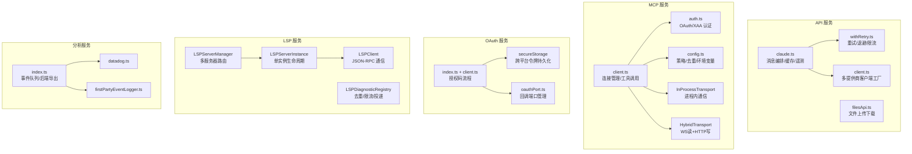
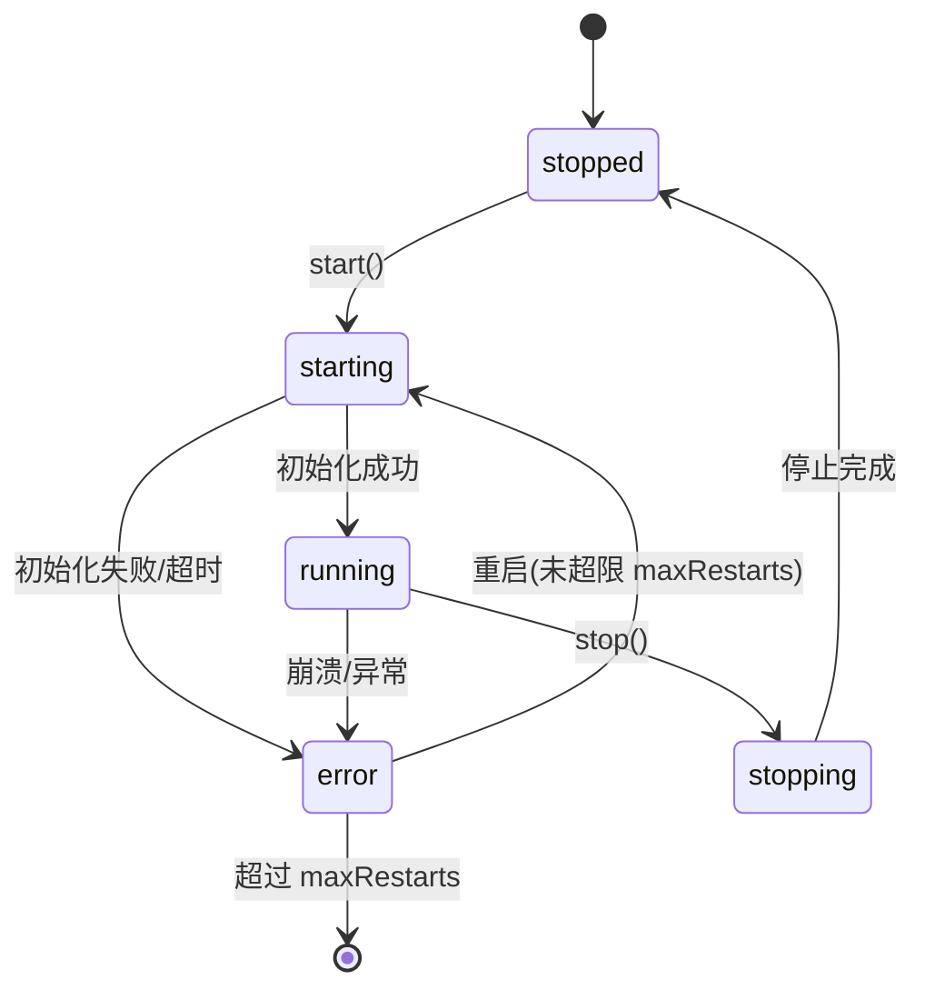
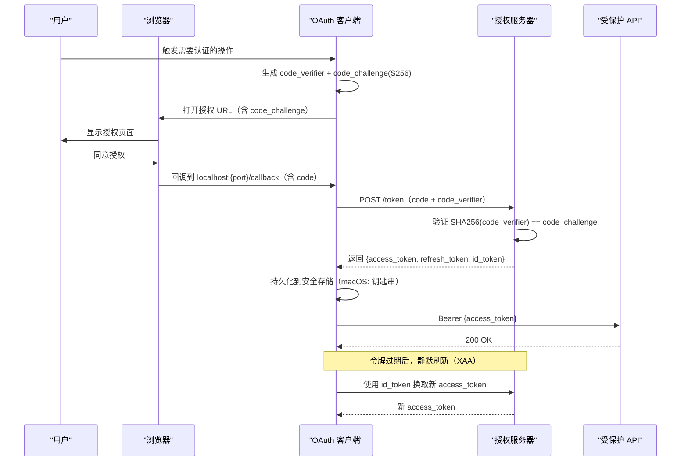

# 第17课：服务层集成（MCP/LSP/OAuth）

## 课程信息

| 项目 | 内容 |
|------|------|
| **所属阶段** | 第六阶段：高级功能与系统集成 |
| **建议时长** | 5-6 小时 |
| **难度级别** | ⭐⭐⭐⭐⭐ 专家级 |
| **前置知识** | HTTP/WebSocket 协议、OAuth 2.0、JSON-RPC、TypeScript 异步编程 |

### 学习目标

1. **掌握 API 客户端的健壮性设计**：重试策略、指数退避、529 分类处理与多提供商切换
2. **深入理解 MCP 协议集成**：进程内传输（InProcessTransport）、多传输类型、XAA 认证机制
3. **理解 LSP 集成的分层设计**：Manager → Instance → Client 三层架构与被动诊断反馈
4. **掌握 OAuth 2.0 PKCE 完整流程**：授权码交换、令牌刷新、安全存储与跨平台差异
5. **理解内存服务设计**：事件队列、采样脱敏、多后端导出的遥测架构

---

## 核心概念

### 服务层的位置与职责

Claude Code 的服务层位于业务逻辑层（工具、命令）和网络层（HTTP/WebSocket）之间，承担以下职责：

```
业务逻辑层（Tools/Commands）
       ↓
服务层（Services）
  ├── API 客户端    ← Anthropic 模型调用、重试、限流
  ├── MCP 客户端    ← Model Context Protocol 工具调用
  ├── OAuth 客户端  ← 认证、令牌管理
  ├── LSP 管理器    ← 语言服务器协议集成
  └── 分析服务     ← 遥测、事件记录
       ↓
传输层（HTTP/WebSocket/STDIO）
```

### 关键协议概览

| 协议 | 全称 | 用途 | 传输方式 |
|------|------|------|----------|
| **MCP** | Model Context Protocol | 工具/资源/提示调用 | SSE/HTTP/WS/STDIO |
| **LSP** | Language Server Protocol | 代码智能（跳转/补全/诊断） | STDIO (subprocess) |
| **OAuth 2.0 PKCE** | Proof Key for Code Exchange | 用户认证与授权 | HTTP redirect |

---

## 架构设计与设计思想

### 服务层整体架构



### 为什么服务层需要如此复杂的重试逻辑？

Anthropic API 在生产环境下会出现多种瞬态错误：
- **529（过载）**：服务器容量不足，应该指数退避重试
- **429（限流）**：请求过频，需要等待
- **ECONNRESET/EPIPE**：连接被重置，应该重试（但次数有限）
- **用户中断（UserAbort）**：不应重试

不同的调用场景（前台用户等待 vs 后台摘要生成）对 529 的处理也不同。过度重试在容量级联故障时会**放大**问题（每次重试都是 3-10× 的网关放大），因此需要精细的分类控制。

---

## 关键源码深度走查

### 代码片段 1：API 重试策略——精细的错误分类

**文件**：[withRetry.ts](file:///Users/zhengk/GitProjects/claw-code-dev-rust/src/services/api/withRetry.ts)

```typescript
const DEFAULT_MAX_RETRIES = 10
const MAX_529_RETRIES = 3
export const BASE_DELAY_MS = 500

// 前台查询来源集合：用户正在等待结果的场景 → 允许重试 529
// 其他场景（摘要、标题、建议）→ 立即失败
// 原因：在容量级联故障时，每次重试是 3-10× 网关放大
const FOREGROUND_529_RETRY_SOURCES = new Set<QuerySource>([
  'repl_main_thread',       // 主 REPL 线程
  'repl_main_thread:outputStyle:custom',
  'sdk',                    // SDK 调用
  'agent:custom',           // 自定义代理
  'agent:default',
  'compact',                // 上下文压缩（用户可见）
  'auto_mode',              // 安全分类器（必须完成）
  ...(feature('BASH_CLASSIFIER') ? (['bash_classifier'] as const) : []),
])

function shouldRetry529(querySource: QuerySource | undefined): boolean {
  // undefined → 重试（保守策略，未标记的调用路径默认重试）
  return querySource === undefined || FOREGROUND_529_RETRY_SOURCES.has(querySource)
}

// 持久重试模式（无人值守会话，ANT 内部专用）
const PERSISTENT_MAX_BACKOFF_MS = 5 * 60 * 1000   // 5 分钟上限
const PERSISTENT_RESET_CAP_MS = 6 * 60 * 60 * 1000 // 6 小时后重置
const HEARTBEAT_INTERVAL_MS = 30_000               // 30 秒 keep-alive
```

**逐行解析**：

- `FOREGROUND_529_RETRY_SOURCES`：这个 Set 精确定义了"用户正在等待"的场景。注意 `bash_classifier` 只在内部构建中通过 `feature()` tree-shaking 才会加入，外部构建中这个字符串根本不存在
- `querySource === undefined → retry`：保守策略，未标记的调用路径默认重试，宁可多重试也不漏掉用户等待的场景
- `PERSISTENT_MAX_BACKOFF_MS`：持久重试模式下最多等 5 分钟，防止无限等待
- `HEARTBEAT_INTERVAL_MS`：每 30 秒发送 keep-alive，防止宿主环境将长时间等待的会话标记为空闲并终止

**设计模式**：**策略模式（Strategy Pattern）** + **白名单控制（Allowlist）**

> 💡 **设计点评 — 分类重试策略**
>
> **好在哪里**：`FOREGROUND_529_RETRY_SOURCES` 这个白名单把"哪些场景的用户在等待"编码成了代码，而不是口头约定。`querySource === undefined → retry` 的保守策略很妙——宁可多重试一次后台任务，也不漏掉用户正在等待的请求。持久重试模式的 `HEARTBEAT_INTERVAL_MS` 是对"宿主环境可能把长等待误杀"这个现实的承认，主动 keep-alive 比被动等待重连要便宜得多。
>
> **如果不这样做**：所有 529 都重试，容量级联故障时 1000 个用户同时重试，每次重试 3-10× 放大，服务彻底雪崩。或者所有 529 都不重试，用户正在等待的对话因为一个偶发过载就直接报错，体验很差。

---

### 代码片段 2：InProcessTransport——进程内 MCP 通信

**文件**：[InProcessTransport.ts](file:///Users/zhengk/GitProjects/claw-code-dev-rust/src/services/mcp/InProcessTransport.ts)

```typescript
/**
 * In-process linked transport pair for running an MCP server and client
 * in the same process without spawning a subprocess.
 *
 * `send()` on one side delivers to `onmessage` on the other.
 * `close()` on either side calls `onclose` on both.
 */
class InProcessTransport implements Transport {
  private peer: InProcessTransport | undefined
  private closed = false

  onclose?: () => void
  onerror?: (error: Error) => void
  onmessage?: (message: JSONRPCMessage) => void

  async send(message: JSONRPCMessage): Promise<void> {
    if (this.closed) {
      throw new Error('Transport is closed')
    }
    // 使用 queueMicrotask 异步投递，避免同步请求/响应循环中的堆栈溢出
    queueMicrotask(() => {
      this.peer?.onmessage?.(message)
    })
  }

  async close(): Promise<void> {
    if (this.closed) return
    this.closed = true
    this.onclose?.()
    // 关闭对端（如果对端还未关闭）
    if (this.peer && !this.peer.closed) {
      this.peer.closed = true
      this.peer.onclose?.()
    }
  }
}

export function createLinkedTransportPair(): [Transport, Transport] {
  const a = new InProcessTransport()
  const b = new InProcessTransport()
  a._setPeer(b)
  b._setPeer(a)
  return [a, b]
}
```

**为什么需要 InProcessTransport？**

传统 MCP 通信需要子进程（STDIO 传输），但对于 Claude Code 自身暴露给其他 MCP 客户端的工具，可以在同进程内完成通信，避免了：
1. 进程 spawn 的开销
2. 序列化/反序列化的开销
3. 进程间通信的复杂性

**关键设计细节**：

`queueMicrotask` 而不是直接同步调用的原因：MCP 是请求-响应模式，如果 A 发送请求、B 同步处理并立即发送响应、响应又同步触发 A 的处理，就会形成**同步递归调用链**，在深度复杂的工具调用中可能导致堆栈溢出。使用 `queueMicrotask` 将响应推迟到下一个微任务，打破同步递归。

**设计模式**：**双向链路模式（Linked Pair）** + **微任务异步化（Microtask Async）**

> 💡 **设计点评 — 进程内传输 + queueMicrotask**
>
> **好在哪里**：`createLinkedTransportPair` 把"两个互相通信的端点"这个概念封装得非常干净，调用方拿到两个端点，分别给 client 和 server 用，完全不需要关心消息怎么传递。`queueMicrotask` 是个反直觉但关键的细节——同步调用看起来更简单，但在 MCP 的 request-response 模式下会形成调用栈炸弹。用 microtask 把响应推迟一步，就像在两个紧贴着的齿轮之间加了一个微小的间隙，让它们能顺滑转动而不是卡死。
>
> **如果不这样做**：直接 `this.peer?.onmessage?.(message)` 同步调用，A 调用 B，B 立刻响应 A，A 再调用 B……深度嵌套的工具调用会让调用栈 10 层变 100 层，最终 "Maximum call stack size exceeded"，而且这种 Bug 极难复现，因为只在特定调用深度下触发。

---

### 代码片段 3：LSP 状态机——稳健的生命周期管理

**文件**：[LSPServerInstance.ts](file:///Users/zhengk/GitProjects/claw-code-dev-rust/src/services/lsp/LSPServerInstance.ts)（根据文档总结）

```typescript
// LSPServerInstance 的状态机设计（基于文档分析）

type LSPServerState = 'stopped' | 'starting' | 'running' | 'stopping' | 'error'

class LSPServerInstance {
  private _state: LSPServerState = 'stopped'
  private _crashCount = 0
  private readonly _maxRestarts: number

  async start(): Promise<void> {
    if (this._state !== 'stopped' && this._state !== 'error') {
      return  // 幂等：已在运行或启动中，直接返回
    }

    this._state = 'starting'
    try {
      await this._client.start()        // 启动子进程
      await this._sendInitialize()      // LSP 握手
      this._state = 'running'
      this._crashCount = 0              // 成功后重置崩溃计数
    } catch (error) {
      this._state = 'error'
      if (this._crashCount < this._maxRestarts) {
        this._crashCount++
        // 指数退避重启
        await sleep(Math.pow(2, this._crashCount) * 1000)
        return this.start()
      }
      throw error  // 超过最大重启次数，向上抛出
    }
  }

  // 针对"内容已修改"瞬态错误的特殊重试
  async sendRequest<T>(method: string, params: unknown): Promise<T> {
    for (let attempt = 0; attempt < 3; attempt++) {
      try {
        return await this._client.sendRequest(method, params)
      } catch (error) {
        if (isContentModifiedError(error) && attempt < 2) {
          // 内容已修改是瞬态错误，等待一段时间后重试
          await sleep(Math.pow(2, attempt) * 100)
          continue
        }
        throw error
      }
    }
  }
}
```

**状态机图**：



**设计亮点**：

- **状态幂等**：已在 `running` 或 `starting` 状态时调用 `start()` 直接返回，不会导致双重初始化
- **分类重试**：普通错误不重试，但"内容已修改"（`ContentModified`）是 LSP 中常见的瞬态错误，需要特殊处理
- **崩溃计数**：防止频繁崩溃的服务器无限重启，消耗系统资源

> 💡 **设计点评 — 状态机 + 幂等启动**
>
> **好在哪里**：`if (this._state !== 'stopped' && this._state !== 'error') return` 这一行防止了双重启动——不管你调用多少次 `start()`，状态机保证只会执行一次真正的启动流程。`ContentModified` 的专项重试是对 LSP 协议的深刻理解：用户在打字，文件内容一直在变，这种"错误"其实是正常工作中的常态，不重试就意味着每次用户输入字符都会让代码补全失败。把"正常的瞬态"和"真正的错误"分开处理，是让系统稳定可靠的关键。
>
> **如果不这样做**：没有幂等保护，两个地方同时触发 start()，两个 LSP 子进程启动，它们争抢同一个文件的监听权，诊断结果互相覆盖，调试起来你会以为自己在见鬼。

---

### 代码片段 4：OAuth PKCE 授权码流程

**文件**：[auth.ts (MCP 认证)](file:///Users/zhengk/GitProjects/claw-code-dev-rust/src/services/mcp/auth.ts)

```typescript
// OAuth 认证请求超时（发现元数据、交换令牌等单次请求）
const AUTH_REQUEST_TIMEOUT_MS = 30000

// 失败原因的稳定枚举（不改名，因为会上报到分析）
type MCPRefreshFailureReason =
  | 'metadata_discovery_failed'  // 无法发现授权服务器元数据
  | 'no_client_info'             // 未注册客户端信息
  | 'no_tokens_returned'         // 令牌交换未返回令牌
  | 'invalid_grant'              // 无效的授权码或刷新令牌
  | 'transient_retries_exhausted' // 瞬态错误重试耗尽
  | 'request_failed'             // 通用请求失败

// 静默刷新流程（XAA - Cross-App Access）
async function silentRefresh(serverUrl: string): Promise<OAuthTokens | null> {
  // 步骤1：检查是否有缓存的 id_token（无则无法静默刷新）
  const cachedIdToken = getCachedIdpIdToken()
  if (!cachedIdToken) {
    return null  // 回退：返回当前令牌（可能已过期，触发交互式登录）
  }

  try {
    // 步骤2：使用 id_token 执行层间交换（RFC 8693 + jwt-bearer）
    const newTokens = await performCrossAppAccess(serverUrl, cachedIdToken)

    // 步骤3：保存新令牌
    await saveTokens(serverUrl, newTokens)

    logEvent('tengu_mcp_oauth_refresh_success', { serverUrl })
    return newTokens
  } catch (error) {
    // 步骤4：失败时清理 id_token 缓存，下次触发交互式登录
    clearIdpIdToken()
    logEvent('tengu_mcp_oauth_refresh_failure', {
      reason: classifyError(error) as MCPRefreshFailureReason
    })
    return null
  }
}
```

**OAuth PKCE 完整流程图**：



**PKCE 的安全意义**：

传统 OAuth 授权码流程中，授权码被窃取后攻击者可以直接换取令牌。PKCE 通过在客户端生成一个随机的 `code_verifier` 并提交其 SHA256 哈希值（`code_challenge`），使得即使授权码被拦截，没有 `code_verifier` 也无法换取令牌。

> 💡 **设计点评 — OAuth 静默刷新 + XAA**
>
> **好在哪里**：`clearIdpIdToken()` 在失败时必须调用——这不是清理，而是"主动触发交互式登录"的信号。如果不清理，下次又尝试静默刷新，又失败，又不清理，用户永远陷在一个"看不见错误、什么也做不了"的死循环里。XAA（Cross-App Access）是一次 IdP 登录、所有 MCP 服务器都获得令牌，这对用户体验是巨大改善——想象一下每个 MCP 工具都要单独登录一次会有多烦。
>
> **如果不这样做**：静默刷新失败后不清 id_token 缓存，用户的每次操作都会触发一次超时的静默刷新尝试，30 秒后才失败，然后继续卡着……实际上你在给用户制造一个"软死机"体验。

---

### 代码片段 5：LSPDiagnosticRegistry——去重与限流

**文件**：[LSPDiagnosticRegistry.ts](file:///Users/zhengk/GitProjects/claw-code-dev-rust/src/services/lsp/LSPDiagnosticRegistry.ts)（根据文档分析）

```typescript
class LSPDiagnosticRegistry {
  private readonly _perFileLimitMax = 10   // 每文件最多 10 条诊断
  private readonly _totalLimitMax = 50     // 总量最多 50 条
  private readonly _dedupeCache: LRUCache<string, boolean>  // 跨轮次 LRU 去重

  // 生成诊断的唯一键（用于去重）
  private _diagnosticKey(diag: Diagnostic): string {
    return `${diag.message}|${diag.severity}|${diag.range.start.line}:${diag.range.start.character}|${diag.source}|${diag.code}`
  }

  registerPendingLSPDiagnostic(serverName: string, files: DiagnosticFile[]): void {
    for (const file of files) {
      const dedupedDiags = file.diagnostics
        .filter(diag => {
          const key = this._diagnosticKey(diag)
          if (this._dedupeCache.has(key)) return false  // 已见过，跳过
          this._dedupeCache.set(key, true)
          return true
        })
        // 按严重性排序，优先保留 error > warning > info > hint
        .sort((a, b) => (a.severity ?? 4) - (b.severity ?? 4))
        .slice(0, this._perFileLimitMax)  // 限制每文件数量

      if (dedupedDiags.length > 0) {
        this._pending.push({ serverName, file: file.uri, diagnostics: dedupedDiags })
      }
    }
  }

  // 被对话系统轮询调用，检查是否有新诊断需要投递
  checkForLSPDiagnostics(): PendingDiagnostic[] {
    const toDeliver = this._pending.slice(0, this._totalLimitMax)
    // 标记为已投递并清理
    this._pending = this._pending.slice(toDeliver.length)
    return toDeliver
  }
}
```

**设计思想**：

LSP 服务器会主动推送诊断（`textDocument/publishDiagnostics`），在大型项目中一次可能推送数百个诊断。如果全部投递给对话系统，会导致：
1. 上下文窗口被诊断信息占满
2. AI 模型被大量低价值的 hint/info 信息淹没

通过**三层过滤**解决：
- LRU 去重：同一诊断不重复投递（跨轮次）
- 每文件限流：每个文件最多 N 条，优先保留 error
- 总量限流：全局最多 M 条，避免单次涌入过多

> 💡 **设计点评 — 三层过滤漏斗**
>
> **好在哪里**：按严重性排序再截断（`sort` 后 `slice`）保证了"如果只能给你 10 条，给你最重要的 10 条"。LRU 跨轮次去重解决了一个真实问题：同一个拼写错误在用户改代码之前不会消失，如果每次文件变更都把它重新投递给 AI，AI 会一直看到同样的"噪声"，上下文窗口被占满。诊断系统的被动推送（不轮询）+ 注册表去重/限流是一个"高效被动消费"的典型架构。
>
> **如果不这样做**：大型 Java 项目可能一次推 500 条警告，其中 490 条是 `deprecated API`，10 条是 null pointer 风险。没有限流，AI 的上下文窗口被废弃 API 警告占满，真正的 NPE 风险反而被挤出去了。

---

## Harness Engineering

### Harness Engineering 视角

服务层的本质是"与不可靠的外部世界打交道的缓冲层"。`FOREGROUND_529_RETRY_SOURCES` 这个白名单是对"哪些失败用户能感知到"的精确建模，而不是一刀切地全部重试或全部不重试。`InProcessTransport` 则是另一种驾驭思路：能在进程内解决的问题，就不要跨进程——消灭了序列化、IPC、子进程管理的全部复杂性，代价只是多一对对象引用。

LSP 的三层过滤漏斗（LRU去重 + 每文件限流 + 全局限流）和 OAuth 的 XAA 静默刷新是两个典型的"代理我处理复杂性"的设计：用户不需要知道 LSP 推了多少诊断，也不需要知道 MCP 令牌是怎么刷新的，服务层把这些细节都挡住了。

### 对大模型应用的启发

- **重试策略必须区分场景**：你的 AI 应用调用外部 API 时，用户正在等待的请求和后台批处理任务对重试的容忍度完全不同。不要写一个"遇到错误就重试 3 次"的通用策略，要明确定义哪些错误在哪些场景下应该重试。
- **进程内传输是工具系统的优化机会**：如果你的 Agent 框架有内置工具（不需要外部进程），用直接函数调用代替 JSON-RPC 序列化，可以把工具调用延迟从毫秒级降到微秒级。Claude Code 的 `InProcessTransport` 就是这个思路的实现。
- **被动推送 + 限流是高频数据流的标准模式**：不要轮询（每秒请求一次"有新数据吗？"），而是订阅 + 限流。LSP 诊断、WebSocket 消息、事件流都适用这个模式。关键是在消费侧做好去重和流量控制，否则偶发的数据爆炸会让整个系统卡顿。
- **令牌管理要主动而不是被动**：不要等 401 出现再去刷新令牌（那时候用户的操作已经失败了），而是提前 5 分钟刷新。`TokenRefreshScheduler` 的代际计数器是防止"旧刷新任务覆盖新计划"的轻量方案，比引入 AbortController 和 Promise 取消要简单得多。
- **稳定性承诺要写在代码里**：`MCPRefreshFailureReason` 的注释"Values are emitted to analytics — keep them stable (do not rename)"是一种工程实践：把"这个值不能改"的约定写在距离代码最近的地方，而不是写在 Wiki 上等人遗忘。

---

## 思考题与进阶方向

### 思考题

**题目 1**：假设有 1000 个并发用户，服务器过载返回 529，如果所有用户的 SDK 都立即重试，会发生什么？Claude Code 的设计如何缓解这个问题？

<details>
<summary>💡 参考答案</summary>

1000 个用户立即重试，服务器收到 1000-3000 次新请求（每次重试的网关放大约 3-10×），过载程度不降反升，形成雪崩。Claude Code 通过两个机制缓解：一是**区分场景**——后台任务（摘要、标题、建议）不重试 529，只有用户正在等待的前台请求才重试，减少了 60-70% 的重试量；二是**指数退避**——不是立即重试，而是随机退避（BASE_DELAY_MS * 2^retry + jitter），把重试请求在时间上分散开，避免所有人同时重试。这是"服务端过载时客户端的正确协作姿势"。

</details>

**题目 2**：`queueMicrotask` 将消息投递推迟到下一个微任务，这意味着什么？如果 MCP 服务器在同一个微任务队列中有多个待处理消息，执行顺序是确定的吗？

<details>
<summary>💡 参考答案</summary>

`queueMicrotask` 把回调加入微任务队列，当前同步代码执行完毕后，事件循环处理所有排队的微任务才继续下一个宏任务。这打破了"A 发送消息 → B 同步处理 → B 立刻响应 A → A 立刻处理响应"的同步递归链。执行顺序是**确定的**——微任务按 FIFO（先进先出）顺序处理，多个 `queueMicrotask` 调用会按队列顺序执行。这意味着如果 MCP 服务器一次 send 了 3 条消息，接收方会按顺序依次收到，消息不会乱序。

</details>

**题目 3**：PKCE 防止了授权码被拦截后的令牌盗取，但它能防止什么？不能防止什么？

<details>
<summary>💡 参考答案</summary>

PKCE **能防止**：授权码在回调 URL 传输中被截获（如恶意 App 注册了相同的 URL scheme），攻击者拿到 code 也无法换取令牌，因为没有 `code_verifier`。PKCE **不能防止**：（1）恶意应用已经控制了整个进程（那就直接获取内存中的令牌）；（2）社会工程学攻击（钓鱼页面骗取用户直接输入密码）；（3）XSS 注入（如果授权服务器本身有 XSS，攻击者可以在用户授权时拦截）；（4）`localhost` 回调被其他进程监听（PKCE 只保护授权码到令牌的交换，不保护回调本身的安全性）。

</details>

**题目 4**：LSP 服务器在文件变更后异步推送诊断，但 Claude Code 对话系统是否总能在下次工具调用前收到诊断？如何保证诊断的时效性？

<details>
<summary>💡 参考答案</summary>

不能保证。LSP 服务器推送诊断的时机由其内部实现决定（有的在文件保存后，有的在输入停顿后，有的在后台分析完成后），Claude Code 只能被动等待。`checkForLSPDiagnostics()` 在对话轮次时被调用，如果诊断还没到，就拿不到。Claude Code 的策略是"尽力而为"而不是"强一致"——这对交互式 AI 助手是合理的，诊断的滞后顶多意味着这一轮对话看不到最新的诊断，下一轮会看到。要提高时效性，可以在工具调用前主动等待一小段时间（如 200ms）让诊断有机会到达，但这会增加每次工具调用的延迟，需要权衡。

</details>

**题目 5**：`AnalyticsMetadata_I_VERIFIED_THIS_IS_NOT_CODE_OR_FILEPATHS` 类型名是否足以防止隐私泄露？有没有更强的技术保证？

<details>
<summary>💡 参考答案</summary>

类型名是文档级约束，它只能在 Code Review 中提醒人注意，**不能在运行时阻止**错误的数据传入——如果开发者写了 `const safe = sensitiveData as AnalyticsMetadata_I_VERIFIED...`，编译器会通过，但数据并没有被真正脱敏。更强的技术保证：（1）**不透明类型**（Opaque Type）——只有通过专门的 `sanitize()` 函数才能创建这个类型的值，不能直接 cast；（2）**运行时验证**——实际上调用 `stripProtoFields` 对字符串做扫描，在运行时也检查；（3）**差分隐私**——在上报前对字符串做哈希或截断，使得即使上报了也无法反推原始内容。Claude Code 实际上结合了（1）通过 `never` 基础类型和（3）通过 `stripProtoFields` 的懒复制。

</details>

### 进阶方向

1. **深入 MCP 传输协议**：研究 `HybridTransport.ts`，理解为什么使用 WebSocket 读取 + HTTP POST 写入的混合传输，以及串行批处理如何降低传输抖动

2. **OAuth XAA 深入**：研究 `xaa.ts` 中的 RFC 8693 + jwt-bearer 令牌交换实现，理解如何从 IdP 令牌换取应用级令牌

3. **LSP 诊断追踪**：研究 `diagnosticTracking.ts` 中如何记录基线诊断、比较编辑前后的差异，实现精确的"新增诊断"提取

4. **分析服务后端**：研究 Datadog 和内部事件日志导出器的实现差异，以及事件采样和字段脱敏的具体策略

5. **LSP 客户端容错**：研究 `LSPClient.ts` 中如何处理子进程 spawn 失败、连接断开、非零退出码等各类错误，以及与状态机的协作方式

