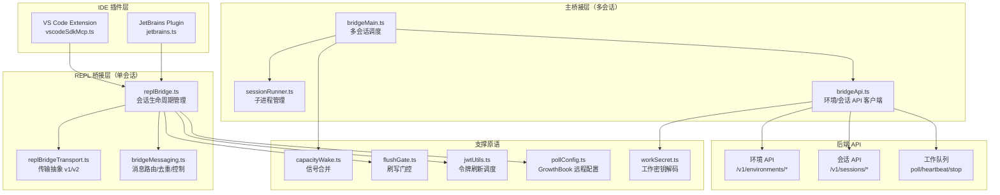

# 第18课：IDE 桥接与部署运维

---

## 课程信息

| 项目 | 内容 |
|------|------|
| **所属阶段** | 第六阶段：工程化进阶 |
| **建议时长** | 5-6 小时（含源码阅读 2 小时） |
| **难度级别** | 专家级 |
| **前置课程** | 第15课（工具系统）、第16课（插件系统）、第17课（服务层集成） |

### 学习目标

1. **理解桥接层分层架构**：掌握 bridgeMain→replBridge→replBridgeTransport 三层结构及各层职责划分
2. **深入容量管理机制**：理解 CapacityWake 信号合并、FlushGate 刷写门控解决的并发顺序问题
3. **掌握 v1/v2 双栈传输**：对比 HybridTransport 与 SSE+CCRClient 的设计差异与适用场景
4. **理解自动更新全流程**：从安装类型检测到原子安装，掌握锁竞争处理的两种策略
5. **掌握配置管理与可观测性**：理解远程托管设置、变更检测、OpenTelemetry 遥测的设计思想

---

## 核心概念

### 1. 桥接层的位置

Claude Code 的桥接层（Bridge Layer）是连接 IDE 插件（VS Code/JetBrains）与后端云服务的中间件：

```
用户在 IDE 中提问
      ↓
IDE 插件（VS Code Extension / JetBrains Plugin）
      ↓
桥接层（src/bridge/）
      ↓    ←→ 环境注册 / 工作轮询 / 心跳
后端 API（Claude Code Remote）
      ↓
Claude 模型推理
      ↑
会话子进程（sessionRunner → spawn CLI）
```

**桥接层解决的核心问题**：IDE 插件是持久运行的进程，而 Claude 推理需要在服务端运行。桥接层负责：
- 把 IDE 中的用户输入传递到后端会话
- 把后端的流式输出回传给 IDE
- 维持心跳保活连接，处理网络断开和重连

### 2. 三大核心原语

| 原语 | 文件 | 解决的问题 |
|------|------|-----------|
| `CapacityWake` | `bridge/capacityWake.ts` | 容量满载时的睡眠/唤醒，避免忙等待 |
| `FlushGate<T>` | `bridge/flushGate.ts` | 初始历史刷写期间新消息排队，防乱序 |
| `TokenRefreshScheduler` | `bridge/jwtUtils.ts` | 基于 JWT exp 提前刷新，防令牌突然失效 |

### 3. 传输协议版本对比

| 特性 | v1（HybridTransport） | v2（SSE + CCRClient） |
|------|----------------------|----------------------|
| 读通道 | WebSocket | SSE（Server-Sent Events） |
| 写通道 | HTTP POST 到 session-ingress | CCRClient 写入 /worker/* |
| 认证 | OAuth token 或 JWT | 必须使用 JWT（含 session_id 声明） |
| 适用场景 | 简单直连 | 高吞吐/批量化场景 |
| Worker注册 | 无 | 需先 registerWorker 获取 worker_epoch |
| 重连方式 | 客户端直接重连 | 触发 reconnectSession，服务端重新派发 |

### 4. 安装类型决策树

```
claude update 命令
      ↓
检测安装类型（getDoctorDiagnostic）
      ├── development → 阻止更新（dev 构建）
      ├── package-manager（homebrew/winget/apk）→ 提示用包管理器
      ├── native → 使用原生安装器（installLatestNative）
      ├── npm-local → installOrUpdateClaudePackage
      └── npm-global → installGlobalPackage
```

---

## 架构设计与设计思想

### 桥接层整体架构



### 设计思想：为什么需要这么复杂？

**问题 1：如何避免容量满载时的忙等待？**

当所有会话槽都被占用时，轮询循环需要等待。朴素做法是 `while(atCapacity) sleep(500)`，但这导致：
- 容量刚释放，要等最多 500ms 才重新轮询
- 两个地方（replBridge + bridgeMain）各自实现了这个逻辑，代码重复

→ `CapacityWake` 的解决方案：**信号合并**。会话结束时调用 `wake()`，合并信号立即触发，零延迟响应。

**问题 2：初始历史刷写期间消息乱序怎么办？**

会话开始时，需要把历史消息批量 POST 给服务端。在此期间，如果用户又发了新消息，直接发送会导致服务端收到的消息顺序错乱。

→ `FlushGate` 的解决方案：**状态机门控**。刷写期间新消息入队，刷写完成后批量"泄洪"。

**问题 3：如何防止 JWT 令牌在会话中途过期？**

JWT 有固定有效期，会话可能持续很长时间。如果令牌过期后才发现，会话就会以 401 中断。

→ `TokenRefreshScheduler` 的解决方案：**提前 5 分钟刷新**。基于 JWT `exp` 字段计算下次刷新时间，并用代际计数器（generation counter）防止过期刷新链被旧任务覆盖。

---

## 关键源码深度走查

### 源码片段一：CapacityWake — 信号合并原语

**文件**：[`src/bridge/capacityWake.ts`](file:///Users/zhengk/GitProjects/claw-code-dev-rust/src/bridge/capacityWake.ts)

```typescript
// CapacityWake 解决的问题：
// replBridge.ts 和 bridgeMain.ts 都需要在"容量满载"时睡眠，
// 但任何一个条件满足时（关机信号 OR 容量释放）就应该立刻唤醒。
// 之前这段逻辑在两个文件中各复制了一份，现在提取为独立原语。

export type CapacityWake = {
  signal(): CapacitySignal  // 返回合并后的信号 + cleanup 函数
  wake(): void              // 触发容量释放：abort 当前控制器，立即创建新的
}

export function createCapacityWake(outerSignal: AbortSignal): CapacityWake {
  let wakeController = new AbortController()  // 容量信号控制器（可变）

  function wake(): void {
    wakeController.abort()              // 触发当前睡眠的 abort
    wakeController = new AbortController() // 立即重置，为下一次等待准备
    // ↑ 设计要点：abort + 新建是原子替换，不存在竞态窗口
  }

  function signal(): CapacitySignal {
    const merged = new AbortController()    // 创建合并信号
    const abort = (): void => merged.abort()

    // 快路径：任一信号已经触发，立即返回已 aborted 的信号
    if (outerSignal.aborted || wakeController.signal.aborted) {
      merged.abort()
      return { signal: merged.signal, cleanup: () => {} }
    }

    // 同时监听两个信号，任一触发即 abort merged
    outerSignal.addEventListener('abort', abort, { once: true })
    const capSig = wakeController.signal  // 快照！否则 wake() 替换后会丢失监听
    capSig.addEventListener('abort', abort, { once: true })

    return {
      signal: merged.signal,
      // cleanup 在 sleep 正常结束时调用，移除监听器，防止内存泄漏
      cleanup: () => {
        outerSignal.removeEventListener('abort', abort)
        capSig.removeEventListener('abort', abort) // 注意：用快照的 capSig
      },
    }
  }

  return { signal, wake }
}
```

**设计模式**：信号合并（Signal Merging）+ 闭包快照

**关键细节**：
- `const capSig = wakeController.signal`：必须快照！`wake()` 会替换 `wakeController`，如果用 `this.wakeController.signal` 来 removeEventListener，会找不到正确的目标
- `{ once: true }`：确保监听器只触发一次，不需要手动 removeEventListener（但 cleanup 仍然调用，双重保险）
- `cleanup` 在睡眠正常结束（未 abort）时调用，防止 GC 压力：每个等待期间都挂了两个监听器，如果不清理会积累

> 💡 **设计点评 — 信号合并 + 快照技巧**
>
> **好在哪里**：`const capSig = wakeController.signal` 这行看起来平平无奇，却是整个实现的关键——wake() 会替换 `wakeController`，如果 cleanup 里用的是 `wakeController.signal`（而不是快照），removeEventListener 找的是新的控制器，永远移除不了旧监听器。`{ once: true }` + `cleanup` 的双重防护就像安全带和安全气囊：任一触发都能防止内存泄漏，两者共存让代码在正常退出和信号触发两种路径下都无懈可击。
>
> **如果不这样做**：每次等待在 outerSignal 上注册一个监听器，而 cleanup 不能正确清除，会话运行时间越长，积累的监听器越多，触发 Node.js MaxListeners 警告，最终影响性能甚至稳定性。

---

### 源码片段二：FlushGate — 刷写门控状态机

**文件**：[`src/bridge/flushGate.ts`](file:///Users/zhengk/GitProjects/claw-code-dev-rust/src/bridge/flushGate.ts)

```typescript
/**
 * FlushGate 状态机生命周期：
 *
 *  inactive ──start()──→ active ──end()──→ inactive (返回队列内容)
 *                          │
 *                          ├──enqueue(item)──→ 入队（返回 true）
 *                          │
 *                          ├──drop()──→ inactive（丢弃队列，永久关闭）
 *                          │
 *                          └──deactivate()──→ inactive（保留队列，传输替换场景）
 */
export class FlushGate<T> {
  private _active = false
  private _pending: T[] = []

  // start() 在开始批量刷写历史时调用
  start(): void {
    this._active = true
  }

  // end() 在刷写完成后调用，返回刷写期间积压的消息
  end(): T[] {
    this._active = false
    return this._pending.splice(0)  // 原子取走：清空并返回数组
    // ↑ splice(0) 比 [...this._pending]; this._pending = [] 更高效
    // 并且在单线程 JS 中天然原子
  }

  // enqueue 在 active 时返回 true（已入队），否则返回 false（调用方直接发送）
  enqueue(...items: T[]): boolean {
    if (!this._active) return false  // 快速路径：不在刷写期，不需要入队
    this._pending.push(...items)
    return true
  }

  // drop() 用于传输永久关闭（如服务端断开且不再重连）
  drop(): number {
    this._active = false
    const count = this._pending.length
    this._pending.length = 0  // 原地清空：比 this._pending = [] 更高效（GC压力更小）
    return count
  }

  // deactivate() 用于传输替换（onWorkReceived）
  // 注意：不丢弃队列！新传输的 flush 会把积压的消息一起发送
  deactivate(): void {
    this._active = false
    // _pending 保留，等待新传输的 end() 调用
  }
}
```

**设计模式**：状态机（State Machine）+ 责任转移（Responsibility Transfer）

**为什么需要 `deactivate` vs `drop` 两种"停止"方式？**

```
传输异常（网络断开，重建传输）：
  旧传输 → deactivate()  ← 保留积压消息
  新传输 → start() → end()  ← 新传输负责发送积压消息

传输永久关闭（会话结束，不再重连）：
  → drop()  ← 直接丢弃，避免内存泄漏
```

**使用方式示例**（简化版）：

```typescript
const gate = new FlushGate<Message>()
gate.start()  // 开始历史刷写

// 并发到来的新消息：
function onNewMessage(msg: Message) {
  if (!gate.enqueue(msg)) {  // 刷写中？入队
    sendToServer(msg)         // 否则直接发
  }
}

// 刷写完成：
await flushHistoryToServer(history)
const pending = gate.end()  // 取出积压消息
for (const msg of pending) {
  await sendToServer(msg)   // 按顺序发送
}
```

> 💡 **设计点评 — 泄洪门控状态机**
>
> **好在哪里**：`splice(0)` 是个妙手——它不只是取出数组内容，还把数组原地清空，两步合一，在 JS 单线程模型里天然是"原子"的。`deactivate` 和 `drop` 两种停止方式解决了一个真实问题：网络断开时你不想丢掉积压的消息（等新连接建立后继续发），但会话彻底结束时就必须清理内存。用两个方法精确表达两种语义，比用一个 `stop(keepPending: boolean)` 更清晰、更不容易误用。
>
> **如果不这样做**：历史刷写期间新消息直接发送，服务端收到的消息顺序是"新消息 → 历史消息"，AI 上下文窗口里历史对话顺序完全乱掉，生成的回答会非常奇怪。

---

### 源码片段三：JWT 令牌刷新调度器 — 代际计数器防竞态

**文件**：[`src/bridge/jwtUtils.ts`](file:///Users/zhengk/GitProjects/claw-code-dev-rust/src/bridge/jwtUtils.ts)

```typescript
// 核心设计：代际计数器（generation counter）解决异步竞态
//
// 问题场景：
//   1. session A 的刷新任务在等待 OAuth token
//   2. 此时 session A 被 cancel()，又立即重新 schedule()
//   3. 旧的刷新任务返回 OAuth token，如果没有竞态保护
//      它会覆盖新的调度计划

const generations = new Map<string, number>()  // sessionId → 当前代际

function nextGeneration(sessionId: string): number {
  const gen = (generations.get(sessionId) ?? 0) + 1
  generations.set(sessionId, gen)
  return gen
}

// schedule() 调用 nextGeneration，使所有老的 doRefresh 实例失效
function schedule(sessionId: string, token: string): void {
  const expiry = decodeJwtExpiry(token)
  if (!expiry) {
    // 无法解析 exp（OAuth token 不是标准 JWT）：保留现有计划，不重置
    return
  }
  if (existing) clearTimeout(existing)
  const gen = nextGeneration(sessionId)  // ← 代际递增，使旧任务失效

  const delayMs = expiry * 1000 - Date.now() - TOKEN_REFRESH_BUFFER_MS
  if (delayMs <= 0) {
    void doRefresh(sessionId, gen)  // 已过期或即将过期，立即刷新
    return
  }
  const timer = setTimeout(doRefresh, delayMs, sessionId, gen)
  timers.set(sessionId, timer)
}

async function doRefresh(sessionId: string, gen: number): Promise<void> {
  const oauthToken = await getAccessToken()  // 异步等待 OAuth token

  // 代际检查：如果在等待期间代际变了，说明有新的 schedule/cancel 调用了
  if (generations.get(sessionId) !== gen) {
    // 此次刷新已被废弃，直接返回，不设置后续计时器
    return
  }

  // 刷新成功：通知调用方，并安排下一次刷新（固定间隔 30min）
  onRefresh(sessionId, oauthToken)
  const followUpDelay = FALLBACK_REFRESH_INTERVAL_MS  // 30 分钟
  const nextTimer = setTimeout(doRefresh, followUpDelay, sessionId, nextGeneration(sessionId))
  timers.set(sessionId, nextTimer)
}
```

**设计模式**：代际版本号（Generation Counter）防异步竞态

**对比 Promise.race 的做法**：

代际计数器比取消 Promise 更轻量。不需要引入 AbortController 或额外依赖，只需要一个递增数字，使得旧的异步操作在完成时能"自我识别"为过期。

> 💡 **设计点评 — 代际计数器**
>
> **好在哪里**：代际计数器的精妙之处在于，它不需要"取消"已经发出的异步请求（那很难做到），而是让请求在完成时自己检查"我还有效吗"。就像工厂里给每批订单打上批次号，某批订单做到一半被取消了，工人完成后检查批次号发现已过期，直接把成品丢掉——比中途打断工人（AbortController）更简单、更安全。`oauthToken` 获取是网络请求，不能被 AbortController 真正取消（fetch 的 abort 只是让你不再处理结果），所以代际计数器是正确的选择。
>
> **如果不这样做**：session A 被取消后立即重新调度，旧的 `doRefresh` 完成后没有代际检查，用旧的 OAuth token 覆盖了新调度设置的 token，新会话每次请求都带着错误的 token，每次都 401，永远登不上。

---

### 源码片段四：工作密钥解码 — 带版本校验的反序列化

**文件**：[`src/bridge/workSecret.ts`](file:///Users/zhengk/GitProjects/claw-code-dev-rust/src/bridge/workSecret.ts)

```typescript
/** 解码 base64url 编码的工作密钥，校验版本 */
export function decodeWorkSecret(secret: string): WorkSecret {
  // Step 1: base64url → JSON 字符串
  const json = Buffer.from(secret, 'base64url').toString('utf-8')
  const parsed: unknown = jsonParse(json)

  // Step 2: 版本校验（严格 === 1，不接受其他版本）
  if (
    !parsed ||
    typeof parsed !== 'object' ||
    !('version' in parsed) ||
    parsed.version !== 1  // ← 版本演进时这里需要同步更新
  ) {
    throw new Error(`Unsupported work secret version: ...`)
  }

  // Step 3: 字段校验（session_ingress_token 和 api_base_url 是必需字段）
  const obj = parsed as Record<string, unknown>
  if (
    typeof obj.session_ingress_token !== 'string' ||
    obj.session_ingress_token.length === 0
  ) {
    throw new Error('Invalid work secret: missing or empty session_ingress_token')
  }
  // ... api_base_url 校验

  return parsed as WorkSecret
}

/**
 * 构建 WebSocket SDK URL，区分 localhost 和生产环境：
 * - localhost → /v2/（直连 session-ingress，无 Envoy 重写）
 * - 生产 → /v1/（Envoy 会把 /v1/ 重写为 /v2/）
 */
export function buildSdkUrl(apiBaseUrl: string, sessionId: string): string {
  const isLocalhost =
    apiBaseUrl.includes('localhost') || apiBaseUrl.includes('127.0.0.1')
  const protocol = isLocalhost ? 'ws' : 'wss'
  const version = isLocalhost ? 'v2' : 'v1'  // ← 关键！环境差异通过 URL 版本体现
  const host = apiBaseUrl.replace(/^https?:\/\//, '').replace(/\/+$/, '')
  return `${protocol}://${host}/${version}/session_ingress/ws/${sessionId}`
}

/**
 * 会话 ID 兼容比较：cse_* 和 session_* 可能指向同一个底层 UUID
 * CCR v2 兼容层在 v1 API 客户端眼中返回 session_*，
 * 但基础设施（工作队列）使用 cse_*
 * → 取最后一个 _ 之后的 body 部分比较
 */
export function sameSessionId(a: string, b: string): boolean {
  if (a === b) return true
  const aBody = a.slice(a.lastIndexOf('_') + 1)
  const bBody = b.slice(b.lastIndexOf('_') + 1)
  // 要求 body 长度 ≥ 4，防止短后缀的意外匹配
  return aBody.length >= 4 && aBody === bBody
}
```

**设计模式**：防御性反序列化（Defensive Deserialization）+ 版本契约

`sameSessionId` 是一个典型的兼容层 bug 修复：当两个系统（CCR v2 compat 和基础设施）对同一个会话使用不同的 ID 前缀时，直接字符串比较会导致"认不出自己的会话"。通过提取最后一段（UUID body）来比较，消除了前缀差异。

> 💡 **设计点评 — 防御性反序列化 + 兼容比较**
>
> **好在哪里**：`parsed.version !== 1` 的严格版本校验是一个工程上的"fail fast"原则——宁可启动时崩溃报错，也不要用未知格式的密钥悄悄运行，否则下游错误会更难排查。`sameSessionId` 里 `>= 4` 的长度校验是防止"短后缀意外匹配"的安全网：如果两个不同会话碰巧都以 `_ab` 结尾，没有长度校验会误判它们是同一个会话，导致消息路由错乱。
>
> **如果不这样做**：`cse_` 前缀和 `session_` 前缀直接字符串比较，`cse_abc123` 和 `session_abc123` 被认为是两个不同的会话。桥接层在一个工作队列条目上等待结果，但实际结果发给了另一个"会话"，永远等不到，超时报错，用户看到莫名其妙的会话断开。

---

### 源码片段五：原生安装器锁竞争处理 — 双重锁策略

**文件**：[`src/utils/nativeInstaller/installer.ts`](file:///Users/zhengk/GitProjects/claw-code-dev-rust/src/utils/nativeInstaller/installer.ts)

```typescript
// 两种锁策略共存：
// 1. mtime-based（默认）：写文件的修改时间作为锁，7天后过期（防死锁）
// 2. PID-based（实验性，ENABLE_PID_BASED_LOCKING=true）：写 PID 到锁文件，
//    通过 kill(pid, 0) 检查进程是否存活

// update() 调用路径：
export async function installLatest(
  channel: string,
  fromUpdate: boolean = false,
): Promise<InstallLatestResult> {
  const version = await getLatestVersion(channel)
  // ...

  if (isEnvTruthy(process.env.ENABLE_LOCKLESS_UPDATES)) {
    // 无锁模式：依赖文件系统原子操作（如 rename），错误直接抛出
    wasNewInstall = await performVersionUpdate(version, forceReinstall)
  } else {
    // 加锁模式
    const { installPath } = await getVersionPaths(version)
    if (forceReinstall) {
      await forceRemoveLock(installPath)  // 强制重装时清除可能存在的旧锁
    }

    const lockAcquired = await tryWithVersionLock(
      installPath,
      async () => {
        wasNewInstall = await performVersionUpdate(version, forceReinstall)
      },
      3, // 重试次数：最多等待 3 次锁获取
    )

    if (!lockAcquired) {
      // 锁竞争失败：获取锁持有者 PID（仅 PID-based 锁可用）
      let lockHolderPid: number | undefined
      if (isPidBasedLockingEnabled()) {
        const lockfilePath = getLockFilePathFromVersionPath(dirs, installPath)
        if (isLockActive(lockfilePath)) {
          lockHolderPid = readLockContent(lockfilePath)?.pid
        }
      }
      // 上报遥测事件
      logEvent('tengu_native_update_lock_failed', {
        latency_ms: latencyMs,
        lock_holder_pid: lockHolderPid,
      })
      return {
        success: false,
        latestVersion: version,
        lockFailed: true,
        lockHolderPid,     // CLI 会展示 "Another Claude process (PID XXX) is running"
      }
    }
  }
}
```

**原子安装流程**（`performVersionUpdate` 内部）：

```
版本化缓存目录（XDG）
     ↓
 下载到 staging/ 目录
     ↓
 重命名到 versions/<semver>/ （类原子操作）
     ↓
 updateSymlink: current → versions/<semver>/
     ↓
 清理旧版本（保留最近 2 个）
```

**设计模式**：双重策略（Dual Strategy）+ 渐进迁移

`LOCK_STALE_MS = 7 * 24 * 60 * 60 * 1000`（7 天）：这个数字设计用于"能撑过笔记本睡眠时间"。太短会在笔记本唤醒时误判为过期锁；太长会让真正的进程崩溃留下的死锁持续过久。

> 💡 **设计点评 — 双重锁策略 + 原子安装**
>
> **好在哪里**：mtime-based 锁和 PID-based 锁并存是渐进迁移的典型手法——新方案（PID-based）通过环境变量可选启用，老方案（mtime-based）作为默认值，让两种方案可以在生产环境并行验证，不需要一次性全量切换。7 天过期时间是一个精心权衡的常量：比大多数笔记本合盖时间长，比"进程崩溃后不至于拖太久"还短。`staging/ → versions/<semver>/` 的 rename 接近原子操作，确保安装过程中不会有"半完成"状态的版本被使用。
>
> **如果不这样做**：没有锁的情况下两个 `claude update` 并发运行，都下载到 `staging/`，都 rename 到 `versions/1.3.0/`，后者覆盖前者——如果覆盖发生在"部分文件已写入"时，你就得到了一个文件损坏的 Claude Code，且每次启动都会失败，直到你手动删除并重装。

---

## Harness Engineering

### Harness Engineering 视角

桥接层源码的核心工程思路是"把不可靠的中间状态变成有边界的稳定原语"。`CapacityWake` 把"满了就等，空了就醒"这个简单语义背后的所有并发复杂性（AbortController 合并、快照、双重清理）都封装起来，调用方不需要知道这些细节。`FlushGate` 把"刷写期间新消息怎么办"这个时序问题变成了一个状态机，两个 `start/end` 调用之间的所有操作都被门控住了。

代际计数器是"驾驭异步竞态"的一个极简方案——当你需要确保"最新的操作赢"而不需要真正取消进行中的请求时，一个递增数字就够了。`sameSessionId` 则是对"ID 格式不一致"这个现实的坦然接受：不强求统一，而是在比较时做兼容。

### 对大模型应用的启发

- **给你的 Agent 会话做流量整形**：如果你的 AI 应用也有多用户/多会话场景，`CapacityWake` 的设计告诉你：容量满时要等待而不是丢弃，等待要用信号唤醒而不是轮询，信号要能在外部关闭或容量释放时任意一个触发就唤醒。
- **历史消息刷写是 AI 对话系统的通病**：对话接管、上下文恢复、会话转移时都会遇到"先发历史、再处理新消息"的时序问题。`FlushGate` 的门控模式是通用解法：开门、批量发历史、关门取积压、发积压。
- **代际计数器是"最新操作赢"语义的最简实现**：你的 AI 应用里如果有"用户快速切换配置，只有最新配置生效"这类需求，用代际计数器比引入 AbortController 和 Promise 取消要简单 10 倍。
- **防御性反序列化保护你的服务边界**：任何来自外部（网络、文件系统、环境变量）的数据都要验证版本和格式，宁可 fail fast，不要悄悄用错误格式的数据运行，这是 API 边界安全的基本原则。
- **锁和重试策略要考虑"非正常退出"场景**：AI 应用经常被用户 Ctrl+C、被系统 OOM-kill，你的锁、临时文件、写入中的状态都可能处于中间态。mtime-based 锁的自动过期思路值得借鉴：锁要有 TTL，不要相信"程序总能正常退出并清理锁"。

---

## 思考题与进阶方向

### 思考题

**题目 1**：`CapacityWake` 的 `capSig` 快照——为什么必须用 `const capSig = wakeController.signal` 而不能直接用 `wakeController.signal`？如果不用快照，在什么时序下会出现问题？

<details>
<summary>💡 参考答案</summary>

`wake()` 函数会把 `wakeController` 替换为一个全新的 `AbortController`。如果 `cleanup` 里用 `wakeController.signal` 来 `removeEventListener`，那它引用的是**新的** AbortController 的 signal，而监听器注册在**旧的** signal 上，两者不是同一个对象，`removeEventListener` 什么都不会做，监听器永远不会被移除。具体时序：（1）调用 `signal()` 注册监听到旧 `wakeController.signal`；（2）`wake()` 被调用，替换 `wakeController`；（3）`cleanup()` 被调用，但 `wakeController.signal` 已经是新的了，旧监听器泄漏。`const capSig = wakeController.signal` 在注册时固定了引用，cleanup 用的是同一个对象，`removeEventListener` 才能找到并移除。

</details>

**题目 2**：`FlushGate` 的 `splice(0)` 选择——`splice(0)` 与 `[...this._pending]; this._pending = []` 效果上有什么区别？在 JavaScript 单线程模型下，这两种写法的安全性有何不同？

<details>
<summary>💡 参考答案</summary>

效果上：`splice(0)` 修改原数组并返回所有元素；`[...this._pending]` 创建副本，然后 `this._pending = []` 重新赋值。在 JS 单线程下两者都是"原子"的（没有并发）。但 `splice(0)` 有两个优点：（1）效率更高——不创建额外的 spread 副本，直接转移内部数组内容；（2）更语义清晰——"取走并清空"是一个操作，而不是"复制"加"清空"两个操作。更重要的是，`this._pending = []` 是重新赋值，如果有别的变量持有了 `this._pending` 的引用，那个变量仍然指向旧数组，但 `splice(0)` 修改的是同一个数组对象，所有引用都看到了清空后的状态。

</details>

**题目 3**：代际计数器和 AbortController 都能防止异步竞态，但适用场景不同。你能举出一个只能用 AbortController 而不能用代际计数器的例子吗？

<details>
<summary>💡 参考答案</summary>

代际计数器只能在"操作完成后检查是否过期"，不能真正中断进行中的操作。如果你需要**取消一个正在传输的 HTTP 请求**（释放网络连接、停止服务器处理），必须用 AbortController：`fetch(url, { signal })` 会真正中止请求，浏览器/Node.js 会关闭底层 TCP 连接。典型场景：用户在搜索框快速输入，每次输入都取消上一个请求并发新请求，如果用代际计数器，旧的 fetch 请求会继续占用连接直到完成，网络连接被大量未取消的请求耗尽。另一个例子：读取一个大文件，用户点击取消，你需要停止读取（释放文件描述符），这也需要 AbortController。

</details>

**题目 4**：假设 GrowthBook 推送了一个部分无效的配置（`poll_interval` 有效但 `heartbeat` 字段缺失），你会选择"整体降级"还是"字段级合并默认值"？各有什么利弊？

<details>
<summary>💡 参考答案</summary>

`pollConfig.ts` 选择了**整体降级**，其核心理由是：配置有对象级约束（`heartbeat > 0 OR at_capacity_ms > 0`），字段级合并会破坏这个约束的完整性——你合并了 `poll_interval`（有效）但 `heartbeat` 用了默认值，看起来没问题，但如果 `at_capacity_ms` 也恰好为 0，就违反了对象级约束，可能导致紧循环轮询。整体降级的优点是简单、一致、约束完整。缺点是"一个字段错导致整个配置失效"，对运维不友好——推了一个有意义的部分配置，结果所有字段都回退到默认值，需要清晰的错误日志来告知运维人员什么字段出了问题。

</details>

**题目 5**：什么情况下应该使用 v1（HybridTransport），什么情况下使用 v2（SSE+CCRClient）？从 v1 迁移到 v2 的过程中，`sameSessionId` 函数解决了什么问题？

<details>
<summary>💡 参考答案</summary>

v1 适合简单直连场景（开发、测试、低并发）；v2 适合高吞吐、需要批量化的生产场景——SSE 比 WebSocket 更适合"服务端持续推送"的只读流，HTTP POST 的批量化写入比 WebSocket 的逐条写入在高负载下更高效。迁移过程中的核心问题：v1 API 客户端看到的是 `session_*` 格式的会话 ID，而基础设施（工作队列）使用 `cse_*` 格式。两套系统都正确工作，但互相认不出对方——桥接层发现工作队列里有个 `cse_abc123` 的任务，但 API 说会话是 `session_abc123`，直接比较发现不匹配，误以为是别的会话的工作，或者根本找不到对应会话。`sameSessionId` 通过提取 UUID body 部分（最后一个 `_` 后面）来比较，消除前缀差异，让 v1 和 v2 的会话 ID 能够互相识别。

</details>

**题目 6**：原生安装器的 7 天 mtime 超时——7 天这个数字是如何权衡的？如果一台笔记本关机超过 7 天，重启后执行 `claude update` 会发生什么？

<details>
<summary>💡 参考答案</summary>

7 天的权衡考量：大多数开发者不会让笔记本关机超过一周，7 天能覆盖"假期关机"等场景；进程崩溃后，死锁最长持续 7 天（不是永久），是可接受的最大锁持有时间。如果笔记本关机超过 7 天后执行 `claude update`：旧锁的 mtime 比当前时间早 7 天以上，`isLockActive` 判断为过期锁，`claude update` 会直接忽略这个锁并继续安装。如果原来持有锁的进程确实崩溃了，这个行为是正确的。如果原来的进程还在运行（比如通过休眠保活），两个进程会同时进行安装，可能产生文件竞争。这是 mtime-based 锁的根本局限，PID-based 锁能更准确地判断持有者是否还活着。

</details>

### 进阶方向

#### 方向 1：实现一个 WebSocket 心跳管理器

参考 `jwtUtils.ts` 的调度器设计，实现一个通用的"基于 TTL 的心跳调度器"：

```typescript
interface HeartbeatScheduler {
  start(id: string, intervalMs: number): void
  stop(id: string): void
  stopAll(): void
}
// 要求：支持 stop() 后立即安排的下一次心跳不触发
// 要求：支持 restart()（重置 TTL）
```

#### 方向 2：研究 bridgeMessaging 的 BoundedUUIDSet

`bridgeMessaging.ts` 中的 `BoundedUUIDSet` 是一个有界环形去重缓冲，确保内存占用有上限的情况下进行消息去重：

```typescript
// 研究方向：
// 1. 如何选择合适的 bound 大小？
// 2. 当 Set 满了，新 UUID 能入队但旧 UUID 会被"遗忘"，这在什么场景下会有问题？
// 3. 能否用 LRU Cache 替代？各有什么 trade-off？
```

#### 方向 3：深入原生安装器的版本管理

```
XDG_DATA_HOME/
└── claude-code/
    ├── versions/
    │   ├── 1.2.3/     ← 保留的旧版本
    │   └── 1.3.0/     ← 当前版本
    ├── current -> versions/1.3.0/claude  ← 符号链接
    └── locks/
        └── 1.3.0.lock  ← PID/mtime 锁文件
```

研究：
- `VERSION_RETENTION_COUNT = 2`：为什么保留 2 个而不是 1 个？
- 回滚时需要做哪些操作？是否有原生支持？
- Windows 下为什么用文件复制而不是符号链接？

#### 方向 4：理解 GrowthBook 远程配置的防护机制

`pollConfig.ts` 使用 GrowthBook 动态配置轮询参数，但加了多层防护：

1. **Zod schema 校验**：拒绝格式错误的配置
2. **数值下限**：防止 fat-finger
3. **对象级约束**：防止逻辑上不一致的配置
4. **整体降级**：任何问题都回退到 `DEFAULT_POLL_CONFIG`

思考：如果你是这个系统的运维工程师，如何设计一个安全的配置变更流程，确保不会因为 GrowthBook 配置错误导致全量客户端进入紧循环？

#### 方向 5：桥接层的可观测性

目前桥接层通过 `logEvent` 上报关键节点的遥测事件：
- `tengu_native_update_lock_failed`
- `tengu_native_update_complete`
- `tengu_native_update_skipped_minimum_version`

设计一个完整的桥接层监控方案：
- 哪些指标最重要（延迟 P99、错误率、重连次数）？
- 如何在不侵入业务逻辑的情况下注入 trace？
- 如何利用 `worker_epoch` 实现会话追踪？

---

## 附录：关键文件速查

| 文件 | 主要职责 | 关键类/函数 |
|------|---------|-----------|
| `bridge/capacityWake.ts` | 信号合并原语 | `createCapacityWake`, `CapacityWake` |
| `bridge/flushGate.ts` | 刷写门控状态机 | `FlushGate<T>` |
| `bridge/jwtUtils.ts` | JWT 解析 + 刷新调度 | `createTokenRefreshScheduler`, `decodeJwtExpiry` |
| `bridge/workSecret.ts` | 工作密钥解码 + URL 构建 | `decodeWorkSecret`, `buildSdkUrl`, `sameSessionId` |
| `bridge/pollConfig.ts` | GrowthBook 远程轮询配置 | `getPollIntervalConfig` |
| `bridge/bridgeMain.ts` | 多会话主循环 | `runBridgeMain` |
| `bridge/replBridge.ts` | 单会话 REPL 桥接 | `runReplBridge` |
| `bridge/bridgeMessaging.ts` | 消息路由/去重/控制 | `processInboundMessage`, `BoundedUUIDSet` |
| `bridge/sessionRunner.ts` | 子进程会话管理 | `createSessionSpawner` |
| `cli/update.ts` | 更新命令入口 | `update()` |
| `utils/nativeInstaller/installer.ts` | 原生安装器 | `installLatest`, `tryWithVersionLock` |
