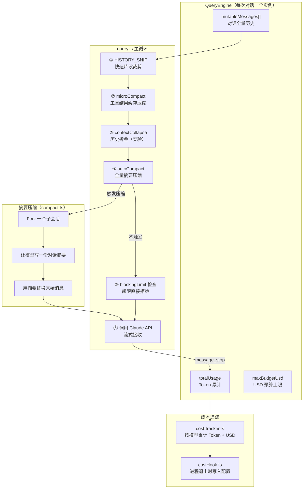

# 第19课：上下文管理与模型路由

> **阶段**：专题篇 · 能力维度横切  
> **建议时长**：75 分钟  
> **难度**：⭐⭐⭐⭐

---

## 课程信息

### 学习目标

完成本课学习后，你将能够：

1. 描述 Claude Code 多轮对话上下文的构建方式，理解 `mutableMessages` 的生命周期
2. 解释上下文窗口管理的三道防线：预警阈值、自动摘要压缩、阻塞拦截
3. 分析 `query.ts` 中七种"continue"路径各自的触发时机与恢复策略
4. 说明模型选择的五级优先链路，以及 `getRuntimeMainLoopModel` 如何在运行时动态切换
5. 理解 Token 计数、成本累积与 USD 预算护栏的完整闭环

---

## 核心概念

### 1.1 上下文即状态

在 Claude Code 里，"一次对话"对应一个 `QueryEngine` 实例。这个实例里有一个叫 `mutableMessages` 的数组——它是整个多轮对话的真正主角。每次你发消息、模型回复、工具执行，结果都追加进这个数组。它是持久的（跨多次 `submitMessage()`），是有序的（时间线完整），也是受保护的（不直接暴露给外部）。

| 类型 | 含义 | 示例 |
|------|------|------|
| `user` | 用户输入 / 工具结果 | 你发的问题、BashTool 的执行结果 |
| `assistant` | 模型回复 | Claude 的文字 + 工具调用指令 |
| `system` | 内部控制信号 | compact_boundary、api_error |
| `progress` | 工具执行进度 | 子任务状态更新 |
| `attachment` | 注入附件 | 记忆文件、队列命令 |

### 1.2 上下文窗口的三道防线

当 mutableMessages 越堆越多，Token 总量就越来越大。Claude Code 设计了三道防线：

```
Token 用量
100% ─── 阻塞拦截（PROMPT_TOO_LONG）─ 直接返回错误消息
 95% ─── 自动压缩阈值（autocompactThreshold）─ 触发摘要压缩
 85% ─── 预警（WARNING_THRESHOLD）─ UI 显示警告
```

### 1.3 模型路由优先链

模型选择遵循严格的五级优先顺序：

```
1. 会话内 /model 命令（最高优先级）
2. --model 启动参数
3. ANTHROPIC_MODEL 环境变量
4. settings.json 中保存的配置
5. 订阅类型默认值（Max/Team Premium → Opus；其他 → Sonnet）
```

---

## 架构设计与设计思想

### 2.1 上下文管理系统架构



### 2.2 "自动压缩"的设计哲学：主动收缩而非被动拒绝

传统 AI 应用遇到上下文溢出只有一个结局：报错，让用户自己重来。Claude Code 的做法更进一步——**在溢出发生之前，主动把历史对话压缩成摘要**，继续跑。

核心公式：
```
autocompactThreshold = contextWindow - 20,000（保留摘要输出空间） - 13,000（缓冲）
```

当累计 Token 超过这个阈值，`autoCompact` 就会 fork 一个子会话，让模型读完历史对话，写一份精炼摘要，用摘要替换原始消息。对用户来说，对话没有中断——只是内存更精简了。

---

## 关键源码深度走查

### 3.1 QueryEngine.ts：一次对话一个对象，状态完全内聚

**文件**：`src/QueryEngine.ts` 第 184-207 行

```typescript
export class QueryEngine {
  private config: QueryEngineConfig
  private mutableMessages: Message[]         // ① 对话历史（跨轮次持久）
  private abortController: AbortController  // ② 中断控制器
  private permissionDenials: SDKPermissionDenial[] // ③ 权限拒绝记录
  private totalUsage: NonNullableUsage       // ④ 累计 Token 统计
  private readFileState: FileStateCache      // ⑤ 文件读取缓存
  private discoveredSkillNames = new Set<string>() // ⑥ 当前轮次发现的技能
  private loadedNestedMemoryPaths = new Set<string>() // ⑦ 已加载的记忆路径

  constructor(config: QueryEngineConfig) {
    this.config = config
    this.mutableMessages = config.initialMessages ?? []  // 支持会话恢复
    this.abortController = config.abortController ?? createAbortController()
    this.permissionDenials = []
    this.readFileState = config.readFileCache
    this.totalUsage = EMPTY_USAGE
  }
```

**逐行解析**：

① `mutableMessages` 是跨轮次的——调用多次 `submitMessage()` 不会丢失历史，这正是多轮对话的根基。

② `abortController` 可以从外部注入，用于协调器模式下统一控制多个并发会话的中断。

③ `permissionDenials` 收集每次工具调用的拒绝记录，在最终 `result` 消息里一起上报，SDK 调用方可以据此分析权限配置。

⑤ `readFileState` 是文件状态缓存——当同一个文件在多轮中被读取，不需要每次都重新从磁盘读，提升响应速度。

⑦ `loadedNestedMemoryPaths` 追踪跨轮次已加载的嵌套记忆文件，防止同一记忆文件被重复注入浪费 Token。

> 💡 **设计点评 — 会话即对象（Session as Object）**
>
> **好在哪里**：所有状态（历史消息、Token 统计、文件缓存、记忆路径）都在一个对象里。不需要全局变量，不需要在函数间传来传去，不会因为某处忘记初始化而出 bug。就像你有一个旅行背包，所有东西都在里面——无论走到哪里，背包里的状态总是完整的。
>
> **如果不这样做**：把 `mutableMessages` 放全局变量，多用户场景下会互相污染；把 Token 统计拆散到各处，每次汇总都要到处找；把文件缓存另建一个全局 Map，生命周期就脱钩了——该清的没清，不该清的反而被清了。

---

### 3.2 query.ts：对话主循环的七种"继续"路径

**文件**：`src/query.ts` 第 268-280 行（State 类型定义）

```typescript
type State = {
  messages: Message[]              // 当前轮次的消息数组
  toolUseContext: ToolUseContext    // 工具执行上下文
  autoCompactTracking: AutoCompactTrackingState | undefined // ① 压缩状态追踪
  maxOutputTokensRecoveryCount: number  // ② 输出限制恢复计数（最多3次）
  hasAttemptedReactiveCompact: boolean  // ③ 是否已尝试过被动压缩
  maxOutputTokensOverride: number | undefined // ④ 动态输出 Token 上限
  pendingToolUseSummary: Promise<ToolUseSummaryMessage | null> | undefined // ⑤ 异步工具摘要
  stopHookActive: boolean | undefined  // ⑥ 停止钩子是否活跃
  turnCount: number               // 当前已进行的轮次数
  transition: Continue | undefined // ⑦ 上一次循环的继续原因
}
```

这个 `State` 结构是整个对话循环的"内存"。每次 `while(true)` 进入下一轮，就从 `state` 里解构出所有变量。每种"继续"情况对应一种 `transition.reason`：

| 继续原因（transition.reason） | 触发场景 |
|------------------------------|---------|
| `next_turn` | 正常工具调用完成，进入下一轮 |
| `max_output_tokens_recovery` | 模型触达输出 Token 上限，注入恢复提示 |
| `max_output_tokens_escalate` | 先尝试放大到 64K 输出再重试 |
| `reactive_compact_retry` | 被动压缩成功后重试 |
| `collapse_drain_retry` | 折叠恢复成功后重试 |
| `stop_hook_blocking` | 停止钩子注入阻断错误后重试 |
| `token_budget_continuation` | Token 预算激励继续输出 |

**关键设计**：所有 continue 路径都通过 `state = { ... }; continue` 的方式更新状态然后重新进入循环顶部，而不是递归调用——这避免了深层递归爆栈，也让状态转换一目了然。

> 💡 **设计点评 — 状态机而非递归（State Machine vs. Recursion）**
>
> **好在哪里**：七种继续路径，每种都是 `state = next; continue`，逻辑清晰、扁平、可追溯。就像地铁换乘系统——不管你从哪条线过来，最终都回到同一个入口重新检票，状态完全透明。
>
> **如果不这样做**：如果用递归实现（`yield* queryLoop(state)` 调用自身），七种路径的深度累积，遇到长任务（几十轮工具调用）就可能触发 JS 调用栈限制，而且每层都要保留完整的局部变量，内存开销是线性递增的。

---

### 3.3 autoCompact.ts：阈值计算与触发决策

**文件**：`src/services/compact/autoCompact.ts` 第 32-91 行

```typescript
// 为摘要输出保留 Token 空间（基于 p99.99 观测值 17,387 tokens）
const MAX_OUTPUT_TOKENS_FOR_SUMMARY = 20_000

export function getEffectiveContextWindowSize(model: string): number {
  const reservedTokensForSummary = Math.min(
    getMaxOutputTokensForModel(model),
    MAX_OUTPUT_TOKENS_FOR_SUMMARY,
  )
  let contextWindow = getContextWindowForModel(model, getSdkBetas())

  // 支持环境变量覆盖，方便压缩功能的测试
  const autoCompactWindow = process.env.CLAUDE_CODE_AUTO_COMPACT_WINDOW
  if (autoCompactWindow) {
    const parsed = parseInt(autoCompactWindow, 10)
    if (!isNaN(parsed) && parsed > 0) {
      contextWindow = Math.min(contextWindow, parsed)
    }
  }

  return contextWindow - reservedTokensForSummary  // ① 有效窗口 = 总窗口 - 摘要预留
}

export function getAutoCompactThreshold(model: string): number {
  const effectiveContextWindow = getEffectiveContextWindowSize(model)
  const autocompactThreshold = effectiveContextWindow - AUTOCOMPACT_BUFFER_TOKENS // ② 再减 13,000 缓冲
  // ...
  return autocompactThreshold
}

export function calculateTokenWarningState(tokenUsage: number, model: string) {
  const effectiveContextWindow = getEffectiveContextWindowSize(model)
  const autoCompactThreshold = getAutoCompactThreshold(model)
  return {
    percentLeft: 1 - tokenUsage / effectiveContextWindow,
    isAboveWarningThreshold: tokenUsage > effectiveContextWindow - WARNING_THRESHOLD_BUFFER_TOKENS, // ③ 预警：-20,000
    isAboveErrorThreshold: tokenUsage > effectiveContextWindow - ERROR_THRESHOLD_BUFFER_TOKENS,    // ④ 错误级预警
    isAboveAutoCompactThreshold: tokenUsage > autoCompactThreshold,     // ⑤ 触发摘要压缩
    isAtBlockingLimit: tokenUsage >= effectiveContextWindow,            // ⑥ 完全阻塞
  }
}
```

**逐行解析**：

① 有效窗口 = 总上下文窗口 - 20,000（为摘要输出预留，基于 p99.99 实测值而非拍脑袋）  
② 压缩触发阈值 = 有效窗口 - 13,000（缓冲区，防止触发压缩后还没跑完一个 API 请求就超了）  
③ 预警 = 剩余 20,000 tokens 时触发，UI 显示黄色警告  
⑥ 阻塞 = 达到有效窗口时完全拒绝，返回 `PROMPT_TOO_LONG_ERROR_MESSAGE`

> 💡 **设计点评 — 分层阈值设计（Layered Thresholds）**
>
> **好在哪里**：预警 → 自动压缩 → 阻塞，三个阈值层层递进，就像汽车的油量表有"低油量警告"、"紧急备用"和"熄火"三个阶段。用户先看到黄色警告，有机会手动处理；如果不处理，系统自动压缩一把继续跑；实在不行才彻底拦住。
>
> **如果不这样做**：只有一个硬限制——超过就报错。用户写了 30 分钟的复杂对话，突然"上下文太长"强行中断，体验极差，而且所有的中间状态都丢失了。

---

### 3.4 model.ts：模型选择的五级优先链

**文件**：`src/utils/model/model.ts` 第 61-99 行

```typescript
// 优先链第一关：读取用户指定的模型（可能是别名）
export function getUserSpecifiedModelSetting(): ModelSetting | undefined {
  let specifiedModel: ModelSetting | undefined

  const modelOverride = getMainLoopModelOverride()  // ① 会话内 /model 命令
  if (modelOverride !== undefined) {
    specifiedModel = modelOverride
  } else {
    const settings = getSettings_DEPRECATED() || {}
    // ② --model 参数 ③ 环境变量 ④ 配置文件，按优先级取第一个非空值
    specifiedModel = process.env.ANTHROPIC_MODEL || settings.model || undefined
  }

  // 安全阀：如果指定模型不在允许列表，当作未指定
  if (specifiedModel && !isModelAllowed(specifiedModel)) {
    return undefined
  }

  return specifiedModel
}

// ⑤ 最后的默认值：按订阅类型选模型
export function getDefaultMainLoopModelSetting(): ModelName | ModelAlias {
  if (isMaxSubscriber() || isTeamPremiumSubscriber()) {
    return getDefaultOpusModel() + (isOpus1mMergeEnabled() ? '[1m]' : '')
  }
  // PAYG、Enterprise、Team Standard、Pro 用 Sonnet
  return getDefaultSonnetModel()
}

// 运行时动态路由：在 plan 模式下可能切换模型
export function getRuntimeMainLoopModel(params: {
  permissionMode: PermissionMode
  mainLoopModel: string
  exceeds200kTokens?: boolean
}): ModelName {
  // opusplan 别名：plan 模式下自动升级到 Opus
  if (
    getUserSpecifiedModelSetting() === 'opusplan' &&
    params.permissionMode === 'plan' &&
    !params.exceeds200kTokens
  ) {
    return getDefaultOpusModel()
  }
  // haiku 用户进入 plan 模式时自动升级到 Sonnet（haiku 推理能力不足以规划）
  if (getUserSpecifiedModelSetting() === 'haiku' && params.permissionMode === 'plan') {
    return getDefaultSonnetModel()
  }
  return params.mainLoopModel
}
```

**逐行解析**：

① 会话内 `/model` 命令的优先级最高——这让用户可以在不中断对话的前提下切换模型。  
安全阀：`isModelAllowed()` 防止用户指定一个不在白名单里的模型，避免 API 端异常。  
`opusplan` 别名是一个智能路由——平时用 Sonnet（省钱），规划阶段用 Opus（更强推理），超过 200k tokens 时回退 Sonnet（Opus 1M 太贵）。

> 💡 **设计点评 — 别名路由（Alias Routing）**
>
> **好在哪里**：`opusplan` 这个别名很巧妙——用户不需要在不同阶段手动切换模型，系统根据 `permissionMode` 自动路由。就像打车软件根据你的订阅档次自动分配顺风车或专车，你只需要打开 APP，剩下的它来决定。
>
> **如果不这样做**：用户要么全程用 Opus（贵、快），要么全程用 Haiku（省、弱），要么每次手动 `/model`——体验割裂，而且大部分用户根本不知道什么时候该换模型。

---

### 3.5 cost-tracker.ts：Token 计数与成本闭环

**文件**：`src/cost-tracker.ts` 第 250-323 行

```typescript
export function addToTotalSessionCost(
  cost: number,
  usage: Usage,   // Anthropic SDK 的 BetaUsage 类型（含缓存字段）
  model: string,
): number {
  const modelUsage = addToTotalModelUsage(cost, usage, model)
  addToTotalCostState(cost, modelUsage, model)  // ① 写入全局成本状态

  const attrs = isFastModeEnabled() && usage.speed === 'fast'
    ? { model, speed: 'fast' }
    : { model }

  // ② OpenTelemetry 式指标上报（供 ANT 内部监控）
  getCostCounter()?.add(cost, attrs)
  getTokenCounter()?.add(usage.input_tokens, { ...attrs, type: 'input' })
  getTokenCounter()?.add(usage.output_tokens, { ...attrs, type: 'output' })
  getTokenCounter()?.add(usage.cache_read_input_tokens ?? 0, { ...attrs, type: 'cacheRead' })
  getTokenCounter()?.add(usage.cache_creation_input_tokens ?? 0, { ...attrs, type: 'cacheCreation' })

  let totalCost = cost
  // ③ 处理 advisor 工具的嵌套成本（advisor 工具内部可能调用第二个模型）
  for (const advisorUsage of getAdvisorUsage(usage)) {
    const advisorCost = calculateUSDCost(advisorUsage.model, advisorUsage)
    totalCost += addToTotalSessionCost(advisorCost, advisorUsage, advisorUsage.model)
  }
  return totalCost
}
```

**逐行解析**：

① 成本状态（`totalCostUSD`、`modelUsage` 等）存储在 `bootstrap/state.ts` 的全局单例中，进程内任何地方都能读取，不需要传参。  
② `CostCounter` / `TokenCounter` 是 OpenTelemetry 计数器的封装，在 ANT 内部环境下上报到监控系统，外部发布版本中为 no-op。  
③ `advisorUsage` 处理的是 advisor 工具（辅助判断工具）内部调用的模型成本，这些成本需要递归累加到总计里。

---

## Harness Engineering

### 5.1 Harness 视角

Claude Code 的上下文管理是 Harness 设计中最值得借鉴的一环。作为一个"代码 AI 宿主"，它必须同时解决三个相互对抗的目标：

1. **记忆尽可能多**：长任务需要完整上下文
2. **成本尽可能低**：每个 Token 都要花钱
3. **质量尽可能高**：摘要压缩会丢失细节

Claude Code 的解法是**多层级的渐进式降级**：优先保留完整历史，当接近限制时用轻量级 microcompact（只压缩工具结果），实在不行再全量 autocompact（摘要整段历史）。每个层级都有成本和精度的取舍，用户看到的是"无缝延续"。

### 5.2 大模型应用启发

**Pattern 1：对话生命周期对象化**

把 `messages[]`、`usage`、`abortController`、`fileCache` 打包进一个类，而不是分散在全局状态里。每次会话 `new QueryEngine(config)`，清理时 `engine = null`，生命周期自动管理。

**Pattern 2：Token 预算护栏**

```typescript
// 设置 USD 预算上限（QueryEngine.ts）
if (maxBudgetUsd !== undefined && getTotalCost() >= maxBudgetUsd) {
  yield { type: 'result', subtype: 'error_max_budget_usd', ... }
  return
}
```

在你自己的 AI Agent 里，可以参考同样的模式：每次 API 回包后检查累计成本，超过预算立即停止并上报。这是防止"Agent 失控烧钱"的最后一道闸。

**Pattern 3：可插拔的压缩钩子**

`QueryEngine` 接受一个 `snipReplay` 回调，这意味着压缩逻辑可以从外部注入。如果你在构建一个多模型对话框架，可以用同样的方式让调用方决定"达到什么条件时用什么策略压缩上下文"。

---

## 思考题与进阶

**题目 1**：`mutableMessages` 和传给 `query()` 的 `messages` 参数有什么区别？在 compact_boundary 之后，两者的处理逻辑为何不同？

<details>
<summary>💡 参考答案</summary>

`mutableMessages` 是 `QueryEngine` 实例级别的完整历史，跨所有 `submitMessage()` 调用持久存在，用于会话恢复和 UI 滚动回看。传给 `query()` 的 `messages` 是在 `submitMessage()` 开始时拷贝的快照（`[...this.mutableMessages]`），之后在循环中追加新消息。当出现 `compact_boundary` 时，QueryEngine 对 `mutableMessages` 做了 `splice(0, boundaryIdx)`——只保留边界之后的消息——释放内存。但 UI 侧（REPL 模式）不做这个截断，保留完整历史供用户回滚查看，通过 `projectSnippedView` 函数在展示时按需"投影"。

</details>

---

**题目 2**：`max_output_tokens_recovery` 的恢复消息（"Output token limit hit. Resume directly…"）是 `isMeta: true` 的。这意味着什么？为什么不能让用户看到这条消息？

<details>
<summary>💡 参考答案</summary>

`isMeta: true` 的消息是"系统注射"——它会进入对话历史（模型能看到），但在 UI 上被过滤掉，用户感知不到。这样做是为了无缝恢复：模型被告知"Token 打满了，继续从刚才截断的地方讲"，而用户界面上看起来模型的回复还在持续流式输出，没有任何中断提示。如果用户能看到这条消息，反而会产生困惑（"谁截断我了？"），破坏交互连贯性。

</details>

---

**题目 3**：`getRipgrepConfig` 使用了 `memoize`，而 `getRuntimeMainLoopModel` 没有。为什么它们对"是否缓存"的处理不一样？

<details>
<summary>💡 参考答案</summary>

`getRipgrepConfig` 的输出只取决于启动时的二进制路径和环境变量，在进程生命周期内是静态的，适合用 `memoize` 永久缓存。`getRuntimeMainLoopModel` 则依赖 `permissionMode` 这个运行时可变状态——用户切换到 plan 模式时 `permissionMode` 变了，必须重新计算。如果对 `getRuntimeMainLoopModel` 做 memoize，就会导致 plan 模式的模型切换失效，`opusplan` 别名永远不会生效。缓存要慎用的核心原则：只缓存"对相同输入总是返回相同输出"的纯函数。

</details>

---

**题目 4**：QueryEngine 的 `maxBudgetUsd` 护栏是每次 `submitMessage()` 重置，还是跨轮次累计的？从代码上看，如何证明你的判断？

<details>
<summary>💡 参考答案</summary>

`maxBudgetUsd` 是跨轮次累计的。`getTotalCost()` 调用的是 `bootstrap/state.ts` 里的全局成本状态，而 `QueryEngine.totalUsage`（实例级）只是 SDK 消息里 `usage` 字段的汇总，两者独立。每次 `submitMessage()` 开始时，没有任何代码重置 `totalCost`；`addToTotalSessionCost` 是累加操作（`+=`）。所以 `maxBudgetUsd` 是针对整个 `QueryEngine` 实例生命周期的累计护栏，适合用于"这个 Agent 任务总共只能花 $5"这样的场景。

</details>

---

**题目 5**：为什么 `autoCompact` 需要一个"连续失败计数器"（`consecutiveFailures`）以及上限 `MAX_CONSECUTIVE_AUTOCOMPACT_FAILURES = 3`？去掉这个计数器会发生什么？

<details>
<summary>💡 参考答案</summary>

如果 autocompact 触发了，但摘要写得太长（超过允许的输出 Token），或者写摘要的过程本身失败，那下一轮进来 Token 还是很高，autocompact 会再次触发，再次失败——这就是"死亡螺旋"。代码注释里明确写到：BQ 数据显示曾有 1,279 个会话发生了 50 次以上的连续失败（最高 3,272 次），每天浪费约 25 万次 API 调用。连续 3 次失败后熔断，让 prompt_too_long 错误自然浮出，停止无效重试。这是典型的"幂等重试 + 熔断"模式在 AI 场景下的应用。

</details>
