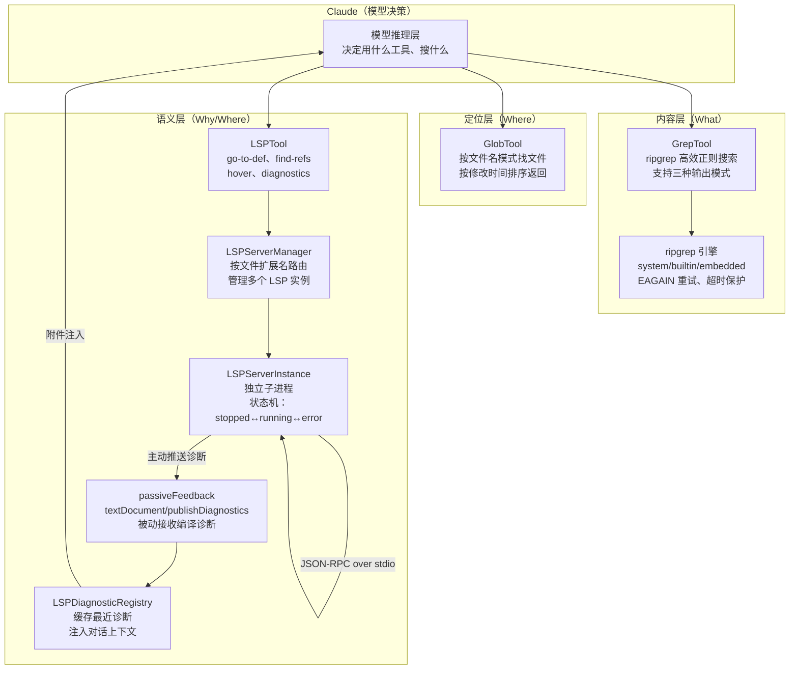

# 第20课：复杂工程理解与资产提取

> **阶段**：专题篇 · 能力维度横切  
> **建议时长**：75 分钟  
> **难度**：⭐⭐⭐⭐

---

## 课程信息

### 学习目标

完成本课学习后，你将能够：

1. 描述 Claude Code 的三层代码理解工具链：Glob 定位文件、Grep 搜索内容、LSP 获取语义
2. 解释 ripgrep 的三种运行模式（system/builtin/embedded）及其安全考量
3. 分析 LSP 服务器管理器的异步初始化模式与"代无效化"机制
4. 说明被动诊断反馈（`textDocument/publishDiagnostics`）如何让 Claude 实时感知编译错误
5. 理解 LSP 服务器通过插件系统加载的完整链路，以及为什么 LSP 不支持用户直接配置

---

## 核心概念

### 1.1 代码理解的三个层次

Claude Code 理解一个大型代码库要经过三个层次的工具：

| 层次 | 工具 | 解决什么问题 | 示例 |
|------|------|-------------|------|
| 文件定位 | `GlobTool` | "找出所有 TypeScript 测试文件" | `**/*.test.ts` |
| 内容搜索 | `GrepTool` + ripgrep | "找出所有调用 `createLSPClient` 的地方" | 正则 + 路径过滤 |
| 语义理解 | `LSPTool` + LSP 服务器 | "这个函数的定义在哪里？有哪些引用？" | `textDocument/definition` |

三者形成递进关系：Glob 缩小范围，Grep 精确匹配，LSP 提供结构化语义。

### 1.2 ripgrep 的三种运行模式

```
优先级：用户指定系统路径 > embedded（内嵌到 bun 二进制）> builtin（vendor 目录）

系统模式（system）：用 'rg' 命令名，不是绝对路径——防止 PATH 劫持
嵌入模式（embedded）：通过 argv0='rg' 让 bun 进程自身分发
内建模式（builtin）：vendor/ripgrep/{arch}-{platform}/rg
```

### 1.3 LSP 的角色：超越文本搜索

grep/glob 是"文本级别"的理解——知道"这串字符在哪里"。LSP（Language Server Protocol）是"语义级别"的理解——知道"这个符号是什么类型、在哪里被定义、谁在引用它"。这种区别在重构和跨文件导航时尤为关键。

---

## 架构设计与设计思想

### 2.1 代码理解工具链架构



### 2.2 被动诊断：让 Claude 在不询问的情况下感知错误

LSP 的一个独特能力是**被动推送**：当你的代码有编译错误，语言服务器会主动发送 `textDocument/publishDiagnostics` 通知，不需要 Claude 专门去问。Claude Code 监听这个通知，把诊断信息缓存起来，在下一轮对话时作为附件注入。这意味着 Claude 在你说"修一下这个 bug"之前，已经知道有 bug 在哪里了。

### 2.3 为什么 LSP 只能通过插件配置

通过 `src/services/lsp/config.ts` 可以看到，LSP 服务器配置**只从插件加载**，不支持用户直接在 `settings.json` 里配置：

```
LSP 配置来源：plugins（only）
不支持：user/project settings
```

这是一个安全决策：LSP 服务器是以独立子进程运行的，并且需要权限发送/接收文件内容。插件系统有独立的安装和审核流程，比用户任意配置更安全。如果用户能直接配置 LSP 服务器命令，等于允许任意代码在后台以 Claude Code 的权限运行。

---

## 关键源码深度走查

### 3.1 ripgrep.ts：三种模式的优先级路由

**文件**：`src/utils/ripgrep.ts` 第 31-65 行

```typescript
type RipgrepConfig = {
  mode: 'system' | 'builtin' | 'embedded'
  command: string
  args: string[]
  argv0?: string   // 只有 embedded 模式才需要，通过 argv0 欺骗 bun 分发
}

const getRipgrepConfig = memoize((): RipgrepConfig => {
  const userWantsSystemRipgrep = isEnvDefinedFalsy(
    process.env.USE_BUILTIN_RIPGREP,  // ① USE_BUILTIN_RIPGREP=0 → 使用系统 rg
  )

  if (userWantsSystemRipgrep) {
    const { cmd: systemPath } = findExecutable('rg', [])
    if (systemPath !== 'rg') {
      // ② 安全关键：使用命令名 'rg' 而不是绝对路径 systemPath
      // 防止 ./rg.exe 这类 PATH 劫持攻击
      // OS 用 NoDefaultCurrentDirectoryInExePath 保护解析 'rg'
      return { mode: 'system', command: 'rg', args: [] }
    }
  }

  // ③ embedded 模式：bun 打包产物内嵌了 ripgrep
  // argv0='rg' 让 bun 进程自身识别为 rg 并分发
  if (isInBundledMode()) {
    return {
      mode: 'embedded',
      command: process.execPath,  // bun 可执行文件自身
      args: ['--no-config'],
      argv0: 'rg',  // 让 bun 的内部分发器以 rg 模式运行
    }
  }

  // ④ builtin：vendor 目录里打包的预编译 rg 二进制
  const rgRoot = path.resolve(__dirname, 'vendor', 'ripgrep')
  const command =
    process.platform === 'win32'
      ? path.resolve(rgRoot, `${process.arch}-win32`, 'rg.exe')
      : path.resolve(rgRoot, `${process.arch}-${process.platform}`, 'rg')

  return { mode: 'builtin', command, args: [] }
})
```

**逐行解析**：

① `isEnvDefinedFalsy` 检测 `USE_BUILTIN_RIPGREP=0` 或 `false`，用来让用户强制使用系统安装的 rg（通常更新、支持更多特性）。  
② **安全关键**：返回字符串 `'rg'` 而不是 `systemPath`（如 `/usr/local/bin/rg`）。原因是 PATH 解析时 OS 会跳过当前目录，而绝对路径解析时攻击者可以在工作目录放一个同名二进制。  
③ embedded 模式是最巧妙的——bun 把 ripgrep 静态编译进了自身，通过 `argv0` 告诉 bun"我是 rg，用 rg 模式运行"，连子进程都不需要额外下载。  
④ 按 `${process.arch}-${process.platform}` 区分不同 CPU 架构和操作系统，支持 arm64-darwin、x64-linux 等多平台。

> 💡 **设计点评 — PATH 劫持防护**
>
> **好在哪里**：用命令名 `'rg'` 而非绝对路径，是一个反直觉但正确的安全决策。绝对路径看起来更"精确"，但在 Windows 上 `NoDefaultCurrentDirectoryInExePath` 保护只对命令名有效。攻击者在项目目录放一个 `rg.exe`，调用绝对路径就会绕过保护，调用命令名 `'rg'` 就不会。
>
> **如果不这样做**：Claude Code 在分析一个"恶意项目"（含伪装的 rg.exe）时，可能执行攻击者的任意代码，权限与 Claude Code 进程相同。这是一种经典的供应链攻击向量。

---

### 3.2 ripgrep.ts：EAGAIN 重试与超时容错

**文件**：`src/utils/ripgrep.ts` 第 380-455 行

```typescript
export async function ripGrep(
  args: string[],
  target: string,
  abortSignal: AbortSignal,
): Promise<string[]> {
  await codesignRipgrepIfNecessary()  // ① macOS 代码签名懒检查

  return new Promise((resolve, reject) => {
    const handleResult = (error, stdout, stderr, isRetry): void => {
      if (!error) {
        // ② 成功：trim + 按行分割 + 过滤空行
        resolve(stdout.trim().split('\n').map(l => l.replace(/\r$/, '')).filter(Boolean))
        return
      }
      if (error.code === 1) {
        resolve([])  // ③ exit code 1 = 无匹配，不是错误
        return
      }
      // ④ 关键错误（ENOENT/EACCES/EPERM）直接 reject
      const CRITICAL_ERROR_CODES = ['ENOENT', 'EACCES', 'EPERM']
      if (CRITICAL_ERROR_CODES.includes(error.code)) {
        reject(error)
        return
      }
      // ⑤ EAGAIN = 资源不足（Docker/CI 环境），单线程重试
      if (!isRetry && isEagainError(stderr)) {
        logEvent('tengu_ripgrep_eagain_retry', {})
        ripGrepRaw(args, target, abortSignal,
          (retryError, retryStdout, retryStderr) => {
            handleResult(retryError, retryStdout, retryStderr, true)
          },
          true,  // 强制 -j 1 单线程模式（仅本次重试）
        )
        return
      }
      // ⑥ 超时有部分结果时，返回不完整列表（比空列表好）
      const isTimeout = error.signal === 'SIGTERM' || error.signal === 'SIGKILL'
      // ⑦ 超时且无结果：抛出专属错误，让 Claude 知道搜索未完成
      if (isTimeout && lines.length === 0) {
        reject(new RipgrepTimeoutError(
          `Ripgrep search timed out after ${getPlatform() === 'wsl' ? 60 : 20} seconds...`,
          lines,
        ))
        return
      }
      resolve(lines)
    }
    // ...
  })
}
```

**逐行解析**：

① `codesignRipgrepIfNecessary()` 是 macOS 专属的懒加载签名检查——首次运行时检测 rg 二进制是否只有 linker-signed（开发签名），如果是就重新签名。这解决了 macOS Gatekeeper 阻拦未签名二进制的问题，只做一次、结果缓存。  
③ ripgrep exit code 1 表示"搜索成功但没有匹配"，是正常情况而非错误。初学者常会把 `code === 1` 当错误处理。  
⑤ EAGAIN 是 Linux 资源不足（`os error 11`），多发于 Docker 容器或 CI 环境，原因是 ripgrep 默认多线程，fork 时受限。解法是一次性的 `-j 1` 单线程重试，不会全局降级（注释写明了为什么不全局降级）。  
⑦ 超时有部分结果 vs 无结果：有结果时返回部分结果（也许够用），无结果时抛出 `RipgrepTimeoutError`——让 Claude 知道"没找到不代表不存在，是搜索超时了"，避免错误推断。

> 💡 **设计点评 — 差异化超时处理**
>
> **好在哪里**：超时后"有结果返回部分结果，无结果抛出专属错误"这个设计很务实。部分结果总比什么都没有强——Claude 可能从 100 个匹配里找到答案，哪怕还有 50 个没搜完。但如果完全没有结果，Claude 必须知道"这不是因为真的没有"，否则会做出错误推断：比如"这个函数没有被引用，可以安全删除"——但其实是搜索没跑完。
>
> **如果不这样做**：超时时统一返回空数组，Claude 看到空结果会认为"无匹配"，可能做出"没有这个文件"、"没有这个函数的引用"等错误结论，导致删代码、改错地方。

---

### 3.3 manager.ts：LSP 初始化的"代无效化"模式

**文件**：`src/services/lsp/manager.ts` 第 145-208 行

```typescript
let initializationGeneration = 0  // ① 代计数器：防止过期 Promise 修改状态

export function initializeLspServerManager(): void {
  if (isBareMode()) return  // ② --bare 模式不需要 LSP

  // ③ 幂等性：已经初始化就直接返回
  if (lspManagerInstance !== undefined && initializationState !== 'failed') {
    return
  }

  // ④ 失败重试：清除旧的失败状态
  if (initializationState === 'failed') {
    lspManagerInstance = undefined
    initializationError = undefined
  }

  lspManagerInstance = createLSPServerManager()
  initializationState = 'pending'

  // ⑤ 关键：在 Promise 启动前递增代数，捕获当前代
  const currentGeneration = ++initializationGeneration

  initializationPromise = lspManagerInstance
    .initialize()
    .then(() => {
      // ⑥ 只有当前代才能修改状态（防止竞态条件）
      if (currentGeneration === initializationGeneration) {
        initializationState = 'success'
        // 注册被动诊断监听器
        if (lspManagerInstance) {
          registerLSPNotificationHandlers(lspManagerInstance)
        }
      }
    })
    .catch((error: unknown) => {
      if (currentGeneration === initializationGeneration) {  // ⑦ 同样的代检查
        initializationState = 'failed'
        initializationError = error as Error
        lspManagerInstance = undefined
      }
    })
}
```

**逐行解析**：

① `initializationGeneration` 是经典的"代无效化"（Generation Counter）模式——每次 reinitialize 时递增，让所有挂起的 Promise 在回调里检查"我还是当前代吗？"  
② `isBareMode()`：`--bare`（`-p` 参数）是无交互的脚本模式，不显示 UI，也不需要 LSP 语义服务。跳过节省启动时间。  
③ 幂等性：`initializeLspServerManager()` 可以被多次调用（插件刷新时会调用），不会重复初始化。  
⑤ ⑥ ⑦ 代无效化的完整模式：在 Promise 外捕获 `currentGeneration`，回调里检查 `currentGeneration === initializationGeneration`。如果 reinit 在中途发生，旧 Promise 的代数已经不匹配，修改状态的操作被跳过，避免"旧初始化覆盖新初始化结果"的竞态。

> 💡 **设计点评 — 代无效化防竞态（Generation Counter）**
>
> **好在哪里**：LSP 初始化是异步的，可能需要几秒。如果在这段时间内用户触发了 `/reload-plugins`，会启动一次新的初始化。没有代计数器的话，旧初始化跑完后会把 `initializationState = 'success'` 覆盖掉新初始化的 `'pending'` 状态——要么把一个旧的失败状态遮住，要么把一个新的成功标记提前设置。代计数器就像给每个 Promise 贴了一张"哪届政府颁发的许可证"，只有当届的才能生效。
>
> **如果不这样做**：快速连续触发两次重新初始化，可能出现"先启动的 Promise 后完成"的时序问题，让系统认为 LSP 已成功初始化，但实际上用的是旧的（可能已过期的）配置。

---

### 3.4 LSPServerInstance.ts：服务器状态机与崩溃恢复

**文件**：`src/services/lsp/LSPServerInstance.ts` 第 90-150 行

```typescript
export function createLSPServerInstance(
  name: string,
  config: ScopedLspServerConfig,
): LSPServerInstance {
  // ① 工厂函数模式，用闭包替代类
  let state: LspServerState = 'stopped'  // stopped | starting | running | stopping | error
  let crashRecoveryCount = 0

  // ② 注入崩溃处理器：子进程异常退出时更新状态
  const client = createLSPClient(name, error => {
    state = 'error'
    lastError = error
    crashRecoveryCount++  // 不自动重启，而是等待下次请求时触发
  })

  async function start(): Promise<void> {
    if (state === 'running' || state === 'starting') {
      return  // ③ 幂等：已在运行则跳过
    }

    // ④ 崩溃熔断：超过最大重启次数后拒绝服务
    const maxRestarts = config.maxRestarts ?? 3
    if (state === 'error' && crashRecoveryCount > maxRestarts) {
      throw new Error(
        `LSP server '${name}' exceeded max crash recovery attempts (${maxRestarts})`
      )
    }

    state = 'starting'
    startTime = new Date()

    // ⑤ 懒加载 vscode-jsonrpc (~129KB)
    // 只有真正需要 LSP 时才加载，不影响启动速度
    // ...
  }
```

**逐行解析**：

① 工厂函数 + 闭包替代类：`state`、`crashRecoveryCount` 等私有状态存在闭包里，不需要 `class` 关键字，也更难从外部意外修改。  
② 崩溃处理器是注入的回调，而不是轮询——子进程退出时立即回调，状态更新没有延迟。  
③ `start()` 的幂等性很重要——`ensureServerStarted()` 可能被多个并发工具调用触发，每次都检查一下，只有真正需要时才启动。  
④ 崩溃熔断：不是无限重试，而是有上限（默认 3 次）。超过后拒绝服务，让上层（LSPServerManager）知道这个服务器不可用，而不是一直卡在重试循环里。  
⑤ `vscode-jsonrpc` 是一个约 129KB 的模块，只有在实际创建 LSP 连接时才 require，不影响 Claude Code 的启动时间。

---

### 3.5 passiveFeedback.ts：被动诊断注入对话上下文

**文件**：`src/services/lsp/passiveFeedback.ts` 第 125-180 行

```typescript
export function registerLSPNotificationHandlers(
  manager: LSPServerManager,
): HandlerRegistrationResult {
  const servers = manager.getAllServers()
  const diagnosticFailures: Map<string, { count: number; lastError: string }> = new Map()

  for (const [serverName, serverInstance] of servers.entries()) {
    // ① 注册 textDocument/publishDiagnostics 被动通知处理器
    serverInstance.onNotification(
      'textDocument/publishDiagnostics',
      (params: unknown) => {
        // ② 验证 params 结构（防御性编程）
        if (!params || typeof params !== 'object' ||
            !('uri' in params) || !('diagnostics' in params)) {
          // 记录但不中断其他服务器的处理
          return
        }

        try {
          // ③ 转换 LSP 诊断格式 → Claude 附件格式
          const diagnosticFiles = formatDiagnosticsForAttachment(
            params as PublishDiagnosticsParams,
          )
          // ④ 注册到全局诊断注册表，后续 turn 时作为附件注入
          registerPendingLSPDiagnostic(diagnosticFiles)
        } catch (error) {
          // ⑤ 跟踪连续失败次数，超过3次则警告用户
          const failures = diagnosticFailures.get(serverName) ?? { count: 0, lastError: '' }
          failures.count++
          failures.lastError = String(error)
          diagnosticFailures.set(serverName, failures)
        }
      },
    )
  }
  // ...
}
```

**逐行解析**：

① `onNotification` 是 JSON-RPC 的单向通知（服务器→客户端），不需要客户端请求触发，LSP 服务器在检测到文件变化时自动推送。  
② 防御性校验是必要的——LSP 服务器（特别是第三方的）可能发送格式不完全合规的 params，`'uri' in params` 这样的检查比直接类型断言更健壮。  
③ `formatDiagnosticsForAttachment` 做了几件事：把 `file://` URI 转换成文件路径，把 LSP 数字 severity（1-4）转换成 Claude 可读的字符串（Error/Warning/Info/Hint）。  
④ `registerPendingLSPDiagnostic` 把诊断结果放进一个全局注册表，下一次对话 turn 开始时，这些诊断会作为"附件"自动注入到上下文里，不需要用户手动请求。

> 💡 **设计点评 — 被动注入（Passive Injection）**
>
> **好在哪里**：LSP 诊断是"主动推送"的——你修改了一个文件，编译器立刻告诉 Claude"这里有个类型错误"，下一句话开始之前 Claude 就已经知道了。就像一个坐在你旁边的同事，你在写代码，他一直盯着看，发现问题随时提醒你，而不是等你问他"这有没有问题"。
>
> **如果不这样做**：每次需要知道错误信息，都要调用一次 `BashTool` 跑编译命令，或者专门调用一次 LSP 请求。不仅慢，还打断了推理链——模型在思考重构方案的同时，还要插入一个"先看看有没有错误"的动作。

---

## Harness Engineering

### 5.1 Harness 视角

代码理解是 Harness 工程里最难做好的一环。Claude Code 的解法给了我们几个重要启示：

**搜索工具的分层设计**：不要试图用一个工具解决所有问题。Glob 做文件名模式匹配、Grep 做内容全文搜索、LSP 做语义查询——三个工具有清晰的职责边界，Claude 会根据任务选择最合适的。如果你在构建 AI 代码助手，可以按同样的方式分层提供工具。

**容错是必须的**：ripgrep 的 EAGAIN 重试、超时部分结果返回、LSP 崩溃熔断——代码库理解工具运行在复杂的真实环境里（Docker、CI、大单仓库），必须为各种边界情况设计容错路径，而不是只 happy path。

### 5.2 大模型应用启发

**Pattern 1：异步初始化 + 代无效化**

```typescript
// 你自己的 Agent 里也可以这样处理异步依赖的初始化
let generation = 0

async function reinitialize() {
  const myGen = ++generation
  const result = await someAsyncInit()
  if (myGen !== generation) return  // 已被新一轮初始化取代，丢弃
  // 更新全局状态...
}
```

这个模式在任何"可能被中途取消或重新触发的异步初始化"场景都适用：数据库连接池、配置重载、模型热更新。

**Pattern 2：工具自我描述的搜索边界**

GrepTool 的 prompt 里写了 `"ALWAYS use Grep for search tasks. NEVER invoke grep or rg as a BashTool command."`——这是一种"元提示约束"，告诉模型工具使用的优先级和边界。如果你在设计多工具 Agent，工具的 description 不仅要说"能做什么"，还要说"什么时候用我而不是其他工具"。

**Pattern 3：被动诊断作为上下文注入**

你的 AI Agent 也可以用类似的模式：设置一个"后台监听器"监听某个状态变化（测试失败、部署状态、监控告警），在每次模型轮次开始前检查有没有新的被动信号，如果有就自动注入为"附件"上下文，让模型在推理时自动感知。

---

## 思考题与进阶

**题目 1**：`ripGrep()` 超时时对"有部分结果"和"无结果"的处理逻辑不同。你能想到一个场景，where 这个差异对于 Claude 的下游推断非常关键？

<details>
<summary>💡 参考答案</summary>

最典型的场景是"查找函数是否被引用"。Claude 可能想在删除某个函数前确认它没有被调用。如果搜索超时且无结果，ripgrep 抛出 `RipgrepTimeoutError`，Claude 能读到"搜索未完成"的提示，不会贸然删除。如果超时但有部分结果（比如扫到了 50 个文件），Claude 可以从已有结果中判断"至少有 N 个引用"，做出保守决策。反之如果都返回空数组，Claude 会误认为"没有引用，可以删除"，导致破坏性错误。超时后的行为设计直接影响了 Agent 的安全边界。

</details>

---

**题目 2**：LSP 服务器通过插件加载，而不是让用户直接在 settings.json 里配置。这背后的安全考量是什么？如果允许用户自由配置，最坏情况是什么？

<details>
<summary>💡 参考答案</summary>

最坏情况：用户在 settings.json 里配置一个伪装成语言服务器的恶意二进制（比如 `"command": "/tmp/evil-lsp"`），Claude Code 启动时会以自身权限运行这个二进制，赋予其读写文件系统、访问网络的能力。更隐蔽的变体是恶意项目（通过 project-level settings.json）注入恶意 LSP，任何打开该项目的用户都会受害。插件系统有独立的安装流程和来源验证（npm/marketplace），提供了一层最低限度的可信度检查。注意同样的安全原因，`autoMemoryDirectory` 也禁止通过 projectSettings 配置。

</details>

---

**题目 3**：`LSPServerInstance` 的崩溃处理器在服务器进程意外退出时将 state 设为 `'error'`，但不自动重启，而是等待下次请求时触发重启。这个"延迟重启"的设计有什么好处？

<details>
<summary>💡 参考答案</summary>

延迟重启避免了"崩溃循环"（crash loop）：如果服务器每次启动都会立即崩溃（比如配置有误，或者项目文件有问题），自动重启只会导致无限循环，消耗 CPU 和内存。等到下次有真实请求时重启，给了用户修复问题的时间，也让日志里的错误和用户的操作有关联性（"我做了什么 → 触发了 LSP → 失败了"），更容易诊断。同时有崩溃次数上限（`maxRestarts=3`），超过后彻底放弃，不再消耗资源。

</details>

---

**题目 4**：Glob 工具的描述说"返回按修改时间排序的文件路径"。为什么按修改时间排序对于 AI 代码助手来说是一个好的默认排序？

<details>
<summary>💡 参考答案</summary>

对于代码助手的典型任务（"帮我修改最近改动的文件"、"找到刚才新增的测试文件"），最近修改的文件往往最相关。按修改时间降序排列意味着 Claude 在列表顶部看到的，通常就是用户刚操作过的文件。在上下文有限（Token 限制）的情况下，如果文件列表被截断，被截断的是最旧的文件——通常影响最小。相比之母，按字母顺序排序则没有这种"最近优先"的语义优势。

</details>

---

**题目 5**：被动诊断（`textDocument/publishDiagnostics`）是 JSON-RPC 通知（Notification），不是请求（Request）。JSON-RPC 协议里通知和请求的核心区别是什么？这对 LSP 的被动推送机制有什么影响？

<details>
<summary>💡 参考答案</summary>

JSON-RPC 请求（Request）有 `id` 字段，服务器必须返回对应的 Response（结果或错误）。通知（Notification）没有 `id`，发送方不期望任何返回——是彻底的 fire-and-forget。对于 LSP 被动推送来说，这意味着：语言服务器可以在任意时刻发送诊断通知，Claude Code 侧只需要注册处理函数（`onNotification`）等待即可；不需要轮询、不需要请求-响应往返、也不需要追踪 ID。这种模式的代价是没有确认机制——如果 Claude Code 的处理器出了异常，服务器不会知道通知是否被正确处理，因此 passiveFeedback.ts 需要在处理器内部做 try/catch 并追踪失败计数。

</details>
