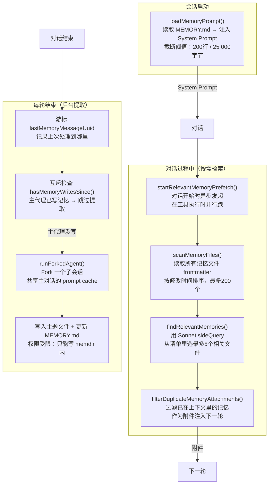

# 第21课：自主记忆与个性化

> **阶段**：专题篇 · 能力维度横切  
> **建议时长**：75 分钟  
> **难度**：⭐⭐⭐⭐

---

## 课程信息

### 学习目标

完成本课学习后，你将能够：

1. 描述 memdir 系统的文件层级结构：`MEMORY.md` 索引 + 主题文件 + frontmatter 格式
2. 解释四类记忆类型（user/feedback/project/reference）的语义边界与适用场景
3. 分析 `extractMemories` 后台代理的"游标+互斥"机制，理解为什么主代理优先于提取代理
4. 说明 `findRelevantMemories` 如何用 sideQuery 让 Sonnet 做语义筛选
5. 理解记忆如何在会话开始时注入 System Prompt，以及 MEMORY.md 截断阈值的设计意图

---

## 核心概念

### 1.1 记忆目录（memdir）的存储结构

Claude Code 的记忆系统是一套**基于文件系统的持久化机制**：

```
~/.claude/projects/<sanitized-git-root>/memory/
├── MEMORY.md          # 索引文件（始终加载进 System Prompt）
├── user_role.md       # 用户类型记忆：角色、偏好
├── feedback_testing.md # 反馈类记忆：操作规范
├── project_deadline.md # 项目类记忆：当前状态、截止日期
└── reference_tools.md  # 参考类记忆：外部系统入口
```

每个主题文件都有 frontmatter：

```markdown
---
name: 用户偏好 - 测试风格
description: 用户强烈要求不 mock 数据库
type: feedback
---

**规则**：集成测试必须连接真实数据库，禁止使用 mock。

**Why**：上一季度 mock 测试全通过，但真实数据库迁移失败，引发线上事故。

**How to apply**：看到 jest.mock() 或 sinon.stub() 对数据库的 mock 时提醒用户。
```

### 1.2 四类记忆的语义边界

| 类型 | 存什么 | 不存什么 | 示例 |
|------|--------|---------|------|
| `user` | 角色、目标、知识背景 | 个人隐私判断 | "用户是后端工程师，第一次接触 React" |
| `feedback` | 操作规范（正向 + 负向）| 个人代码风格偏好 | "不要在每次回复末尾总结刚才做了什么" |
| `project` | 进行中的工作、决策背景 | git 历史 / 代码结构 | "auth 重写是合规需求，不是技术债" |
| `reference` | 外部系统入口指针 | 内容本身 | "pipeline bugs 在 Linear/INGEST 里追踪" |

**最重要的边界**：代码结构、git 历史、架构决策——这些**可以从项目当前状态推导**出来，不应该存进记忆。记忆只存"无法通过读代码恢复"的信息。

### 1.3 记忆生命周期概览

```
会话开始 → loadMemoryPrompt() → MEMORY.md 内容注入 System Prompt
           ↓
对话进行中 → findRelevantMemories() 前缀搜索 → 相关主题文件作为附件注入
           ↓
每轮结束 → extractMemories 后台代理 → 分析对话提取新记忆 → 写主题文件 + 更新 MEMORY.md 索引
```

---

## 架构设计与设计思想

### 2.1 记忆系统整体架构



### 2.2 "主代理优先"的互斥设计

如果用户明确要求 Claude 记住某件事，Claude 会**直接写记忆文件**。这时后台 `extractMemories` 代理就应该跳过，不然两个代理可能同时写同一个文件，产生内容冲突。

代码里的解法是：在每次提取前，检查从上次游标开始的消息里，主代理是否已经调用了 Write/Edit 工具操作记忆目录内的文件。如果有，就跳过本次提取并推进游标，让主代理的写入"生效"。

---

## 关键源码深度走查

### 3.1 memdir.ts：MEMORY.md 截断与安全阈值

**文件**：`src/memdir/memdir.ts` 第 57-103 行

```typescript
export const MAX_ENTRYPOINT_LINES = 200
export const MAX_ENTRYPOINT_BYTES = 25_000  // ~125字节/行 × 200行的上限

export function truncateEntrypointContent(raw: string): EntrypointTruncation {
  const trimmed = raw.trim()
  const contentLines = trimmed.split('\n')
  const lineCount = contentLines.length
  const byteCount = trimmed.length

  const wasLineTruncated = lineCount > MAX_ENTRYPOINT_LINES
  const wasByteTruncated = byteCount > MAX_ENTRYPOINT_BYTES

  if (!wasLineTruncated && !wasByteTruncated) {
    return { content: trimmed, lineCount, byteCount, wasLineTruncated, wasByteTruncated }
  }

  // ① 先按行截断（自然分割边界）
  let truncated = wasLineTruncated
    ? contentLines.slice(0, MAX_ENTRYPOINT_LINES).join('\n')
    : trimmed

  // ② 再按字节截断（找最后一个换行符处裁切，不切断中间一行）
  if (truncated.length > MAX_ENTRYPOINT_BYTES) {
    const cutAt = truncated.lastIndexOf('\n', MAX_ENTRYPOINT_BYTES)
    truncated = truncated.slice(0, cutAt > 0 ? cutAt : MAX_ENTRYPOINT_BYTES)
  }

  // ③ 附加警告文本，告诉 Claude 索引被截断了
  const reason =
    wasByteTruncated && !wasLineTruncated
      ? `${formatFileSize(byteCount)} (limit: ${formatFileSize(MAX_ENTRYPOINT_BYTES)}) — index entries are too long`
      : wasLineTruncated && !wasByteTruncated
        ? `${lineCount} lines (limit: ${MAX_ENTRYPOINT_LINES})`
        : `${lineCount} lines and ${formatFileSize(byteCount)}`

  return {
    content:
      truncated +
      `\n\n> WARNING: ${ENTRYPOINT_NAME} is ${reason}. Only part of it was loaded.` +
      ` Keep index entries to one line under ~200 chars; move detail into topic files.`,
    lineCount,
    byteCount,
    wasLineTruncated,
    wasByteTruncated,
  }
}
```

**逐行解析**：

① 行截断优先（自然分割边界）：200 行的限制保证索引不会占用太多 System Prompt Token。MEMORY.md 是**索引**，每行应该是一个指向主题文件的简短条目，而不是详细内容。  
② 字节截断用 `lastIndexOf('\n', MAX_ENTRYPOINT_BYTES)` 找最后一个换行符——确保不在一行中间截断，中文等多字节字符也不会在字符边界中间断开。  
③ 警告文本很重要：让 Claude 知道"MEMORY.md 被截断了，只看到了部分"，而不是默默截断让 Claude 误以为这就是完整内容。提示信息还告诉 Claude 如何优化：保持索引条目简短，细节放主题文件里。

> 💡 **设计点评 — 明示截断而非静默截断**
>
> **好在哪里**：截断时附加 WARNING 提示，就像图书馆里的"本书后 50 页缺失，请联系管理员"，而不是直接把书给你——这样你知道信息不完整，不会基于不完整信息做出错误决策。对 AI 来说这点尤为重要：如果 MEMORY.md 有 300 条索引但只加载了 200 条，Claude 不知道有 100 条被截断，就可能在"帮用户查找相关记忆"时忘掉那 100 条。警告文本让 Claude 知道应该谨慎。
>
> **如果不这样做**：静默截断。用户发现 Claude "记性变差"，但不知道为什么——其实是因为 MEMORY.md 索引条目太长，200行以后的记忆都被悄悄截断了。这种无声的退化比错误更难 debug。

---

### 3.2 findRelevantMemories.ts：Sonnet 辅助语义筛选

**文件**：`src/memdir/findRelevantMemories.ts` 第 39-75 行

```typescript
export async function findRelevantMemories(
  query: string,       // 当前对话的用户提问
  memoryDir: string,
  signal: AbortSignal,
  recentTools: readonly string[] = [],  // ① 最近使用的工具（防止重复注入参考文档）
  alreadySurfaced: ReadonlySet<string> = new Set(),  // ② 本轮已展示过的记忆路径
): Promise<RelevantMemory[]> {
  const memories = (await scanMemoryFiles(memoryDir, signal)).filter(
    m => !alreadySurfaced.has(m.filePath),  // ③ 过滤已展示的，避免重复
  )
  if (memories.length === 0) return []

  const selectedFilenames = await selectRelevantMemories(
    query, memories, signal, recentTools,
  )
  // ...
}

const SELECT_MEMORIES_SYSTEM_PROMPT = `You are selecting memories that will be useful to Claude Code
as it processes a user's query...

- If you are unsure if a memory will be useful, then do not include it. Be selective and discerning.
- If a list of recently-used tools is provided, do not select memories that are usage reference or
  API documentation for those tools (Claude Code is already exercising them).
  DO still select memories containing warnings, gotchas, or known issues about those tools.`

async function selectRelevantMemories(
  query: string,
  memories: MemoryHeader[],
  signal: AbortSignal,
  recentTools: readonly string[],
): Promise<string[]> {
  const manifest = formatMemoryManifest(memories)

  // ④ 拼接最近使用的工具信息，帮助 Sonnet 过滤无关参考文档
  const toolsSection = recentTools.length > 0
    ? `\n\nRecently used tools: ${recentTools.join(', ')}`
    : ''

  const result = await sideQuery({
    model: getDefaultSonnetModel(),        // ⑤ 用 Sonnet（而非 Haiku）做相关性判断
    system: SELECT_MEMORIES_SYSTEM_PROMPT,
    skipSystemPromptPrefix: true,          // ⑥ 不注入主代理的 System Prompt
    messages: [{ role: 'user', content: `Query: ${query}\n\nAvailable memories:\n${manifest}${toolsSection}` }],
    max_tokens: 256,                        // ⑦ 输出很短（只是文件名列表）
    output_format: {
      type: 'json_schema',
      schema: {
        type: 'object',
        properties: { selected_memories: { type: 'array', items: { type: 'string' } } },
        required: ['selected_memories'],
        additionalProperties: false,
      },
    },
    signal,
    querySource: 'memdir_relevance',
  })
  // ...
}
```

**逐行解析**：

① `recentTools` 传入最近调用的工具名称列表。例如用户在用 `mcp__X__spawn` 工具，就不需要把这个工具的使用文档记忆再注入一遍（Claude 已经在用了），但仍然应该注入这个工具的已知 bug 和注意事项记忆。  
② ③ `alreadySurfaced` 是本轮已经展示过的记忆集合，过滤掉重复项，让每轮只注入新内容。  
④ 把最近使用工具信息加进 prompt，帮助 Sonnet 做更精准的"不需要参考文档，但需要注意事项"判断。  
⑤ 用 Sonnet 而非 Haiku：相关性判断需要一定的语义理解能力，Haiku 可能漏选或误选。但也不需要 Opus，Sonnet 在这个任务上精度够用。  
⑥ `skipSystemPromptPrefix: true`：记忆筛选是一个专门的子任务，不需要带上主代理的所有工具列表和权限配置，这样 sideQuery 更快，也不污染筛选模型的 prompt。  
⑦ `max_tokens: 256`：输出只是一个文件名列表（JSON 数组），非常短，不需要大输出限制。

> 💡 **设计点评 — 用小模型做相关性筛选**
>
> **好在哪里**：让 Sonnet（而非主模型）来判断"哪些记忆文件和当前问题相关"，是一种"专家分工"——主模型做推理和生成，辅助模型做检索和排序。Sonnet 在这个任务上速度快、成本低，而且它只需要看文件名 + description，不需要读完整文件，整个筛选可以在 500ms 内完成，并且可以和主模型的工具执行**并行跑**（`startRelevantMemoryPrefetch` 在工具执行时启动）。
>
> **如果不这样做**：把所有记忆文件都加载进主模型的上下文——如果有 100 个记忆文件，每个平均 500 token，就是 50,000 token 的额外上下文，还没开始回答问题就用掉了大量上下文窗口。或者不做相关性筛选，让主模型自己判断——但主模型在处理复杂任务时已经需要花很多 token 思考，再加上"从 200 个文件里选 5 个"这样的任务会分散注意力。

---

### 3.3 extractMemories.ts：游标、互斥与前置扫描

**文件**：`src/services/extractMemories/extractMemories.ts` 第 296-430 行

```typescript
export function initExtractMemories(): void {
  // ① 闭包隔离的可变状态
  let lastMemoryMessageUuid: string | undefined   // 游标：上次处理到哪条消息
  let inProgress = false                          // 互斥锁：防止并发提取
  let pendingContext: ... | undefined             // 等待运行的尾随提取
  let turnsSinceLastExtraction = 0               // 节流计数器

  async function runExtraction({ context, appendSystemMessage, isTrailingRun }) {
    const { messages } = context

    // ② 互斥检查：主代理已经写了记忆，跳过并推进游标
    if (hasMemoryWritesSince(messages, lastMemoryMessageUuid)) {
      logForDebugging('[extractMemories] skipping — conversation already wrote to memory files')
      const lastMessage = messages.at(-1)
      if (lastMessage?.uuid) {
        lastMemoryMessageUuid = lastMessage.uuid  // 推进游标
      }
      return
    }

    // ③ 节流：默认每轮跑一次，可通过 feature flag 调整为每 N 轮跑一次
    if (!isTrailingRun) {
      turnsSinceLastExtraction++
      if (turnsSinceLastExtraction < (getFeatureValue_CACHED_MAY_BE_STALE('tengu_bramble_lintel', null) ?? 1)) {
        return
      }
    }
    turnsSinceLastExtraction = 0

    inProgress = true
    try {
      // ④ 前置扫描记忆目录：生成现有记忆清单，避免提取代理浪费一轮 ls
      const existingMemories = formatMemoryManifest(
        await scanMemoryFiles(memoryDir, createAbortController().signal),
      )

      // ⑤ 构建提取 prompt：新消息数量 + 现有记忆清单
      const userPrompt = buildExtractAutoOnlyPrompt(newMessageCount, existingMemories, skipIndex)

      // ⑥ Fork 子代理：共享主对话 prompt cache，最多 5 轮
      const result = await runForkedAgent({
        promptMessages: [createUserMessage({ content: userPrompt })],
        cacheSafeParams,
        canUseTool,           // ⑦ 权限受限：只能写 memdir 内的文件
        querySource: 'extract_memories',
        skipTranscript: true, // ⑧ 不写入会话记录（防止和主线程竞争）
        maxTurns: 5,
      })

      // ⑨ 成功后推进游标
      const lastMessage = messages.at(-1)
      if (lastMessage?.uuid) {
        lastMemoryMessageUuid = lastMessage.uuid
      }
    } catch (error) {
      // ⑩ 失败时不推进游标：下次重新尝试处理同一批消息
    }
    // ...
  }
}
```

**逐行解析**：

① 闭包隔离：`lastMemoryMessageUuid`、`inProgress`、`pendingContext` 等状态存在 `initExtractMemories()` 的闭包里，而不是模块级全局变量。这意味着测试里每次 `initExtractMemories()` 都获得一个干净的新闭包。  
② 互斥检查是"主代理优先"原则的实现：当主代理明确写了记忆文件（比如用户说"帮我记住 xxx"），后台提取代理就让位，不重复写。游标推进确保这段对话不会在下次提取时被重复处理。  
③ 节流：生产环境默认每轮触发一次，但通过 feature flag `tengu_bramble_lintel` 可以调整为每 N 轮触发一次，用于降低成本或减少并发压力。  
④ 前置扫描解决了一个实际问题：如果不预先注入现有记忆清单，提取代理的第一步通常是 `ls memoryDir` 或 `cat MEMORY.md`——浪费了一轮 API 调用。把扫描结果直接塞进 prompt，提取代理一开始就知道有哪些记忆文件，可以直接决策写还是更新。  
⑧ `skipTranscript: true`：提取代理运行时不写入会话记录（transcript），因为它和主线程是并发的，如果都写 transcript 会有竞态条件。  
⑨ ⑩ 游标推进只在成功时发生：如果提取失败，游标不推进，下次会从同一个位置重试，不丢失需要提取的消息。

> 💡 **设计点评 — 游标 + 互斥的后台代理**
>
> **好在哪里**：游标让提取代理"知道从哪里继续"，互斥让主代理和提取代理不互相踩踏。就像两个人合写一份文档：一个人在主动编辑的时候，另一个人不会去碰（互斥）；当"主动编辑者"停下来，另一个人从书签处继续整理（游标）。两人分工，不重复也不遗漏。
>
> **如果不这样做**：没有游标的话，每次提取都要重新扫描所有历史消息，对话越长越贵越慢；没有互斥检查，主代理和提取代理可能同时写 `MEMORY.md` 导致内容冲突或数据损坏。

---

### 3.4 memoryTypes.ts：记忆类型约束与提示工程

**文件**：`src/memdir/memoryTypes.ts` 第 183-202 行

```typescript
// 禁止存储的内容（即使用户要求也不保存）
export const WHAT_NOT_TO_SAVE_SECTION: readonly string[] = [
  '## What NOT to save in memory',
  '',
  '- Code patterns, conventions, architecture, file paths, or project structure — ' +
    'these can be derived by reading the current project state.',
  '- Git history, recent changes, or who-changed-what — `git log` / `git blame` are authoritative.',
  '- Debugging solutions or fix recipes — the fix is in the code; the commit message has the context.',
  '- Anything already documented in CLAUDE.md files.',
  '- Ephemeral task details: in-progress work, temporary state, current conversation context.',
  '',
  // ① 关键约束：即使用户明确要求，某些类型也不应该存储
  'These exclusions apply even when the user explicitly asks you to save. ' +
  'If they ask you to save a PR list or activity summary, ask what was *surprising* ' +
  'or *non-obvious* about it — that is the part worth keeping.',
]

// 记忆漂移警告：验证后再使用
export const MEMORY_DRIFT_CAVEAT =
  '- Memory records can become stale over time. Use memory as context for what was true at a ' +
  'given point in time. Before answering the user or building assumptions based solely on ' +
  'information in memory records, verify that the memory is still correct and up-to-date by ' +
  'reading the current state of the files or resources. If a recalled memory conflicts with ' +
  'current information, trust what you observe now — and update or remove the stale memory ' +
  'rather than acting on it.'
```

**逐行解析**：

① 这个约束很关键：即使用户说"帮我记住这周做了哪些 PR"，Claude 也应该问"这里面有什么是你下次来还值得知道的非显而易见的内容？"而不是机械地把 PR 列表存下来。记忆系统的核心价值是**存储非显而易见的、跨对话有用的信息**，而不是当作日记本。  
记忆漂移警告（`MEMORY_DRIFT_CAVEAT`）解决了一个深层问题：记忆文件记录的是"过去某时刻的事实"，但代码库和项目状态一直在变。Claude 不应该直接相信 3 个月前写的记忆，而应该先验证，再使用。这防止了"过时记忆 → 错误推断 → 破坏性操作"的连锁问题。

---

### 3.5 paths.ts：记忆目录路径解析与安全校验

**文件**：`src/memdir/paths.ts` 第 109-150 行

```typescript
function validateMemoryPath(raw: string | undefined, expandTilde: boolean): string | undefined {
  if (!raw) return undefined
  let candidate = raw

  // ① 安全地展开 ~/，但拒绝 ~ 或 ~/. 这类过于宽泛的路径
  if (expandTilde && (candidate.startsWith('~/') || candidate.startsWith('~\\'))) {
    const rest = candidate.slice(2)
    const restNorm = normalize(rest || '.')
    if (restNorm === '.' || restNorm === '..') {
      return undefined  // 拒绝：会把 $HOME 或其父目录作为记忆目录
    }
    candidate = join(homedir(), rest)
  }

  const normalized = normalize(candidate).replace(/[/\\]+$/, '')
  if (
    !isAbsolute(normalized) ||           // ② 必须是绝对路径
    normalized.length < 3 ||            // ③ 拒绝 / 和 /a 这类根目录
    /^[A-Za-z]:$/.test(normalized) ||   // ④ 拒绝 C: 这类 Windows 驱动器根
    normalized.startsWith('\\\\') ||    // ⑤ 拒绝 UNC 网络路径
    normalized.startsWith('//') ||
    normalized.includes('\0')           // ⑥ 拒绝含空字节（可截断 syscall 路径）
  ) {
    return undefined
  }

  return (normalized + sep).normalize('NFC')
}

// 路径计算：<memoryBase>/projects/<sanitized-git-root>/memory/
export const getAutoMemPath = memoize(
  (): string => {
    const override = getAutoMemPathOverride() ?? getAutoMemPathSetting()
    if (override) return override

    const projectsDir = join(getMemoryBaseDir(), 'projects')
    return (
      join(projectsDir, sanitizePath(getAutoMemBase()), AUTO_MEM_DIRNAME) + sep
    ).normalize('NFC')
  },
  () => getProjectRoot(),  // ⑦ 按 projectRoot 缓存：切换项目时自动重算
)
```

**逐行解析**：

① 支持 `~/` 展开（settings.json 用户输入友好），但必须有非空的剩余路径——拒绝 `~/`（等于 `$HOME/`），防止攻击者把记忆目录设为 `$HOME`，从而读取整个主目录。  
② ③ 绝对路径 + 最小长度：防止 `"."` 或 `"/a"` 这类路径被接受，如果记忆目录是工作目录（`.`），Claude 可以"写记忆文件"的权限读写项目根目录下的所有文件。  
⑥ 空字节（`\0`）：在 C 语言底层，字符串以 `\0` 结尾。攻击者构造 `/tmp/evil\0/safe` 这样的路径，`normalize()` 不会处理空字节，但 syscall 会在 `\0` 处截断，实际操作的是 `/tmp/evil`。  
⑦ `memoize` 以 `getProjectRoot()` 为 cache key——当用户在不同项目间切换时（`cd` 到另一个仓库），cache miss，自动重新计算出新路径，不会把 A 项目的记忆目录用在 B 项目上。

> 💡 **设计点评 — 路径校验的层层防御**
>
> **好在哪里**：记忆系统写文件的权限是通过路径前缀来控制的（`isAutoMemPath()` 检查），所以路径计算的安全性直接决定了权限边界的安全性。validateMemoryPath 里的每一个 `if` 判断，都对应一个真实的攻击向量（UNC 路径、空字节、驱动器根）。这种"路径校验 = 安全边界校验"的模式，必须用"层层否决"而不是"充分条件允许"来实现。
>
> **如果不这样做**：假设用户把 settings.json 里的 `autoMemoryDirectory` 设为 `~/.ssh`，然后设计一个让 Claude 记住 SSH 密钥内容的对话——Claude 可以用"写记忆"权限读写 `~/.ssh` 目录，潜在地泄露私钥或注入恶意 authorized_keys。注意代码里已经禁止了 projectSettings 层配置此选项（防止恶意仓库注入），但用户层也需要路径校验来防止用户自己不小心配置了危险路径。

---

## Harness Engineering

### 5.1 Harness 视角

Claude Code 的记忆系统是"跨会话个性化"的完整工程实现，给了我们几个关键启示：

**文件系统比数据库更透明**：记忆存在 `~/.claude/projects/*/memory/` 里，用户可以直接打开看、手动编辑、版本控制。数据库方案虽然查询更快，但对用户是黑盒。对于需要"用户信任"的 AI 应用，透明度往往比性能更重要。

**记忆 vs 上下文**：不是所有信息都值得持久化。代码库结构随时可以从文件读，git 历史随时可以从 git 查——这些不需要记忆。只有"无法从当前状态恢复"的信息才值得占用记忆空间。这个判断标准同样适用于你自己的 AI 应用的知识库设计。

**分层检索**：MEMORY.md（轻量索引，始终在 System Prompt）+ 相关主题文件（按需附件注入）——不一次性把所有记忆都塞进上下文，而是分两层，既保证了低延迟（索引始终可用），又保证了精度（主题文件按需加载）。

### 5.2 大模型应用启发

**Pattern 1：frontmatter 结构化记忆**

```markdown
---
name: 用户偏好
description: 用户喜欢简洁的代码，讨厌冗长注释
type: feedback
---

规则：不要在代码里写描述性注释，除非算法极其复杂。
Why：用户认为"好代码就是文档"，冗余注释是噪音。
```

给记忆文件加 frontmatter 有两个好处：`description` 字段让辅助模型快速判断相关性（不需要读完整文件），`type` 字段让提取/检索逻辑可以按类型过滤，保持语义清晰。

**Pattern 2：异步预取 + 并行检索**

```
主模型流式生成中... ← 同步进行
       ↕
辅助模型筛选记忆... ← 并行进行
```

`startRelevantMemoryPrefetch()` 在对话开始时就启动，在工具执行期间完成筛选，在主模型需要上下文时把结果注入。这种"隐藏在等待时间里的预取"模式可以让 AI 应用的整体感知延迟降低 30-50%。

**Pattern 3：后台记忆提取 + 前台无感**

用户角度：你在和 Claude 对话，完全无感知。
系统内部：每轮对话结束后，有一个子代理在悄悄分析对话内容，把值得记住的信息写进文件系统。

这种"AI 主动学习用户偏好"的模式，比"用户手动维护偏好设置"体验好一个数量级。你在构建的 Agent 里，可以参考同样的模式：专门维护一个"学习代理"，在每轮交互后运行，提取用户隐式反馈（用户的纠正、确认、忽略）并更新用户模型。

---

## 思考题与进阶

**题目 1**：`extractMemories` 用了 `initExtractMemories()` 工厂函数创建闭包，而不是直接用模块级全局变量。这个设计选择的主要动机是什么？对测试有什么意义？

<details>
<summary>💡 参考答案</summary>

工厂函数创建的闭包让每次测试都能获得完全独立的状态（`lastMemoryMessageUuid`、`inProgress`、`pendingContext`）。如果用模块级全局变量，测试用例之间会互相污染——比如测试 A 把游标推到了某个位置，测试 B 就会从那个错误位置开始提取，导致断言失败但原因和被测代码无关。代码注释里明确写了：`initExtractMemories()` 应该在 `beforeEach` 中调用，每次测试获得全新状态。这是一个用"工厂函数 + 闭包"替代"单例 + 重置方法"的最佳实践。

</details>

---

**题目 2**：MEMORY.md 的截断阈值是 200 行 / 25,000 字节。假设你的记忆系统达到了上限，而且有些重要记忆在 200 行之后被截断了，你会怎么解决？

<details>
<summary>💡 参考答案</summary>

MEMORY.md 是**索引**，不是内容。解决方案是：把长条目的细节移到主题文件里，索引行只保留"标题 + 一行摘要"（约 150 字符以内）。比如把"关于 auth 重写的背景（50行）"移到 `project_auth_rewrite.md`，索引行变成 `- [project] auth 重写原因 — 合规要求，不是技术债 (2026-01-15)`。还有另一个思路：把不再活跃的旧记忆归档（从 MEMORY.md 删掉条目，保留文件）——记忆也需要"过期管理"，项目已完成的截止日期、已解决的 bug 不需要永久占用索引位置。

</details>

---

**题目 3**：`findRelevantMemories` 在调用 sideQuery 之前，先用 `alreadySurfaced` 过滤掉已展示的记忆。这个过滤发生在 Sonnet 调用之前还是之后？为什么这个顺序很重要？

<details>
<summary>💡 参考答案</summary>

过滤发生在 Sonnet 调用**之前**（在 `scanMemoryFiles` 的结果上先过滤，再传给 `selectRelevantMemories`）。顺序重要是因为：Sonnet 的"5个候选"预算是有限的，如果让 Sonnet 先选，再过滤掉已展示的，可能最终只剩 2 个新记忆，浪费了 Sonnet 的判断机会；而先过滤掉已展示的，再给 Sonnet 看，Sonnet 选出的 5 个都是新鲜的，效率更高。此外还节省了 Token——不需要把已经展示过的记忆描述再发给 Sonnet 做判断。

</details>

---

**题目 4**：记忆类型里有 `feedback` 类型，专门存储"操作规范"（包括正向确认，不只是纠错）。为什么说"只记录纠错，不记录确认"会导致问题？

<details>
<summary>💡 参考答案</summary>

只记录纠错的问题：Claude 会记住"不要做 X"，但不记得"Y 这种方式用户已经验证有效"。结果是 Claude 在类似场景下会"过度保守"——每次都犹豫或采用"更保险"的方案，而不是直接用上次被确认有效的方案。用户会觉得 Claude 不会"举一反三"，每次都在重新探索。记录正向确认（"用户接受了我的建议，且这个建议是非显然的"）让 Claude 能在类似场景直接复用，而不是重新学习。代码里的 feedback 类型文档里明确写了"Record from failure AND success"，以及"confirmations are quieter — watch for them"。

</details>

---

**题目 5**：`validateMemoryPath` 函数拒绝包含空字节（`\0`）的路径。解释这个检查防护的是什么攻击场景，以及为什么 `normalize()` 不足以处理这个情况？

<details>
<summary>💡 参考答案</summary>

空字节攻击：C 语言的字符串以 `\0` 终止，所以许多底层 syscall（如 `open()`、`stat()`）在遇到 `\0` 时会截断路径。攻击者构造 `/safe/path\0/evil`，在 Node.js 的 `path.normalize()` 里，`\0` 是普通字符，不会被截断，normalize 结果仍包含它；但真正调用 `fs.writeFile()` 时，底层 libc 的 `fopen()` 会在 `\0` 处截断，实际操作 `/safe/path`。如果 `/safe/path` 是一个系统文件（如 `/etc/passwd`），攻击者就利用了路径校验绕过写入了原本不应该有权限写的文件。JavaScript 的 `path.normalize` 不处理 `\0`，因此必须在校验层显式拒绝包含空字节的路径。

</details>
