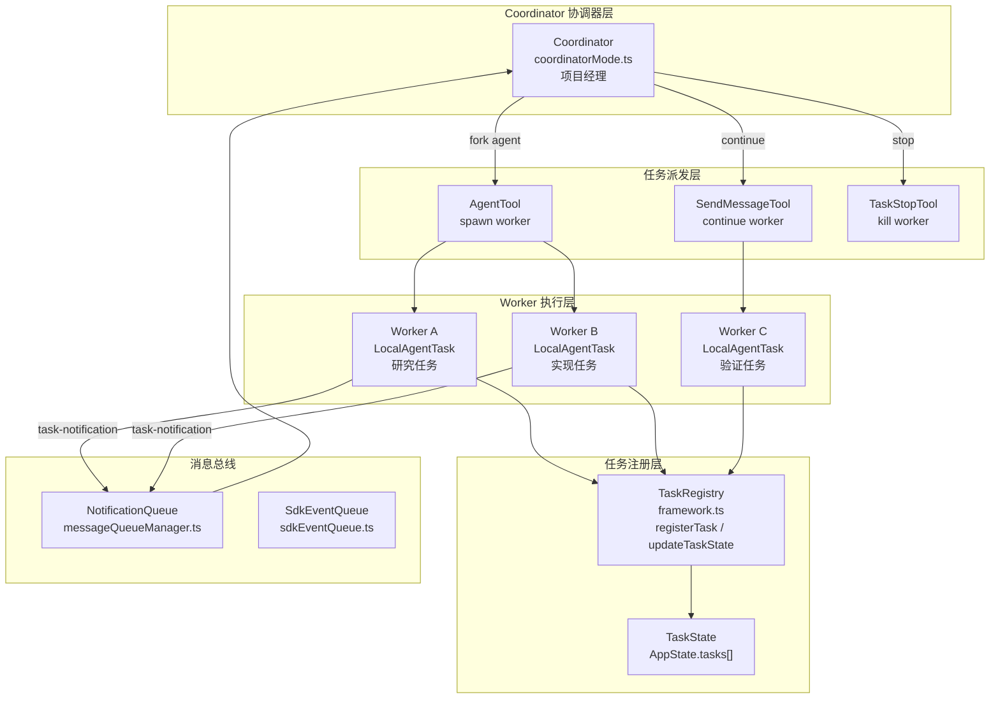

# 第22课：长程任务与多智能体协作

> **阶段**：专题篇 · 深度进阶  
> **难度**：⭐⭐⭐⭐⭐  
> **建议时长**：120 分钟  

---

## 课程信息

### 学习目标

完成本课学习后，你将能够：

1. 解释 Claude Code 的任务分类体系（七种 `TaskType`）及其使用场景
2. 分析 `Coordinator` 协调器的角色与工作流：Research → Synthesis → Implementation → Verification
3. 理解 Agent Swarm 的调度模型：`AgentTool`（派发）+ `SendMessageTool`（续接）+ `TaskStopTool`（中止）
4. 描述任务状态机（pending → running → completed/failed/killed）与终态守卫机制
5. 说明消息传递协议（`<task-notification>` XML）与后台通知机制

---

## 核心概念

### 22.1 什么是"长程任务"

传统 AI 对话是一问一答。"长程任务"是指一个需要**跨越多个对话轮次、甚至并行运行多个 AI 实例**才能完成的工作单元。

Claude Code 用"任务（Task）"来封装这类工作。一个任务可以是：

| TaskType | 前缀 | 说明 |
|----------|------|------|
| `local_bash` | `b` | 本地 Shell 命令（BashTool 触发） |
| `local_agent` | `a` | 本地 AI 子代理（AgentTool 触发） |
| `remote_agent` | `r` | 远程 CCR 环境里的子代理 |
| `in_process_teammate` | `t` | 进程内队友（与主会话共享内存） |
| `local_workflow` | `w` | 本地工作流脚本（实验性） |
| `monitor_mcp` | `m` | MCP 监控任务（实验性） |
| `dream` | `d` | 梦境任务（后台异步愿望） |

每个任务都有一个带前缀的随机 ID（如 `a3f8k2xy`），让你一眼看出这是哪种任务。

### 22.2 任务状态机

```
pending → running → completed
                 ↘ failed
                 ↘ killed
```

**终态守卫（`isTerminalTaskStatus`）**：一旦任务到达 `completed`、`failed` 或 `killed` 三种终态之一，任何试图向它注入消息或修改状态的操作都会被拦截。这防止了"向已死的队友发消息"导致的资源泄漏。

### 22.3 什么是 Coordinator 模式

Coordinator 是 Claude Code 的"项目经理"角色。当你用 `CLAUDE_CODE_COORDINATOR_MODE=1` 启动时，这个实例不再亲自写代码，而是：

1. **派发任务**给 Worker 子代理（`AgentTool`）
2. **综合结果**（自己理解，不转包理解）
3. **续接 Worker**继续干或修错（`SendMessageTool`）
4. **叫停**走错方向的 Worker（`TaskStopTool`）

**关键规则**：Worker 的结果以 `<task-notification>` XML 形式到达，格式如下：

```xml
<task-notification>
  <task-id>agent-a1b</task-id>
  <status>completed</status>
  <summary>Worker 已完成</summary>
  <result>找到了 src/auth/validate.ts:42 的 null pointer...</result>
  <usage>
    <total_tokens>4200</total_tokens>
    <tool_uses>7</tool_uses>
    <duration_ms>18500</duration_ms>
  </usage>
</task-notification>
```

---

## 架构设计

### 2.1 多智能体协作全景图



### 2.2 协调器工作流设计

Coordinator 的四阶段工作流并不是随意定的——它对应了软件工程里**不同阶段的信息依赖关系**：

| 阶段 | 执行者 | 目的 | 并发策略 |
|------|--------|------|----------|
| Research（研究） | Workers（并行） | 探索代码库、找到问题 | 尽量并行，多角度覆盖 |
| Synthesis（综合） | **Coordinator 自己** | 理解结果，写出精确 spec | 串行，必须自己读懂 |
| Implementation（实现） | Workers | 按 spec 改代码，提交 | 同一文件集串行，不同文件集可并行 |
| Verification（验证） | Workers（独立） | 证明代码工作，不是确认代码存在 | 独立 Worker，新鲜视角 |

**关键设计约定**——Coordinator 的系统提示里明确写道：

> "Workers can't see your conversation. Every prompt must be self-contained."

Worker 每次启动都是白板，看不见 Coordinator 和用户的对话历史。所以 Coordinator 写的每个 prompt 都必须**自包含**——文件路径、行号、错误信息、预期结果，一个都不能省。

---

## 关键源码深度走查

### 3.1 Task.ts：任务类型系统与 ID 生成

**文件**：`src/Task.ts` 第 6-106 行

```typescript
// 七种任务类型，各有前缀字母用于 ID 区分
export type TaskType =
  | 'local_bash'          // b - BashTool 触发的后台 shell
  | 'local_agent'         // a - AgentTool 触发的本地子代理
  | 'remote_agent'        // r - 远程 CCR 环境代理
  | 'in_process_teammate' // t - 进程内队友
  | 'local_workflow'      // w - 工作流脚本（实验）
  | 'monitor_mcp'         // m - MCP 监控（实验）
  | 'dream'               // d - 异步后台愿望

// 终态守卫：一旦进入终态，外部代码不允许修改状态
export function isTerminalTaskStatus(status: TaskStatus): boolean {
  return status === 'completed' || status === 'failed' || status === 'killed'
}

// Task ID 生成：前缀 + 8位随机字母数字
// 36^8 ≈ 2.8万亿种组合，抵抗暴力枚举的符号链接攻击
const TASK_ID_ALPHABET = '0123456789abcdefghijklmnopqrstuvwxyz'
export function generateTaskId(type: TaskType): string {
  const prefix = getTaskIdPrefix(type)  // 'a'、'b'、'r' 等
  const bytes = randomBytes(8)           // 加密安全随机
  let id = prefix
  for (let i = 0; i < 8; i++) {
    id += TASK_ID_ALPHABET[bytes[i]! % TASK_ID_ALPHABET.length]
  }
  return id
}

// 所有任务共享的基础字段
export type TaskStateBase = {
  id: string
  type: TaskType
  status: TaskStatus
  description: string
  toolUseId?: string    // 关联的 tool_use 消息 ID（用于结果回调）
  startTime: number
  endTime?: number
  outputFile: string    // 任务输出落地到磁盘的路径
  outputOffset: number  // 支持增量读取（流式输出）
  notified: boolean     // 是否已向 Coordinator 发送完成通知
}
```

**逐段解析**：

`isTerminalTaskStatus` 是整个任务生命周期管理的"防火墙"。调用它的地方有三类：防止向死掉的 Worker 注入消息（`enqueuePendingNotification`）、防止任务状态的错误回流（`updateTaskState`）、以及触发孤儿任务的清理（orphan-cleanup）。

`generateTaskId` 用 **加密安全** 的 `randomBytes` 而非 `Math.random()`，这不是小题大做——任务 ID 会作为磁盘路径的一部分，如果用可预测的随机 ID，攻击者可以预先创建符号链接，把任务输出重定向到任意位置。

> 💡 **设计点评 — ID 前缀的类型可读性**
>
> **好在哪里**：`a3f8k2xy` 一眼看出这是 local_agent 任务，`b5j9m1qw` 是 bash 任务。这种前缀设计让日志、调试、UI 展示都更直观——不用查表就能知道背景任务栏里那个 `r2d3...` 到底是本地代理还是远程代理。
>
> **如果不这样做**：所有任务都用纯随机 UUID，日志里全是 `38f2a901-7bcd-4e12-...`，排查问题时你需要额外查询来确认类型，增加认知负担。就像快递单号里的前缀——看到"SF"就知道是顺丰，不用查。

---

### 3.2 tasks.ts：任务注册表与特性标志门控

**文件**：`src/tasks.ts` 第 1-39 行

```typescript
import { feature } from 'bun:bundle'

// ① 静态注册：核心任务类型，始终存在
import { LocalShellTask } from './tasks/LocalShellTask/LocalShellTask.js'
import { LocalAgentTask } from './tasks/LocalAgentTask/LocalAgentTask.js'
import { RemoteAgentTask } from './tasks/RemoteAgentTask/RemoteAgentTask.js'
import { DreamTask } from './tasks/DreamTask/DreamTask.js'

// ② 特性标志门控：实验性任务类型，按需打包
const LocalWorkflowTask: Task | null = feature('WORKFLOW_SCRIPTS')
  ? require('./tasks/LocalWorkflowTask/LocalWorkflowTask.js').LocalWorkflowTask
  : null

const MonitorMcpTask: Task | null = feature('MONITOR_TOOL')
  ? require('./tasks/MonitorMcpTask/MonitorMcpTask.js').MonitorMcpTask
  : null

// ③ 任务注册表：按 type 查找对应任务处理器
export function getAllTasks(): Task[] {
  const tasks: Task[] = [
    LocalShellTask, LocalAgentTask, RemoteAgentTask, DreamTask,
  ]
  if (LocalWorkflowTask) tasks.push(LocalWorkflowTask)
  if (MonitorMcpTask) tasks.push(MonitorMcpTask)
  return tasks
}

export function getTaskByType(type: TaskType): Task | undefined {
  return getAllTasks().find(t => t.type === type)
}
```

**设计分析**：

`tasks.ts` 和 `tools.ts` 用了完全相同的注册表模式——注释里甚至写着"Mirrors the pattern from tools.ts"。这是有意识的**一致性设计**：工具和任务都是可扩展的能力，用统一的模式管理，降低学习成本。

`Task` 接口只有三个字段：`name`、`type`、`kill()`。注意 `spawn` 和 `render` 不在接口里——它们不再是多态调度的入口，而是由调用方直接调用具体类型。这是一次刻意的**接口精简**：减少接口面，降低实现者的负担。

> 💡 **设计点评 — "kill 是唯一多态操作"的设计哲学**
>
> **好在哪里**：六种任务类型的 `kill` 实现各不相同（Shell 任务发 SIGKILL、Agent 任务取消 AbortController、Remote 任务调 API 停止），但它们都需要通过同一个接口被统一调用。把 `kill` 放进接口，只暴露"需要多态"的那个操作，其他操作各用各的实现——接口不膨胀，实现者不过度承诺。就像餐厅里"叫停上菜"是统一服务，但"怎么退菜"每家厨房的操作不一样。

---

### 3.3 coordinatorMode.ts：协调器系统提示工程

**文件**：`src/coordinator/coordinatorMode.ts` 第 111-213 行（精选）

```typescript
export function getCoordinatorSystemPrompt(): string {
  // ① 根据 SIMPLE 环境变量决定 Worker 有哪些工具
  const workerCapabilities = isEnvTruthy(process.env.CLAUDE_CODE_SIMPLE)
    ? 'Workers have access to Bash, Read, and Edit tools, plus MCP tools.'
    : 'Workers have access to standard tools, MCP tools, and project skills.'

  return `You are Claude Code, an AI assistant that orchestrates software
engineering tasks across multiple workers.

## 1. Your Role
You are a **coordinator**. Your job is to:
- Direct workers to research, implement and verify code changes
- Synthesize results and communicate with the user
- Answer questions directly when possible — don't delegate trivial work

## 2. Your Tools
- **${AGENT_TOOL_NAME}** - Spawn a new worker
- **${SEND_MESSAGE_TOOL_NAME}** - Continue an existing worker
- **${TASK_STOP_TOOL_NAME}** - Stop a running worker

## 3. Workers
${workerCapabilities}

## 4. Task Workflow
### Concurrency
**Parallelism is your superpower. Workers are async. Launch independent
workers concurrently whenever possible.**

- Read-only tasks (research) — run in parallel freely
- Write-heavy tasks (implementation) — one at a time per set of files
- Verification can sometimes run alongside implementation

## 5. Writing Worker Prompts
**Workers can't see your conversation.** Every prompt must be
self-contained with everything the worker needs.

Never write "based on your findings" or "based on the research."
// ② 反模式明确禁止
// Anti-pattern:
AgentTool({ prompt: "Based on your findings, fix the auth bug" })

// Good — synthesized spec with concrete details:
AgentTool({ prompt: "Fix null pointer in src/auth/validate.ts:42.
  The user field on Session is undefined when sessions expire but token
  remains cached. Add null check before user.id access — if null, return
  401 with 'Session expired'. Commit and report the hash." })`
}
```

**逐段解析**：

① `workerCapabilities` 根据 `CLAUDE_CODE_SIMPLE` 决定 Worker 的工具能力。简化模式下只给 Bash/Read/Edit，正常模式下 Worker 还能用技能系统（`/commit`、`/verify` 等 slash 命令）。这是一个**能力分级**设计：复杂任务用全功能 Worker，简单场景用轻量 Worker。

② 系统提示里的反模式禁令（"Never write 'based on your findings'"）是一种**防退化机制**——明确告诉 Coordinator 不要把理解工作转包给 Worker。这在提示工程里不常见但非常重要：大模型如果没有约束会自然倾向于"将球踢回去"，这里用强制语言堵上了这个漏洞。

> 💡 **设计点评 — 系统提示里的"反模式禁令"**
>
> **好在哪里**：与其说"要写好 spec"，不如直接说"永远不要写'based on your findings'"，更具体，更好执行。大模型读到具体的禁止语言比读到抽象的"应该"有效得多。这就像驾校考试规则不是"你要好好开车"，而是"不系安全带扣12分"——具体的边界比抽象的原则更能约束行为。
>
> **如果不这样做**：Coordinator 可能说"根据你发现的问题，请修复 auth bug"——Worker 没有具体指引，就会重新探索代码库，做 Coordinator 已经做过的工作，浪费 token 和时间，而且可能得出不同结论。多智能体系统里，"理解必须在 Coordinator 侧"是最核心的约束之一。

---

### 3.4 TeamCreateTool.ts：Agent Swarm 的团队管理

**文件**：`src/tools/TeamCreateTool/TeamCreateTool.ts` 第 74-237 行

```typescript
export const TeamCreateTool = buildTool({
  name: TEAM_CREATE_TOOL_NAME,
  shouldDefer: true,  // ① 写操作，需要走 defer 审批流
  isEnabled() {
    return isAgentSwarmsEnabled()  // ② 由特性标志控制
  },

  async call(input, context) {
    const { team_name, agent_type } = input
    const appState = context.getAppState()

    // ③ 一个 Leader 同时只能领导一个团队
    if (appState.teamContext?.teamName) {
      throw new Error(
        `Already leading team "${appState.teamContext.teamName}". ` +
        `Use TeamDelete to end the current team before creating a new one.`
      )
    }

    // ④ 团队 ID 去重：如果团队名已存在，自动生成新名
    const finalTeamName = generateUniqueTeamName(team_name)

    // ⑤ 确定性 Lead Agent ID：格式为 "team-lead@teamName"
    const leadAgentId = formatAgentId(TEAM_LEAD_NAME, finalTeamName)

    // ⑥ 构建 TeamFile：落地到磁盘（跨进程通信的关键）
    const teamFile: TeamFile = {
      name: finalTeamName,
      leadAgentId,
      leadSessionId: getSessionId(),  // 存储 session ID 用于团队发现
      members: [{ agentId: leadAgentId, name: TEAM_LEAD_NAME, ... }],
    }
    await writeTeamFileAsync(finalTeamName, teamFile)
    registerTeamForSessionCleanup(finalTeamName)  // ⑦ 确保 session 结束时清理

    // ⑧ 重置任务列表：每个新 Swarm 的任务编号从 1 重新开始
    const taskListId = sanitizeName(finalTeamName)
    await resetTaskList(taskListId)
    setLeaderTeamName(sanitizeName(finalTeamName))

    // ⑨ 更新 AppState：让 Leader 的后续操作都知道自己属于哪个团队
    context.setAppState(prev => ({
      ...prev,
      teamContext: {
        teamName: finalTeamName,
        teamFilePath, leadAgentId,
        teammates: { [leadAgentId]: { name: TEAM_LEAD_NAME, ... } },
      },
    }))
  }
})
```

**逐段解析**：

③ "一个 Leader 同时只能领导一个团队"——这个约束防止了嵌套 Swarm 导致的状态复杂性爆炸。Swarm 是线性的：Leader → 团队，不是 Leader → 团队 A + Leader → 团队 B。

⑥ TeamFile 写到磁盘是**跨进程协调**的关键机制。不同的 tmux pane 里运行的 Worker 实例，通过读取同一个磁盘文件来发现团队成员和 Leader。这是一种简单有效的**文件系统作为消息总线**的模式。

⑦ `registerTeamForSessionCleanup` 是一个很细心的设计：修复了团队文件永久残留在磁盘上的 bug（gh-32730）。Session 结束时，即使没有显式调用 `TeamDelete`，也会清理。

> 💡 **设计点评 — 文件系统作为 Swarm 协调总线**
>
> **好在哪里**：多个 Worker 进程之间需要协调，最简单可靠的方式不是搭消息中间件，而是用文件系统——每个进程都能读写文件，不需要额外的网络配置，天然跨进程，还自带持久化。TeamFile 就是这个"公告栏"，所有人看同一个文件就知道团队在哪、Leader 是谁、成员有哪些。
>
> **如果不这样做**：用 IPC、Socket、或进程间通信协议来协调，每个 Worker 进程启动时都要注册到某个服务，服务挂了整个 Swarm 就崩溃了。文件系统的简单性在这里胜过了架构的"优雅性"。就像村子里的公告栏——不如微信群快，但永远在那，停电了也看得见。

---

### 3.5 AgentTool.tsx：子代理的递归深度控制

**文件**：`src/tools/AgentTool/AgentTool.tsx` 第 82-102 行

```typescript
// 基础输入 schema（所有 Agent 共用）
const baseInputSchema = lazySchema(() => z.object({
  description: z.string().describe('A short (3-5 word) description of the task'),
  prompt: z.string().describe('The task for the agent to perform'),
  subagent_type: z.string().optional()
    .describe('The type of specialized agent to use for this task'),
  model: z.enum(['sonnet', 'opus', 'haiku']).optional()
    .describe("Optional model override for this agent."),
  run_in_background: z.boolean().optional()
    .describe('Set to true to run this agent in the background.'),
}))

// 完整 schema（包含多智能体参数）
const fullInputSchema = lazySchema(() => {
  const multiAgentParams = z.object({
    name: z.string().optional()  // ① 可命名 Agent，用于 SendMessage 寻址
      .describe('Name for the spawned agent. Makes it addressable via SendMessage.'),
    team_name: z.string().optional(),
    mode: permissionModeSchema().optional(),
  })
  return baseInputSchema().merge(multiAgentParams).extend({
    isolation: z.enum(['worktree']).optional()
      .describe('Creates a temporary git worktree for isolated work.'),
    cwd: z.string().optional()  // ② 覆盖工作目录
      .describe('Absolute path to run the agent in.'),
  })
})
```

**逐段解析**：

① `name` 参数让 Agent 可以被 `SendMessageTool` 寻址。没有名字的 Agent 只能通过 `task_id` 找到，而 `task_id` 是 spawn 时返回的；有了 `name`，Coordinator 可以在多轮对话中用可读的名字持续引用同一个 Worker。

`model` 参数允许对特定任务使用不同模型——研究任务用 Haiku（便宜快），实现任务用 Opus（质量高），这是**按任务复杂度选模型**的成本优化策略。

`isolation: 'worktree'` 是一个深度特性：给 Agent 创建一个临时 git worktree，让它在完全隔离的代码副本上工作。多个实现 Worker 并行时不会互相覆盖文件，避免了"并行写同一文件"的数据竞争。

> 💡 **设计点评 — git worktree 作为并行隔离的天然沙盒**
>
> **好在哪里**：让多个 Agent 并行改代码，最怕的是 A 修了文件 X，B 也修文件 X，两人改完后 merge 一片混乱。git worktree 天然解决这个问题：每个 Agent 在自己的工作树里工作，互不干扰，最后 merge 时走 git 的标准冲突解决流程，而不是两个 Agent 互相覆盖文件。
>
> **如果不这样做**：多个 Agent 在同一工作目录并行写文件，就像多个人同时在同一张白纸上写字——速度快了，但结果不可预料。worktree 相当于给每个人发一张复印件，各自写完再汇总，干净多了。

---

### 3.6 LocalMainSessionTask.ts：主会话后台化

**文件**：`src/tasks/LocalMainSessionTask.ts` 第 1-57 行

```typescript
/**
 * LocalMainSessionTask - Handles backgrounding the main session query.
 *
 * 当用户在查询进行中按两次 Ctrl+B 时：
 * - 查询继续在后台运行
 * - UI 清空，显示新的输入提示符
 * - 查询完成时发送通知
 */

// 主会话任务的状态：复用 LocalAgentTaskState + agentType='main-session'
export type LocalMainSessionTaskState = LocalAgentTaskState & {
  agentType: 'main-session'
}

// 主会话任务用 's' 前缀（区别于 agent 的 'a' 前缀）
function generateMainSessionTaskId(): string {
  const bytes = randomBytes(8)
  let id = 's'
  for (let i = 0; i < 8; i++) {
    id += TASK_ID_ALPHABET[bytes[i]! % TASK_ID_ALPHABET.length]
  }
  return id
}

export function registerMainSessionTask(
  description: string,
  setAppState: SetAppState,
  mainThreadAgentDefinition?: AgentDefinition,
  existingAbortController?: AbortController,  // ① 复用已有的 AbortController
): { taskId: string; abortSignal: AbortSignal } {
  const taskId = generateMainSessionTaskId()
  // ...
}
```

**逐段解析**：

主会话后台化（Ctrl+B×2）是一个"任务系统意识到人类注意力的有限性"的设计。当你触发了一个需要 3 分钟的 AI 任务，你不用盯着进度条——按两次 Ctrl+B，任务继续跑，你可以开新的对话。完成后它会通知你。

① `existingAbortController` 参数允许复用已有的 AbortController。这很重要：主会话后台化时，不是杀掉当前请求重新启动，而是把同一个请求的控制权"交接"给任务系统，后台继续运行同一个 HTTP 流。

> 💡 **设计点评 — AbortController 作为任务控制权的凭证**
>
> **好在哪里**：同一个 `AbortController` 实例被传递，意味着"谁拿着这个 controller，谁就能叫停这个任务"。从前台传给任务系统，控制权无缝转移，不需要重建请求、不需要重置上下文，就像你把一张写着"停工命令"的纸条从一个人手里传到另一个人手里——命令还是同一张纸，只是执行权换人了。

---

## Harness Engineering

### 4.1 Harness 视角：多智能体是"力量放大器"

单个 Claude 实例是一把"瑞士军刀"——什么都能干，但同一时刻只能干一件事。多智能体协作是"工厂流水线"——各专其职，并行推进，整体吞吐量远超单人。

Claude Code 的多智能体架构在 Harness Engineering 维度上体现了三个层次：

| 层次 | 机制 | Harness 作用 |
|------|------|-------------|
| **约束层** | Coordinator 系统提示（反模式禁令、自包含 prompt 要求） | 防止智能体退化为"传声筒" |
| **赋能层** | `isolation: 'worktree'`、MCP 工具继承、技能传递 | 让每个 Worker 有独立的能力边界 |
| **编排层** | Research → Synthesis → Implement → Verify 四阶段工作流 | 保证整体任务有序推进，不产生循环依赖 |

### 4.2 对大模型应用的启发

**启发 1：Coordinator 一定要自己"综合"，不要转包理解**

最常见的多智能体失败模式是：Coordinator 把 Worker A 的结果原封不动转发给 Worker B，让 B 去"理解和处理"。这实际上是把 Coordinator 的核心职责（综合判断）外包出去了。

> **实践建议**：设计多智能体系统时，明确规定 Orchestrator 层必须"消化"上游结果，产出具体的下游指令（文件路径 + 行号 + 具体操作），而不是把原始结果透传下去。

**启发 2：并行读，串行写**

Coordinator 系统提示里说得很清楚："Read-only tasks — run in parallel freely; Write-heavy tasks — one at a time per set of files." 这是从软件工程并发控制里借来的最朴素的原则——读操作没有副作用，天然可以并行；写操作有副作用，需要协调。

> **实践建议**：在你的多 Agent 系统里，明确区分"探索型任务"（可大量并行）和"变更型任务"（需要按文件集序列化），并在调度器里显式实现这个约束。

**启发 3：任务的"终态守卫"是多智能体系统的基础设施**

单 Agent 系统不需要操心任务是否死亡——任务跑完就跑完了。多 Agent 系统里，任务状态是多个实体共享的，必须防止"向死掉的任务发消息"的竞态。

> **实践建议**：在你的任务系统里，第一个就实现"终态守卫"函数，并在所有涉及任务状态变更的代码路径前检查。这个函数看起来简单（三行代码），但是防止了一大类难以调试的竞态 bug。

**启发 4：消息协议的结构化**

`<task-notification>` XML 格式不是随意的——它包含了 Coordinator 做决策所需的最小必要信息（状态、摘要、结果、token 用量），没有多余的噪音。

> **实践建议**：多 Agent 之间的消息协议要结构化，不要用自然语言传递状态（"我完成了"）——用机器可解析的格式（JSON/XML），包含明确的任务 ID、状态枚举值、结果正文。这让 Coordinator 不需要"解读"结果，而是"提取"结果。

---

## 思考题

**题目 1**：**为什么 `generateTaskId` 用 `randomBytes` 而不是 `Math.random()`？** 符号链接攻击是怎么发生的？

<details>
<summary>💡 参考答案</summary>

`Math.random()` 是伪随机数，种子固定时输出可预测。攻击者如果知道程序启动时间，可以预测接下来的 task ID，进而提前在对应路径创建一个指向任意文件的符号链接（symlink）。当任务系统向 `outputFile` 路径写任务输出时，实际上写入了攻击者指定的位置——这是**预测性符号链接攻击（predictive symlink attack）**。

`randomBytes` 使用操作系统的加密安全随机源（`/dev/urandom` 或 Windows CNG），输出不可预测。再加上 36^8 ≈ 2.8 万亿种组合，枚举所有可能性的时间成本远超攻击价值。

这是一个"CLI 工具的安全边界"意识：你的输出文件路径，是一个隐形的攻击面。

</details>

---

**题目 2**：**`shouldDefer: true` 在 `TeamCreateTool` 里意味着什么？** 为什么创建团队需要 defer？

<details>
<summary>💡 参考答案</summary>

`shouldDefer: true` 告诉权限系统，这个工具的调用需要经过"推迟审批"流程，而不是直接执行。具体来说，当模型决定调用 `TeamCreateTool` 时，系统不会立即执行，而是先展示给用户确认。

对创建团队操作来说，这很合理：创建团队会在 AppState 里产生全局状态变更（`teamContext`）、在磁盘上写文件（TeamFile）、重置任务列表——这些都是有实质影响的副作用，不应该被模型悄悄执行。`shouldDefer: true` 确保了人在决策链里，模型只能"建议"创建团队，而不能"自主"创建。

这也说明为什么 Swarm 模式需要显式开启（`isAgentSwarmsEnabled()`）：它是一个高权限功能，默认关闭，用 feature flag 保护。

</details>

---

**题目 3**：**Coordinator 系统提示里说"Continue vs. Spawn"是按"context overlap"决定的。** 在实际工程里，你如何判断一个 Worker 的上下文是"帮助"还是"噪音"？

<details>
<summary>💡 参考答案</summary>

系统提示给出了几个判断规则：

- **Continue（续接同一 Worker）**：当 Worker 已经探索了接下来需要修改的那些文件（研究完成后继续实现）；当 Worker 刚刚报告了失败，需要基于失败上下文纠错（Worker 知道它刚做了什么）。
- **Spawn Fresh（开新 Worker）**：当 Worker 探索的范围太广，但实现只需要其中一小部分（广泛探索的上下文会分散注意力）；当要做验证时（验证者不应该带着实现者的假设）；当上次实现走错了方向（错误的上下文会拉偏重试）。

更底层的判断逻辑是：这个 Worker 的 context window 里，有多少比例是接下来任务**真正需要**的内容？如果超过 50%，续接；如果不足 30%，开新。这不是精确数字，而是一种"context 利用率"的直觉。

对 Claude 这种 token 计费的场景，这也是一个成本优化决策：续接节省了重新加载 context 的 token，但携带了不相关的上下文噪音；新开节省了噪音，但增加了 context 建立的 token 消耗。

</details>

---

**题目 4**：**`getCoordinatorUserContext` 里的 scratchpadDir 是什么？** 它解决了多 Worker 场景下的什么问题？

<details>
<summary>💡 参考答案</summary>

`scratchpadDir` 是一个由 Coordinator 提供给所有 Worker 的**共享暂存目录路径**。Workers 可以在这里读写文件，而不会触发权限提示（注释里说"without permission prompts"）。

它解决的是**跨 Worker 知识共享**问题：在多 Worker 协作中，Worker A 在研究阶段发现了一些有用的上下文（API 签名、数据结构定义等），想把这些传递给 Worker B（实现阶段）。如果通过 Coordinator 转发，Coordinator 需要先理解 A 的结果，再重新写入 B 的 prompt，存在信息损耗；如果 A 把结果写进 scratchpadDir，B 直接读取原始内容，精准无损。

这是一种**结构化持久化知识库**的用途：不同 Worker 在任务过程中积累的结构化知识（如 API 文档摘要、代码地图、测试报告），可以通过 scratchpadDir 持续可用。开启条件是 Statsig feature gate `tengu_scratch`，说明这是一个实验性功能。

</details>

---

**题目 5**：**如果一个 Worker 任务失败了（`status: 'failed'`），Coordinator 有哪些恢复策略？** 什么时候续接同一 Worker，什么时候开新 Worker？

<details>
<summary>💡 参考答案</summary>

系统提示里给出了明确指导：

1. **优先 Continue 同一 Worker**：Worker 失败时最有价值的资产是它的**失败上下文**——它看到了什么错误、尝试了什么方法、错误发生在哪一行。用 `SendMessageTool` 把具体的纠错指令发给它，它能直接基于错误上下文修正。

2. **开新 Worker 的时机**：
   - 如果 Worker 在某个方向上"走歪了"（实现了错误的设计方案），续接可能导致它继续沿着错误方向修补。这时开新 Worker + 重新综合更好。
   - 如果 Worker 经历了多次失败，context window 里充满了失败的尝试，可能已经形成了"锚定效应"——新开一个 Worker，给它只包含成功路径的精确 spec。

3. **Coordinator 的纠错职责**：系统提示明确说"Continue workers whose work is complete via SendMessage to take advantage of their loaded context"——失败不等于上下文无用，通常继续是第一选择。只有当方向根本性错误时，才考虑开新。

</details>

---

*参考源码*：`src/Task.ts`、`src/tasks.ts`、`src/coordinator/coordinatorMode.ts`、`src/tools/AgentTool/AgentTool.tsx`、`src/tools/TeamCreateTool/TeamCreateTool.ts`、`src/tasks/LocalMainSessionTask.ts`
