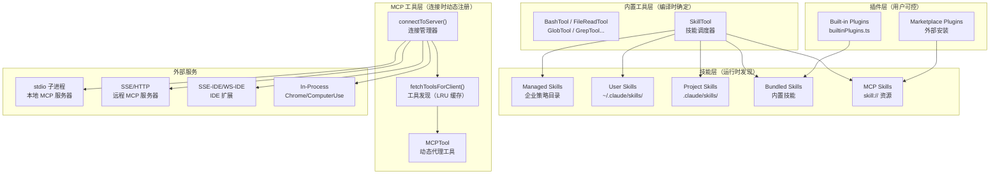

# 第23课：工具能力扩展（MCP + 技能 + 生态）

> **阶段**：专题篇 · 深度进阶  
> **难度**：⭐⭐⭐⭐⭐  
> **建议时长**：120 分钟  

---

## 课程信息

### 学习目标

完成本课学习后，你将能够：

1. 解释 MCP（Model Context Protocol）的设计哲学与六种传输类型的适用场景
2. 描述 `connectToServer` 的连接生命周期管理与自动重连机制
3. 分析技能系统的"五路加载"架构（managed / user / project / additional / bundled）
4. 理解 `SkillTool` 的双执行模式（inline vs. forked）与 MCP skills 集成
5. 说明插件系统的分层设计：Built-in Plugin vs. Bundled Skill 的区别与选择

---

## 核心概念

### 23.1 什么是 MCP

MCP（Model Context Protocol）是 Anthropic 提出的**开放协议**，让外部服务以标准化的方式向 AI 模型暴露能力（工具/资源/提示词）。类比：如果 AI 是一个"大脑"，MCP 就是连接外部世界的标准接口，就像 USB-C 统一了各种外设的连接方式。

Claude Code 作为 MCP **客户端**，可以连接任意符合协议的 MCP **服务端**，动态获取服务端提供的工具并注册到工具池里，模型随时可调用。

**六种传输类型**：

| 传输类型 | 适用场景 | 典型用途 |
|----------|----------|----------|
| `stdio` | 本地子进程 | 大多数本地 MCP 服务器 |
| `sse` | 远程 HTTP 流（旧） | 带 OAuth 认证的远程服务 |
| `http` | 远程 Streamable HTTP（新） | 现代远程服务（支持 OAuth + 代理） |
| `ws` | WebSocket | 需要双向通信的场景 |
| `sse-ide` / `ws-ide` | IDE 扩展专用 | VS Code / JetBrains 插件通信 |
| `sdk` | 进程内 | SDK 控制的内嵌服务器 |

### 23.2 什么是技能（Skill）

技能是 Claude Code 里"可调用的 Markdown 脚本"——本质是一个带 frontmatter 的 `.md` 文件，定义了 `name`、`description`、`whenToUse` 等元数据，以及技能执行时注入给模型的提示词内容。

```
.claude/skills/
└── commit/
    └── SKILL.md      ← 技能文件
```

**技能的五条加载路径**：

| 路径 | 来源 | 优先级 |
|------|------|--------|
| Managed（企业策略） | `getManagedFilePath()/.claude/skills/` | 最高（可锁定） |
| User（用户级） | `~/.claude/skills/` | 高 |
| Project（项目级） | `.claude/skills/`（从项目根到 HOME 逐级向上） | 中 |
| Additional（`--add-dir`） | `{dir}/.claude/skills/` | 中 |
| Legacy commands | `.claude/commands/` | 低（向后兼容） |

还有两条特殊路径：**Bundled**（编译进二进制）和 **MCP skills**（从 MCP 服务器的 `skill://` 资源动态发现）。

### 23.3 什么是插件（Plugin）

插件是可以被用户启用/禁用的**能力包**，可以包含技能、Hooks、MCP 服务器配置。

- **Built-in Plugin**：随 CLI 发布，用户可在 `/plugin` 界面开关，ID 格式为 `name@builtin`
- **Marketplace Plugin**：从外部市场安装，ID 格式为 `name@marketplace`

Built-in Plugin 和 Bundled Skill 的区别：Bundled Skill 是"硬编码进去、永远存在"；Built-in Plugin 是"随包发布、但用户可以关掉"。

---

## 架构设计

### 2.1 工具能力分层架构



### 2.2 MCP 连接生命周期

MCP 连接不是"调用时建立，调用完断开"，而是**持久连接**。一旦服务器连接成功，连接对象被 `memoize` 缓存，后续调用直接复用。只有服务器主动断开（`onclose`）或出错到达阈值（`MAX_ERRORS_BEFORE_RECONNECT = 3`）时，缓存才会清除，触发重连。

这个设计让 MCP 工具调用的延迟接近本地函数调用——不需要每次建立 TCP 握手、TLS 协商、MCP 协议握手。

---

## 关键源码深度走查

### 3.1 services/mcp/types.ts：Transport 联合类型的接口设计

**文件**：`src/services/mcp/types.ts` 第 23-161 行（精选）

```typescript
// ① 传输类型联合：六种传输的完整枚举
export const TransportSchema = lazySchema(() =>
  z.enum(['stdio', 'sse', 'sse-ide', 'http', 'ws', 'sdk']),
)
export type Transport = z.infer<ReturnType<typeof TransportSchema>>

// ② 每种传输有独立的 config schema，字段各不相同
export const McpStdioServerConfigSchema = lazySchema(() =>
  z.object({
    type: z.literal('stdio').optional(),  // 向后兼容：无 type 字段默认是 stdio
    command: z.string().min(1, 'Command cannot be empty'),
    args: z.array(z.string()).default([]),
    env: z.record(z.string(), z.string()).optional(),
  }),
)

export const McpHTTPServerConfigSchema = lazySchema(() =>
  z.object({
    type: z.literal('http'),
    url: z.string(),
    headers: z.record(z.string(), z.string()).optional(),
    oauth: McpOAuthConfigSchema().optional(),  // ③ HTTP 支持 OAuth
  }),
)

// ④ 服务器连接状态：五种可能状态
export type MCPServerConnection =
  | ConnectedMCPServer   // 连接成功
  | FailedMCPServer      // 连接失败（附错误信息）
  | NeedsAuthMCPServer   // 需要认证（OAuth 未完成）
  | PendingMCPServer     // 连接中（附重试次数）
  | DisabledMCPServer    // 用户手动禁用

// ⑤ 工具序列化格式：跨进程传递工具定义
export interface SerializedTool {
  name: string
  description: string
  inputJSONSchema?: { type: 'object'; properties?: { [x: string]: unknown } }
  isMcp?: boolean
  originalToolName?: string  // ⑥ 工具名规范化前的原始名称
}
```

**逐段解析**：

① 传输类型是枚举而不是字符串，配合 `lazySchema` 延迟构造——Zod schema 只在第一次访问时初始化，避免模块加载时的循环依赖和性能损耗。

④ 连接状态是**代数数据类型（ADT）**设计：每种状态携带该状态特有的数据（`FailedMCPServer` 有 `error` 字段，`PendingMCPServer` 有 `reconnectAttempt`），而不是一个大对象挂各种可选字段。这让处理代码可以用 `if (conn.type === 'connected')` 收窄类型，编译器帮你检查每种情况都处理了。

⑥ `originalToolName` 存储工具名规范化前的原始值。MCP 工具名可能包含 `/`、`.` 等在 JSON schema 里不合法的字符，规范化时会被替换；但调用时需要用原始名发给 MCP 服务器。这个字段保持了双向翻译的能力。

> 💡 **设计点评 — ADT 连接状态 vs. 大对象 + 可选字段**
>
> **好在哪里**：当你写 `if (conn.type === 'failed')` 时，TypeScript 知道 `conn.error` 一定存在，因为 `FailedMCPServer` 类型上有 `error: string`。你不需要写 `conn.error!` 或者 `conn.error ?? ''`——类型系统保证了数据的完整性。相比之下，如果 `error` 是大对象上的可选字段 `error?: string`，所有消费代码都要加 `?.` 防御，编译器也无法帮你保证"只有失败状态才有错误信息"。
>
> **如果不这样做**：一个 `MCPServerConnection` 对象挂着 `status?: string`、`error?: string`、`reconnectAttempt?: number`——每个消费者都要手动判断"这个字段在这个 status 下是否有意义"，遗漏一处就是运行时 bug。ADT 让"无效状态不可表示"，这是类型驱动设计的核心理念。

---

### 3.2 services/mcp/client.ts：connectToServer 的连接管理器

**文件**：`src/services/mcp/client.ts` 第 595-641 行（精选）

```typescript
// ① memoize：相同 (name, config) 参数只连接一次，后续调用复用缓存
export const connectToServer = memoize(
  async (
    name: string,
    serverRef: ScopedMcpServerConfig,
  ): Promise<MCPServerConnection> => {
    let transport

    // ② 根据 type 字段选择对应的传输实现
    if (serverRef.type === 'sse') {
      const authProvider = new ClaudeAuthProvider(name, serverRef)
      transport = new SSEClientTransport(
        new URL(serverRef.url),
        {
          authProvider,
          // ③ 双层 fetch 包装：超时控制 + 403 Step-Up 检测
          fetch: wrapFetchWithTimeout(
            wrapFetchWithStepUpDetection(createFetchWithInit(), authProvider),
          ),
        },
      )
    } else if (serverRef.type === 'http') {
      // HTTP Streamable（新协议）：同样的双层包装
      transport = new StreamableHTTPClientTransport(...)
    } else if (
      isClaudeInChromeMCPServer(name)  // ④ 特殊：Chrome MCP 不启动子进程
    ) {
      const [clientTransport, serverTransport] = createLinkedTransportPair()
      inProcessServer = createClaudeForChromeMcpServer(context)
      await inProcessServer.connect(serverTransport)
      transport = clientTransport
    } else {
      // ⑤ stdio：启动子进程，用 stdin/stdout 通信
      transport = new StdioClientTransport({
        command: serverRef.command,
        args: serverRef.args,
        env: { ...subprocessEnv(), ...serverRef.env },
        stderr: 'pipe',  // ⑥ 截获 stderr，防止污染 UI
      })
    }

    const client = new Client({ name: 'claude-code', ... }, { capabilities: { roots: {}, elicitation: {} } })
    await Promise.race([
      client.connect(transport),
      timeoutPromise,  // ⑦ 30 秒连接超时
    ])

    // ⑧ onclose 钩子：断开时清空缓存，触发重连
    client.onclose = () => {
      fetchToolsForClient.cache.delete(name)
      connectToServer.cache.delete(getServerCacheKey(name, serverRef))
    }

    // ⑨ onerror：连续 3 次终态错误后主动关闭，清除 pending tool calls
    client.onerror = (error) => {
      if (isTerminalConnectionError(error.message)) {
        consecutiveConnectionErrors++
        if (consecutiveConnectionErrors >= MAX_ERRORS_BEFORE_RECONNECT) {
          closeTransportAndRejectPending('max consecutive terminal errors')
        }
      }
    }

    return { name, client, type: 'connected', capabilities, cleanup }
  },
  getServerCacheKey,  // ⑩ 缓存 key：name + 序列化 config
)
```

**逐段解析**：

③ `wrapFetchWithTimeout(wrapFetchWithStepUpDetection(...))` 是两层装饰器。外层超时包装（60 秒）作用于每个 POST 请求；内层 Step-Up 检测处理 HTTP 403 的 OAuth 升级流程。两件事各管各的，通过组合实现。

④ Chrome MCP 和 Computer Use MCP 是**进程内服务器**——用 `createLinkedTransportPair()` 建立一对内存中的虚拟传输管道，Server 和 Client 在同一进程里通过队列传消息，避免了启动一个 ~325MB 子进程的开销。这是 `InProcessTransport` 的核心价值。

⑥ `stderr: 'pipe'` 截获子进程的 stderr——MCP 服务器启动时可能有 debug 日志输出到 stderr，如果不截获会直接打印到 CLI 的 UI 里，破坏用户体验。截获后存到 `stderrOutput`，只在连接失败时作为错误信息输出。

⑧⑨ `onclose` + `onerror` 的组合实现了**自愈重连**：断开时清空 memoize 缓存，下一次工具调用会触发重新 `connectToServer`，自动建立新连接。`onerror` 里的终态错误计数防止了无限错误循环——3 次失败后主动关闭，让 pending 的工具调用拿到明确的失败，而不是永远 hang 着。

> 💡 **设计点评 — memoize 缓存 + onclose 清缓存 = 惰性自愈**
>
> **好在哪里**：这是一个聪明的"懒连接 + 自愈"组合。正常情况下 `connectToServer` 只跑一次，之后所有工具调用都复用缓存的连接对象——零开销。断线了？缓存自动清空，下次工具调用时 memoize 发现缓存 miss，自动重连——不需要任何 health check 轮询，也不需要 reconnect 定时器。
>
> **如果不这样做**：要么每次工具调用都重新建立连接（慢），要么用定时器 keep-alive 检测（浪费资源，且检测周期内的调用仍然会失败），要么手动实现连接池（复杂）。memoize + onclose 清缓存用一个优雅的机制代替了这三种方案。就像水龙头——平时关着，用时打开，断水了等水来就行，不需要雇人一直站在那监测。

---

### 3.3 services/mcp/InProcessTransport.ts：进程内双向管道

**文件**：`src/services/mcp/InProcessTransport.ts` 第 1-63 行

```typescript
/**
 * In-process linked transport pair for running an MCP server and client
 * in the same process without spawning a subprocess.
 */
class InProcessTransport implements Transport {
  private peer: InProcessTransport | undefined
  private closed = false

  onclose?: () => void
  onerror?: (error: Error) => void
  onmessage?: (message: JSONRPCMessage) => void

  async send(message: JSONRPCMessage): Promise<void> {
    if (this.closed) throw new Error('Transport is closed')
    // ① 异步投递：避免同步调用栈溢出
    queueMicrotask(() => {
      this.peer?.onmessage?.(message)
    })
  }

  async close(): Promise<void> {
    if (this.closed) return
    this.closed = true
    this.onclose?.()
    // ② 级联关闭：关一侧，另一侧也关
    if (this.peer && !this.peer.closed) {
      this.peer.closed = true
      this.peer.onclose?.()
    }
  }
}

// 工厂函数：创建一对互联的传输实例
export function createLinkedTransportPair(): [Transport, Transport] {
  const a = new InProcessTransport()
  const b = new InProcessTransport()
  a._setPeer(b)  // a.send → b.onmessage
  b._setPeer(a)  // b.send → a.onmessage
  return [a, b]  // [clientTransport, serverTransport]
}
```

**逐段解析**：

① `queueMicrotask` 是这个实现里最关键的细节。如果用同步的 `this.peer.onmessage(message)` 投递消息，当 Client 发请求、Server 处理并立刻回复时，调用栈会是：`client.send → server.onmessage → server.handler → server.send → client.onmessage → client.handler → ...`——这是深度递归，容易栈溢出。`queueMicrotask` 把消息投递延迟到当前调用栈清空后，打破了同步递归链。

② 级联关闭保证了"两侧同步关闭"——关掉 Client 传输时，Server 传输也会收到 `onclose` 回调，不会出现"一侧已关，另一侧还在等待消息"的不一致状态。

> 💡 **设计点评 — queueMicrotask 打破同步递归**
>
> **好在哪里**：MCP 的请求-响应模式是同步的在协议层面上——发请求，等响应。但如果 Client 和 Server 在同一线程里，"等响应"必须异步，不然会锁死。`queueMicrotask` 把消息投递扔进微任务队列，让当前调用栈先退出，事件循环再处理消息——完美模拟了"网络延迟"这个异步边界，但实际是零延迟。这就像传纸条：你写完纸条（send）不直接插嘴，而是等对方说完当前这句话（调用栈清空），再把纸条传过去（queueMicrotask 触发 onmessage）。

---

### 3.4 skills/loadSkillsDir.ts：五路并行加载与去重

**文件**：`src/skills/loadSkillsDir.ts` 第 638-770 行（精选）

```typescript
export const getSkillDirCommands = memoize(
  async (cwd: string): Promise<Command[]> => {
    const userSkillsDir = join(getClaudeConfigHomeDir(), 'skills')
    const managedSkillsDir = join(getManagedFilePath(), '.claude', 'skills')
    const projectSkillsDirs = getProjectDirsUpToHome('skills', cwd)  // ① 从项目根向上遍历到 HOME

    const skillsLocked = isRestrictedToPluginOnly('skills')  // ② 企业策略锁定

    // ③ 五路并行加载（都是磁盘读取，互相独立，并行最优）
    const [
      managedSkills,    // 企业策略目录
      userSkills,       // 用户级目录
      projectSkillsNested,   // 项目级目录（从当前目录向上到 HOME）
      additionalSkillsNested, // --add-dir 指定的额外目录
      legacyCommands,   // 旧式 .claude/commands/ 目录（向后兼容）
    ] = await Promise.all([
      isEnvTruthy(process.env.CLAUDE_CODE_DISABLE_POLICY_SKILLS)
        ? Promise.resolve([])
        : loadSkillsFromSkillsDir(managedSkillsDir, 'policySettings'),
      isSettingSourceEnabled('userSettings') && !skillsLocked
        ? loadSkillsFromSkillsDir(userSkillsDir, 'userSettings')
        : Promise.resolve([]),
      projectSettingsEnabled
        ? Promise.all(projectSkillsDirs.map(dir =>
            loadSkillsFromSkillsDir(dir, 'projectSettings')))
        : Promise.resolve([]),
      projectSettingsEnabled
        ? Promise.all(additionalDirs.map(dir =>
            loadSkillsFromSkillsDir(join(dir, '.claude', 'skills'), 'projectSettings')))
        : Promise.resolve([]),
      skillsLocked ? Promise.resolve([]) : loadSkillsFromCommandsDir(cwd),
    ])

    // ④ 合并所有来源
    const allSkillsWithPaths = [
      ...managedSkills, ...userSkills,
      ...projectSkillsNested.flat(), ...additionalSkillsNested.flat(),
      ...legacyCommands,
    ]

    // ⑤ 去重：通过 realpath 解析符号链接，防止同一文件被多路径加载两次
    const fileIds = await Promise.all(
      allSkillsWithPaths.map(({ filePath }) => getFileIdentity(filePath)),
    )
    const seenFileIds = new Map()
    const deduplicatedSkills: Command[] = []

    for (let i = 0; i < allSkillsWithPaths.length; i++) {
      const fileId = fileIds[i]
      if (seenFileIds.has(fileId)) {
        logForDebugging(`Skipping duplicate skill from ${skill.source}`)
        continue
      }
      seenFileIds.set(fileId, skill.source)
      deduplicatedSkills.push(skill)
    }
    // ...
  }
)
```

**逐段解析**：

① `getProjectDirsUpToHome('skills', cwd)` 从当前工作目录开始，**逐级向上**查找 `.claude/skills/` 目录，直到 HOME 目录为止。这意味着在嵌套的 monorepo 里，`packages/backend/.claude/skills/` 和根目录的 `.claude/skills/` 都会被发现。

② `isRestrictedToPluginOnly('skills')` 是企业策略控制——当 MDM 或策略配置设置了"只允许通过插件加载技能"时，这个函数返回 `true`，所有自定义技能目录加载都被跳过。这是"企业合规优先于用户便利"的体现。

⑤ 去重用 `realpath` 解析符号链接（而非 inode）——因为某些文件系统（如挂载的 NFS、ExFAT 分区）的 inode 不可靠（可能全是 0）。用 `realpath` 解析出真实路径后比较，避免了"同一个 SKILL.md 被软链接从两个路径加载，注册了两个同名技能"的问题。

> 💡 **设计点评 — 五路并行加载的架构决策**
>
> **好在哪里**：五条加载路径是完全独立的（不同目录，没有共享状态），用 `Promise.all` 并行加载，比串行快 5 倍左右。对 CLI 工具来说，启动时的技能加载是关键路径——用户发出命令后，等技能加载完才能用——并行化直接缩短了这个等待时间。
>
> **如果不这样做**：串行加载五个目录，每个目录 10ms，五个就是 50ms。对一个反复使用的 CLI 工具，这 50ms 每次都要付出。`Promise.all` 让这变成 10ms（最慢的那个）。就像早上准备出门：你可以先烧水，烧水的时候同时刷牙、准备包，不需要先烧完水再刷牙——并行处理节省的是整体时间，不是某一步的时间。

---

### 3.5 skills/bundledSkills.ts：内置技能的安全文件提取

**文件**：`src/skills/bundledSkills.ts` 第 53-206 行（精选）

```typescript
export function registerBundledSkill(definition: BundledSkillDefinition): void {
  const { files } = definition

  // ① 如果技能携带参考文件，设置惰性提取
  if (files && Object.keys(files).length > 0) {
    let extractionPromise: Promise<string | null> | undefined
    const inner = definition.getPromptForCommand
    getPromptForCommand = async (args, ctx) => {
      // ② 只提取一次：并发调用共享同一个 Promise
      extractionPromise ??= extractBundledSkillFiles(definition.name, files)
      const extractedDir = await extractionPromise
      return prependBaseDir(await inner(args, ctx), extractedDir)
    }
  }
  // 注册到 bundledSkills 数组...
}

// ③ 安全文件写入：多层防御
// 进程内 nonce（随机路径）= 第一层防御，攻击者猜不到路径
// O_CREAT | O_EXCL | O_NOFOLLOW = 第二层防御，不跟随符号链接
// 0o600 权限 = 第三层防御，只有进程所有者可读
const SAFE_WRITE_FLAGS =
  process.platform === 'win32'
    ? 'wx'  // Windows 等价标志
    : fsConstants.O_WRONLY | fsConstants.O_CREAT | fsConstants.O_EXCL | O_NOFOLLOW

async function safeWriteFile(p: string, content: string): Promise<void> {
  const fh = await open(p, SAFE_WRITE_FLAGS, 0o600)
  try {
    await fh.writeFile(content, 'utf8')
  } finally {
    await fh.close()
  }
}

// ④ 路径遍历防御：拒绝 '..'、绝对路径
function resolveSkillFilePath(baseDir: string, relPath: string): string {
  const normalized = normalize(relPath)
  if (
    isAbsolute(normalized) ||
    normalized.split(pathSep).includes('..') ||
    normalized.split('/').includes('..')
  ) {
    throw new Error(`bundled skill file path escapes skill dir: ${relPath}`)
  }
  return join(baseDir, normalized)
}
```

**逐段解析**：

② `extractionPromise ??= extractBundledSkillFiles(...)` 是**Promise 级别的 memoize**——不是缓存结果，而是缓存 Promise 本身。如果两个并发调用同时触发技能的首次使用，第一个调用创建 Promise，第二个调用找到已有的 Promise，两者等待同一个结果，不会产生两次文件写入竞争。

③ 安全写入用了三层防御：随机路径（进程内 nonce 防预测）+ `O_EXCL`（防 TOCTOU 竞争）+ `O_NOFOLLOW`（防最终路径组件的符号链接）+ `0o600`（防其他用户读取）。注释里说"不 unlink+retry"——因为 `unlink()` 本身也会跟随中间路径的符号链接，删了之后 re-create 不能保证安全。

④ 路径遍历防御必须检查两种格式的 `..`：系统路径分隔符（Windows `\`）和 URL 风格的 `/`——因为 `normalize()` 在不同系统上行为不同，要用两种分隔符分割后都检查。

> 💡 **设计点评 — 三层文件安全防御的必要性**
>
> **好在哪里**：Bundled skills 的文件提取到用户临时目录，这个操作涉及"写文件到用户可控路径"——这是一个经典的安全敏感操作。三层防御（随机路径 + O_EXCL + O_NOFOLLOW）分别对付三种攻击：预测路径攻击（随机 nonce 防）、TOCTOU 竞争（O_EXCL 防）、符号链接劫持（O_NOFOLLOW 防）。每层单独都不够，组合起来才能覆盖所有已知攻击向量。
>
> **如果不这样做**：只用普通的 `writeFile(path, content)`，攻击者可以在你写文件前预创建一个指向 `/etc/crontab` 的符号链接，你的技能文件内容就写进了系统配置文件。这类攻击在 CLI 工具里非常常见。安全防御的成本是几行额外代码，收益是避免了一类整类的攻击向量。

---

### 3.6 plugins/builtinPlugins.ts：内置插件注册表

**文件**：`src/plugins/builtinPlugins.ts` 第 21-102 行

```typescript
const BUILTIN_PLUGINS: Map<string, BuiltinPluginDefinition> = new Map()

// ① 注册入口：启动时调用，把插件定义加入全局 Map
export function registerBuiltinPlugin(definition: BuiltinPluginDefinition): void {
  BUILTIN_PLUGINS.set(definition.name, definition)
}

// ② 状态查询：根据用户配置决定每个插件的启用状态
export function getBuiltinPlugins(): { enabled: LoadedPlugin[]; disabled: LoadedPlugin[] } {
  const settings = getSettings_DEPRECATED()

  for (const [name, definition] of BUILTIN_PLUGINS) {
    if (definition.isAvailable && !definition.isAvailable()) continue  // ③ 可用性检查

    const pluginId = `${name}@builtin`
    const userSetting = settings?.enabledPlugins?.[pluginId]
    // ④ 优先级：用户设置 > 插件默认值 > true（默认启用）
    const isEnabled = userSetting !== undefined
      ? userSetting === true
      : (definition.defaultEnabled ?? true)

    const plugin: LoadedPlugin = {
      name, manifest: { name, description: definition.description, version: definition.version },
      path: 'builtin',   // ⑤ 哨兵值：不是真实文件路径
      source: pluginId,
      enabled: isEnabled,
      isBuiltin: true,
      hooksConfig: definition.hooks,
      mcpServers: definition.mcpServers,
    }
    // 分别加入 enabled / disabled 数组...
  }
}

// ⑥ 插件里的技能：转换为 Command 对象后进入技能系统
export function getBuiltinPluginSkillCommands(): Command[] {
  const { enabled } = getBuiltinPlugins()
  const commands: Command[] = []
  for (const plugin of enabled) {
    const definition = BUILTIN_PLUGINS.get(plugin.name)
    if (!definition?.skills) continue
    for (const skill of definition.skills) {
      commands.push(skillDefinitionToCommand(skill))
    }
  }
  return commands
}
```

**逐段解析**：

① 注册表用 `Map<string, BuiltinPluginDefinition>`，和工具注册表、任务注册表一样是"注册中心"模式——把定义和使用解耦。新增内置插件只需要调用 `registerBuiltinPlugin`，不需要修改核心调度逻辑。

③ `isAvailable()` 让插件能够根据运行时条件决定是否出现。比如 macOS 专属的 Computer Use 插件，在 Linux 上不应该出现在插件列表里，`isAvailable()` 返回 `false` 就直接跳过。

⑤ `path: 'builtin'` 是一个哨兵值。内置插件没有真实的文件系统路径，但 `LoadedPlugin` 类型要求有 `path` 字段。用 `'builtin'` 作为哨兵，既满足类型要求，又让消费代码能识别"这是内置的，不需要去文件系统找"。

> 💡 **设计点评 — Built-in Plugin vs. Bundled Skill 的架构分层**
>
> **好在哪里**：如果你的技能只是"一段 Markdown 提示词"，用 Bundled Skill 就够了——`registerBundledSkill` 就是一行调用。但如果你的功能需要附带 MCP 服务器配置、Hooks 钩子、还要能让用户开关，那就该用 Built-in Plugin——它是更重的包装，承载更复杂的能力单元。两个机制并存不是冗余，而是"复杂度匹配"：简单能力用简单机制，复杂能力用复杂机制，不让简单技能背负不必要的开关逻辑，也不限制复杂插件的表达能力。就像用钉子挂画和用膨胀螺丝固定书柜——都是"固定东西"，但复杂度匹配任务重量。

---

## Harness Engineering

### 4.1 Harness 视角：工具能力的分层架构

Claude Code 的工具扩展能力体现了"Harness = 约束 + 赋能 + 编排"三位一体的架构哲学：

**约束**：
- MCP 工具只能通过 `fetchToolsForClient` 的 `memoizeWithLRU` 缓存进入工具池——LRU 的 size=20 限制了并发 MCP 连接数，防止工具池无限膨胀
- Bundled Skill 的文件提取有三层安全防御，防止技能文件被用来攻击文件系统
- `skillsLocked`（企业策略）可以完全阻止自定义技能加载，实现合规管控

**赋能**：
- 六种 MCP 传输类型覆盖了从本地进程到远程 OAuth 服务的所有接入方式
- InProcessTransport 让 Chrome/Computer Use 等重量级 MCP 服务器不需要子进程
- SkillTool 的 `fork` 执行模式让技能可以在独立 Agent 上下文里运行，有独立 token 预算

**编排**：
- `getSkillDirCommands` 的五路并行加载 + 去重，让"能力发现"和"使用"解耦
- `connectToServer` 的 memoize + onclose 自愈，让连接管理对上层透明
- `getAllCommands` 统一了本地技能和 MCP skills 的视图，调用方无需区分来源

### 4.2 对大模型应用的启发

**启发 1：协议标准化是能力扩展的关键**

MCP 的价值不在于它的具体实现，而在于它是一个**开放标准**——任何人都可以写一个 MCP 服务器，立刻让 Claude Code 获得新能力。这和 VSCode 的 Language Server Protocol（LSP）是一个思路：定义标准接口，把扩展生态开放给社区。

> **实践建议**：在你的 AI 应用里，把"能力扩展接口"设计成公开的、文档化的协议，而不是内部 API。这让第三方能参与扩展生态，也迫使你自己的扩展遵循一致的规范。

**启发 2：多来源、有优先级的配置加载**

技能的五路加载（managed > user > project > additional > legacy）是一个经典的"配置层叠"模式——低优先级是默认值，高优先级的配置覆盖它。企业管理员通过 `policySettings` 可以锁定设置，覆盖所有用户和项目级配置。

> **实践建议**：设计配置系统时，从一开始就规划好"谁的配置优先"。常见的层次是：系统策略 > 用户设置 > 项目设置 > 默认值。不要把所有配置放在一个文件里，这会让不同层次的配置无法独立管理。

**启发 3：惰性连接 + memoize = 零成本持久连接**

`connectToServer` 的 memoize 实现了一个优雅的模式：**第一次需要时才连接，连接后复用，断开后自动触发重连**。这是"按需加载"和"连接池"的组合，成本却很低——就一个 `memoize` 调用加上 `onclose` 回调。

> **实践建议**：对于需要持久连接的外部服务（数据库、消息队列、API），考虑用这种"memoize + 失效清除"模式，而不是手动维护连接池。结构更简单，行为更正确。

**启发 4：安全意识需要从设计开始**

Bundled Skill 的文件提取有三层安全防御，不是事后加的 patch——这是从设计阶段就内置的安全考量。`O_EXCL | O_NOFOLLOW`、随机路径 nonce、路径遍历检查，每一个都对应一类具体的攻击向量。

> **实践建议**：每次你的 AI 系统要"写文件"、"执行命令"、"访问外部 URL"时，列出可能的攻击向量，并对应地设计防御。安全防御的成本在设计阶段是最低的，上线后才加的 patch 往往不完整。

---

## 思考题

**题目 1**：**`MCPServerConnection` 为什么用 ADT（代数数据类型）设计，而不是一个带可选字段的大对象？** 这对 TypeScript 类型系统有什么好处？

<details>
<summary>💡 参考答案</summary>

ADT 设计的核心优势是"无效状态不可表示（Making Invalid States Unrepresentable）"。以 `FailedMCPServer` 为例：只有失败状态才有 `error: string` 字段；`ConnectedMCPServer` 才有 `capabilities` 和 `cleanup` 字段。

如果用大对象 + 可选字段：`error?: string; capabilities?: ServerCapabilities`，TypeScript 无法保证"有 error 的一定是失败状态"——你可以构造一个 `{ type: 'connected', error: 'something' }` 的对象，这在逻辑上是矛盾的，但类型系统无法拦截。

使用 ADT + 判别联合（`type` 字段作为 discriminant），`if (conn.type === 'failed')` 之后，TypeScript 的控制流分析会把 `conn` 的类型收窄为 `FailedMCPServer`，自动知道 `conn.error` 一定存在、`conn.client` 不存在。这让消费代码既安全又简洁，编译器替你做了"状态一致性检查"。

</details>

---

**题目 2**：**为什么 `InProcessTransport.send` 用 `queueMicrotask` 而不是直接同步调用 `this.peer.onmessage(message)`？** 不用异步会有什么问题？

<details>
<summary>💡 参考答案</summary>

MCP 协议是请求-响应模式：Client 发请求，等待 Server 处理，Server 返回响应。如果用同步调用：

1. Client 调用 `send(request)` → 直接调用 `server.onmessage(request)`
2. Server 处理请求，调用 `send(response)` → 直接调用 `client.onmessage(response)`
3. Client 的 `onmessage` 处理响应，可能再次 `send` 下一个请求 → ...

这形成了深度嵌套的同步调用栈：`send → onmessage → send → onmessage → ...`，每一层都在等前一层完成。如果请求-响应链条足够长，会导致**调用栈溢出**（`RangeError: Maximum call stack size exceeded`）。

`queueMicrotask` 把消息投递推迟到当前调用栈完全展开（unwind）之后，再在微任务队列里执行。这打破了同步递归链，每一个 send 都会在独立的、干净的调用栈环境里被处理。相当于把"同步调用"改成了"异步调度"，但延迟几乎为零（microtask queue 比 setTimeout 快得多）。

</details>

---

**题目 3**：**技能的五路加载用 `realpath` 去重，而不是比较文件名字符串。** 什么情况下同一个文件会有两个不同的路径？

<details>
<summary>💡 参考答案</summary>

有几种常见情况：

1. **符号链接**：`.claude/skills` 可能是一个指向 `../../shared/skills` 的软链接。从 `projectA/.claude/skills/commit/SKILL.md` 和直接路径 `shared/skills/commit/SKILL.md` 访问的是同一个文件，但字符串不同。

2. **`--add-dir` 与项目目录重叠**：用户用 `--add-dir /path/to/project` 指定了一个额外目录，而这个目录恰好就是当前工作目录，或者是当前项目目录的父目录——技能被两条路径分别发现一次。

3. **monorepo 中的嵌套父目录**：`getProjectDirsUpToHome` 逐级向上扫描，`packages/backend/.claude/skills/` 和 `.claude/skills/`（项目根）会被分别加载。如果两个目录里有同名技能（甚至是同一个 symlink 指向的文件），字符串不同但 realpath 相同。

用字符串比较无法识别这些情况（路径字符串不同），用 `realpath` 解析出真实的规范路径后比较，才能正确去重。注释里也提到为什么不用 inode：某些文件系统（NFS、ExFAT）的 inode 不可靠，可能全部返回 0，导致所有文件都被认为是"同一个文件"。

</details>

---

**题目 4**：**MCP 连接断开后为什么要同时清空 `fetchToolsForClient.cache`，而不只清空 `connectToServer.cache`？**

<details>
<summary>💡 参考答案</summary>

`connectToServer` 的缓存 key 是 `name + config` 的组合；`fetchToolsForClient` 的缓存 key 是服务器名（`name`）。

当连接断开、重连后，`connectToServer` 会返回一个**新的 Client 对象**（旧的已关闭）。但 `fetchToolsForClient` 缓存的是基于**旧 Client 对象**调用 `client.listTools()` 的结果——如果只清空 `connectToServer` 的缓存，下次 `fetchToolsForClient` 仍会返回旧的工具列表（缓存 hit），不会基于新 Client 重新查询。

实际上，MCP 服务器重连后可能工具列表发生了变化（服务器升级、配置变更），或者新 Client 对象和旧对象的 `listTools()` 结果格式不兼容。清空两份缓存确保了重连后使用全新的连接和全新的工具发现，避免了"新连接用旧工具列表"的不一致状态。

</details>

---

*参考源码*：`src/services/mcp/types.ts`、`src/services/mcp/client.ts`、`src/services/mcp/InProcessTransport.ts`、`src/skills/loadSkillsDir.ts`、`src/skills/bundledSkills.ts`、`src/plugins/builtinPlugins.ts`、`src/tools/SkillTool/SkillTool.ts`
