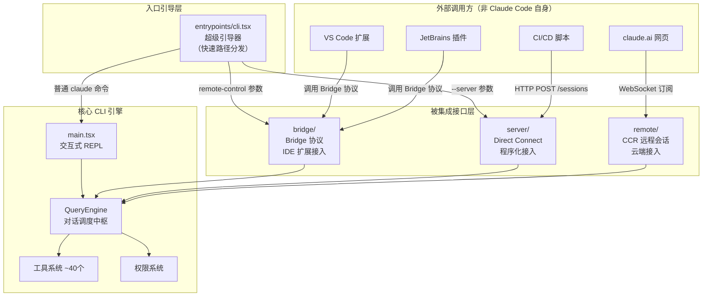
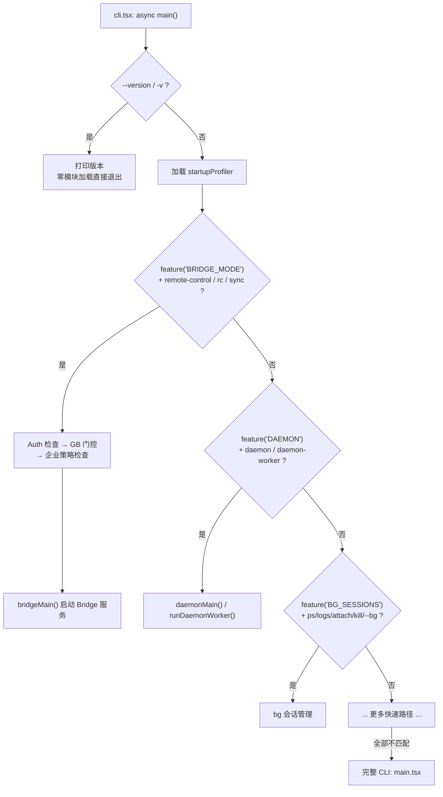

# 第24课：CLI-first 与开放集成架构

> **阶段**：专题篇  
> **建议时长**：90 分钟  
> **难度**：⭐⭐⭐⭐

---

## 课程信息

### 学习目标

完成本课学习后，你将能够：

1. 解释 Claude Code 为什么选择 CLI-first 而不是"多端内置"的设计哲学
2. 描述 `src/entrypoints/cli.tsx` 作为超级引导器的快速路径分发机制
3. 分析 `src/bridge/` 如何提供标准化协议让外部 IDE 扩展（VS Code、JetBrains）**被动调用** Claude Code
4. 说明 `src/server/` 的 Direct Connect 模式如何支持程序化/自动化调用场景
5. 理解 `src/remote/` 的远程会话机制本质上仍是 CLI 进程的远程投影
6. 从架构角度解读"CLI-first + 开放集成接口"的 Harness Engineering 思想

---

## 核心概念

### 1.1 CLI-first 是什么意思

Claude Code 的本质是一个**命令行工具**。你在终端输入 `claude`，它启动一个交互式 REPL；你写 `claude -p "帮我审查这段代码"`，它在非交互模式运行并输出结果；你加 `--output-format stream-json`，它变成一个可以被程序消费的 JSON 流。

这三种用法，核心都是同一套代码：

- `src/main.tsx` — 主循环，React+Ink 渲染 UI
- `src/QueryEngine.ts` — 对话调度中枢
- `src/tools/` — ~40 个工具
- `src/commands/` — ~50 个用户命令

**所谓"多端"，从来不是 Claude Code 内置的四个独立实现。** VS Code 插件、JetBrains 插件这些"多触点"，是**外部生态通过接口调用 Claude Code**，而不是 Claude Code 自己变成了 VS Code 扩展。

### 1.2 三条集成接口

Claude Code 对外提供三条被集成的接口：

| 接口 | 模块 | 用途 | 调用方 |
|------|------|------|--------|
| **Bridge 协议** | `src/bridge/` | IDE 扩展双向通信 | VS Code / JetBrains 插件 |
| **Direct Connect** | `src/server/` | 本地 HTTP + WebSocket 服务 | 自动化脚本、CI/CD 工具 |
| **Remote/CCR** | `src/remote/` | 云端会话订阅 | claude.ai 网页、远程客户端 |

注意方向：这三条接口都是"Claude Code **等待被调用**"，而不是"Claude Code 主动提供三套 UI"。

### 1.3 统一消息协议

无论哪条接口，消息都用同一套协议类型（定义于 `src/entrypoints/agentSdkTypes.ts` 和 `src/entrypoints/sdk/controlTypes.ts`）：

- **`SDKMessage`**：AI 产出的消息（assistant / tool_result / system 等）
- **`SDKControlRequest`**：外部向 Claude Code 发送的控制指令（权限响应、中断、切换模型等）
- **`SDKControlResponse`**：Claude Code 向外部回报的控制结果
- **`StdinMessage` / `StdoutMessage`**：结构化 IO 模式的输入输出包装

这套协议是所有外部集成的"通用语言"——不管你从哪条通道接入，说的都是同一种话。

---

## 架构设计

### 2.1 以 CLI 为核心的集成架构



**关键视角**：外部 IDE 插件是调用方，`src/bridge/` 是被调用的接口层，`QueryEngine` 才是始终不变的核心。这是"CLI 工具 + 开放接口"的架构，不是"多端一体"的架构。

### 2.2 cli.tsx：超级引导器的分发逻辑

`src/entrypoints/cli.tsx` 是整个 Claude Code 最外层的入口。它做的事只有一件：**判断用户想干什么，把控制权转给对应的处理器**。



每个快速路径都用 `feature()` 做编译期门控：未启用的分支在生产包里**根本不存在**（死代码消除），已启用但参数不匹配的分支在运行时零成本跳过。

---

## 关键源码深度走查

### 3.1 cli.tsx：--version 快速路径与 Bridge 入口

**文件**：`src/entrypoints/cli.tsx` 第 28-161 行

```typescript
/**
 * Bootstrap entrypoint - checks for special flags before loading the full CLI.
 * All imports are dynamic to minimize module evaluation for fast paths.
 * Fast-path for --version has zero imports beyond this file.
 */
async function main(): Promise<void> {
  const args = process.argv.slice(2)

  // ① 零模块加载的快速路径：--version
  if (args.length === 1 && (args[0] === '--version' || args[0] === '-v' || args[0] === '-V')) {
    // MACRO.VERSION 在构建时内联
    console.log(`${MACRO.VERSION} (Claude Code)`)
    return
  }

  // ② 其他路径才加载 startupProfiler（动态 import，避免静态拖包）
  const { profileCheckpoint } = await import('../utils/startupProfiler.js')
  profileCheckpoint('cli_entry')

  // ③ Bridge 快速路径：接受 remote-control / rc / remote / sync / bridge 等别名
  if (feature('BRIDGE_MODE') && (
    args[0] === 'remote-control' || args[0] === 'rc' ||
    args[0] === 'remote' || args[0] === 'sync' || args[0] === 'bridge'
  )) {
    profileCheckpoint('cli_bridge_path')
    const { enableConfigs } = await import('../utils/config.js')
    enableConfigs()
    const { getBridgeDisabledReason, checkBridgeMinVersion } = await import('../bridge/bridgeEnabled.js')

    // ④ Auth 检查（必须先于 GrowthBook，否则 GB 无用户上下文）
    const { getClaudeAIOAuthTokens } = await import('../utils/auth.js')
    if (!getClaudeAIOAuthTokens()?.accessToken) {
      exitWithError(BRIDGE_LOGIN_ERROR)
    }

    // ⑤ GrowthBook 门控 + 企业策略检查
    const disabledReason = await getBridgeDisabledReason()
    if (disabledReason) exitWithError(`Error: ${disabledReason}`)
    const versionError = checkBridgeMinVersion()
    if (versionError) exitWithError(versionError)

    await waitForPolicyLimitsToLoad()
    if (!isPolicyAllowed('allow_remote_control')) {
      exitWithError("Error: Remote Control is disabled by your organization's policy.")
    }

    // ⑥ 三重验证通过后，才真正启动 Bridge 服务
    await bridgeMain(args.slice(1))
    return
  }
  // ... 更多快速路径 ...
}
```

**逐步解析**：

① `--version` 路径是真正的"零成本"——文件本身没有静态 import（只有构建期宏），所以连 `startupProfiler` 都不加载，打印版本后立即退出。这对 CI 脚本里频繁执行 `claude --version` 的场景很重要。

② 动态 `import()` 替代静态导入，确保每条路径只加载自己真正需要的模块。

③④⑤⑥ Bridge 路径的三重验证链：**OAuth 登录状态 → GrowthBook 功能门控 → 企业管理策略**。必须按顺序检查，因为没有 OAuth token 的话 GrowthBook 连用户上下文都没有，门控判断不准确。

注意⑥：`bridgeMain()` 是真正把 Claude Code 变成一个"等待被 IDE 连接"的服务进程的函数——这时候 CLI 变成了一个服务端，等待 VS Code 插件等外部程序接入。

> 💡 **设计点评 — 超级引导器的最小化加载**
>
> **好在哪里**：`cli.tsx` 本身几乎不做任何业务，它的全部工作是"判断→转发"。每条路径用动态 `import()` 按需加载，确保 `--version` 不会拖着整个 React 树和工具注册表一起加载。对 CI 来说，`claude --version` 多等 300ms，一天跑几百次流水线，就是纯损耗。
>
> **如果不这样做**：如果 `cli.tsx` 像 `main.tsx` 那样静态导入所有东西，`claude --version` 就要等整个初始化链跑完才能响应。就像你去便利店只买一瓶水，结账台有两个通道——快速通道不扫码直接付款，普通通道要过一遍全套流程。用对通道，就是快一步。

---

### 3.2 bridgeEnabled.ts：Bridge 的三层入口保护

**文件**：`src/bridge/bridgeEnabled.ts` 第 28-87 行

```typescript
/**
 * Runtime check for bridge mode entitlement.
 *
 * Remote Control requires a claude.ai subscription (the bridge auths to CCR
 * with the claude.ai OAuth token). isClaudeAISubscriber() excludes
 * Bedrock/Vertex/Foundry, apiKeyHelper/gateway deployments, env-var API keys,
 * and Console API logins — none of which have the OAuth token CCR needs.
 */
export function isBridgeEnabled(): boolean {
  // ① 编译期 feature() 保证：外部包里 GrowthBook 字符串字面量不出现
  return feature('BRIDGE_MODE')
    ? isClaudeAISubscriber() &&
        getFeatureValue_CACHED_MAY_BE_STALE('tengu_ccr_bridge', false)
    : false
}

export async function getBridgeDisabledReason(): Promise<string | null> {
  if (feature('BRIDGE_MODE')) {
    if (!isClaudeAISubscriber()) {
      // ② 没有 claude.ai 订阅，Bedrock/Vertex/API Key 用户都排除在外
      return 'Remote Control requires a claude.ai subscription. Run `claude auth login` ...'
    }
    if (!hasProfileScope()) {
      // ③ setup-token 或 CLAUDE_CODE_OAUTH_TOKEN 缺少 profile scope，无法获取 organizationUUID
      return 'Remote Control requires a full-scope login token. ...'
    }
    if (!getOauthAccountInfo()?.organizationUuid) {
      // ④ organizationUUID 为空，GrowthBook 门控无法正确判断
      return 'Unable to determine your organization ...'
    }
    if (!(await checkGate_CACHED_OR_BLOCKING('tengu_ccr_bridge'))) {
      // ⑤ GrowthBook 滚动发布门控未开放
      return 'Remote Control is not yet enabled for your account.'
    }
    return null  // ⑥ 全部通过，返回 null 表示可用
  }
  return 'Remote Control is not available in this build.'
}
```

**逐步解析**：

① `feature('BRIDGE_MODE')` 是编译期门控。外部发布版里，这个 `if` 分支的代码完全消失，GrowthBook 的功能名字符串（`'tengu_ccr_bridge'`）也不会出现在包里，防止被逆向分析内部功能标志。

②③ Bridge 必须使用 claude.ai OAuth token，Bedrock/Vertex/API Key 模式的用户完全不支持——因为 Bridge 需要通过 claude.ai 的 OAuth 体系做用户身份认证，并与 CCR（Claude Code Remote）服务通信。

④ `organizationUuid` 缺失时，GrowthBook 的滚动发布门控（按组织维度）就无法正确判断，会误返回 false，用户看到"未开启"而不知道重新登录就能解决，是一个 UX bug 的记录（见代码注释 CC-1165）。

> 💡 **设计点评 — 诊断性错误消息而不是裸 bool**
>
> **好在哪里**：`getBridgeDisabledReason()` 返回的不是 `true/false`，而是**人类可读的具体原因**（缺订阅、token scope 不够、组织 UUID 为空、门控未开放……）。每种情况给出不同的用户提示，用户知道下一步该做什么（重新登录、换账号）。
>
> **如果不这样做**：用户启动 Bridge 失败，看到的是"Remote Control not enabled"，但不知道是因为没订阅、还是 token 过期、还是企业策略禁用、还是功能灰度没轮到自己。运维人员每天要回答这些"我明明买了订阅为什么不能用"的支持工单，全都因为没有精准的诊断信息。就像医院化验单，不能只写"身体不好"——你要告诉患者是哪个指标异常，才能有针对性地处理。

---

### 3.3 bridgeMessaging.ts：纯函数消息处理层

**文件**：`src/bridge/bridgeMessaging.ts` 第 1-88 行

```typescript
/**
 * Shared transport-layer helpers for bridge message handling.
 *
 * Extracted from replBridge.ts so both the env-based core (initBridgeCore)
 * and the env-less core (initEnvLessBridgeCore) can use the same ingress
 * parsing, control-request handling, and echo-dedup machinery.
 *
 * Everything here is pure — no closure over bridge-specific state. All
 * collaborators (transport, sessionId, UUID sets, callbacks) are passed
 * as params.
 */

// ① 类型守卫：判断是否为 SDKMessage（宽松——只验证 type 字段是字符串）
export function isSDKMessage(value: unknown): value is SDKMessage {
  return (
    value !== null &&
    typeof value === 'object' &&
    'type' in value &&
    typeof value.type === 'string'
  )
}

// ② 类型守卫：精确匹配 control_request（必须有 request_id 和 request 字段）
export function isSDKControlRequest(value: unknown): value is SDKControlRequest {
  return (
    value !== null &&
    typeof value === 'object' &&
    'type' in value &&
    value.type === 'control_request' &&
    'request_id' in value &&
    'request' in value
  )
}

/**
 * True for message types that should be forwarded to the bridge transport.
 * The server only wants user/assistant turns and slash-command system events;
 * everything else (tool_result, progress, etc.) is internal REPL chatter.
 */
export function isEligibleBridgeMessage(m: Message): boolean {
  // ③ 虚拟消息（REPL 内部调用）是显示层的，Bridge 只关心顶层的 tool_use/result
  if ((m.type === 'user' || m.type === 'assistant') && m.isVirtual) {
    return false
  }
  return (
    m.type === 'user' ||
    m.type === 'assistant' ||
    (m.type === 'system' && m.subtype === 'local_command')
  )
}
```

**逐步解析**：

① `isSDKMessage` 故意是宽松的——只要 `type` 是字符串就通过。这保证了服务端新增消息类型时，客户端不会静默丢弃（下游代码再进一步窄化类型）。

② `isSDKControlRequest` 则需要精确匹配三个字段，因为调用方需要准确区分控制消息和普通 AI 消息，不能搞混。

③ 虚拟消息（`isVirtual: true`）是 `AgentTool` 内部子对话产生的"工作记录"，只是本地 UI 渲染用的，IDE 端不需要关心这些内部噪声——它只需要看最终的 `tool_use` 和 `tool_result`。

**纯函数的价值**：整个文件没有任何模块级状态，所有协作者（transport、sessionId、UUID 集合、回调函数）都作为参数传入。这使得 `replBridge.ts`（有环境变量的完整版本）和 `envLessBridgeCore.ts`（daemon 场景的无环境版本）都能复用同一套消息处理逻辑。

> 💡 **设计点评 — 把"判断逻辑"提炼成纯函数**
>
> **好在哪里**：`isEligibleBridgeMessage` 这种判断如果写死在 `replBridge.ts` 里，后来写 `envLessBridgeCore.ts` 时就需要复制一份。两份代码各自演化，最终"哪些消息应该转发给 IDE"的行为会不一致，这是分布式 bug 的温床。提炼成纯函数后，任何地方改了规则，所有使用方自动同步。
>
> **如果不这样做**：就像餐厅有两个厨房，但"这道菜的配方"只写在 A 厨房的墙上。B 厨房的师傅凭记忆做，做出来的味道迟早会偏——你甚至可能察觉不到哪里不对，直到有客人投诉两家店口味不一样。

---

### 3.4 replBridge.ts：BridgeCoreParams 的依赖注入设计

**文件**：`src/bridge/replBridge.ts` 第 83-160 行（精选）

```typescript
export type BridgeState = 'ready' | 'connected' | 'reconnecting' | 'failed'

/**
 * Explicit-param input to initBridgeCore. Everything initReplBridge reads
 * from bootstrap state (cwd, session ID, git, OAuth) becomes a field here.
 * A daemon caller (Agent SDK) that never runs main.tsx fills these in itself.
 */
export type BridgeCoreParams = {
  dir: string          // ① 工作目录
  machineName: string  // ② 机器标识（会话卡片显示用）
  branch: string       // ③ Git 分支
  gitRepoUrl: string | null  // ④ 仓库 URL

  getAccessToken: () => string | undefined  // ⑤ 动态令牌获取器（不是静态字符串）

  /**
   * ⑥ 注入而非导入：避免把 auth.ts → config.ts → commands.ts 整条链拖进 Agent SDK 包
   */
  createSession: (opts: {
    environmentId: string
    title: string
    gitRepoUrl: string | null
    branch: string
    signal: AbortSignal
  }) => Promise<string | null>

  archiveSession: (sessionId: string) => Promise<void>  // ⑦ 会话存档（尽力而为）

  /**
   * ⑧ 内部 Message 到 SDKMessage 的转换器（注入以避免 commands.ts 拖入 bundle）
   */
  toSDKMessages?: (messages: Message[]) => SDKMessage[]

  // 事件回调
  onInboundMessage?: (msg: SDKMessage) => void    // ⑨ IDE 发来的入站消息
  onPermissionResponse?: (response: SDKControlResponse) => void  // ⑩ 权限决策响应
  onInterrupt?: () => void                         // ⑪ 用户中断信号
  onSetPermissionMode?: (mode: PermissionMode) =>  // ⑫ 权限模式切换（带错误反馈）
    { ok: true } | { ok: false; error: string }
  onStateChange?: (state: BridgeState, detail?: string) => void  // ⑬ 状态变化通知
}
```

**逐步解析**：

⑤ `getAccessToken` 是函数而不是字符串，因为 OAuth token 会过期需要动态刷新。如果把 token 作为构造时的字符串传入，几十分钟后就失效了。

⑥⑧ **依赖注入的核心原因**：如果 `replBridge.ts` 直接 `import createSession`，就会把整条依赖链拉进来：`createSession.ts → auth.ts → config.ts → commands.ts → React 树`——这意味着 Agent SDK 包会包含完整的命令注册树和 React 组件，体积爆炸。通过参数注入，`replBridge.ts` 只声明接口，调用方（REPL 包装器或 daemon 守护进程）自己决定注入哪个版本的实现。

⑫ `onSetPermissionMode` 返回 `{ ok: true } | { ok: false; error: string }` 而不是直接抛出异常——因为权限模式切换有前置条件（`auto` 需要 GrowthBook 门控、`bypassPermissions` 需要可用性检查），这些检查在回调里执行，结果通过 `ok/error` 结构化返回，`replBridge.ts` 只负责把结果转化为 `control_response` 发送给 IDE 端，不需要了解检查的内部逻辑。

> 💡 **设计点评 — 依赖注入 vs. 直接导入的 bundle 隔离**
>
> **好在哪里**：把 `createSession` 作为参数传进来，而不是直接 import，代价是参数列表变长了，但解决了真实的"Agent SDK bundle 变肥"问题。JavaScript 的 `import` 是静态的，一旦 `replBridge.ts` 导入了 `createSession.ts`，整条传递依赖都被打包进去，即使在 daemon 场景下完全用不到。
>
> **如果不这样做**：Agent SDK 包会包含完整的命令注册树（50 个命令）和 React 组件树，轻量化的 daemon 模式就失去了轻量的意义。就像你委托快递公司帮你打印文件，你只需要告诉他们"打印"这个接口——你不需要把你家的整台打印机搬过去，快递公司自己有他们的打印设备。

---

### 3.5 server/：Direct Connect 的程序化接入

**文件**：`src/server/createDirectConnectSession.ts`（完整）和 `src/server/types.ts`

```typescript
// src/server/types.ts — 服务端配置结构
export type ServerConfig = {
  port: number
  host: string
  authToken: string
  unix?: string              // ① Unix socket 支持（本机 IPC，零网络开销）
  idleTimeoutMs?: number     // ② 空闲超时，0 = 永不过期（daemon 模式）
  maxSessions?: number       // ③ 最大并发会话数
  workspace?: string         // ④ 默认工作目录
}

export type SessionInfo = {
  id: string
  status: SessionState       // starting | running | detached | stopping | stopped
  createdAt: number
  workDir: string
  process: ChildProcess | null  // ⑤ 每个会话是独立的子进程
  sessionKey?: string
}
```

```typescript
// src/server/createDirectConnectSession.ts — 创建会话
export async function createDirectConnectSession({
  serverUrl,
  authToken,
  cwd,
  dangerouslySkipPermissions,
}: {
  serverUrl: string
  authToken?: string
  cwd: string
  dangerouslySkipPermissions?: boolean
}): Promise<{ config: DirectConnectConfig; workDir?: string }> {

  // ⑥ POST /sessions 创建新会话，服务端返回 session_id 和 ws_url
  const resp = await fetch(`${serverUrl}/sessions`, {
    method: 'POST',
    headers,
    body: jsonStringify({
      cwd,
      ...(dangerouslySkipPermissions && {
        dangerously_skip_permissions: true,  // ⑦ 显式跳过权限检查（CI 自动化场景）
      }),
    }),
  })

  // ⑧ Zod 验证响应结构（session_id, ws_url, work_dir）
  const result = connectResponseSchema().safeParse(await resp.json())
  if (!result.success) {
    throw new DirectConnectError(`Invalid session response: ${result.error.message}`)
  }

  return {
    config: {
      serverUrl,
      sessionId: result.data.session_id,
      wsUrl: result.data.ws_url,  // ⑨ 后续用 WebSocket 接收流式输出
      authToken,
    },
    workDir: result.data.work_dir,
  }
}
```

**逐步解析**：

⑤ **每个会话是独立的子进程**：`process: ChildProcess | null` 表明服务端不是把所有会话跑在同一个进程里，而是为每个会话 fork 一个独立的 Claude Code 子进程——隔离性好，一个会话崩溃不影响其他会话，代价是进程开销。

⑥⑦ 这是 Direct Connect 的核心交互：先 POST 创建会话，拿到 `session_id` 和 `ws_url`，再用 WebSocket 连接接收流式输出。`dangerouslySkipPermissions: true` 是为 CI/CD 场景设计的——在受控的自动化环境里，不需要等人工确认权限提示。

⑧ Zod 验证服务端响应结构，不信任裸 JSON——这在 API 版本不匹配时能给出明确的错误信息，而不是 `undefined is not a function`。

> 💡 **设计点评 — HTTP + WebSocket 的会话创建模式**
>
> **好在哪里**：用 HTTP POST 创建会话（有请求/响应语义，易于重试和错误处理），用 WebSocket 订阅输出（实时流式，适合长时间运行的 AI 会话）。两种协议各用在最合适的地方，不强求用一种协议做所有事。
>
> **如果不这样做**：如果会话创建也走 WebSocket（比如先 connect 再发一个"create"消息），创建失败的重试就复杂了——WebSocket 连接本身的建立失败和会话创建失败是两回事，混在一起很难区分错误类型。HTTP 的同步请求-响应模型天然适合"创建资源"这种操作。就像你租房子，先签合同（HTTP，有明确的生效时间）、再搬进去住（WebSocket，长期连接）——这两个步骤用不同的机制处理，各自清晰。

---

### 3.6 remote/RemoteSessionManager：远程会话的消息分流

**文件**：`src/remote/RemoteSessionManager.ts` 第 87-200 行（精选）

```typescript
/**
 * Manages a remote CCR session.
 * Coordinates:
 * - WebSocket subscription for receiving messages from CCR
 * - HTTP POST for sending user messages to CCR
 * - Permission request/response flow
 */
export class RemoteSessionManager {
  private websocket: SessionsWebSocket | null = null
  // ① 挂起的权限请求：requestId → 请求详情（支持并发多个）
  private pendingPermissionRequests: Map<string, SDKControlPermissionRequest> = new Map()

  constructor(
    private readonly config: RemoteSessionConfig,
    private readonly callbacks: RemoteSessionCallbacks,
  ) {}

  connect(): void {
    const wsCallbacks: SessionsWebSocketCallbacks = {
      onMessage: message => this.handleMessage(message),
      onConnected: () => this.callbacks.onConnected?.(),
      onClose: () => this.callbacks.onDisconnected?.(),
      onReconnecting: () => this.callbacks.onReconnecting?.(),
    }
    this.websocket = new SessionsWebSocket(
      this.config.sessionId,
      this.config.orgUuid,
      this.config.getAccessToken,
      wsCallbacks,
    )
    void this.websocket.connect()
  }

  // ② 消息分流：SDKMessage vs. control_request vs. control_cancel_request
  private handleMessage(message: SDKMessage | SDKControlRequest | ...): void {
    if (message.type === 'control_request') {
      this.handleControlRequest(message)  // ③ 权限请求
      return
    }
    if (message.type === 'control_cancel_request') {
      // ④ 服务端取消待处理的权限请求（超时或被中断）
      const { request_id } = message
      this.pendingPermissionRequests.delete(request_id)
      this.callbacks.onPermissionCancelled?.(request_id, ...)
      return
    }
    if (isSDKMessage(message)) {
      this.callbacks.onMessage(message)  // ⑤ AI 正常输出转发给上层
    }
  }

  // ⑥ 用户消息通过 HTTP POST 发送（有明确的成功/失败语义）
  async sendMessage(content: RemoteMessageContent): Promise<void> {
    await sendEventToRemoteSession(this.config.sessionId, {
      type: 'human',
      content,
    })
  }
}
```

也注意 `RemoteSessionConfig` 里有一个关键字段：

```typescript
export type RemoteSessionConfig = {
  sessionId: string
  getAccessToken: () => string
  orgUuid: string
  /**
   * ⑦ 当 true 时，该客户端是纯观察者：
   *   - Ctrl+C/Escape 不发 interrupt 给远程 agent
   *   - 60s 重连超时被禁用
   *   - 不更新会话标题
   * 用于 `claude assistant` 命令（旁观模式）。
   */
  viewerOnly?: boolean
}
```

**逐步解析**：

① `pendingPermissionRequests` 是一个 Map，支持多个权限请求并发挂起——AI 可能同时发出多个工具调用，每个都需要用户确认，不能用单个变量。

④ `control_cancel_request` 是服务端取消权限请求的机制：如果 AI 已经超时或被中断，服务端会主动推送取消消息，客户端把对应的确认弹窗关掉，不留无效的交互状态。

⑥ 写路径（用户消息）走 HTTP POST，读路径（AI 输出）走 WebSocket 订阅。这是非对称设计——读写方向的需求不同（实时推送 vs. 有明确成功/失败语义的请求），用不同的协议最适合。

⑦ `viewerOnly` 用一个 boolean 实现了"主控者"和"旁观者"两种行为，不需要子类化——这是 `claude assistant` 命令的底层支撑，让用户可以用 assistant 模式"旁观"一个正在运行的远程 AI 会话。

> 💡 **设计点评 — 用 viewerOnly 字段而非子类实现"旁观者"**
>
> **好在哪里**：`viewerOnly: true` 一个字段，控制了三件互相关联的行为（不发中断、不重连超时、不更新标题）。如果用子类，要写 `ViewerOnlyRemoteSessionManager extends RemoteSessionManager`，还要 override 三个方法，以后新增一个"旁观者专属逻辑"就又要改子类。
>
> **如果不这样做**：同一套 `RemoteSessionManager` 类被分裂成两个类，两套代码各自维护，主控者的 bug fix 忘了同步到旁观者，用户发现旁观模式下的奇怪行为——这类 bug 非常难复现，因为大部分情况下两个类行为一样，只在边界场景才暴露差异。就像家里两个孩子，你可以给一个贴"请勿打扰"标签，而不是给他换一个脑子——一个 bool 字段比重塑整个对象结构简单多了。

---

## Harness Engineering

### 5.1 CLI-first 是一种 Harness 选择

从 Harness Engineering 的视角看，Claude Code 选择 CLI-first 不是偶然的，而是深思熟虑的工程决策：

**Harness 的本质是"驾驭层"**——在强大但难以精确控制的 AI 模型之上，构建一套工程化的约束、赋能和编排层。CLI 是最纯粹的 Harness 形态：

| Harness 维度 | CLI-first 的体现 |
|--------------|-----------------|
| **约束** | 权限系统、`REMOTE_SAFE_COMMANDS` 白名单、Bridge 入口的三重验证链；任何外部调用方只能通过开放接口接入，核心逻辑不可绕过 |
| **赋能** | ~40 个工具、~50 个命令、QueryEngine 的 ReAct 循环；外部集成者通过调用这些能力，而非重新实现 |
| **编排** | `cli.tsx` 的快速路径分发、Bridge 的 `BridgeState` 状态机、`HybridTransport` 的串行写队列；保证行为有序、可预期 |

### 5.2 "被集成"架构的工程价值

Claude Code 选择"CLI-first + 开放集成接口"而不是"多端一体"，有几条深层工程理由：

**单一核心，多样接入**：所有集成方（VS Code 插件、CI 脚本、云端网页）共享同一套 QueryEngine + 工具系统 + 权限系统。一次 bug fix，所有接入方同时受益。如果为每个"端"单独实现一套 AI 逻辑，这些 bug 就要修 N 次。

**明确的信任边界**：Bridge 接口有 OAuth 验证 + GrowthBook 门控 + 企业策略三层保护；Direct Connect 有 `authToken` 认证；Remote 有 OAuth + orgUuid 验证。"CLI 作为核心，接口作为入口"的结构使得信任边界非常清晰——不需要在每个业务逻辑里判断"这次请求是从哪个端来的"。

**最小化集成成本**：IDE 插件开发者只需要实现 Bridge 协议的客户端（发送 `control_request`、接收 `SDKMessage`），不需要嵌入或重新实现 AI 引擎。Claude Code 的核心能力对所有集成方是透明的黑盒，接口稳定不变。

### 5.3 对大模型应用的启发

**启发 1：先有 CLI，再有集成**

构建大模型应用时，先把核心能力做成一个命令行工具或库，再在此基础上构建 UI、API 和插件，而不是一开始就试图同时构建"Web + App + CLI + 插件"四个端。

> **实践建议**：用"核心 Harness"+ "接入适配器"的分层思路，让 AI 逻辑（对话管理、工具调用、权限控制）在一个地方，各种接入形式（API、WebSocket、CLI、嵌入式）在另一个地方。

**启发 2：开放接口比内置多端更可维护**

"被集成"的架构意味着你只需要维护一套接口规范，生态里的集成方自行实现客户端。VS Code 插件团队自己维护插件代码，Anthropic 维护 Claude Code 核心——职责分离，出问题边界清晰。

> **实践建议**：为你的 AI 应用设计清晰的"集成接口"（如 WebSocket 协议、REST API），而不是把每个外部集成写进核心代码里。每多一个"内置集成"，就多一份维护负担。

**启发 3：消息协议的统一比传输协议的统一更重要**

Bridge、Direct Connect、Remote 走的传输协议各不相同（WebSocket、HTTP POST、Unix socket），但消息格式（`SDKMessage`、`SDKControlRequest`、`SDKControlResponse`）是统一的。统一协议层让新的集成方容易上手，也让测试和调试工具可以复用。

> **实践建议**：定义清晰的消息类型（最好有 TypeScript 类型或 JSON Schema），让所有集成方说同一种语言，而不是每条通道各自发明格式。

---

## 思考题

**题目 1**：`cli.tsx` 的 `--version` 快速路径为什么可以做到"零模块加载"？如果改成 `main.tsx` 里判断，会有什么代价？

<details>
<summary>💡 参考答案</summary>

`cli.tsx` 本身几乎没有静态 `import`（只有构建期宏 `MACRO.VERSION`），所有后续模块都用动态 `import()` 延迟加载。所以 `--version` 路径在 `console.log` 之前不需要评估任何其他模块——零模块加载不是魔法，而是"动态导入 + 没有静态依赖"的结果。

如果改到 `main.tsx` 里判断：`main.tsx` 有大量静态导入（QueryEngine、工具注册表、React+Ink 组件树、服务层），光是模块评估就需要 100-200ms，哪怕 `--version` 一共也就打印一行文字，这 100-200ms 是纯损耗。CI 流水线里频繁执行 `claude --version` 做版本检测，日积月累的等待时间很可观。

</details>

---

**题目 2**：`BridgeCoreParams` 里 `createSession` 为什么用参数注入而不是直接 `import`？如果直接导入会出现什么问题？

<details>
<summary>💡 参考答案</summary>

直接 `import createSession` 会把整条传递依赖拉进 bundle：`createSession.ts → auth.ts → config.ts → commands.ts → React 树`。这意味着 Agent SDK 包（轻量化场景）会包含完整的命令注册树（~50 个命令）和 React 组件，体积膨胀几倍。

参数注入让 `replBridge.ts` 只声明接口（`createSession` 的类型），实现由调用方决定：完整 REPL 场景注入真实的 `createSession`，daemon 场景注入一个轻量版本（可能通过 IPC 调用），测试场景注入一个 mock。这三种场景的 bundle 大小和依赖图各不相同，参数注入是唯一能统一抽象这三种场景的方式。

</details>

---

**题目 3**：`getBridgeDisabledReason()` 检查 `organizationUuid` 是否为空，然后才检查 GrowthBook 门控。这个顺序是否可以调换？为什么？

<details>
<summary>💡 参考答案</summary>

不能调换。GrowthBook 门控（`tengu_ccr_bridge`）是**按 organizationUUID 维度**做滚动发布的——如果 `organizationUuid` 为空，GrowthBook 没有定位维度，会返回默认值 `false`，用户看到"Remote Control 未启用"的错误，但真正的原因是 token 缺少 profile scope 导致 UUID 没拉到，重新登录就能解决。

如果先检查 GrowthBook 再检查 UUID，用户会看到一个误导性的错误消息，以为是账号没有资格开通，去找客服投诉——实际上只需要重新登录刷新 token。代码注释里明确记录了这是一个 UX bug 的修复（CC-1165），提醒维护者不要"优化"这个顺序。

</details>

---

**题目 4**：`RemoteSessionManager` 的 `viewerOnly` 字段控制了三个不同的行为（不发中断、不重连超时、不更新标题）。这三个行为为什么要绑定在同一个字段里，而不是分成三个独立的字段？

<details>
<summary>💡 参考答案</summary>

这三个行为在业务语义上是强耦合的——"旁观者"这个用户角色天然要求这三者同时成立：旁观者不应该打断别人的会话（不发中断）、旁观者断线了重连超时不是严重错误（不重连超时）、旁观者不应该覆盖主控者设置的标题（不更新标题）。这三者描述的是同一个"旁观者身份"，不是三个独立可组合的选项。

如果分成三个字段，调用方需要同时设置三个才能正确启用旁观模式，漏掉任何一个都是半残状态（比如旁观者意外发了中断，把别人的会话打断了）。单一 `viewerOnly` 字段明确表达了业务语义，是"意图驱动"的接口设计，而不是"能力组合"的接口设计。

</details>

---

**题目 5**：`SessionsWebSocket` 对 4001（Session Not Found）做了最多 3 次重试，对 4003（Unauthorized）直接放弃，对其他断连做指数退避重连。这三种策略体现了什么工程原则？

<details>
<summary>💡 参考答案</summary>

**按错误根本原因分类，给出有意义的重试策略**，而不是对所有断连一刀切。

- **4001（暂时性）**：服务端在做 compaction，会话短暂不可达但很快恢复，值得重试几次（最多 3 次，给一个宽容窗口）。
- **4003（永久性）**：token 无效或无权限，这是客户端状态问题，重连再多次也解决不了——直接放弃，提示用户重新登录。
- **其他断连（网络性）**：可能是网络抖动、服务重启等，指数退避（500ms → 8s）+ 随机抖动避免"重试风暴"，是处理暂时性网络问题的标准模式。

将错误分为"暂时性"、"永久性"、"网络性"三类并给出不同策略，这种纵深的故障处理思维对所有需要网络重连的系统都有参考价值。

</details>

---

*参考源码*：`src/entrypoints/cli.tsx`、`src/bridge/bridgeEnabled.ts`、`src/bridge/bridgeMessaging.ts`、`src/bridge/replBridge.ts`、`src/server/createDirectConnectSession.ts`、`src/server/directConnectManager.ts`、`src/server/types.ts`、`src/remote/RemoteSessionManager.ts`、`src/remote/SessionsWebSocket.ts`
